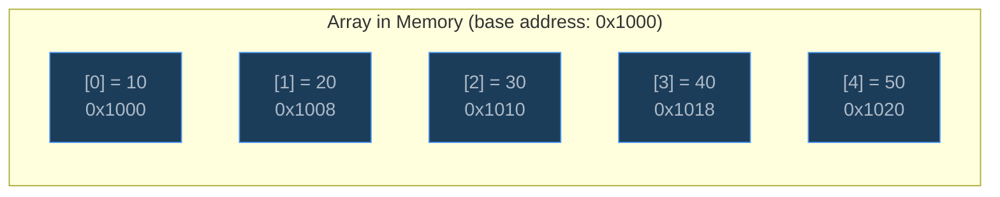
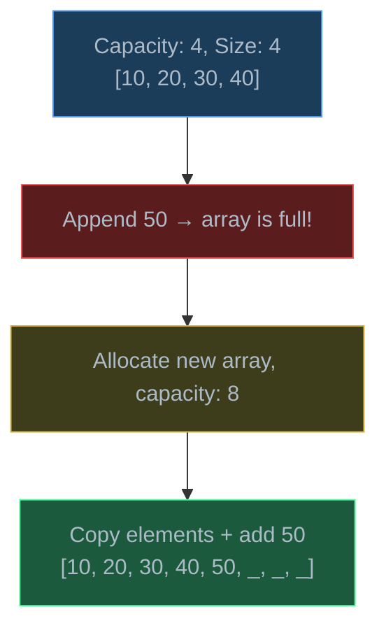
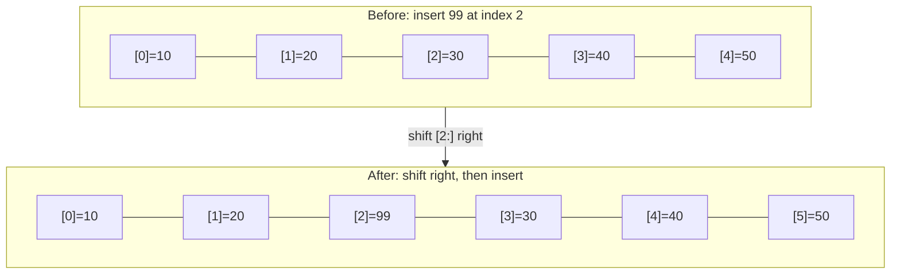

# Arrays

> An array stores elements in contiguous memory, giving O(1) access by index — the simplest and most important data structure in computing.

## Table of Contents
- [Core Concepts](#core-concepts)
- [Code Examples](#code-examples)
- [Common Pitfalls](#common-pitfalls)
- [Key Takeaways](#key-takeaways)
- [Exercises](#exercises)

## Core Concepts

### Contiguous Memory and Indexing

#### What

An array is a block of elements stored in **contiguous (adjacent) memory locations**. Each element occupies the same amount of space, and elements are laid out one after another with no gaps.



#### How

Because elements are contiguous and equally sized, accessing any element is a single arithmetic operation:

```
address_of(element[i]) = base_address + i × element_size
```

This is called **pointer arithmetic**. The CPU calculates the memory address directly from the index — no searching, no following pointers, no iteration. This is why array access is O(1): it takes the same time to access the first element as the millionth.

#### Why It Matters

O(1) random access is the fundamental superpower of arrays and the reason they're the default data structure in virtually every language. When Python evaluates `my_list[42]`, it computes a memory address and reads from it directly. This is why arrays are the backbone of hash tables (mapping keys to array indices), matrix operations, image processing (pixels are 2D arrays), and any workload that needs fast, predictable access patterns.

The contiguity also means arrays are **cache-friendly** — when the CPU loads one element from memory, nearby elements come along for free (they're on the same cache line). This makes sequential array traversal significantly faster than traversing a linked list, where nodes can be scattered across memory.

### Static vs Dynamic Arrays

#### What

- **Static array** — fixed size, determined at creation. Cannot grow or shrink. Used in C, C++, and low-level systems. If you need more space, you create a new, larger array and copy everything.
- **Dynamic array** — automatically resizes when it runs out of space. Python's `list`, Java's `ArrayList`, and C++'s `std::vector` are all dynamic arrays.

#### How

A dynamic array starts with some initial capacity. When you add an element and the array is full, it:

1. Allocates a new array with **double the capacity** (typically 2x, Python uses ~1.125x)
2. Copies all existing elements to the new array
3. Frees the old array
4. Adds the new element

This copying step is O(n), but it happens rarely. If you add n elements, the total number of copies across all resizes is roughly 2n, so the **amortized cost** per insertion is O(1).



#### Why It Matters

Understanding amortized O(1) is critical. A single `append()` *might* be O(n) if a resize triggers, but averaged over many appends, each one costs O(1). This is why Python's `list.append()` is fast in practice — you can build a list of a million elements by appending one at a time and it's still efficient.

However, if you know the final size in advance, pre-allocating avoids all resize overhead. This is why `[0] * n` or list comprehensions outperform repeated `append()` — they allocate once.

### Array Operations and Complexity

#### What

| Operation | Time Complexity | Why |
| --- | --- | --- |
| Access by index `a[i]` | O(1) | Pointer arithmetic |
| Search (unsorted) | O(n) | Must check every element |
| Search (sorted) | O(log n) | Binary search |
| Append (end) | O(1) amortized | Occasional O(n) resize |
| Insert (at index i) | O(n) | Must shift elements right |
| Delete (at index i) | O(n) | Must shift elements left |
| Delete (end) | O(1) | No shifting needed |

#### How

Insertion and deletion in the middle are expensive because contiguity must be maintained. To insert at index 2 in a 5-element array, you shift elements at indices 2, 3, and 4 one position to the right, then place the new element. That's why `list.insert(0, x)` is O(n) — every element shifts.



#### Why It Matters

This explains why arrays are best for workloads dominated by reads and appends, not arbitrary insertions. If you're building a text editor where users insert characters at random positions, an array is a poor choice (every keystroke shifts text). A gap buffer or rope would be better. Knowing *why* operations are slow helps you pick the right structure — or recognize when you need a different approach.

### Python `list` Internals

#### What

Python's `list` is a **dynamic array of pointers**. It doesn't store the actual objects contiguously — it stores *references* (pointers) to objects, which can be of any type. The pointer array itself is contiguous.

```
list object → [ptr0, ptr1, ptr2, ptr3, ...]
                 ↓      ↓      ↓      ↓
               obj0   obj1   obj2   obj3
```

#### How

This design explains several Python list behaviors:

- **Heterogeneous types**: `[1, "hello", 3.14]` works because the list stores pointers, and all pointers are the same size — they can point to any object type.
- **Shallow copies**: `b = a[:]` copies the pointer array but not the underlying objects. Both lists reference the same objects.
- **`sys.getsizeof()`**: Reports the size of the pointer array, not the total size of all contained objects.

Python's over-allocation formula is approximately: `new_size = old_size + (old_size >> 3) + 6`. This grows the array by roughly 12.5% each time (more conservative than the 2x doubling used in Java's `ArrayList`).

#### Why It Matters

Understanding that Python lists store pointers — not values — prevents subtle bugs with mutable objects. When you do `matrix = [[0] * 3] * 3`, you get three pointers to the *same* inner list. Modifying `matrix[0][0]` changes all rows because they're all the same object. This is one of the most common Python bugs, and it stems directly from how lists work internally.

## Code Examples

### Basic Array Operations with Complexity Annotations

```python
import sys


def demonstrate_list_operations() -> None:
    """Show common list operations and their time complexities."""

    # Creation — O(n) where n is the number of elements
    numbers: list[int] = [10, 20, 30, 40, 50]

    # Access by index — O(1), pointer arithmetic
    third_element: int = numbers[2]
    print(f"Element at index 2: {third_element}")  # 30

    # Append — O(1) amortized, may trigger resize
    numbers.append(60)
    print(f"After append(60): {numbers}")

    # Insert at beginning — O(n), shifts all elements right
    numbers.insert(0, 5)
    print(f"After insert(0, 5): {numbers}")

    # Delete by index — O(n), shifts elements left
    removed: int = numbers.pop(0)
    print(f"Removed {removed}, after pop(0): {numbers}")

    # Delete from end — O(1), no shifting
    last: int = numbers.pop()
    print(f"Removed {last}, after pop(): {numbers}")

    # Search — O(n), linear scan
    idx: int = numbers.index(30)
    print(f"Index of 30: {idx}")

    # Slice — O(k) where k is slice length
    sub: list[int] = numbers[1:4]
    print(f"Slice [1:4]: {sub}")


demonstrate_list_operations()
```

### Dynamic Array Resize Behavior

```python
import sys


def observe_resize_pattern(n: int = 50) -> None:
    """Watch Python list capacity grow as elements are appended.

    Demonstrates amortized O(1) — the list over-allocates to avoid
    resizing on every append.
    """
    items: list[int] = []
    prev_size: int = sys.getsizeof(items)

    print(f"{'Length':>6}  {'Size (bytes)':>12}  {'Event'}")
    print(f"{'------':>6}  {'------------':>12}  {'-----'}")
    print(f"{0:>6}  {prev_size:>12}  initial (empty)")

    for i in range(n):
        items.append(i)
        current_size: int = sys.getsizeof(items)

        if current_size != prev_size:
            # A resize happened — the list allocated more memory
            print(f"{len(items):>6}  {current_size:>12}  ← RESIZE (+{current_size - prev_size} bytes)")
            prev_size = current_size


observe_resize_pattern()
```

**Time**: Each `append()` is O(1) amortized. Across n appends, total work is O(n).
**Space**: Python over-allocates by ~12.5%, so the actual memory used is slightly more than the minimum needed.

### Pre-allocation vs Repeated Append

```python
import time


def build_with_append(n: int) -> list[int]:
    """Build a list by appending one element at a time — O(n) amortized."""
    result: list[int] = []
    for i in range(n):
        result.append(i * 2)
    return result


def build_with_comprehension(n: int) -> list[int]:
    """Build a list with a comprehension — O(n), single allocation."""
    return [i * 2 for i in range(n)]


def build_with_preallocation(n: int) -> list[int]:
    """Build a list by pre-allocating, then assigning — O(n), no resizing."""
    result: list[int] = [0] * n
    for i in range(n):
        result[i] = i * 2
    return result


def compare_approaches(n: int = 1_000_000) -> None:
    """Benchmark three ways to build a list of n elements."""
    approaches = [
        ("append loop", build_with_append),
        ("list comprehension", build_with_comprehension),
        ("pre-allocate + assign", build_with_preallocation),
    ]

    for name, func in approaches:
        start = time.perf_counter()
        result = func(n)
        elapsed = time.perf_counter() - start
        print(f"  {name:<25} {elapsed:.4f}s  (len={len(result):,})")


if __name__ == "__main__":
    compare_approaches()
```

**Time**: All three are O(n), but list comprehension and pre-allocation avoid resize overhead and are faster in practice.
**Space**: O(n) for all three. Pre-allocation wastes no space on over-allocation.

### Two-Dimensional Arrays (Matrix)

```python
def create_matrix(rows: int, cols: int, fill: int = 0) -> list[list[int]]:
    """Create a 2D matrix as a list of lists.

    IMPORTANT: Each row must be a separate list object.
    Using [[fill] * cols] * rows creates rows that share the same list!
    """
    return [[fill] * cols for _ in range(rows)]


def print_matrix(matrix: list[list[int]], label: str = "") -> None:
    """Display a matrix in a readable grid format."""
    if label:
        print(f"{label}:")
    for row in matrix:
        print("  " + "  ".join(f"{val:3}" for val in row))
    print()


def transpose(matrix: list[list[int]]) -> list[list[int]]:
    """Transpose a matrix — swap rows and columns.

    Time:  O(rows × cols) — visit every element once
    Space: O(rows × cols) — new matrix
    """
    rows: int = len(matrix)
    cols: int = len(matrix[0])
    # Row i, col j in original → row j, col i in transposed
    return [[matrix[i][j] for i in range(rows)] for j in range(cols)]


# Demo
grid: list[list[int]] = create_matrix(3, 4)

# Assign some values
for i in range(3):
    for j in range(4):
        grid[i][j] = i * 4 + j + 1

print_matrix(grid, "Original 3×4 matrix")
print_matrix(transpose(grid), "Transposed 4×3 matrix")
```

## Common Pitfalls

### Pitfall 1: The Shared Row Trap

```python
# BAD — all three rows are the SAME list object
matrix = [[0] * 3] * 3
matrix[0][0] = 99
print(matrix)
# [[99, 0, 0], [99, 0, 0], [99, 0, 0]]  ← all rows changed!

# GOOD — each row is an independent list
matrix = [[0] * 3 for _ in range(3)]
matrix[0][0] = 99
print(matrix)
# [[99, 0, 0], [0, 0, 0], [0, 0, 0]]  ← only row 0 changed
```

Why it's wrong: `[[0] * 3] * 3` creates one inner list and copies the *pointer* three times. All rows point to the same list object. The list comprehension creates three separate list objects.

### Pitfall 2: Using `insert(0, x)` in a Loop

```python
# BAD — inserting at the front is O(n) per call, O(n²) total
result: list[int] = []
for i in range(10_000):
    result.insert(0, i)  # shifts ALL elements right every time

# GOOD — append and reverse, or use deque
result: list[int] = []
for i in range(10_000):
    result.append(i)
result.reverse()  # O(n) single pass

# ALSO GOOD — use deque for O(1) left insertion
from collections import deque
result: deque[int] = deque()
for i in range(10_000):
    result.appendleft(i)  # O(1) per operation
```

Why it's wrong: `insert(0, x)` shifts every existing element one position to the right. In a loop of n iterations, the total work is 0 + 1 + 2 + ... + (n-1) = O(n^2). Appending and reversing is O(n) total.

### Pitfall 3: Modifying a List While Iterating

```python
# BAD — skips elements because indices shift during deletion
numbers = [1, 2, 3, 4, 5, 6]
for i in range(len(numbers)):
    if numbers[i] % 2 == 0:
        numbers.pop(i)  # IndexError or skipped elements!

# GOOD — use a list comprehension to build a new list
numbers = [1, 2, 3, 4, 5, 6]
numbers = [x for x in numbers if x % 2 != 0]
# [1, 3, 5]
```

Why it's wrong: When you remove element at index `i`, all subsequent elements shift left. The loop counter `i` advances, but the elements have shifted — so you skip the element that moved into position `i`. List comprehensions avoid this entirely by building a new list.

## Key Takeaways

- Arrays store elements in **contiguous memory**, enabling **O(1) access** by index via pointer arithmetic — this is their defining advantage.
- **Insertion and deletion** in the middle are **O(n)** because contiguity must be maintained (elements must shift). Append at the end is O(1) amortized.
- Python's `list` is a **dynamic array of pointers** — it auto-resizes by over-allocating, and it stores references to objects, not the objects themselves.
- **Pre-allocate** when you know the size in advance. Use list comprehensions over repeated `append()` for cleaner and faster code.
- Arrays are **cache-friendly** — sequential traversal is fast because nearby elements share cache lines. This real-world performance advantage doesn't show up in Big-O analysis but matters significantly in practice.

## Exercises

1. **Write a function** `rotate_right(arr: list[int], k: int) -> list[int]` that rotates an array to the right by `k` positions. For example, `rotate_right([1, 2, 3, 4, 5], 2)` returns `[4, 5, 1, 2, 3]`. Analyze the time and space complexity of your solution.

2. **Explain** why `list.pop()` is O(1) but `list.pop(0)` is O(n). What would change if Python's list were implemented as a doubly-linked list instead of a dynamic array?

3. **Write a function** `find_duplicates(arr: list[int]) -> list[int]` that returns all elements that appear more than once. First write a brute-force O(n^2) solution, then optimize it to O(n) using a different data structure.

4. **Predict** the output of this code and explain why:
   ```python
   a = [1, 2, 3]
   b = a
   c = a[:]
   a.append(4)
   print(f"a={a}, b={b}, c={c}")
   ```

5. **Write a function** `merge_sorted(a: list[int], b: list[int]) -> list[int]` that merges two sorted arrays into one sorted array in O(n + m) time without using Python's built-in `sort()`. This is the merge step of merge sort.

---
up:: [Schedule](../../Schedule.md)
#type/learning #source/self-study #status/seed
