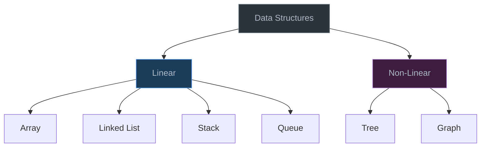

# Introduction to Data Structures

> A data structure is a way of organizing data so that it can be used efficiently — choosing the right one is the difference between code that scales and code that collapses.

## Table of Contents
- [Core Concepts](#core-concepts)
- [Code Examples](#code-examples)
- [Common Pitfalls](#common-pitfalls)
- [Key Takeaways](#key-takeaways)
- [Exercises](#exercises)

## Core Concepts

### What Are Data Structures?

#### What

A data structure is a specific way of organizing, storing, and accessing data in a computer's memory. Think of it like containers in a kitchen: you *could* throw all your ingredients into one big pile, but using labeled jars, shelves, and drawers lets you find things faster and keep related items together.

In programming, raw data (numbers, strings, objects) needs to live somewhere in memory. A data structure defines *how* that data is arranged and *what operations* you can perform on it efficiently.

#### How

Every data structure provides a set of operations — typically some combination of:

- **Insert** — add new data
- **Delete** — remove existing data
- **Search** — find specific data
- **Access** — retrieve data at a known position
- **Traverse** — visit every element

The key insight is that different data structures make different operations fast or slow. An array gives you instant access by index but makes insertion expensive. A linked list makes insertion cheap but access slow.

#### Why It Matters

Choosing the wrong data structure is one of the most common performance mistakes in software engineering. If you store user sessions in an unsorted list and search by session ID, every lookup scans the entire list — O(n). Switch to a hash map and it drops to O(1). That single decision can be the difference between a server handling 100 requests/second and 100,000.

Data structures aren't academic exercises — they're the foundation every real system is built on. Databases use B-Trees. Network routers use tries. Your browser's undo button uses a stack. Understanding data structures means understanding *why* software works the way it does.

### Categories of Data Structures

#### What

Data structures are classified along two axes:

**Linear vs Non-Linear:**
- **Linear** — elements are arranged in a sequence, one after another. Each element has at most one predecessor and one successor. Examples: arrays, linked lists, stacks, queues.
- **Non-Linear** — elements are arranged hierarchically or in a network. Each element can connect to multiple others. Examples: trees, graphs.

**Abstract vs Concrete:**
- **Abstract Data Type (ADT)** — defines *what* operations are supported, not *how* they're implemented. A "Stack" is an ADT: it supports push, pop, and peek. It says nothing about using an array or linked list under the hood.
- **Concrete Data Structure** — the actual implementation. A "dynamic array" is concrete: it's a contiguous block of memory that doubles in size when full.



#### How

The distinction between abstract and concrete matters in practice. Python's `list` is a concrete data structure (dynamic array), but you can *use* it as a stack (append/pop from the end) or even as a queue (though inefficiently). The `collections.deque` is a different concrete structure (doubly-linked list internally) that efficiently supports both stack and queue operations.

When you see a problem that says "use a stack," you're being told the *abstract* behavior you need (LIFO). The *concrete* choice (list vs deque vs linked list) depends on your performance requirements.

#### Why It Matters

Thinking in terms of ADTs separates *interface* from *implementation*. This is the same principle behind good API design — callers shouldn't care about internal details. When you say "I need a priority queue," you're describing *behavior* (give me the smallest element quickly). Whether you implement it with a sorted array, a binary heap, or a Fibonacci heap is a separate decision based on your constraints.

This mental model also helps you see that many problems have the same structure. A browser's back button and an undo system both need a stack. BFS and a print queue both need a queue. Recognizing the abstract pattern lets you solve new problems by mapping them to known structures.

### How to Choose a Data Structure

#### What

Choosing a data structure means answering: "What operations does my program perform most frequently, and which structure makes those operations fastest?"

Here's a quick comparison of the fundamental structures:

| Operation     | Array   | Linked List | Hash Table | BST (balanced) |
| ------------- | ------- | ----------- | ---------- | -------------- |
| Access by index | O(1)  | O(n)        | —          | —              |
| Search        | O(n)    | O(n)        | O(1) avg   | O(log n)       |
| Insert (end)  | O(1)*   | O(1)**      | O(1) avg   | O(log n)       |
| Insert (middle)| O(n)   | O(1)**      | —          | O(log n)       |
| Delete        | O(n)    | O(1)**      | O(1) avg   | O(log n)       |

\* Amortized — occasionally O(n) when resizing.
\*\* O(1) only if you already have a reference to the node.

#### How

Ask yourself these questions in order:

1. **Do I need key-value lookups?** → Hash table (`dict`)
2. **Do I need sorted data or range queries?** → BST or sorted array with binary search
3. **Do I mainly access by position?** → Array (`list`)
4. **Do I mainly insert/delete at the ends?** → Deque or linked list
5. **Do I need LIFO?** → Stack (use `list`)
6. **Do I need FIFO?** → Queue (use `collections.deque`)

#### Why It Matters

There is no "best" data structure — only the best data structure *for your use case*. A hash table has O(1) lookups but doesn't maintain order. A BST maintains order but costs O(log n) per operation. An array has O(1) access but O(n) insertion in the middle.

Every engineering decision is a trade-off. Understanding these trade-offs is what makes you effective. A junior developer picks whatever they learned first. A senior developer picks the structure that matches the workload.

## Code Examples

### Demonstrating the Performance Impact of Data Structure Choice

This example shows why choosing the right data structure matters — searching for an element in a list vs a set.

```python
import time


def search_in_list(data: list[int], target: int) -> bool:
    """Search for target in an unsorted list — O(n)."""
    return target in data


def search_in_set(data: set[int], target: int) -> bool:
    """Search for target in a hash set — O(1) average."""
    return target in data


def benchmark_search(size: int) -> None:
    """Compare search performance between list and set."""
    data_list: list[int] = list(range(size))
    data_set: set[int] = set(range(size))

    # Search for an element that doesn't exist (worst case for list)
    target: int = size + 1

    # Time the list search
    start = time.perf_counter()
    for _ in range(1000):
        search_in_list(data_list, target)
    list_time = time.perf_counter() - start

    # Time the set search
    start = time.perf_counter()
    for _ in range(1000):
        search_in_set(data_set, target)
    set_time = time.perf_counter() - start

    print(f"Size: {size:>10,}")
    print(f"  List search (O(n)):   {list_time:.4f}s")
    print(f"  Set search  (O(1)):   {set_time:.4f}s")
    print(f"  Speedup:              {list_time / set_time:.0f}x")
    print()


if __name__ == "__main__":
    for n in [1_000, 10_000, 100_000]:
        benchmark_search(n)
```

**Time**: List search is O(n) per lookup — it checks every element. Set search is O(1) average — it hashes the target and jumps directly to the bucket.
**Space**: Set uses more memory than a list (hash table overhead), but the speed gain is dramatic.

### Using Abstract Data Types in Practice

This example shows how the same abstract behavior (a stack) can be implemented with different concrete structures.

```python
from collections import deque


def is_balanced_parens(expression: str) -> bool:
    """Check if parentheses in an expression are balanced using a stack.

    Demonstrates the Stack ADT — we only use push (append) and pop.
    The concrete structure is a Python list, but any LIFO container works.
    """
    # Using a list as a stack — append() is push, pop() is pop
    stack: list[str] = []

    matching: dict[str, str] = {")": "(", "]": "[", "}": "{"}

    for char in expression:
        if char in "([{":
            stack.append(char)  # push
        elif char in ")]}":
            if not stack or stack[-1] != matching[char]:
                return False
            stack.pop()  # pop

    return len(stack) == 0


# Test cases
expressions: list[tuple[str, bool]] = [
    ("(a + b) * [c - d]", True),
    ("((a + b)", False),
    ("{[()]}", True),
    ("([)]", False),
]

for expr, expected in expressions:
    result = is_balanced_parens(expr)
    status = "PASS" if result == expected else "FAIL"
    print(f"  {status}: '{expr}' -> balanced={result}")
```

**Time**: O(n) — we visit each character exactly once.
**Space**: O(n) — in the worst case, every character is an opening bracket pushed onto the stack.

## Common Pitfalls

### Pitfall 1: Using a List When You Need O(1) Lookups

```python
# BAD — checking membership in a list is O(n)
allowed_users: list[str] = ["alice", "bob", "charlie", "diana"]

def is_allowed(user: str) -> bool:
    return user in allowed_users  # scans the entire list every time

# GOOD — checking membership in a set is O(1) average
allowed_users: set[str] = {"alice", "bob", "charlie", "diana"}

def is_allowed(user: str) -> bool:
    return user in allowed_users  # hashes the key and checks directly
```

Why it's wrong: `in` on a list scans every element sequentially. With 10 users it doesn't matter, but with 10,000 users and thousands of checks per second, the difference is massive. If you only need to check membership (not order or indexing), use a `set`.

### Pitfall 2: Confusing ADTs with Concrete Implementations

```python
# BAD — using a list as a queue (popping from the front is O(n))
queue: list[int] = [1, 2, 3, 4, 5]
item = queue.pop(0)  # O(n) — shifts every remaining element left

# GOOD — using deque as a queue (popping from either end is O(1))
from collections import deque

queue: deque[int] = deque([1, 2, 3, 4, 5])
item = queue.popleft()  # O(1) — doubly-linked list, no shifting needed
```

Why it's wrong: A Python `list` is a dynamic array — removing the first element requires shifting every other element. `collections.deque` is implemented as a doubly-linked list and supports O(1) operations at both ends. The ADT "queue" only requires FIFO behavior, but the *concrete* choice determines performance.

## Key Takeaways

- A **data structure** defines how data is organized in memory and what operations are efficient — choosing the right one is the single biggest performance lever you have.
- **Abstract Data Types** (stack, queue, priority queue) define *behavior*; **concrete data structures** (array, linked list, heap) define *implementation*. Separate the two in your thinking.
- **Linear** structures (array, linked list, stack, queue) arrange data in sequence; **non-linear** structures (tree, graph) arrange data in hierarchies or networks.
- Every data structure is a **trade-off** — fast access vs fast insertion, memory efficiency vs operation speed. There is no universally "best" structure.
- When choosing a data structure, start by asking: **"What operation does my program perform most frequently?"** Then pick the structure that makes that operation cheapest.

## Exercises

1. **Explain why** a hash table provides O(1) average-case search while an array provides O(n) search. What trade-off does the hash table make to achieve this speedup?

2. **Classify** each of the following as linear or non-linear, and abstract or concrete: (a) a Python `list`, (b) a "priority queue", (c) a binary tree, (d) a `collections.deque`.

3. **Write a program** that stores 100,000 random integers and then searches for 1,000 random targets. Compare the total search time using a `list` vs a `set`. Print the timing results and the speedup factor.

4. **A web server** receives HTTP requests and must process them in the order they arrive. Which abstract data type best fits this use case? Which concrete Python structure would you use to implement it, and why?

5. **Explain** why using `list.pop(0)` in a loop is O(n^2) overall, while using `deque.popleft()` in a loop is O(n). What is fundamentally different about how these two structures store data?

---
up:: [Schedule](../../Schedule.md)
#type/learning #source/self-study #status/seed
