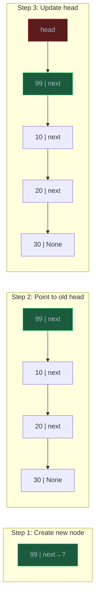

# Linked Lists

> A linked list stores elements as individual nodes connected by pointers, enabling O(1) insertion and deletion without shifting elements — the fundamental alternative to arrays.

## Table of Contents
- [Core Concepts](#core-concepts)
- [Code Examples](#code-examples)
- [Common Pitfalls](#common-pitfalls)
- [Key Takeaways](#key-takeaways)
- [Exercises](#exercises)

## Core Concepts

### What Is a Linked List?

#### What

A linked list is a sequence of **nodes**, where each node contains two things: the **data** it stores and a **pointer** (reference) to the next node. The nodes are *not* stored in contiguous memory — they can be scattered anywhere in the heap. The list is held together entirely by pointers.


#### How

To traverse a linked list, you start at the **head** node and follow `next` pointers until you reach `None`. There is no index, no pointer arithmetic, no way to jump to the 5th element directly. You must walk through nodes 1, 2, 3, 4 to get to node 5.

This is the opposite of an array: arrays give O(1) access but O(n) insertion; linked lists give O(1) insertion (at a known position) but O(n) access.

#### Why It Matters

Linked lists solve the fundamental limitation of arrays: **insertion and deletion without shifting**. In an array, inserting in the middle requires moving every element after the insertion point. In a linked list, you just rewire two pointers — O(1) if you already have a reference to the node.

This makes linked lists ideal for scenarios where elements are frequently added or removed from arbitrary positions: undo histories, LRU caches (via doubly-linked lists), and the free list in memory allocators. They're also the building block for other structures — hash tables use linked lists for chaining, and adjacency lists for graphs are essentially arrays of linked lists.

### Singly Linked Lists

#### What

A **singly linked list** has nodes that point in one direction only — each node has a `next` pointer to the following node. You can traverse forward but not backward.

| Operation | Time | Why |
| --- | --- | --- |
| Access by index | O(n) | Must walk from head |
| Search | O(n) | Must walk from head |
| Insert at head | O(1) | Rewire head pointer |
| Insert at tail | O(n) or O(1)* | O(1) if tail pointer maintained |
| Insert after a node | O(1) | Rewire two pointers |
| Delete head | O(1) | Move head to next |
| Delete a specific node | O(n) | Must find the previous node |

\* Many implementations maintain a `tail` pointer to make tail insertion O(1).

#### How

Insertion at the head is the simplest and most common operation:

1. Create a new node
2. Point its `next` to the current head
3. Update `head` to point to the new node



Deletion requires finding the **previous node** because you need to update its `next` pointer to skip the deleted node. This is why deleting a specific node is O(n) in a singly linked list — you must traverse from the head to find the predecessor.

#### Why It Matters

Singly linked lists use less memory per node than doubly linked lists (one pointer instead of two). For scenarios where you only traverse forward — like a stack (push/pop from head) or a simple iterator — the extra `prev` pointer of a doubly linked list wastes memory for no benefit.

### Doubly Linked Lists

#### What

A **doubly linked list** adds a `prev` pointer to each node, allowing traversal in both directions. This solves the biggest limitation of singly linked lists: you can delete a node in O(1) if you have a direct reference to it (no need to find the predecessor).


| Operation | Time | Why |
| --- | --- | --- |
| Access by index | O(n) | Must walk from head or tail |
| Search | O(n) | Walk from either end |
| Insert at head/tail | O(1) | Rewire pointers |
| Insert before/after a node | O(1) | Rewire four pointers |
| Delete a known node | O(1) | Rewire prev and next pointers |

#### How

Deleting a node when you have a direct reference to it is straightforward:

```
node.prev.next = node.next   # skip forward over the deleted node
node.next.prev = node.prev   # skip backward over the deleted node
```

Two pointer reassignments and the node is removed. No traversal needed.

Many implementations use a **sentinel node** (dummy head/tail) to eliminate edge cases. The sentinel is always present and never holds real data. This means `head.next` is the first real element and `tail.prev` is the last — you never have to check for `None` during insertion or deletion.

#### Why It Matters

Doubly linked lists power Python's `collections.deque` and are the core of **LRU cache** implementations. In an LRU cache, you need to both move recently accessed items to the front (O(1) delete + O(1) insert at head) and evict the least recently used item from the back (O(1) delete from tail). A doubly linked list combined with a hash map gives O(1) for all three operations.

The trade-off is memory: each node stores two pointers instead of one. For a list of integers, those extra pointers might double the memory overhead. For a list of large objects, the extra pointer is negligible.

### Arrays vs Linked Lists: When to Use Which

#### What

| Criteria | Array | Linked List |
| --- | --- | --- |
| Access pattern | Random access by index | Sequential traversal |
| Insertions | Rare, or only at end | Frequent, at arbitrary positions |
| Memory | Compact, cache-friendly | Pointer overhead, cache-unfriendly |
| Size | Known in advance (or append-heavy) | Unpredictable, grows/shrinks often |
| Real examples | Image pixels, lookup tables, buffers | Undo history, LRU cache, free lists |

#### How

In practice, **arrays (Python `list`) are the default choice** for almost everything. Linked lists are a specialized tool for specific use cases:

- **Use an array** when you need fast access by position, when you're iterating over all elements, or when memory efficiency matters.
- **Use a linked list** when you need frequent O(1) insertion/deletion at known positions and don't need random access.

In Python specifically, you rarely implement a linked list yourself. `collections.deque` (doubly linked list internally) handles the common cases. You implement linked lists to understand the concept, solve interview problems, and recognize when a linked list is the right tool in lower-level languages.

#### Why It Matters

The cache performance gap between arrays and linked lists is much larger than Big-O suggests. Walking an array is sequential memory access — the CPU prefetcher loads the next chunk before you ask for it. Walking a linked list involves pointer chasing — each `next` pointer could point anywhere in memory, causing cache misses. In benchmarks, iterating over an array can be 10-100x faster than iterating over a linked list of the same size, even though both are O(n).

This is why understanding data structures means understanding *both* the theoretical complexity and the practical hardware implications. Big-O tells you the growth rate; cache behavior tells you the constant factor.

## Code Examples

### Singly Linked List Implementation

```python
from __future__ import annotations
from dataclasses import dataclass


@dataclass
class SinglyNode:
    """A node in a singly linked list."""
    data: int
    next: SinglyNode | None = None


class SinglyLinkedList:
    """A singly linked list with head and tail pointers.

    Maintaining a tail pointer makes append O(1) instead of O(n).
    """

    def __init__(self) -> None:
        self.head: SinglyNode | None = None
        self.tail: SinglyNode | None = None
        self._size: int = 0

    def __len__(self) -> int:
        return self._size

    def __repr__(self) -> str:
        elements: list[str] = []
        current = self.head
        while current is not None:
            elements.append(str(current.data))
            current = current.next
        return " -> ".join(elements) + " -> None"

    def prepend(self, data: int) -> None:
        """Insert at the head — O(1).

        Time:  O(1) — just rewire the head pointer.
        Space: O(1) — one new node.
        """
        new_node = SinglyNode(data, next=self.head)
        self.head = new_node
        if self.tail is None:  # list was empty
            self.tail = new_node
        self._size += 1

    def append(self, data: int) -> None:
        """Insert at the tail — O(1) with tail pointer.

        Time:  O(1) — tail pointer gives direct access to the end.
        Space: O(1) — one new node.
        """
        new_node = SinglyNode(data)
        if self.tail is None:  # list is empty
            self.head = new_node
            self.tail = new_node
        else:
            self.tail.next = new_node
            self.tail = new_node
        self._size += 1

    def delete(self, data: int) -> bool:
        """Delete the first node containing `data` — O(n).

        Time:  O(n) — must find the node and its predecessor.
        Space: O(1).
        Returns True if found and deleted, False otherwise.
        """
        if self.head is None:
            return False

        # Special case: deleting the head
        if self.head.data == data:
            self.head = self.head.next
            if self.head is None:  # list is now empty
                self.tail = None
            self._size -= 1
            return True

        # Walk the list to find the node before the target
        current = self.head
        while current.next is not None:
            if current.next.data == data:
                if current.next is self.tail:  # deleting the tail
                    self.tail = current
                current.next = current.next.next
                self._size -= 1
                return True
            current = current.next

        return False

    def search(self, data: int) -> SinglyNode | None:
        """Find the first node containing `data` — O(n).

        Time:  O(n) — must walk from head.
        Space: O(1).
        """
        current = self.head
        while current is not None:
            if current.data == data:
                return current
            current = current.next
        return None

    def reverse(self) -> None:
        """Reverse the list in-place — O(n).

        Time:  O(n) — visit every node once.
        Space: O(1) — only pointer manipulation, no extra storage.
        """
        self.tail = self.head
        prev: SinglyNode | None = None
        current = self.head

        while current is not None:
            next_node = current.next  # save next before we overwrite it
            current.next = prev       # reverse the pointer
            prev = current             # advance prev
            current = next_node        # advance current

        self.head = prev


# Demo
ll = SinglyLinkedList()
for val in [10, 20, 30, 40, 50]:
    ll.append(val)

print(f"Original: {ll}")
print(f"Length:   {len(ll)}")
print(f"Search 30: {ll.search(30)}")

ll.prepend(5)
print(f"After prepend(5): {ll}")

ll.delete(30)
print(f"After delete(30): {ll}")

ll.reverse()
print(f"After reverse():  {ll}")
```

### Doubly Linked List Implementation

```python
from __future__ import annotations
from dataclasses import dataclass


@dataclass
class DoublyNode:
    """A node in a doubly linked list."""
    data: int
    prev: DoublyNode | None = None
    next: DoublyNode | None = None


class DoublyLinkedList:
    """A doubly linked list using sentinel nodes.

    Sentinel nodes eliminate edge cases — the head sentinel's `next`
    is the first real element, and the tail sentinel's `prev` is the last.
    No None checks needed during insertion or deletion.
    """

    def __init__(self) -> None:
        # Sentinels — never hold real data, always present
        self._head_sentinel = DoublyNode(data=-1)
        self._tail_sentinel = DoublyNode(data=-1)
        self._head_sentinel.next = self._tail_sentinel
        self._tail_sentinel.prev = self._head_sentinel
        self._size: int = 0

    def __len__(self) -> int:
        return self._size

    def __repr__(self) -> str:
        elements: list[str] = []
        current = self._head_sentinel.next
        while current is not self._tail_sentinel:
            elements.append(str(current.data))
            current = current.next
        return " <-> ".join(elements)

    def _insert_between(
        self, data: int, predecessor: DoublyNode, successor: DoublyNode
    ) -> DoublyNode:
        """Insert a new node between two existing nodes — O(1).

        This is the fundamental operation — prepend, append, and
        insert-after are all special cases of this.
        """
        new_node = DoublyNode(data, prev=predecessor, next=successor)
        predecessor.next = new_node
        successor.prev = new_node
        self._size += 1
        return new_node

    def _remove_node(self, node: DoublyNode) -> int:
        """Remove a node from the list — O(1) when you have the reference.

        The key advantage of doubly linked lists: you can delete any node
        without traversing from the head.
        """
        node.prev.next = node.next
        node.next.prev = node.prev
        self._size -= 1
        return node.data

    def prepend(self, data: int) -> DoublyNode:
        """Insert at the front — O(1)."""
        return self._insert_between(data, self._head_sentinel, self._head_sentinel.next)

    def append(self, data: int) -> DoublyNode:
        """Insert at the back — O(1)."""
        return self._insert_between(data, self._tail_sentinel.prev, self._tail_sentinel)

    def pop_front(self) -> int:
        """Remove and return the first element — O(1).

        Raises IndexError if the list is empty.
        """
        if self._size == 0:
            raise IndexError("pop from empty list")
        return self._remove_node(self._head_sentinel.next)

    def pop_back(self) -> int:
        """Remove and return the last element — O(1).

        Raises IndexError if the list is empty.
        """
        if self._size == 0:
            raise IndexError("pop from empty list")
        return self._remove_node(self._tail_sentinel.prev)

    def delete_value(self, data: int) -> bool:
        """Delete the first node containing `data` — O(n).

        Must traverse to find the node, but once found, deletion is O(1).
        """
        current = self._head_sentinel.next
        while current is not self._tail_sentinel:
            if current.data == data:
                self._remove_node(current)
                return True
            current = current.next
        return False


# Demo
dll = DoublyLinkedList()
for val in [10, 20, 30, 40, 50]:
    dll.append(val)

print(f"Original:          {dll}")
print(f"Length:             {len(dll)}")

dll.prepend(5)
print(f"After prepend(5):  {dll}")

dll.pop_front()
print(f"After pop_front(): {dll}")

dll.pop_back()
print(f"After pop_back():  {dll}")

dll.delete_value(30)
print(f"After delete(30):  {dll}")
```

### Practical Use: LRU Cache with Doubly Linked List

```python
from __future__ import annotations
from dataclasses import dataclass


@dataclass
class CacheNode:
    """Node for LRU cache — stores key-value pair with doubly linked pointers."""
    key: str
    value: str
    prev: CacheNode | None = None
    next: CacheNode | None = None


class LRUCache:
    """Least Recently Used cache — O(1) get and put.

    Combines a hash map (O(1) lookup by key) with a doubly linked list
    (O(1) move-to-front and evict-from-back). This is the classic
    interview problem that demonstrates why doubly linked lists exist.
    """

    def __init__(self, capacity: int) -> None:
        self.capacity = capacity
        self.cache: dict[str, CacheNode] = {}

        # Sentinel nodes to avoid None checks
        self._head = CacheNode(key="", value="")
        self._tail = CacheNode(key="", value="")
        self._head.next = self._tail
        self._tail.prev = self._head

    def _remove(self, node: CacheNode) -> None:
        """Remove a node from the doubly linked list — O(1)."""
        node.prev.next = node.next
        node.next.prev = node.prev

    def _add_to_front(self, node: CacheNode) -> None:
        """Add a node right after the head sentinel — O(1)."""
        node.next = self._head.next
        node.prev = self._head
        self._head.next.prev = node
        self._head.next = node

    def get(self, key: str) -> str | None:
        """Retrieve value by key — O(1).

        Moves the accessed node to the front (most recently used).
        """
        if key not in self.cache:
            return None
        node = self.cache[key]
        # Move to front — this item was just accessed
        self._remove(node)
        self._add_to_front(node)
        return node.value

    def put(self, key: str, value: str) -> None:
        """Add or update a key-value pair — O(1).

        If at capacity, evicts the least recently used item (tail).
        """
        if key in self.cache:
            # Update existing — remove old position, will re-add at front
            self._remove(self.cache[key])
        elif len(self.cache) >= self.capacity:
            # Evict LRU item (the one just before the tail sentinel)
            lru_node = self._tail.prev
            self._remove(lru_node)
            del self.cache[lru_node.key]

        # Add new/updated node at front
        new_node = CacheNode(key=key, value=value)
        self._add_to_front(new_node)
        self.cache[key] = new_node

    def __repr__(self) -> str:
        items: list[str] = []
        current = self._head.next
        while current is not self._tail:
            items.append(f"{current.key}={current.value}")
            current = current.next
        return f"LRUCache([{', '.join(items)}])"


# Demo
cache = LRUCache(capacity=3)

cache.put("a", "apple")
cache.put("b", "banana")
cache.put("c", "cherry")
print(f"After 3 puts: {cache}")

cache.get("a")  # moves "a" to front
print(f"After get(a): {cache}")

cache.put("d", "date")  # evicts "b" (least recently used)
print(f"After put(d): {cache}")

print(f"get(b): {cache.get('b')}")  # None — was evicted
print(f"get(c): {cache.get('c')}")  # cherry — still present
```

**Time**: O(1) for both `get` and `put` — hash map lookup + pointer rewiring.
**Space**: O(capacity) — stores at most `capacity` nodes plus the hash map entries.

## Common Pitfalls

### Pitfall 1: Losing the Reference to the Next Node

```python
# BAD — overwriting next before saving it
def bad_reverse(head: SinglyNode | None) -> SinglyNode | None:
    current = head
    prev = None
    while current:
        current.next = prev  # OOPS — lost reference to the rest of the list!
        prev = current
        current = current.next  # current.next is now prev, not the original next!
    return prev

# GOOD — save the next pointer before overwriting
def good_reverse(head: SinglyNode | None) -> SinglyNode | None:
    current = head
    prev = None
    while current:
        next_node = current.next  # save before overwriting
        current.next = prev
        prev = current
        current = next_node       # use the saved reference
    return prev
```

Why it's wrong: When you set `current.next = prev`, you lose the link to the rest of the list. You must save `current.next` *before* modifying it. This is the most common bug in linked list problems.

### Pitfall 2: Forgetting Edge Cases (Empty List, Single Node)

```python
# BAD — crashes on empty list
def bad_get_last(head: SinglyNode | None) -> int:
    current = head
    while current.next:  # AttributeError if head is None!
        current = current.next
    return current.data

# GOOD — handle empty list explicitly
def good_get_last(head: SinglyNode | None) -> int | None:
    if head is None:
        return None
    current = head
    while current.next is not None:
        current = current.next
    return current.data
```

Why it's wrong: Linked list code must always handle: (1) empty list (`head is None`), (2) single-node list, and (3) operations on the tail. Using sentinel nodes eliminates most of these edge cases — it's the professional approach.

### Pitfall 3: Creating a Cycle Accidentally

```python
# BAD — appending to a list without checking creates a cycle
def bad_append(head: SinglyNode, data: int) -> None:
    new_node = SinglyNode(data)
    current = head
    while current.next:
        current = current.next
    current.next = new_node
    new_node.next = head  # OOPS — created a cycle! Traversal now loops forever

# GOOD — new tail's next should be None
def good_append(head: SinglyNode, data: int) -> None:
    new_node = SinglyNode(data)  # next defaults to None
    current = head
    while current.next:
        current = current.next
    current.next = new_node
    # new_node.next is already None — no cycle
```

Why it's wrong: If the last node's `next` points back to any earlier node, traversal loops forever. Always verify that the tail node's `next` is `None`. Cycles in singly linked lists are bugs unless you're intentionally building a circular linked list.

## Key Takeaways

- **Linked lists** store elements as nodes connected by pointers — O(1) insertion/deletion at known positions, O(n) access by index. They're the inverse of arrays.
- **Singly linked lists** use one pointer per node (less memory). **Doubly linked lists** add a `prev` pointer, enabling O(1) deletion of any node you have a reference to.
- **Sentinel nodes** eliminate edge cases (empty list, head/tail operations) by ensuring the list always has at least two nodes. This is the professional approach.
- In practice, **arrays (Python `list`) are almost always faster** due to cache locality. Use linked lists when you need O(1) insertion/deletion at arbitrary positions — the classic example is an **LRU cache** (doubly linked list + hash map).
- The key skill with linked lists is **pointer manipulation** — always save `next` before overwriting, always handle edge cases, and draw diagrams before coding.

## Exercises

1. **Write a function** `has_cycle(head: SinglyNode | None) -> bool` that detects whether a singly linked list contains a cycle. Use Floyd's slow/fast pointer technique (the "tortoise and hare" algorithm). Analyze the time and space complexity.

2. **Write a function** `find_middle(head: SinglyNode | None) -> SinglyNode | None` that returns the middle node of a singly linked list in a single pass (O(n) time, O(1) space). Hint: use two pointers moving at different speeds.

3. **Explain** why deleting a node from a singly linked list is O(n) even if you have a direct reference to the node, while the same operation on a doubly linked list is O(1). What specific information does the singly linked list lack?

4. **Write a function** `merge_sorted_lists(l1: SinglyNode | None, l2: SinglyNode | None) -> SinglyNode | None` that merges two sorted singly linked lists into one sorted list. Do not create new nodes — rewire the existing pointers. Analyze the time and space complexity.

5. **Design** an LRU cache that supports `get(key)` and `put(key, value)` both in O(1) time. Explain why a doubly linked list (not singly linked) combined with a hash map is necessary. What would break if you used a singly linked list instead?

---
up:: [Schedule](../../Schedule.md)
#type/learning #source/self-study #status/seed
