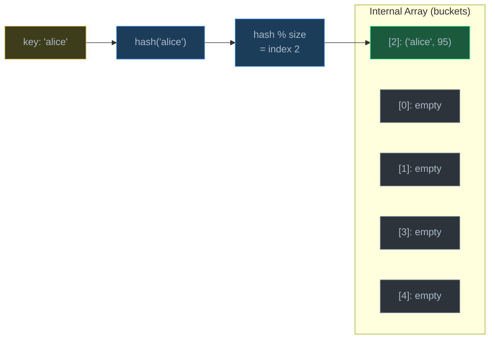
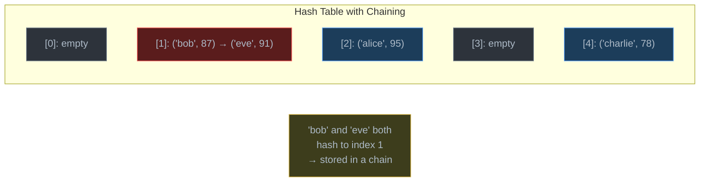
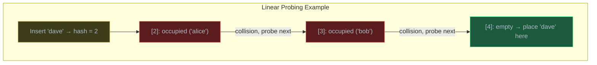
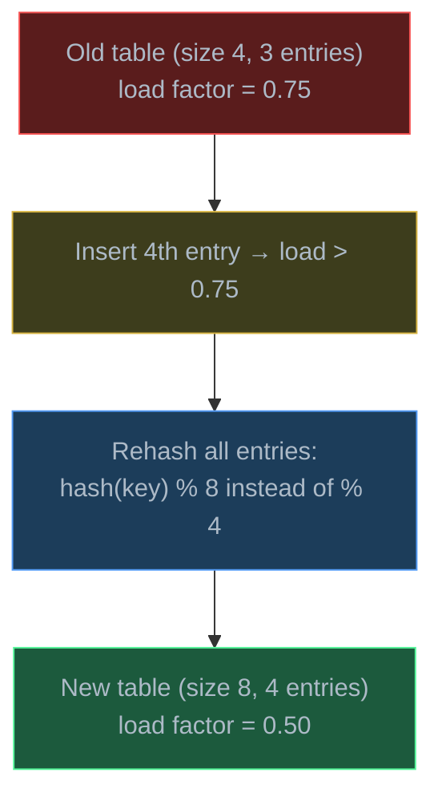
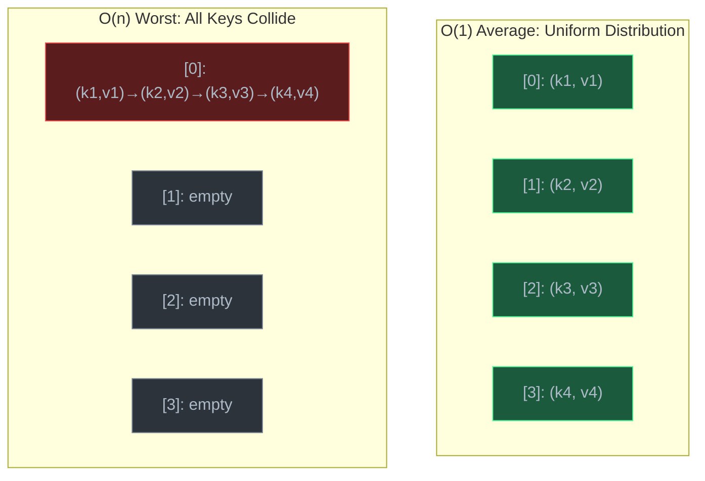

# Hash Tables

> A hash table maps keys to values in O(1) average time by using a hash function to convert keys into array indices — the most important data structure for fast lookups in practical programming.

## Table of Contents
- [Core Concepts](#core-concepts)
- [Code Examples](#code-examples)
- [Common Pitfalls](#common-pitfalls)
- [Key Takeaways](#key-takeaways)
- [Exercises](#exercises)

## Core Concepts

### What Is a Hash Table?

#### What

A **hash table** (also called a hash map) is a data structure that stores **key-value pairs** and supports O(1) average-case lookup, insertion, and deletion. It works by using a **hash function** to convert a key into an **array index**, then storing the value at that index.



The core idea: instead of searching through every element to find a key (O(n)), you compute where the key *should be* (O(1)) and go directly there.

| Operation | Average Case | Worst Case | Why |
| --- | --- | --- | --- |
| Lookup `table[key]` | O(1) | O(n) | Hash to index; worst case if all keys collide |
| Insert `table[key] = val` | O(1) | O(n) | Same as lookup + store |
| Delete `del table[key]` | O(1) | O(n) | Same as lookup + remove |
| Search by value | O(n) | O(n) | Must scan all entries — no shortcut |

#### How

The two-step process for every operation:

1. **Hash the key**: `index = hash(key) % array_size`
2. **Access the bucket**: Go to `array[index]` and perform the operation

The hash function turns any key (string, number, tuple) into an integer. The modulo operation (`% array_size`) maps that integer to a valid array index. If two different keys map to the same index (a **collision**), we need a strategy to handle it — more on this below.

#### Why It Matters

Hash tables are the single most used data structure in software engineering. Python's `dict`, JavaScript's `Object` and `Map`, Java's `HashMap`, Go's `map` — all hash tables. Every time you write `user["name"]` or `cache[url]`, you're using a hash table. Databases use hash indices for constant-time lookups. Web frameworks use hash tables for session storage, routing tables, and configuration. Understanding how they work — and when they degrade — is essential for writing performant code and passing interviews.

### Hash Functions

#### What

A **hash function** takes an input of arbitrary size (a string, a number, a tuple) and produces a fixed-size integer. For hash tables, a good hash function has three properties:

1. **Deterministic** — the same key always produces the same hash value
2. **Uniform distribution** — keys should spread evenly across the array indices (minimizes collisions)
3. **Fast to compute** — hashing should be O(1) or O(k) where k is the key length

Python's built-in `hash()` function satisfies all three:

```python
print(hash("hello"))       # e.g., 5765423985743290122 (varies per session)
print(hash("hello"))       # same value within the same session
print(hash(42))            # 42 (integers hash to themselves)
print(hash((1, 2, 3)))    # tuples are hashable (immutable)
# hash([1, 2, 3])         # TypeError — lists are NOT hashable (mutable)
```

#### How

A simplified hash function for strings works by combining character codes:

```
hash("cat") = ord('c') * 31^2 + ord('a') * 31^1 + ord('t') * 31^0
            = 99 * 961 + 97 * 31 + 116 * 1
            = 95139 + 3007 + 116
            = 98262
```

The multiplication by powers of a prime (31 is commonly used) ensures that the order of characters matters — `"cat"` and `"tac"` hash to different values. Java's `String.hashCode()` uses this exact formula.

To map the hash to an array index: `index = hash_value % array_size`. If the array has 8 buckets and the hash is 98262, the index is `98262 % 8 = 6`.

#### Why It Matters

A bad hash function destroys hash table performance. If every key hashes to the same index, the hash table degrades to a linked list with O(n) lookups. This is not theoretical — **hash collision attacks** exploit predictable hash functions to cause denial of service (send many keys that collide, turning O(1) lookups into O(n)). This is why Python randomizes hash seeds across sessions (`PYTHONHASHSEED`) — the same string produces a different hash in different program runs, preventing attackers from predicting collisions.

Only **immutable** types can be hash keys. If a key could change after being stored, its hash would change, and the hash table would look in the wrong bucket — the entry would be lost. This is why Python allows `str`, `int`, `tuple` as dict keys but not `list`, `set`, or `dict`.

### Collision Resolution: Chaining

#### What

A **collision** occurs when two different keys hash to the same array index. **Chaining** (also called separate chaining) handles this by storing a linked list (or any collection) at each bucket. When multiple keys map to the same index, they're all stored in that bucket's list.



#### How

To insert `(key, value)` with chaining:
1. Compute `index = hash(key) % size`
2. Go to `buckets[index]`
3. If the key already exists in the chain, update its value
4. Otherwise, append `(key, value)` to the chain

To look up a key:
1. Compute `index = hash(key) % size`
2. Walk the chain at `buckets[index]`, comparing keys until you find a match (or reach the end)

With a good hash function and a reasonable load factor, each chain has at most 1-2 entries on average, so the walk is effectively O(1). But if all n keys collide into one bucket, looking up a key requires walking a chain of length n — O(n).

#### Why It Matters

Chaining is the simplest and most intuitive collision resolution strategy. It never "fills up" — you can always add more entries by extending a chain. Its worst-case behavior is predictable (degrades to linked list search), and it's easy to implement correctly. The trade-off is extra memory for the linked list pointers, and poor cache locality since chain nodes can be scattered in memory.

Java's `HashMap` uses chaining, with an optimization: when a chain grows beyond 8 entries, it converts from a linked list to a balanced binary tree (red-black tree), improving worst-case lookup from O(n) to O(log n).

### Collision Resolution: Open Addressing

#### What

**Open addressing** handles collisions by finding another empty slot within the same array. Instead of building a chain at the collision index, you **probe** — try successive indices until you find an empty slot.

Three common probing strategies:

| Strategy | Probe Sequence | Problem |
| --- | --- | --- |
| **Linear probing** | index, index+1, index+2, ... | Clustering — runs of occupied slots grow |
| **Quadratic probing** | index, index+1, index+4, index+9, ... | Secondary clustering — less severe |
| **Double hashing** | index, index+h2(key), index+2·h2(key), ... | No clustering — but more expensive to compute |



#### How

**Linear probing** in detail:

To insert:
1. Compute `index = hash(key) % size`
2. If `buckets[index]` is empty, store the entry there
3. If occupied, try `(index + 1) % size`, then `(index + 2) % size`, etc.
4. Continue until an empty slot is found

To look up:
1. Compute `index = hash(key) % size`
2. If `buckets[index]` has the target key, return its value
3. If occupied by a different key, probe forward
4. If you hit an empty slot, the key is not in the table

To delete: you can't just empty the slot — that would break the probe chain for keys that were inserted after this one and probed past this position. Instead, mark the slot as **"deleted"** (a tombstone). Lookups skip tombstones; insertions can reuse them.

#### Why It Matters

Open addressing stores everything in a single contiguous array, which is **extremely cache-friendly** — probing through adjacent slots stays within the same cache line. This makes open addressing significantly faster than chaining in practice for moderate load factors, despite having a more complex deletion strategy.

The downside: performance degrades sharply as the table fills up. At 90% full, linear probing averages ~50 probes per lookup. At 50% full, it averages ~1.5 probes. This is why load factor management is critical for open addressing — more so than for chaining.

Python's `dict` uses a variant of open addressing (see below), which is part of why Python dicts are so fast.

### Load Factor and Resizing

#### What

The **load factor** is the ratio of stored entries to the number of buckets:

```
load_factor = n / m
```

where `n` is the number of entries and `m` is the number of buckets.

| Load Factor | Meaning | Effect |
| --- | --- | --- |
| 0.0 | Empty table | No collisions, wasted memory |
| 0.25 | 25% full | Few collisions, good performance |
| 0.5 | 50% full | Occasional collisions, normal |
| 0.75 | 75% full | Frequent collisions, resize soon |
| 1.0 | Completely full | Many collisions, severe degradation |
| > 1.0 | Only with chaining | Chains averaging > 1 entry each |

#### How

When the load factor exceeds a threshold (typically 0.6-0.75), the hash table **resizes**:

1. Allocate a new, larger array (usually 2x the current size)
2. **Rehash every entry** — recompute `hash(key) % new_size` for each existing entry
3. Insert all entries into the new array
4. Free the old array



Resizing is O(n) — you must rehash every entry. But like dynamic array resizing, it happens infrequently. Over n insertions, the total cost of all resizes is O(n), so the **amortized cost** per insertion remains O(1).

#### Why It Matters

Load factor is the single most important factor in hash table performance. A hash table that never resizes will gradually degrade from O(1) to O(n) as it fills up. Too-eager resizing wastes memory; too-late resizing causes slow operations. The threshold of 0.75 is a widely-used sweet spot: Java's `HashMap` resizes at 0.75, and Python's `dict` resizes at roughly 2/3 (~0.67).

If you know how many entries you'll store in advance, you can pre-size the hash table to avoid all resizing. In Python, there's no direct way to pre-size a `dict`, but `dict.fromkeys()` or a dict comprehension over known keys achieves a similar effect.

### Python dict Internals

#### What

Python's `dict` is a hash table using **open addressing** with a probing strategy called **perturbation-based probing**. Since Python 3.7, dictionaries are guaranteed to maintain **insertion order** — iterating over a dict yields keys in the order they were inserted.

| Operation | Average | Worst | Notes |
| --- | --- | --- | --- |
| `d[key]` | O(1) | O(n) | Hash + probe |
| `d[key] = val` | O(1) amortized | O(n) | May trigger resize |
| `del d[key]` | O(1) | O(n) | Hash + probe |
| `key in d` | O(1) | O(n) | Same as lookup |
| `len(d)` | O(1) | O(1) | Stored counter |
| `for k in d` | O(n) | O(n) | Iterate entries array |

#### How

Python's dict uses two internal arrays:

1. **Hash table** (sparse) — a compact index array where each slot holds either an index into the entries array or an "empty" marker
2. **Entries array** (dense) — a compact, ordered array of `(hash, key, value)` tuples

```
Hash table (indices):    [_, 2, _, 0, _, 1, _, _]
Entries array (dense):   [(hash_a, 'alice', 95),
                          (hash_b, 'bob', 87),
                          (hash_c, 'charlie', 78)]
```

When you insert `'alice'`, Python:
1. Computes `hash('alice')`
2. Uses the hash to find a slot in the index table
3. Stores the entry at the next position in the dense entries array
4. Records that position in the index table

This split-table design saves memory (the sparse index table uses small integers instead of full entries) and naturally preserves insertion order (entries are appended to the dense array in order).

The probing strategy uses **perturbation**: when a collision occurs, instead of just moving to the next slot (linear probing), Python mixes in more bits of the original hash:

```python
# Simplified Python dict probing
perturb = hash_value
index = hash_value % table_size
while table[index] is occupied:
    perturb >>= 5
    index = (5 * index + perturb + 1) % table_size
```

This reduces clustering compared to pure linear probing because it scatters probes based on the full hash value, not just the initial position.

#### Why It Matters

Understanding Python's dict internals explains several behaviors:

- **Insertion order preserved** (Python 3.7+): Because entries are stored in a dense array in insertion order. Before 3.7, dicts used a single sparse table, and iteration order was unpredictable.
- **Only hashable keys**: Keys must be immutable so their hash doesn't change after insertion. `hash([1,2])` raises `TypeError`.
- **Memory efficiency**: The split-table design uses ~30% less memory than the pre-3.6 implementation.
- **Resizing at 2/3 full**: Python resizes when the table is about 2/3 full to keep probe chains short.
- **Performance degrades with many collisions**: If you create millions of keys with the same hash, lookups become O(n). This is a real security concern (hash flooding attacks).

### When and Why Hash Tables Degrade to O(n)

#### What

Hash tables have O(1) *average* case but O(n) *worst* case. Worst case happens when many keys collide — they all hash to the same index, forming either a long chain (chaining) or a long probe sequence (open addressing). At that point, looking up a key requires checking every colliding entry, just like searching an unsorted list.

#### How

Three scenarios that cause degradation:

1. **Pathological input**: Many keys with the same hash value. If 1000 keys all hash to index 3, looking up any of them requires searching through up to 1000 entries.

2. **Bad hash function**: A function that maps many different keys to the same value. For example, `hash(x) = x % 10` maps all multiples of 10 to index 0. A good hash function distributes keys uniformly.

3. **High load factor**: Even with a good hash function, a nearly-full table has long probe sequences. At load factor 0.95, linear probing averages ~10 probes per lookup; at 0.50, it averages ~1.5.



#### Why It Matters

In practice, O(n) worst case almost never happens with Python's built-in `dict` because Python uses a high-quality hash function with randomized seeding. But it's critical to understand *when* it can happen:

- In competitive programming, adversarial test cases can trigger worst-case behavior
- In security-sensitive applications, hash flooding attacks are a real threat
- In performance-critical code, knowing that an unexpectedly slow `dict` lookup might indicate hash collisions helps with debugging

The key takeaway: O(1) average is a *statistical guarantee* that assumes a good hash function and a reasonable load factor. It's not a constant-time guarantee for every single operation.

## Code Examples

### Hash Table with Chaining (From Scratch)

```python
from __future__ import annotations
from dataclasses import dataclass, field


@dataclass
class Entry:
    """A key-value pair in the hash table."""
    key: str
    value: int


class HashTableChaining:
    """A hash table using separate chaining for collision resolution.

    Each bucket is a list of (key, value) entries. When multiple keys
    hash to the same index, they're stored in the same bucket's list.
    """

    _INITIAL_SIZE: int = 8
    _LOAD_FACTOR_THRESHOLD: float = 0.75

    def __init__(self) -> None:
        self._size: int = self._INITIAL_SIZE
        self._count: int = 0
        self._buckets: list[list[Entry]] = [[] for _ in range(self._size)]

    def _hash_index(self, key: str) -> int:
        """Compute the bucket index for a key.

        Uses Python's built-in hash() and maps to a valid index via modulo.
        Time: O(k) where k is the key length (for string hashing).
        """
        return hash(key) % self._size

    def _resize(self) -> None:
        """Double the table size and rehash all entries — O(n).

        Called when load factor exceeds threshold. Every entry must be
        rehashed because the modulo divisor changes.
        """
        old_buckets = self._buckets
        self._size *= 2
        self._count = 0
        self._buckets = [[] for _ in range(self._size)]

        for bucket in old_buckets:
            for entry in bucket:
                self.put(entry.key, entry.value)

    def put(self, key: str, value: int) -> None:
        """Insert or update a key-value pair — O(1) average, O(n) worst.

        If the key already exists, update its value.
        If the load factor exceeds the threshold, resize first.
        """
        # Check if resize is needed
        if (self._count + 1) / self._size > self._LOAD_FACTOR_THRESHOLD:
            self._resize()

        index: int = self._hash_index(key)
        bucket: list[Entry] = self._buckets[index]

        # Check if the key already exists in this bucket
        for entry in bucket:
            if entry.key == key:
                entry.value = value  # update existing
                return

        # Key not found — add new entry
        bucket.append(Entry(key, value))
        self._count += 1

    def get(self, key: str) -> int | None:
        """Look up a value by key — O(1) average, O(n) worst.

        Returns None if the key is not found.
        """
        index: int = self._hash_index(key)
        bucket: list[Entry] = self._buckets[index]

        for entry in bucket:
            if entry.key == key:
                return entry.value

        return None

    def delete(self, key: str) -> bool:
        """Remove a key-value pair — O(1) average, O(n) worst.

        Returns True if the key was found and deleted, False otherwise.
        """
        index: int = self._hash_index(key)
        bucket: list[Entry] = self._buckets[index]

        for i, entry in enumerate(bucket):
            if entry.key == key:
                bucket.pop(i)
                self._count -= 1
                return True

        return False

    def __contains__(self, key: str) -> bool:
        """Support 'key in table' syntax — O(1) average."""
        return self.get(key) is not None

    def __len__(self) -> int:
        return self._count

    @property
    def load_factor(self) -> float:
        return self._count / self._size

    def __repr__(self) -> str:
        items: list[str] = []
        for bucket in self._buckets:
            for entry in bucket:
                items.append(f"{entry.key!r}: {entry.value}")
        return "{" + ", ".join(items) + "}"


# Demo
ht = HashTableChaining()

# Insert entries
students = [("alice", 95), ("bob", 87), ("charlie", 78), ("diana", 92), ("eve", 88)]
for name, score in students:
    ht.put(name, score)

print(f"Table:       {ht}")
print(f"Length:      {len(ht)}")
print(f"Load factor: {ht.load_factor:.2f}")
print(f"get('bob'):  {ht.get('bob')}")       # 87
print(f"'eve' in ht: {'eve' in ht}")          # True
print(f"'frank' in ht: {'frank' in ht}")      # False

# Update
ht.put("bob", 90)
print(f"After update bob: {ht.get('bob')}")   # 90

# Delete
ht.delete("charlie")
print(f"After delete charlie: {ht}")
print(f"Length: {len(ht)}")
```

**Time**: O(1) average for `put`, `get`, `delete`. O(n) worst case when all keys hash to the same bucket. Resizing is O(n) but amortized O(1) over many insertions.
**Space**: O(n) where n is the number of entries, plus O(m) for the bucket array where m is the table size.

### Word Frequency Counter

```python
from collections import defaultdict


def word_frequency(text: str) -> dict[str, int]:
    """Count the frequency of each word in a text.

    Uses a dict as a hash table — each word is a key, its count is the value.
    This is the most common real-world use of hash tables.

    Time:  O(n) where n is the number of words — one O(1) dict lookup per word.
    Space: O(k) where k is the number of unique words.
    """
    freq: dict[str, int] = {}

    for word in text.lower().split():
        # Strip punctuation from the word
        cleaned: str = word.strip(".,!?;:\"'()-")
        if cleaned:
            freq[cleaned] = freq.get(cleaned, 0) + 1

    return freq


def top_n_words(text: str, n: int = 5) -> list[tuple[str, int]]:
    """Find the n most frequent words in a text.

    Time:  O(w + w log w) where w is unique word count — O(w) to count,
           O(w log w) to sort. For top-n specifically, a heap would give
           O(w + n log w), but sorting is simpler and fine for typical text.
    Space: O(w) for the frequency dict.
    """
    freq: dict[str, int] = word_frequency(text)
    # Sort by frequency (descending), then alphabetically for ties
    sorted_words = sorted(freq.items(), key=lambda x: (-x[1], x[0]))
    return sorted_words[:n]


# Demo
sample_text = """
Hash tables are the most important data structure in practical programming.
Every language has hash tables. Python has dict. Java has HashMap.
Hash tables give us constant time lookups. Hash tables are everywhere.
"""

freq = word_frequency(sample_text)
print("Word frequencies:")
for word, count in sorted(freq.items(), key=lambda x: -x[1])[:10]:
    print(f"  {word:<15} {count}")

print(f"\nTop 5 words: {top_n_words(sample_text, 5)}")
```

**Time**: O(n) for counting where n is total words, O(k log k) for sorting where k is unique words.
**Space**: O(k) for the frequency dictionary.

### Two Sum with Hash Map

```python
def two_sum_brute_force(nums: list[int], target: int) -> tuple[int, int] | None:
    """Find two indices whose values sum to target — brute force.

    Check every pair of elements. Simple but slow.

    Time:  O(n^2) — nested loops checking all pairs.
    Space: O(1) — no extra data structures.
    """
    n: int = len(nums)
    for i in range(n):
        for j in range(i + 1, n):
            if nums[i] + nums[j] == target:
                return (i, j)
    return None


def two_sum_hash_map(nums: list[int], target: int) -> tuple[int, int] | None:
    """Find two indices whose values sum to target — hash map approach.

    Key insight: for each number, we need (target - number) to exist.
    Instead of searching for it in O(n), store previously seen numbers
    in a hash map for O(1) lookup.

    Time:  O(n) — single pass, each lookup is O(1) average.
    Space: O(n) — hash map stores up to n entries.
    """
    seen: dict[int, int] = {}  # value → index

    for i, num in enumerate(nums):
        complement: int = target - num

        if complement in seen:  # O(1) hash table lookup
            return (seen[complement], i)

        seen[num] = i  # store current number's index for future lookups

    return None


# Demo
nums = [2, 7, 11, 15]
target = 9
print(f"Brute force: {two_sum_brute_force(nums, target)}")  # (0, 1)
print(f"Hash map:    {two_sum_hash_map(nums, target)}")      # (0, 1)

nums2 = [3, 2, 4]
target2 = 6
print(f"Hash map:    {two_sum_hash_map(nums2, target2)}")    # (1, 2)
```

**Brute force**: O(n^2) time, O(1) space — check every pair.
**Hash map**: O(n) time, O(n) space — trade space for time by storing seen values in a hash table. This is the classic example of how hash tables enable O(n) solutions to problems that seem to require O(n^2).

### Group Anagrams

```python
from collections import defaultdict


def group_anagrams(words: list[str]) -> list[list[str]]:
    """Group words that are anagrams of each other.

    Anagrams have the same characters in different order: "eat", "tea", "ate".
    Key insight: if we sort the characters of each word, anagrams produce the
    same sorted string. Use that sorted string as a hash map key.

    Example: sorted("eat") = "aet", sorted("tea") = "aet" → same key

    Time:  O(n * k log k) — n words, each sorted in O(k log k) where k is
           the maximum word length.
    Space: O(n * k) — storing all words in the hash map.
    """
    groups: defaultdict[str, list[str]] = defaultdict(list)

    for word in words:
        # The sorted characters serve as a canonical form for the anagram group
        key: str = "".join(sorted(word))
        groups[key].append(word)

    return list(groups.values())


# Demo
words = ["eat", "tea", "tan", "ate", "nat", "bat"]
result = group_anagrams(words)
print("Anagram groups:")
for group in result:
    print(f"  {group}")
# ['eat', 'tea', 'ate']
# ['tan', 'nat']
# ['bat']
```

**Time**: O(n * k log k) — for each of n words, sorting its k characters takes O(k log k). The hash map operations are O(1) average.
**Space**: O(n * k) — the hash map stores all n words of up to k characters each.

### Detecting Duplicates

```python
def has_duplicates(nums: list[int]) -> bool:
    """Check if a list contains any duplicate values.

    Without a hash table, you'd sort in O(n log n) and check adjacent
    pairs, or brute-force in O(n^2). A hash set gives O(n).

    Time:  O(n) — one pass, each set lookup/insert is O(1) average.
    Space: O(n) — the set stores up to n elements.
    """
    seen: set[int] = set()

    for num in nums:
        if num in seen:  # O(1) average — set uses a hash table internally
            return True
        seen.add(num)

    return False


def find_first_duplicate(nums: list[int]) -> int | None:
    """Find the first element that appears more than once.

    Time:  O(n) — stops at the first duplicate found.
    Space: O(n) — the set stores previously seen elements.
    """
    seen: set[int] = set()

    for num in nums:
        if num in seen:
            return num
        seen.add(num)

    return None


# Demo
print(has_duplicates([1, 2, 3, 4, 5]))          # False
print(has_duplicates([1, 2, 3, 2, 5]))          # True
print(find_first_duplicate([1, 2, 3, 2, 5]))    # 2
print(find_first_duplicate([1, 2, 3, 4, 5]))    # None
```

**Time**: O(n) — single pass with O(1) hash set operations.
**Space**: O(n) — the set can hold up to n elements.

### Hash Table with Linear Probing (From Scratch)

```python
from __future__ import annotations
from dataclasses import dataclass


_EMPTY = object()     # sentinel for empty slots
_DELETED = object()   # sentinel for deleted slots (tombstones)


@dataclass
class HashTableOpenAddressing:
    """A hash table using open addressing with linear probing.

    Demonstrates how open addressing works — all entries are stored directly
    in the array, with probing used to resolve collisions.
    """

    _INITIAL_SIZE: int = 8
    _LOAD_FACTOR_THRESHOLD: float = 0.6  # lower than chaining — open addressing is more sensitive

    def __init__(self) -> None:
        self._size: int = self._INITIAL_SIZE
        self._count: int = 0
        self._keys: list[object] = [_EMPTY] * self._size
        self._values: list[object] = [_EMPTY] * self._size

    def _hash_index(self, key: str) -> int:
        """Compute initial bucket index."""
        return hash(key) % self._size

    def _probe(self, key: str) -> int:
        """Find the slot for a key using linear probing.

        Walks forward from the initial hash index until it finds:
        - The key itself (for lookups/updates)
        - An empty slot (for insertions, or to confirm key doesn't exist)

        Tombstones (DELETED) are skipped during lookup but can be
        reused during insertion.
        """
        index: int = self._hash_index(key)
        first_deleted: int | None = None

        for _ in range(self._size):
            if self._keys[index] is _EMPTY:
                # Empty slot — key is not in the table
                return first_deleted if first_deleted is not None else index
            elif self._keys[index] is _DELETED:
                # Tombstone — remember it for potential reuse
                if first_deleted is None:
                    first_deleted = index
            elif self._keys[index] == key:
                # Found the key
                return index

            index = (index + 1) % self._size  # linear probe: next slot

        # Table is full of occupied + deleted slots (shouldn't happen with resizing)
        return first_deleted if first_deleted is not None else -1

    def _resize(self) -> None:
        """Double the table and rehash all non-deleted entries — O(n)."""
        old_keys = self._keys
        old_values = self._values
        self._size *= 2
        self._count = 0
        self._keys = [_EMPTY] * self._size
        self._values = [_EMPTY] * self._size

        for i in range(len(old_keys)):
            if old_keys[i] is not _EMPTY and old_keys[i] is not _DELETED:
                self.put(old_keys[i], old_values[i])

    def put(self, key: str, value: int) -> None:
        """Insert or update — O(1) average with linear probing."""
        if (self._count + 1) / self._size > self._LOAD_FACTOR_THRESHOLD:
            self._resize()

        index: int = self._probe(key)
        is_new: bool = self._keys[index] is _EMPTY or self._keys[index] is _DELETED
        self._keys[index] = key
        self._values[index] = value
        if is_new:
            self._count += 1

    def get(self, key: str) -> int | None:
        """Look up — O(1) average with linear probing."""
        index: int = self._probe(key)
        if self._keys[index] == key:
            return self._values[index]
        return None

    def delete(self, key: str) -> bool:
        """Delete by placing a tombstone — O(1) average."""
        index: int = self._probe(key)
        if self._keys[index] == key:
            self._keys[index] = _DELETED
            self._values[index] = _DELETED
            self._count -= 1
            return True
        return False

    def __repr__(self) -> str:
        items: list[str] = []
        for i in range(self._size):
            if self._keys[i] is not _EMPTY and self._keys[i] is not _DELETED:
                items.append(f"{self._keys[i]!r}: {self._values[i]}")
        return "{" + ", ".join(items) + "}"


# Demo
ht = HashTableOpenAddressing()
for name, score in [("alice", 95), ("bob", 87), ("charlie", 78)]:
    ht.put(name, score)

print(f"Table: {ht}")
print(f"get('bob'): {ht.get('bob')}")        # 87
ht.delete("bob")
print(f"After delete: {ht}")
print(f"get('bob'): {ht.get('bob')}")        # None
ht.put("diana", 92)
print(f"After insert: {ht}")
```

**Time**: O(1) average for all operations. With linear probing at load factor 0.6, the average probe length is ~1.3. Worst case O(n) if all keys collide.
**Space**: O(m) where m is the table size (always at least n/0.6 due to load factor threshold).

## Common Pitfalls

### Pitfall 1: Using Mutable Objects as Dict Keys

```python
# BAD — lists are mutable and not hashable
scores = {}
key = [1, 2, 3]
scores[key] = "high"  # TypeError: unhashable type: 'list'

# GOOD — convert to a tuple (immutable and hashable)
scores = {}
key = (1, 2, 3)
scores[key] = "high"  # works — tuples are hashable

# ALSO GOOD — use frozenset for unordered collections
scores = {}
key = frozenset([3, 1, 2])
scores[key] = "high"  # works — frozensets are hashable
```

Why it's wrong: Hash tables rely on the hash value remaining constant. If you could mutate a list after using it as a key, its hash would change, but it would still be stored at the old hash's index. The entry would become unreachable — a silent data corruption bug. Python prevents this by making mutable types unhashable.

### Pitfall 2: Assuming Dict Preserves Insertion Order in Python < 3.7

```python
# BAD assumption in Python < 3.7
config = {}
config["host"] = "localhost"
config["port"] = 8080
config["debug"] = True
# In Python 3.5: iteration order was UNPREDICTABLE
# for key in config: print(key)  # might print in any order!

# GOOD — in Python 3.7+, insertion order is guaranteed
config = {}
config["host"] = "localhost"
config["port"] = 8080
config["debug"] = True
for key in config:
    print(key)
# Always prints: host, port, debug (insertion order)

# If you need ordered behavior in older Python, use OrderedDict
from collections import OrderedDict
config = OrderedDict()
config["host"] = "localhost"
config["port"] = 8080
```

Why it matters: Before Python 3.7, relying on dict iteration order was a bug waiting to happen — the order could change between Python versions, between runs, or even between different parts of the same program. In Python 3.7+, insertion order is part of the language specification. But if your code might run on older Python, be explicit with `OrderedDict`.

### Pitfall 3: Checking Existence Before Accessing

```python
# BAD — two lookups instead of one (still correct, just wasteful)
counts: dict[str, int] = {}
word = "hello"
if word in counts:
    counts[word] += 1
else:
    counts[word] = 1

# GOOD — use dict.get() with a default (one lookup)
counts: dict[str, int] = {}
word = "hello"
counts[word] = counts.get(word, 0) + 1

# ALSO GOOD — use defaultdict (zero lookups for existence check)
from collections import defaultdict
counts: defaultdict[str, int] = defaultdict(int)
word = "hello"
counts[word] += 1  # auto-creates entry with default value 0
```

Why it matters: The `if key in dict` pattern does a hash lookup, then `dict[key]` does another hash lookup. That's two O(1) operations where one would suffice. `dict.get(key, default)` and `defaultdict` both avoid the double lookup. In tight loops over millions of entries, this overhead adds up.

### Pitfall 4: Modifying a Dict While Iterating Over It

```python
# BAD — RuntimeError: dictionary changed size during iteration
scores = {"alice": 95, "bob": 50, "charlie": 78, "diana": 45}
for name, score in scores.items():
    if score < 60:
        del scores[name]  # RuntimeError!

# GOOD — build a list of keys to delete, then delete them
scores = {"alice": 95, "bob": 50, "charlie": 78, "diana": 45}
to_remove = [name for name, score in scores.items() if score < 60]
for name in to_remove:
    del scores[name]
print(scores)  # {'alice': 95, 'charlie': 78}

# ALSO GOOD — build a new dict with a comprehension
scores = {"alice": 95, "bob": 50, "charlie": 78, "diana": 45}
scores = {name: score for name, score in scores.items() if score >= 60}
print(scores)  # {'alice': 95, 'charlie': 78}
```

Why it's wrong: Python's dict raises `RuntimeError` if you add or remove entries during iteration because the internal hash table structure might resize or reorganize, invalidating the iterator. The dict comprehension approach is cleanest — it creates a new dict with only the desired entries.

## Key Takeaways

- A hash table maps keys to values in **O(1) average time** by using a hash function to convert keys into array indices. This O(1) is a statistical guarantee that depends on a good hash function and a reasonable load factor.
- **Collision resolution** has two main strategies: **chaining** (linked lists per bucket — simple, never fills up) and **open addressing** (probe for empty slots — cache-friendly, degrades at high load). Python's `dict` uses open addressing with perturbation-based probing.
- **Load factor** (entries / buckets) is the key performance knob. Keep it below 0.75. When it gets too high, the table resizes (doubles) and rehashes all entries — O(n) but amortized O(1).
- **Only immutable types** can be hash table keys. Mutable keys would silently corrupt the table because their hash could change after insertion, making the entry unreachable.
- Hash tables degrade to **O(n) worst case** when many keys collide. In practice, Python's randomized hash seeding and high-quality hash function make this extremely rare — but it's important to understand for security (hash flooding attacks) and for interviews.

## Exercises

1. **Write a function** `find_intersection(a: list[int], b: list[int]) -> list[int]` that returns the common elements between two lists. First write a brute-force O(n*m) solution, then optimize to O(n+m) using a hash set. Analyze both solutions.

2. **Explain** why Python lists cannot be used as dictionary keys but tuples can. What would go wrong if Python allowed mutable keys? Give a concrete scenario where using a mutable key would cause a bug.

3. **Write a function** `longest_consecutive_sequence(nums: list[int]) -> int` that finds the length of the longest consecutive element sequence. For example, `[100, 4, 200, 1, 3, 2]` returns `4` (the sequence `[1, 2, 3, 4]`). Achieve O(n) time using a hash set. Hint: only start counting from numbers where `num - 1` is NOT in the set.

4. **Design a simple hash table** that uses linear probing and supports `put(key, value)`, `get(key)`, and `delete(key)`. Implement the tombstone mechanism for deletion and explain why simply clearing a slot would break the table. What happens to tombstones when the table resizes?

5. **Explain** what happens to the performance of a hash table as the load factor increases from 0.1 to 0.9. At what point should you resize? Why does open addressing degrade more quickly than chaining as the load factor approaches 1.0?

---
up:: [Schedule](../../Schedule.md)
#type/learning #source/self-study #status/seed
