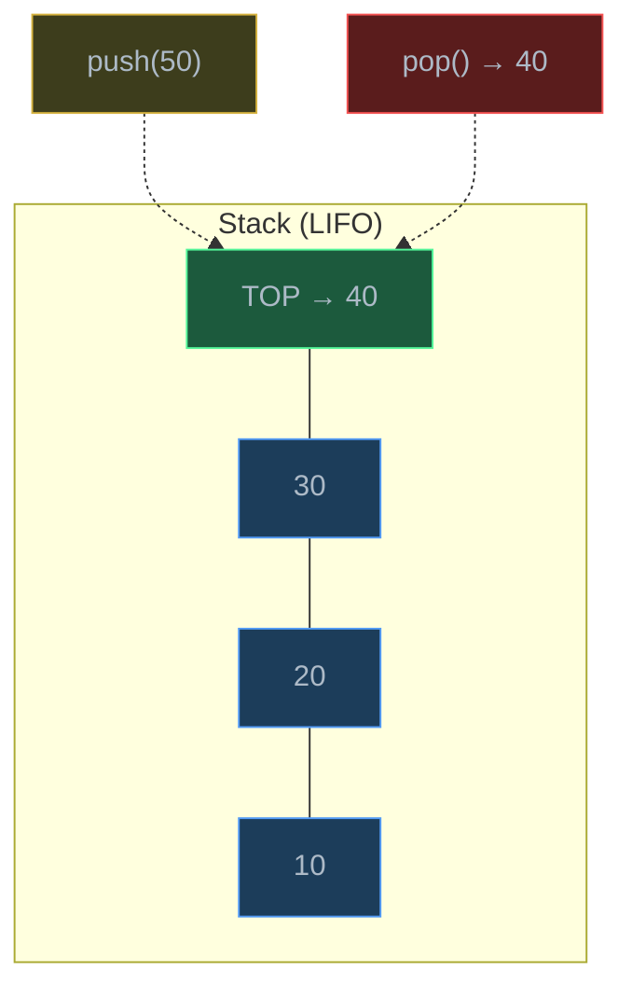
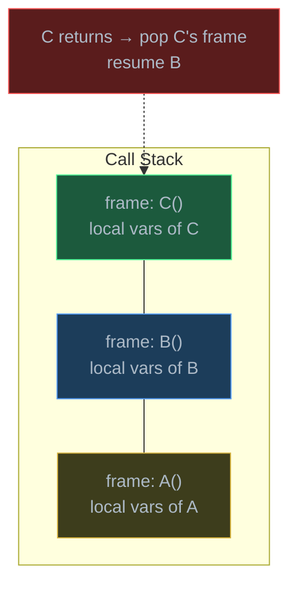
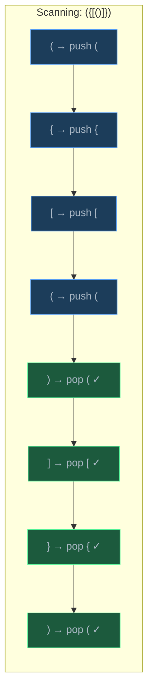
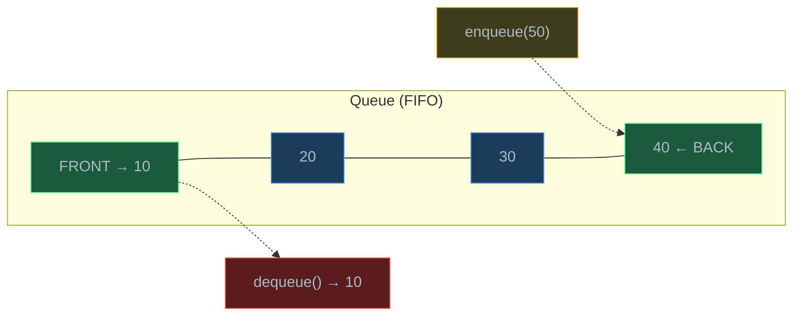
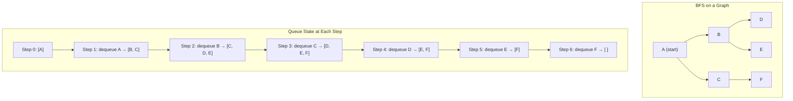
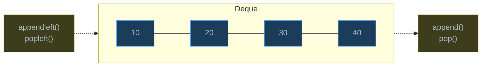

# Stacks and Queues

> Stacks and queues are restricted-access data structures that enforce a specific ordering discipline — LIFO and FIFO respectively — making them the backbone of function calls, expression evaluation, BFS, and task scheduling.

## Table of Contents
- [Core Concepts](#core-concepts)
- [Code Examples](#code-examples)
- [Common Pitfalls](#common-pitfalls)
- [Key Takeaways](#key-takeaways)
- [Exercises](#exercises)

## Core Concepts

### Stack: Last In, First Out (LIFO)

#### What

A **stack** is a collection where the last element added is the first one removed — Last In, First Out (LIFO). Think of a stack of plates: you add to the top and remove from the top. You never pull a plate from the middle.

A stack supports three core operations:

| Operation | Description | Time |
| --- | --- | --- |
| `push(item)` | Add an item to the top | O(1) |
| `pop()` | Remove and return the top item | O(1) |
| `peek()` / `top()` | View the top item without removing | O(1) |
| `is_empty()` | Check if the stack has no elements | O(1) |

All operations are O(1) because you only ever interact with the top of the stack — no searching, no shifting.



#### How

In Python, a `list` works perfectly as a stack:
- `list.append(x)` is `push` — O(1) amortized (adds to the end)
- `list.pop()` is `pop` — O(1) (removes from the end)
- `list[-1]` is `peek` — O(1)

This works because Python lists are dynamic arrays, and adding/removing from the end doesn't require shifting elements. The end of the list is the "top" of the stack.

You can also use `collections.deque`, which provides O(1) append and pop from both ends. For a pure stack, `list` and `deque` perform identically — `deque` becomes important when you need queue behavior.

#### Why It Matters

Stacks are everywhere in computing because **nested structure is everywhere**. Every time you enter a function, the CPU pushes a frame onto the call stack. Every time the function returns, it pops that frame. Undo/redo in text editors is a stack. The back button in your browser is a stack. Parsing nested parentheses, HTML tags, or mathematical expressions all use stacks.

The key insight is that stacks naturally handle **matching** and **nesting** — whenever you open something (a function call, a parenthesis, a tag), you push; whenever you close it, you pop and verify it matches.

### Stack Applications

#### What

Stacks solve four major categories of problems:

1. **Function call stack** — tracking which functions are active and their local variables
2. **Expression evaluation** — converting and evaluating mathematical expressions (infix to postfix)
3. **Undo operations** — reversing actions in order
4. **Parentheses/bracket matching** — validating that every opener has a matching closer

#### How

**Function call stack**: When function `A` calls function `B`, and `B` calls `C`, the call stack looks like:



When `C` returns, its frame is popped and execution resumes in `B`. This is why infinite recursion causes a **stack overflow** — you keep pushing frames until memory runs out.

**Parentheses matching**: For the expression `({[()]})`, scan left to right. Push every opener. When you see a closer, pop and check that it matches the most recent opener.



**Postfix evaluation**: In postfix notation (also called Reverse Polish Notation), operators come after their operands: `3 4 + 5 *` means `(3 + 4) * 5 = 35`. Evaluation is simple with a stack: push numbers, and when you see an operator, pop two operands, apply the operator, and push the result.

#### Why It Matters

Understanding the call stack is fundamental to debugging. When you read a traceback, you're reading the call stack. When you convert recursion to iteration, you're replacing the implicit call stack with an explicit one. Postfix evaluation eliminates the need for parentheses and operator precedence rules — this is why early calculators (HP) and stack-based languages (Forth, PostScript) use it. The bracket matching algorithm is a universal interview question and generalizes to validating any nested structure (HTML, JSON, code blocks).

### Queue: First In, First Out (FIFO)

#### What

A **queue** is a collection where the first element added is the first one removed — First In, First Out (FIFO). Think of a line at a store: people join at the back and leave from the front.

| Operation | Description | Time |
| --- | --- | --- |
| `enqueue(item)` | Add an item to the back | O(1) |
| `dequeue()` | Remove and return the front item | O(1) |
| `peek()` / `front()` | View the front item without removing | O(1) |
| `is_empty()` | Check if the queue has no elements | O(1) |



#### How

**Do NOT use a Python `list` as a queue.** While `list.append()` is O(1), `list.pop(0)` is O(n) because every remaining element must shift left. This is the most common performance mistake with queues.

Use `collections.deque` (double-ended queue) instead:
- `deque.append(x)` — enqueue at the back, O(1)
- `deque.popleft()` — dequeue from the front, O(1)
- `deque[0]` — peek at the front, O(1)

Under the hood, `deque` is implemented as a doubly linked list of fixed-size blocks, giving O(1) operations on both ends.

#### Why It Matters

Queues enforce **fairness** — first come, first served. BFS (Breadth-First Search) uses a queue to explore nodes level by level, which is why BFS finds the shortest path in unweighted graphs. Operating systems use queues for task scheduling (the CPU processes tasks in the order they arrive, with priority variations). Network routers queue packets. Print spoolers queue documents. Whenever ordering must be preserved, you need a queue.

### Queue Applications

#### What

Queues are essential for:

1. **Breadth-First Search (BFS)** — exploring graphs level by level
2. **Task scheduling** — processing jobs in arrival order (OS process queues, thread pools)
3. **Buffering** — smoothing out rate mismatches (producer-consumer, I/O buffers, message queues)
4. **Sliding window problems** — maintaining a window of elements in order

#### How

**BFS traversal**: Start at a node, enqueue it. Repeatedly dequeue a node, process it, and enqueue all its unvisited neighbors. The queue ensures you visit nodes in order of their distance from the start.



The visit order (A, B, C, D, E, F) proceeds level by level — all nodes at distance 1 from A (B, C) are visited before nodes at distance 2 (D, E, F).

#### Why It Matters

BFS is the foundation for shortest-path algorithms in unweighted graphs, and its correctness depends entirely on the FIFO property of the queue. If you replaced the queue with a stack, you'd get DFS instead — a completely different traversal order that does *not* guarantee shortest paths. Understanding this connection between the data structure and the algorithm's behavior is a key insight in computer science.

### Deque: Double-Ended Queue

#### What

A **deque** (pronounced "deck") is a double-ended queue — it supports O(1) insertion and removal from *both* ends. It's a generalization that can act as both a stack and a queue.

| Operation | Description | Time |
| --- | --- | --- |
| `append(x)` | Add to the right end | O(1) |
| `appendleft(x)` | Add to the left end | O(1) |
| `pop()` | Remove from the right end | O(1) |
| `popleft()` | Remove from the left end | O(1) |
| `deque[0]` | Peek at the left end | O(1) |
| `deque[-1]` | Peek at the right end | O(1) |
| `deque[i]` | Access by index | O(n) |



#### How

Python's `collections.deque` is implemented as a **doubly linked list of fixed-size blocks** (each block holds ~64 elements). This gives O(1) append/pop on both ends while maintaining reasonable cache locality within each block. It's not a pure linked list — the block-based design is a practical optimization.

You can also create a **bounded deque** with `deque(maxlen=n)`. When the deque is full and you append to one end, the element at the other end is automatically discarded. This is perfect for sliding window problems and maintaining recent history.

```python
from collections import deque

# Bounded deque — keeps last 3 items
recent: deque[int] = deque(maxlen=3)
for i in [1, 2, 3, 4, 5]:
    recent.append(i)
    print(f"append({i}): {list(recent)}")
# append(1): [1]
# append(2): [1, 2]
# append(3): [1, 2, 3]
# append(4): [2, 3, 4]  ← 1 was dropped
# append(5): [3, 4, 5]  ← 2 was dropped
```

#### Why It Matters

`deque` is the **correct default choice** for any queue in Python. It's also the right choice for a stack if you ever need `appendleft`. The bounded deque is a powerful tool for problems involving "last N elements" — rate limiters, moving averages, and recent history buffers. The key trade-off vs `list`: deque has O(n) random access by index, so if you need both fast ends *and* fast random access, neither `list` nor `deque` alone is perfect.

### Implementation Trade-offs: list vs deque

#### What

| Criteria | `list` | `collections.deque` |
| --- | --- | --- |
| Append to end | O(1) amortized | O(1) |
| Pop from end | O(1) | O(1) |
| Append to front | O(n) — shifts all elements | O(1) |
| Pop from front | O(n) — shifts all elements | O(1) |
| Random access `[i]` | O(1) — pointer arithmetic | O(n) — must traverse blocks |
| Memory layout | Contiguous array of pointers | Linked blocks of pointers |
| Cache locality | Excellent (sequential access) | Good within blocks, poor across |

#### How

For a **stack** (only touch one end), both `list` and `deque` are equally good. `list` is slightly more common in Python for stacks because `list[-1]`, `list.append()`, and `list.pop()` are idiomatic.

For a **queue** (add to back, remove from front), you *must* use `deque`. Using a `list` as a queue is O(n) per dequeue because `list.pop(0)` shifts every element. This turns what should be an O(n) BFS into an O(n^2) BFS.

For a **deque** (both ends), only `collections.deque` provides O(1) on both sides.

#### Why It Matters

Choosing the wrong underlying structure turns O(1) operations into O(n) operations. In an interview, using `list.pop(0)` in a BFS loop is a red flag — it shows you don't understand the performance characteristics of your tools. In production, it causes real performance degradation: a BFS on a graph with 100,000 nodes goes from ~0.1 seconds to ~10 seconds.

## Code Examples

### Stack Implementation with Python list

```python
from typing import Any


class Stack:
    """A stack (LIFO) backed by a Python list.

    The end of the list is the top of the stack. All operations are O(1)
    because list.append() and list.pop() operate on the end.
    """

    def __init__(self) -> None:
        self._items: list[Any] = []

    def push(self, item: Any) -> None:
        """Add an item to the top of the stack — O(1) amortized."""
        self._items.append(item)

    def pop(self) -> Any:
        """Remove and return the top item — O(1).

        Raises IndexError if the stack is empty.
        """
        if self.is_empty():
            raise IndexError("pop from empty stack")
        return self._items.pop()

    def peek(self) -> Any:
        """Return the top item without removing it — O(1).

        Raises IndexError if the stack is empty.
        """
        if self.is_empty():
            raise IndexError("peek at empty stack")
        return self._items[-1]

    def is_empty(self) -> bool:
        """Check whether the stack is empty — O(1)."""
        return len(self._items) == 0

    def __len__(self) -> int:
        return len(self._items)

    def __repr__(self) -> str:
        return f"Stack({self._items})"


# Demo
stack = Stack()
for val in [10, 20, 30, 40]:
    stack.push(val)

print(f"Stack:  {stack}")
print(f"Peek:   {stack.peek()}")       # 40
print(f"Pop:    {stack.pop()}")         # 40
print(f"Pop:    {stack.pop()}")         # 30
print(f"Stack:  {stack}")               # Stack([10, 20])
print(f"Length: {len(stack)}")          # 2
```

**Time**: All operations (push, pop, peek) are O(1). `push` is O(1) amortized due to dynamic array resizing.
**Space**: O(n) where n is the number of elements in the stack.

### Queue Implementation with collections.deque

```python
from collections import deque
from typing import Any


class Queue:
    """A queue (FIFO) backed by collections.deque.

    deque provides O(1) append and popleft — the correct way to
    implement a queue in Python. Never use list.pop(0).
    """

    def __init__(self) -> None:
        self._items: deque[Any] = deque()

    def enqueue(self, item: Any) -> None:
        """Add an item to the back of the queue — O(1)."""
        self._items.append(item)

    def dequeue(self) -> Any:
        """Remove and return the front item — O(1).

        Raises IndexError if the queue is empty.
        """
        if self.is_empty():
            raise IndexError("dequeue from empty queue")
        return self._items.popleft()

    def front(self) -> Any:
        """Return the front item without removing it — O(1).

        Raises IndexError if the queue is empty.
        """
        if self.is_empty():
            raise IndexError("front of empty queue")
        return self._items[0]

    def is_empty(self) -> bool:
        """Check whether the queue is empty — O(1)."""
        return len(self._items) == 0

    def __len__(self) -> int:
        return len(self._items)

    def __repr__(self) -> str:
        return f"Queue({list(self._items)})"


# Demo
queue = Queue()
for val in ["task_A", "task_B", "task_C", "task_D"]:
    queue.enqueue(val)

print(f"Queue:   {queue}")
print(f"Front:   {queue.front()}")         # task_A
print(f"Dequeue: {queue.dequeue()}")       # task_A
print(f"Dequeue: {queue.dequeue()}")       # task_B
print(f"Queue:   {queue}")                 # Queue(['task_C', 'task_D'])
print(f"Length:  {len(queue)}")            # 2
```

**Time**: All operations (enqueue, dequeue, front) are O(1) — `deque.append()` and `deque.popleft()` are constant time.
**Space**: O(n) where n is the number of elements in the queue.

### Parentheses Matching

```python
def is_valid_parentheses(s: str) -> bool:
    """Check if a string of brackets is properly nested and matched.

    Uses a stack: push openers, pop and match on closers.

    Time:  O(n) — scan each character once.
    Space: O(n) — worst case, all characters are openers (e.g., "((((").
    """
    matching: dict[str, str] = {")": "(", "]": "[", "}": "{"}
    stack: list[str] = []

    for char in s:
        if char in matching.values():
            # It's an opener — push onto the stack
            stack.append(char)
        elif char in matching:
            # It's a closer — check that it matches the most recent opener
            if not stack or stack[-1] != matching[char]:
                return False
            stack.pop()

    # If the stack is empty, every opener was matched
    return len(stack) == 0


# Tests
print(is_valid_parentheses("({[()]})"))    # True
print(is_valid_parentheses("([)]"))         # False — mismatched
print(is_valid_parentheses("(("))           # False — unmatched opener
print(is_valid_parentheses(""))             # True — empty is valid
print(is_valid_parentheses("{[]}()"))       # True
```

**Time**: O(n) — one pass through the string, each character is pushed/popped at most once.
**Space**: O(n) — in the worst case (all openers), the stack holds n elements.

### Postfix Expression Evaluator

```python
def evaluate_postfix(expression: str) -> float:
    """Evaluate a postfix (Reverse Polish Notation) expression.

    Postfix notation: operands come before their operator.
      "3 4 + 5 *" means (3 + 4) * 5 = 35

    Algorithm:
      - Scan tokens left to right
      - If token is a number, push onto stack
      - If token is an operator, pop two operands, apply, push result
      - The final value on the stack is the answer

    Time:  O(n) — process each token once.
    Space: O(n) — stack holds operands.
    """
    stack: list[float] = []
    operators: set[str] = {"+", "-", "*", "/"}

    for token in expression.split():
        if token in operators:
            if len(stack) < 2:
                raise ValueError(f"Not enough operands for operator '{token}'")
            right: float = stack.pop()  # right operand was pushed last
            left: float = stack.pop()

            if token == "+":
                stack.append(left + right)
            elif token == "-":
                stack.append(left - right)
            elif token == "*":
                stack.append(left * right)
            elif token == "/":
                if right == 0:
                    raise ZeroDivisionError("Division by zero")
                stack.append(left / right)
        else:
            # It's a number — push onto the stack
            stack.append(float(token))

    if len(stack) != 1:
        raise ValueError(f"Invalid expression: {len(stack)} values remain on stack")

    return stack[0]


# Demo
print(evaluate_postfix("3 4 +"))           # 7.0    → (3 + 4)
print(evaluate_postfix("3 4 + 5 *"))       # 35.0   → (3 + 4) * 5
print(evaluate_postfix("5 1 2 + 4 * + 3 -"))  # 14.0 → 5 + (1+2)*4 - 3
print(evaluate_postfix("10 2 /"))          # 5.0    → 10 / 2
```

**Time**: O(n) where n is the number of tokens — each token is processed exactly once.
**Space**: O(n) — the stack can hold up to n/2 operands in the worst case.

### BFS Using a Queue

```python
from collections import deque


def bfs(graph: dict[str, list[str]], start: str) -> list[str]:
    """Perform Breadth-First Search on a graph.

    BFS explores nodes level by level using a queue, guaranteeing that
    nodes are visited in order of their distance from the start node.

    Time:  O(V + E) — visit every vertex once, examine every edge once.
    Space: O(V) — the queue and visited set each hold at most V nodes.
    """
    visited: set[str] = {start}
    queue: deque[str] = deque([start])
    order: list[str] = []

    while queue:
        node: str = queue.popleft()  # O(1) with deque
        order.append(node)

        for neighbor in graph[node]:
            if neighbor not in visited:
                visited.add(neighbor)
                queue.append(neighbor)  # O(1) with deque

    return order


# Demo — undirected graph
graph: dict[str, list[str]] = {
    "A": ["B", "C"],
    "B": ["A", "D", "E"],
    "C": ["A", "F"],
    "D": ["B"],
    "E": ["B", "F"],
    "F": ["C", "E"],
}

print(f"BFS from A: {bfs(graph, 'A')}")
# BFS from A: ['A', 'B', 'C', 'D', 'E', 'F']
```

**Time**: O(V + E) — each vertex is enqueued/dequeued once (O(V)), and each edge is examined once (O(E)).
**Space**: O(V) — the visited set and queue together hold at most O(V) elements.

### Undo/Redo with Two Stacks

```python
class TextEditor:
    """A simple text editor with undo/redo support using two stacks.

    - undo_stack: stores previous states for undo
    - redo_stack: stores undone states for redo
    - Any new edit clears the redo stack (you can't redo after a new edit)
    """

    def __init__(self) -> None:
        self._text: str = ""
        self._undo_stack: list[str] = []
        self._redo_stack: list[str] = []

    def type_text(self, new_text: str) -> None:
        """Append text — O(1) for the stack operations.

        Saves the current state before modifying, clears redo history.
        """
        self._undo_stack.append(self._text)
        self._text += new_text
        self._redo_stack.clear()  # new edit invalidates redo history

    def undo(self) -> None:
        """Revert to the previous state — O(1).

        Pushes current state onto redo stack before reverting.
        """
        if not self._undo_stack:
            print("Nothing to undo")
            return
        self._redo_stack.append(self._text)
        self._text = self._undo_stack.pop()

    def redo(self) -> None:
        """Re-apply the last undone change — O(1).

        Pushes current state onto undo stack before re-applying.
        """
        if not self._redo_stack:
            print("Nothing to redo")
            return
        self._undo_stack.append(self._text)
        self._text = self._redo_stack.pop()

    @property
    def text(self) -> str:
        return self._text


# Demo
editor = TextEditor()
editor.type_text("Hello")
editor.type_text(" World")
editor.type_text("!")
print(f"Text: '{editor.text}'")        # Hello World!

editor.undo()
print(f"After undo: '{editor.text}'")  # Hello World

editor.undo()
print(f"After undo: '{editor.text}'")  # Hello

editor.redo()
print(f"After redo: '{editor.text}'")  # Hello World

editor.type_text("?")
print(f"After type: '{editor.text}'")  # Hello World?

editor.redo()                           # Nothing to redo — new edit cleared it
print(f"After redo: '{editor.text}'")  # Hello World?
```

**Time**: O(1) for undo, redo, and the stack operations within type_text. (Note: the string concatenation in `type_text` is O(k) where k is the length of the new text, but the stack management is O(1).)
**Space**: O(m) where m is the number of edits — each edit saves the full text state.

### Monotonic Stack: Next Greater Element

```python
def next_greater_element(nums: list[int]) -> list[int]:
    """For each element, find the next element to its right that is greater.

    Uses a monotonic decreasing stack: the stack holds indices of elements
    we haven't found a "next greater" for yet. When we encounter a larger
    element, we pop all smaller elements from the stack — the current
    element is their answer.

    Example: [4, 2, 8, 1, 5]
      - 4: next greater is 8
      - 2: next greater is 8
      - 8: next greater is -1 (none)
      - 1: next greater is 5
      - 5: next greater is -1 (none)
      Result: [8, 8, -1, 5, -1]

    Time:  O(n) — each index is pushed and popped at most once.
    Space: O(n) — the stack and result array.
    """
    n: int = len(nums)
    result: list[int] = [-1] * n
    stack: list[int] = []  # stores indices, not values

    for i in range(n):
        # Pop all elements smaller than nums[i] — we found their answer
        while stack and nums[stack[-1]] < nums[i]:
            idx: int = stack.pop()
            result[idx] = nums[i]
        stack.append(i)

    # Elements remaining in the stack have no next greater element
    # (result already initialized to -1)
    return result


# Demo
nums = [4, 2, 8, 1, 5]
print(f"Input:         {nums}")
print(f"Next greater:  {next_greater_element(nums)}")
# Next greater: [8, 8, -1, 5, -1]

nums2 = [1, 3, 2, 4]
print(f"Input:         {nums2}")
print(f"Next greater:  {next_greater_element(nums2)}")
# Next greater: [3, 4, 4, -1]
```

**Time**: O(n) — even though there's a while loop inside the for loop, each element is pushed and popped at most once across the entire run. Total operations = 2n = O(n).
**Space**: O(n) — for the stack and result array.

## Common Pitfalls

### Pitfall 1: Using list.pop(0) for a Queue

```python
# BAD — list.pop(0) is O(n), making BFS O(V² + E) instead of O(V + E)
queue: list[str] = ["A", "B", "C"]
front = queue.pop(0)  # O(n) — every element shifts left!

# GOOD — deque.popleft() is O(1)
from collections import deque
queue: deque[str] = deque(["A", "B", "C"])
front = queue.popleft()  # O(1) — no shifting
```

Why it's wrong: `list.pop(0)` removes the first element by shifting all remaining elements one position to the left. In a BFS with V nodes, you dequeue V times, each costing O(V) in the worst case — turning O(V + E) into O(V^2 + E). `deque.popleft()` is O(1) because it adjusts an internal pointer.

### Pitfall 2: Forgetting to Check for Empty Stack/Queue

```python
# BAD — crashes on empty stack
stack: list[int] = []
top = stack.pop()  # IndexError: pop from empty list

# GOOD — check before popping
stack: list[int] = []
if stack:
    top = stack.pop()
else:
    print("Stack is empty")

# ALSO GOOD — use a wrapper class that raises a descriptive error
class Stack:
    def __init__(self) -> None:
        self._items: list[int] = []

    def pop(self) -> int:
        if not self._items:
            raise IndexError("pop from empty stack")
        return self._items.pop()
```

Why it's wrong: An unguarded `pop()` on an empty list raises a generic `IndexError` with the message "pop from empty list." In a real application, this crash might happen deep in a BFS or expression evaluator, making it hard to debug. Always check `is_empty()` or guard with `if stack:` before popping.

### Pitfall 3: Mismatching Push/Pop Order in Postfix Evaluation

```python
# BAD — swapped operand order for non-commutative operators
expression = "10 3 -"
# Incorrect: pop left first, then right
left = stack.pop()   # 3
right = stack.pop()  # 10
result = left - right  # 3 - 10 = -7 (WRONG, should be 10 - 3 = 7)

# GOOD — pop right first (it was pushed last), then left
right = stack.pop()  # 3  (pushed second, so popped first)
left = stack.pop()   # 10 (pushed first, so popped second)
result = left - right  # 10 - 3 = 7 ✓
```

Why it's wrong: In postfix, `10 3 -` means `10 - 3`, not `3 - 10`. The first operand (`10`) was pushed first, so it's deeper in the stack. When you pop, the second operand (`3`) comes out first. For subtraction and division (non-commutative operations), the order matters. Always pop `right` first, then `left`.

### Pitfall 4: Using Deque for Random Access

```python
# BAD — deque[i] is O(n), not O(1)
from collections import deque
d: deque[int] = deque(range(100_000))
middle = d[50_000]  # O(n) — must traverse from an end to the middle

# GOOD — use a list if you need random access
items: list[int] = list(range(100_000))
middle = items[50_000]  # O(1) — pointer arithmetic
```

Why it's wrong: `deque` is a linked list of blocks, not a contiguous array. Accessing element `i` requires traversing from one end through the linked blocks. If you need both O(1) ends *and* O(1) random access, you need a different approach (such as keeping a separate list for indexed lookups alongside a deque for queue operations).

## Key Takeaways

- **Stacks (LIFO)** are the natural data structure for anything involving **nesting or reversal** — function calls, parentheses matching, undo, expression evaluation. Use Python `list` with `append()` and `pop()`.
- **Queues (FIFO)** enforce **ordering and fairness** — BFS, task scheduling, buffering. Always use `collections.deque` with `append()` and `popleft()`. Never use `list.pop(0)`.
- **Deque** is the Swiss Army knife — O(1) on both ends. Use it as your default queue implementation, and use `maxlen` for bounded buffers.
- The choice between stack and queue **determines algorithm behavior**: swapping a queue for a stack in graph traversal changes BFS into DFS, fundamentally changing what the algorithm finds.
- All core operations (push, pop, enqueue, dequeue, peek) are **O(1)** — stacks and queues are fast by design. Their power comes not from speed but from the **ordering discipline** they enforce.

## Exercises

1. **Write a function** `reverse_string(s: str) -> str` that reverses a string using a stack. Push every character onto a stack, then pop them all off. Analyze the time and space complexity. Then explain why Python's `s[::-1]` is preferable in practice.

2. **Write a function** `is_palindrome_with_deque(s: str) -> bool` that checks whether a string is a palindrome using a deque. Compare characters from both ends simultaneously using `popleft()` and `pop()`. What is the time and space complexity?

3. **Implement a MinStack** — a stack that supports `push`, `pop`, `peek`, and `get_min` all in O(1) time. Hint: maintain a second stack that tracks the current minimum at each level.

4. **Write a function** `daily_temperatures(temps: list[int]) -> list[int]` that, given a list of daily temperatures, returns a list where each element tells you how many days you have to wait for a warmer temperature. If there is no future warmer day, the answer is 0. Example: `[73, 74, 75, 71, 69, 72, 76, 73]` returns `[1, 1, 4, 2, 1, 1, 0, 0]`. Use a monotonic stack. Analyze the time complexity.

5. **Explain** why BFS guarantees the shortest path in an unweighted graph but DFS does not. What property of the queue makes this guarantee possible? What happens to the traversal order if you replace the queue with a stack?

---
up:: [Schedule](../../Schedule.md)
#type/learning #source/self-study #status/seed
