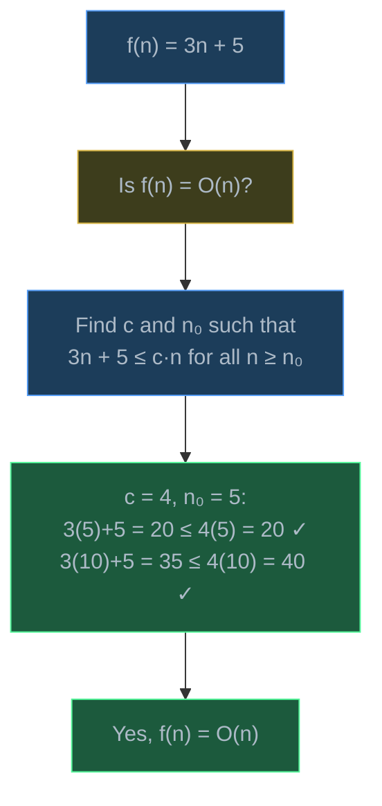
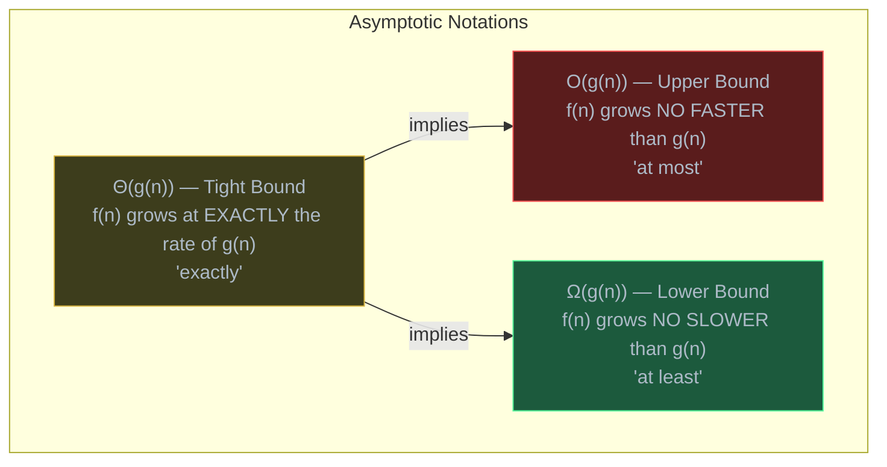
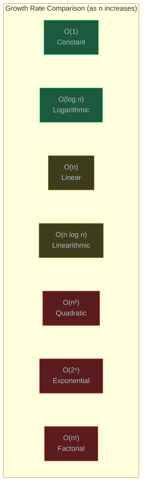
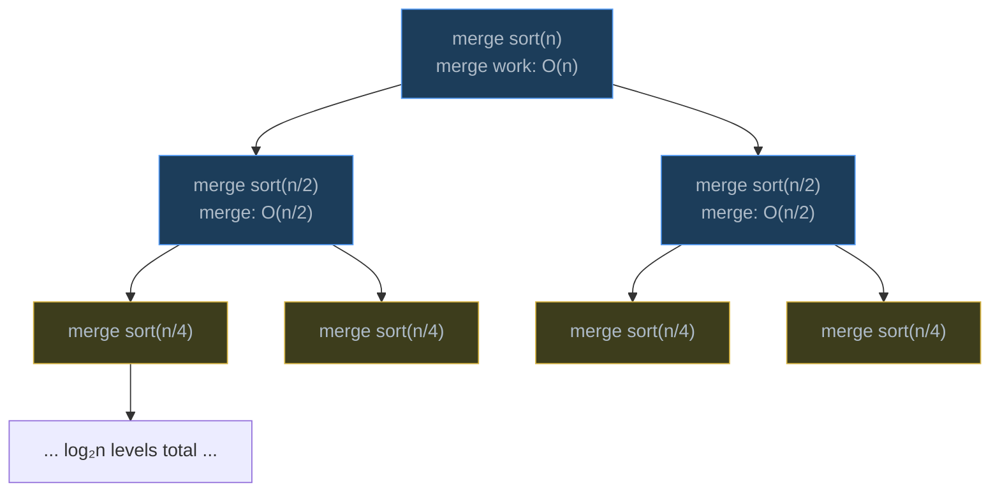
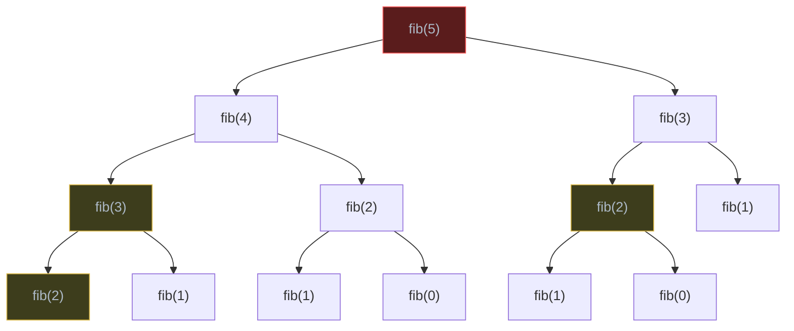
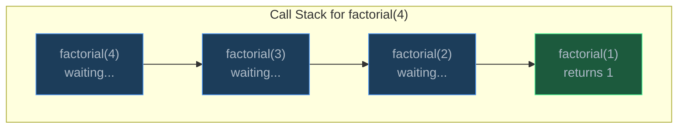
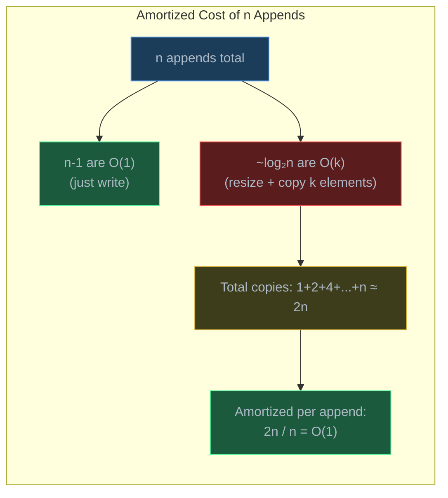

# Algorithmic Complexity

> Algorithmic complexity is the framework for measuring how an algorithm's resource consumption (time and space) grows as the input size increases — the universal language engineers use to compare algorithms and predict performance at scale.

## Table of Contents
- [Core Concepts](#core-concepts)
- [Code Examples](#code-examples)
- [Common Pitfalls](#common-pitfalls)
- [Key Takeaways](#key-takeaways)
- [Exercises](#exercises)

## Core Concepts

### Time vs Space Complexity

#### What

Every algorithm consumes two resources: **time** (how many operations it performs) and **space** (how much memory it uses). Complexity analysis measures how these resources grow as the input size **n** increases — not the exact number of seconds or bytes, but the *growth rate*.

- **Time complexity** counts the number of fundamental operations (comparisons, assignments, arithmetic) as a function of n.
- **Space complexity** counts the amount of extra memory allocated beyond the input itself (called **auxiliary space**).

#### How

You express complexity as a mathematical function of n:

- A function that scans every element once: time grows proportionally to n, so we say it's **O(n)**.
- A function that compares every pair of elements: time grows proportionally to n^2, so we say it's **O(n^2)**.
- A function that uses a fixed number of variables regardless of n: space is **O(1)**.

The input size n represents whatever makes the problem bigger — the number of elements in an array, the number of characters in a string, the number of nodes in a graph.

#### Why It Matters

Without complexity analysis, you cannot answer the most basic engineering question: *will this code still work when the data gets bigger?* A function that runs fine on 100 items might take hours on 1,000,000 items if it's O(n^2). Complexity gives you a prediction model — before writing or running code, you can estimate whether an approach will scale. It also provides a common vocabulary: when a colleague says "that's O(n log n)," everyone immediately understands the performance characteristics.

### How to Calculate Complexity

#### What

Calculating complexity means determining how the number of operations grows with input size. The process involves three steps:

1. **Count operations** — identify the fundamental operations and express their count as a function of n.
2. **Identify the dominant term** — the term that grows fastest as n increases.
3. **Drop constants and lower-order terms** — because Big-O describes growth rate, not exact count.

#### How

Consider this example:

```python
def example(data: list[int]) -> int:
    total = 0                    # 1 operation
    for x in data:               # n iterations
        total += x * 2           # 2 operations per iteration (multiply + add)
    for i in range(len(data)):   # n iterations
        for j in range(len(data)):  # n iterations
            total += data[i] + data[j]  # 2 operations per iteration
    return total                 # 1 operation
```

Operation count: `1 + 2n + 2n^2 + 1 = 2n^2 + 2n + 2`

Now apply the rules:

| Step | Result | Reasoning |
| --- | --- | --- |
| Full count | 2n^2 + 2n + 2 | Every operation counted |
| Drop lower-order terms | 2n^2 | n^2 dominates n and constants as n grows |
| Drop constants | n^2 | The coefficient 2 doesn't affect growth rate |
| Final | O(n^2) | Quadratic growth |

Why drop constants? Because O(2n) and O(n) grow at the same *rate* — doubling n doubles the work in both cases. The constant factor affects the actual runtime on a specific machine, but it doesn't change *how fast the curve rises* as n increases.

Why drop lower-order terms? Because as n becomes large, n^2 dominates everything else. When n = 1,000, the n^2 term contributes 1,000,000 while the n term contributes only 1,000 — it's less than 0.1% of the total. For large inputs, the lower-order terms become irrelevant.

#### Why It Matters

This skill — looking at code and determining its complexity — is what interviewers test and what engineers use daily. You don't need to count exact operations; you need to identify *which part of the code dominates* and how it scales. The nested loop above is clearly O(n^2) because the inner loop runs n times for each of the n iterations of the outer loop. Training your eye to spot these patterns instantly is the goal.

### Big-O Notation (O): Upper Bound

#### What

**Big-O** describes the **upper bound** on an algorithm's growth rate. When we say an algorithm is O(n^2), we mean: as n grows, the number of operations grows *at most* proportionally to n^2. It's a guarantee that performance won't be *worse* than this rate.

Formally (simplified): f(n) is O(g(n)) if there exist constants c > 0 and n0 >= 0 such that f(n) <= c * g(n) for all n >= n0.

In plain language: beyond some starting point, f(n) never exceeds some constant multiple of g(n).

#### How

Big-O is the most commonly used notation because engineers usually care about the **worst case** — what happens when the input is adversarial or unlucky. Examples:

| Algorithm | Big-O | Meaning |
| --- | --- | --- |
| Linear search | O(n) | At worst, checks every element |
| Binary search | O(log n) | At worst, halves the search space log n times |
| Bubble sort | O(n^2) | At worst, compares every pair |
| Hash table lookup | O(n) | At worst (all keys collide), scans entire chain |

Note that Big-O is an *upper bound*, not a tight bound. Technically, an O(n) algorithm is also O(n^2), O(n^3), and O(2^n) — because n never exceeds n^2. But by convention, we always state the *tightest* upper bound. Saying linear search is O(n^2) is technically correct but useless.



#### Why It Matters

Big-O is the default language of algorithm analysis. When you read documentation, attend interviews, or discuss architecture, Big-O is what everyone uses. It answers the critical question: *what's the worst this can get?* Designing systems around worst-case guarantees prevents catastrophic slowdowns — you don't want your web server to hang because one request triggered O(n^2) behavior on a large dataset.

### Big-Theta Notation (Theta): Tight Bound

#### What

**Big-Theta** describes the **tight bound** — the algorithm grows at *exactly* this rate (within constant factors). When we say an algorithm is Theta(n^2), we mean it's both O(n^2) (never grows faster) and Omega(n^2) (never grows slower). The growth rate is pinned down precisely.

Formally: f(n) is Theta(g(n)) if f(n) is both O(g(n)) and Omega(g(n)).

#### How

Theta is more precise than Big-O. Consider merge sort:

- **O(n log n)** — says it's at most n log n (true, but doesn't tell the full story).
- **Theta(n log n)** — says it's *exactly* n log n growth, in all cases.

Merge sort always divides the array and merges — it does the same amount of work regardless of input order. So Theta(n log n) is the right description.

Contrast with quicksort:
- **O(n^2)** — worst case (already sorted input with bad pivot).
- **Theta(n log n)** — *not correct*, because the worst case is n^2, not n log n.
- Best we can say: O(n^2) worst case, Theta(n log n) average case.

#### Why It Matters

Theta gives you more information than Big-O. If someone says an algorithm is Theta(n log n), you know it can't do better *or* worse than that growth rate. In practice, most people use Big-O loosely to mean Theta — when someone says "merge sort is O(n log n)," they usually mean the tight bound. But understanding the distinction helps when analyzing algorithms where best, worst, and average cases differ significantly.

### Big-Omega Notation (Omega): Lower Bound

#### What

**Big-Omega** describes the **lower bound** — the minimum growth rate. When we say an algorithm is Omega(n), we mean it must do at *least* n work, no matter how lucky the input is.

Formally: f(n) is Omega(g(n)) if there exist constants c > 0 and n0 >= 0 such that f(n) >= c * g(n) for all n >= n0.

#### How

Lower bounds are most useful for proving that a problem *cannot* be solved faster than a certain rate:

- **Comparison-based sorting** is Omega(n log n) — you cannot sort n elements using fewer than n log n comparisons. This is a proven mathematical lower bound, not a property of any specific algorithm.
- **Searching an unsorted array** is Omega(n) — you must look at every element because the target could be anywhere.

For a specific algorithm, Omega describes the best case:
- Linear search is Omega(1) — the target might be the first element.
- Bubble sort is Omega(n) — if the array is already sorted, one pass confirms it.

#### Why It Matters

Omega answers: *can we do better?* If you know a problem has a lower bound of Omega(n log n), there's no point searching for an O(n) sorting algorithm (using comparisons). It's a theoretical impossibility. This saves you from wasted effort and helps you recognize when an algorithm is already optimal.

### The Three Notations Together



Think of it like a salary range: Big-O is the maximum you'll pay, Big-Omega is the minimum, and Big-Theta means the salary is fixed — the max and min are the same (up to constant factors).

### Common Runtime Classes

#### What

There are seven runtime classes that account for nearly all algorithms you'll encounter. Understanding each one — what it *feels like*, what kind of code produces it, and where you see it in practice — is fundamental to algorithmic thinking.



Here's what each class looks like in terms of concrete numbers:

| n | O(1) | O(log n) | O(n) | O(n log n) | O(n^2) | O(2^n) | O(n!) |
| --- | --- | --- | --- | --- | --- | --- | --- |
| 10 | 1 | 3.3 | 10 | 33 | 100 | 1,024 | 3,628,800 |
| 100 | 1 | 6.6 | 100 | 664 | 10,000 | 1.27 x 10^30 | 9.33 x 10^157 |
| 1,000 | 1 | 10 | 1,000 | 10,000 | 1,000,000 | overflow | overflow |
| 1,000,000 | 1 | 20 | 1,000,000 | 20,000,000 | 10^12 | overflow | overflow |

The table makes the critical insight visceral: the gap between O(n) and O(n^2) barely matters at n = 10, but at n = 1,000,000, it's the difference between 1 second and 11 days (assuming 1 million operations per second). Exponential and factorial growth become physically impossible to compute for even moderate n.

#### How

Each runtime class arises from a specific code pattern:

**O(1) — Constant**: The algorithm does a fixed amount of work regardless of input size.

- Hash table lookup (average case)
- Array access by index
- Push/pop from a stack
- Arithmetic operations

**O(log n) — Logarithmic**: The algorithm halves the problem size each step.

- Binary search
- Balanced BST operations
- Finding a number in a sorted array
- Each step eliminates half the remaining possibilities, so after k steps you've checked n/2^k elements. When n/2^k = 1, k = log2(n).

**O(n) — Linear**: The algorithm examines each element exactly once (or a constant number of times).

- Linear search
- Finding the maximum element
- Counting occurrences
- Iterating through an array or linked list

**O(n log n) — Linearithmic**: The algorithm does log n work for each of n elements, or equivalently, divides the problem in half but does O(n) work at each level.

- Merge sort: log n levels of recursion, each level merges n elements
- Heap sort: n elements, each requiring log n heap operations
- Efficient sorting algorithms in general

**O(n^2) — Quadratic**: The algorithm compares every pair of elements, typically via nested loops.

- Bubble sort, insertion sort, selection sort
- Checking all pairs for duplicates (brute force)
- Matrix traversal (n x n matrix)

**O(2^n) — Exponential**: The algorithm explores all subsets of the input.

- Recursive Fibonacci (naive)
- Generating all subsets of a set
- Solving the traveling salesman problem via brute force
- Each element has two choices (include or exclude), giving 2^n combinations.

**O(n!) — Factorial**: The algorithm generates all permutations of the input.

- Generating all permutations
- Brute-force traveling salesman (try every route)
- n choices for the first position, n-1 for the second, ..., 1 for the last = n!

#### Why It Matters

Recognizing which class your algorithm falls into is the first step in optimization. If your solution is O(n^2) and n can be 100,000, you need to find an O(n log n) or O(n) approach — or your code will time out. Conversely, if n is always small (say, under 20), even O(2^n) might be acceptable. The runtime class tells you whether to optimize or ship.

### Analyzing Nested Loops

#### What

Nested loops are the most common source of polynomial complexity. The key rule: **multiply the iteration counts of nested loops**.

#### How

**Independent nested loops** — the inner loop's count doesn't depend on the outer loop's variable:

```python
for i in range(n):       # n iterations
    for j in range(n):   # n iterations each time
        process(i, j)    # n × n = n² total calls
```

This is O(n^2). Each loop contributes a factor of n, and they multiply.

**Dependent nested loops** — the inner loop's count depends on the outer variable:

```python
for i in range(n):           # n iterations
    for j in range(i):       # 0, 1, 2, ..., n-1 iterations
        process(i, j)
```

Total operations: 0 + 1 + 2 + ... + (n-1) = n(n-1)/2 = O(n^2). Even though the inner loop doesn't always run n times, the sum is still quadratic.

**Sequential loops** (not nested) — add, don't multiply:

```python
for i in range(n):      # O(n)
    step_a(i)

for j in range(n):      # O(n)
    step_b(j)
```

Total: O(n) + O(n) = O(n). Sequential loops add; nested loops multiply.

**Triple nesting**:

```python
for i in range(n):
    for j in range(n):
        for k in range(n):
            process(i, j, k)   # O(n³)
```

#### Why It Matters

Nested loop analysis is the bread and butter of complexity calculation. Most interview problems start with a brute-force nested-loop solution (O(n^2) or O(n^3)) and ask you to optimize it. Recognizing the nested structure tells you the starting complexity, and the goal is to eliminate one or more levels of nesting using a smarter data structure or technique (hash maps, two pointers, sorting).

### Analyzing Recursive Functions

#### What

Recursive algorithms have complexity determined by **recurrence relations** — equations that define the total work in terms of smaller subproblems. The three key questions are:

1. How many recursive calls does each invocation make?
2. What is the size of each subproblem?
3. How much non-recursive work is done at each level?

#### How

**Example 1: Binary search** — one recursive call, half the problem, O(1) work per call.

```
T(n) = T(n/2) + O(1)
```

Each call halves the input and does constant work. After log n halvings, you reach the base case. Total: **O(log n)**.

**Example 2: Merge sort** — two recursive calls, each on half the problem, O(n) work to merge.

```
T(n) = 2T(n/2) + O(n)
```

There are log n levels. At each level, the total merge work is O(n) (because the subarrays across a level always total n elements). Total: **O(n log n)**.



**Example 3: Naive Fibonacci** — two recursive calls, problem shrinks by 1 and 2, O(1) work per call.

```
T(n) = T(n-1) + T(n-2) + O(1)
```

This grows exponentially. The recursion tree doubles at each level, producing roughly 2^n total calls. Total: **O(2^n)**.



Notice that `fib(3)` is computed twice, `fib(2)` is computed three times. This redundant computation is what makes it exponential — and what dynamic programming fixes by caching results.

#### Why It Matters

Many elegant algorithms are recursive (merge sort, quicksort, tree traversals, backtracking). Understanding recurrence relations lets you determine their complexity without guessing. The two most common patterns are:

- **Divide and conquer**: T(n) = aT(n/b) + O(n^d) — use the Master Theorem to solve.
- **Linear recursion**: T(n) = T(n-1) + O(f(n)) — sum up f(n) across all levels.

### Space Complexity

#### What

Space complexity measures the **extra memory** an algorithm uses beyond the input. This includes:

- **Auxiliary variables**: counters, temporary arrays, hash maps.
- **Call stack frames**: each recursive call adds a frame to the stack, consuming memory proportional to the recursion depth.

#### How

| Algorithm | Time | Space | Why |
| --- | --- | --- | --- |
| Iterative linear search | O(n) | O(1) | Only a few variables |
| Merge sort | O(n log n) | O(n) | Temporary array for merging |
| Recursive DFS on a tree | O(n) | O(h) | Call stack depth = tree height h |
| BFS on a tree | O(n) | O(w) | Queue holds at most w nodes (width of widest level) |
| Hash set for deduplication | O(n) | O(n) | Stores up to n elements |
| In-place quicksort | O(n log n) avg | O(log n) | Call stack for recursion (no temp array) |

Recursive algorithms have *implicit* space cost from the call stack. Each recursive call pushes a new frame onto the stack. For a recursion depth of d, the stack uses O(d) space. This is why naive recursive Fibonacci uses O(n) space (depth n) even though the "auxiliary" variables are O(1).



Four stack frames = O(n) space for `factorial(n)`.

#### Why It Matters

Space complexity matters just as much as time complexity, but it's easier to overlook. An O(n) algorithm that creates a hash set of all elements uses O(n) space — this could be a problem if n is 100 million elements and each takes 100 bytes (that's 10 GB of RAM). Space constraints are particularly important in embedded systems, mobile apps, and data pipelines processing massive datasets.

The space-time trade-off is one of the most fundamental patterns in CS: you can often reduce time complexity by using more space (e.g., hash maps for O(1) lookup), or reduce space by accepting more time (e.g., re-computing values instead of caching them).

### Amortized Analysis

#### What

Amortized analysis calculates the **average cost per operation** over a sequence of operations. Some individual operations may be expensive, but if expensive operations are rare enough, the average cost stays low.

The classic example is the **dynamic array** (Python's `list`). Most `append()` calls are O(1) — just write to the next slot. But occasionally, the array is full and must resize: allocate a new array of double the size and copy all elements (O(n)). Amortized analysis shows that the average cost per append is still O(1).

#### How

Imagine appending n elements to a dynamic array that doubles in capacity when full. The resize copies happen at sizes 1, 2, 4, 8, 16, ..., up to n. Total copy operations:

```
1 + 2 + 4 + 8 + ... + n = 2n - 1
```

This geometric series sums to less than 2n. Spread across n append operations, the amortized cost per operation is 2n / n = **O(1)**.



Think of it like a bank account: each cheap O(1) append "deposits" a small extra cost. When the expensive O(n) resize happens, the accumulated deposits "pay" for it. Over time, the account stays balanced.

#### Why It Matters

Amortized O(1) is why `list.append()` in Python is efficient despite occasional resizes. It's also why hash table insertions are O(1) amortized (occasional rehashing when the load factor gets too high). Without amortized analysis, you might see the occasional O(n) resize and incorrectly conclude that dynamic arrays are slow. The amortized perspective reveals the true cost: O(1) per operation when considering the whole sequence.

## Code Examples

### O(1) — Constant Time: Hash Table Lookup

```python
def find_pair_with_sum(numbers: list[int], target: int) -> tuple[int, int] | None:
    """Find two numbers that add up to target using a hash set.

    Uses O(1) hash set lookups to avoid O(n) linear scans,
    reducing overall complexity from O(n²) to O(n).
    """
    seen: set[int] = set()

    for num in numbers:
        complement = target - num
        if complement in seen:  # O(1) hash set lookup
            return (complement, num)
        seen.add(num)           # O(1) hash set insertion

    return None


# Demo
data = [2, 7, 11, 15, 3, 6]
result = find_pair_with_sum(data, 9)
print(f"Pair summing to 9: {result}")  # (2, 7) or (3, 6)
```

**Time**: O(n) — one pass through the array, each with O(1) hash set operations.
**Space**: O(n) — the hash set stores up to n elements.

### O(log n) — Logarithmic Time: Binary Search

```python
def binary_search(sorted_arr: list[int], target: int) -> int:
    """Find target's index in a sorted array using binary search.

    Each iteration halves the search space. After k iterations,
    the remaining space is n / 2^k. When n / 2^k = 1, k = log₂(n).
    Returns -1 if the target is not found.
    """
    left = 0
    right = len(sorted_arr) - 1

    while left <= right:
        mid = left + (right - left) // 2  # avoids potential integer overflow

        if sorted_arr[mid] == target:
            return mid
        elif sorted_arr[mid] < target:
            left = mid + 1    # target is in the right half
        else:
            right = mid - 1   # target is in the left half

    return -1


# Demo — searching in a sorted array of 1 million elements
import random

sorted_data = sorted(random.sample(range(10_000_000), 1_000_000))
target = sorted_data[567_890]  # pick a known element

idx = binary_search(sorted_data, target)
print(f"Found {target} at index {idx}")
# Only ~20 comparisons needed (log₂(1,000,000) ≈ 20)
```

**Time**: O(log n) — the search space halves each iteration, so at most log2(n) iterations.
**Space**: O(1) — only three variables (left, right, mid) regardless of array size.

### O(n) — Linear Time: Finding the Maximum

```python
def find_max(arr: list[int]) -> int:
    """Find the maximum element by scanning every element once.

    Must check every element because the max could be anywhere.
    This is provably optimal — Ω(n) — because any unseen element
    could be the maximum.
    """
    if not arr:
        raise ValueError("Cannot find max of empty array")

    current_max = arr[0]
    for i in range(1, len(arr)):
        if arr[i] > current_max:
            current_max = arr[i]

    return current_max


# Demo
data = [34, 12, 78, 56, 90, 23, 45]
print(f"Maximum: {find_max(data)}")  # 90
```

**Time**: O(n) — exactly n-1 comparisons, which is provably optimal for this problem.
**Space**: O(1) — one variable to track the maximum.

### O(n log n) — Linearithmic Time: Merge Sort

```python
def merge_sort(arr: list[int]) -> list[int]:
    """Sort an array using merge sort.

    Divides the array in half recursively (log n levels),
    then merges sorted halves at each level (O(n) work per level).
    Total: O(n log n) — optimal for comparison-based sorting.
    """
    if len(arr) <= 1:
        return arr

    mid = len(arr) // 2
    left = merge_sort(arr[:mid])
    right = merge_sort(arr[mid:])

    return _merge(left, right)


def _merge(left: list[int], right: list[int]) -> list[int]:
    """Merge two sorted arrays into one sorted array — O(n)."""
    result: list[int] = []
    i = j = 0

    while i < len(left) and j < len(right):
        if left[i] <= right[j]:
            result.append(left[i])
            i += 1
        else:
            result.append(right[j])
            j += 1

    # Append remaining elements (one of these will be empty)
    result.extend(left[i:])
    result.extend(right[j:])
    return result


# Demo
data = [38, 27, 43, 3, 9, 82, 10]
sorted_data = merge_sort(data)
print(f"Sorted: {sorted_data}")  # [3, 9, 10, 27, 38, 43, 82]
```

**Time**: O(n log n) — log n levels of recursion, O(n) merge work per level.
**Space**: O(n) — the merge step creates temporary arrays that collectively hold n elements.

### O(n^2) — Quadratic Time: Bubble Sort

```python
def bubble_sort(arr: list[int]) -> list[int]:
    """Sort an array using bubble sort.

    Compares adjacent elements and swaps if out of order.
    After each pass, the largest unsorted element "bubbles" to its
    correct position. Worst case: n passes × n comparisons = O(n²).
    """
    result = arr.copy()
    n = len(result)

    for i in range(n):
        swapped = False
        for j in range(n - 1 - i):  # last i elements are already sorted
            if result[j] > result[j + 1]:
                result[j], result[j + 1] = result[j + 1], result[j]
                swapped = True
        if not swapped:
            break  # early exit if no swaps — array is sorted

    return result


# Demo
data = [64, 34, 25, 12, 22, 11, 90]
sorted_data = bubble_sort(data)
print(f"Sorted: {sorted_data}")  # [11, 12, 22, 25, 34, 64, 90]
```

**Time**: O(n^2) — n passes, each comparing up to n elements. Best case O(n) with the early exit optimization on already-sorted input.
**Space**: O(1) — in-place sorting (the copy is for demonstration; a true in-place version modifies the input).

### O(2^n) — Exponential Time: Generating All Subsets

```python
def generate_subsets(elements: list[int]) -> list[list[int]]:
    """Generate all subsets (power set) of the input list.

    Each element has two choices: included or excluded.
    With n elements, that's 2 × 2 × ... × 2 = 2ⁿ subsets.
    This is inherently exponential — no optimization can avoid it
    because the output itself has 2ⁿ items.
    """
    result: list[list[int]] = []

    def backtrack(index: int, current: list[int]) -> None:
        if index == len(elements):
            result.append(current.copy())
            return

        # Choice 1: exclude elements[index]
        backtrack(index + 1, current)

        # Choice 2: include elements[index]
        current.append(elements[index])
        backtrack(index + 1, current)
        current.pop()  # backtrack — undo the choice

    backtrack(0, [])
    return result


# Demo
subsets = generate_subsets([1, 2, 3])
print(f"All subsets of [1, 2, 3]: ({len(subsets)} total)")
for s in subsets:
    print(f"  {s}")
# [], [3], [2], [2, 3], [1], [1, 3], [1, 2], [1, 2, 3]
```

**Time**: O(2^n) — there are 2^n subsets, and we generate each one.
**Space**: O(n) — the recursion depth is n (call stack), plus O(n) for the current subset being built. The output itself is O(n * 2^n) but that's output size, not auxiliary space.

### O(n!) — Factorial Time: Generating All Permutations

```python
def generate_permutations(elements: list[int]) -> list[list[int]]:
    """Generate all permutations of the input list.

    For each position, we choose from the remaining unused elements:
    n choices for position 0, n-1 for position 1, ..., 1 for the last.
    Total: n × (n-1) × ... × 1 = n! permutations.
    """
    result: list[list[int]] = []

    def backtrack(current: list[int], remaining: list[int]) -> None:
        if not remaining:
            result.append(current.copy())
            return

        for i in range(len(remaining)):
            # Choose remaining[i] for the next position
            current.append(remaining[i])
            backtrack(current, remaining[:i] + remaining[i + 1:])
            current.pop()  # backtrack — undo the choice

    backtrack([], elements)
    return result


# Demo
perms = generate_permutations([1, 2, 3])
print(f"All permutations of [1, 2, 3]: ({len(perms)} total)")
for p in perms:
    print(f"  {p}")
# [1,2,3], [1,3,2], [2,1,3], [2,3,1], [3,1,2], [3,2,1]
```

**Time**: O(n!) — there are n! permutations, and generating each takes O(n) work (list slicing), giving O(n * n!) total.
**Space**: O(n) — recursion depth is n, plus O(n) for the current permutation.

### Benchmark: Comparing O(n) vs O(n log n) vs O(n^2)

```python
import time
import random


def linear_scan(arr: list[int]) -> int:
    """O(n) — single pass to find the maximum."""
    max_val = arr[0]
    for x in arr:
        if x > max_val:
            max_val = x
    return max_val


def sort_then_take_last(arr: list[int]) -> int:
    """O(n log n) — sort the array, then return the last element."""
    sorted_arr = sorted(arr)
    return sorted_arr[-1]


def compare_all_pairs(arr: list[int]) -> int:
    """O(n²) — compare every element against every other element.

    This is an intentionally bad approach to finding the max,
    used here to demonstrate quadratic scaling.
    """
    n = len(arr)
    max_val = arr[0]
    for i in range(n):
        for j in range(n):
            if arr[j] > max_val:
                max_val = arr[j]
    return max_val


def benchmark_growth_rates() -> None:
    """Run all three approaches at increasing input sizes.

    Shows how O(n), O(n log n), and O(n²) diverge as n grows.
    """
    sizes = [1_000, 5_000, 10_000, 50_000]

    print(f"{'n':>8}  {'O(n)':>12}  {'O(n log n)':>12}  {'O(n²)':>12}")
    print(f"{'---':>8}  {'---':>12}  {'---':>12}  {'---':>12}")

    for n in sizes:
        arr = [random.randint(0, 1_000_000) for _ in range(n)]

        # O(n)
        start = time.perf_counter()
        linear_scan(arr)
        t_linear = time.perf_counter() - start

        # O(n log n)
        start = time.perf_counter()
        sort_then_take_last(arr)
        t_nlogn = time.perf_counter() - start

        # O(n²) — skip for very large n to avoid waiting
        if n <= 50_000:
            start = time.perf_counter()
            compare_all_pairs(arr)
            t_quad = time.perf_counter() - start
            quad_str = f"{t_quad:.6f}s"
        else:
            quad_str = "skipped"

        print(f"{n:>8,}  {t_linear:>11.6f}s  {t_nlogn:>11.6f}s  {quad_str:>12}")


if __name__ == "__main__":
    benchmark_growth_rates()
```

**Time**: Varies by approach — O(n), O(n log n), and O(n^2) respectively.
**Space**: O(1) for linear scan, O(n) for sorted copy, O(1) for pair comparison.

Running this benchmark makes the growth rate differences tangible. At n = 50,000, the O(n^2) approach takes roughly 2,500x longer than the O(n) approach — and the gap widens with every increase in n.

### Space Complexity: Iterative vs Recursive

```python
def factorial_iterative(n: int) -> int:
    """Calculate n! iteratively.

    Uses a single accumulator variable — O(1) auxiliary space.
    """
    result = 1
    for i in range(2, n + 1):
        result *= i
    return result


def factorial_recursive(n: int) -> int:
    """Calculate n! recursively.

    Each call adds a stack frame. For factorial(1000), that's
    1000 frames on the call stack — O(n) space.
    Python's default recursion limit is 1000, so this will crash
    for large n without sys.setrecursionlimit().
    """
    if n <= 1:
        return 1
    return n * factorial_recursive(n - 1)


# Demo — both produce the same result, but different space usage
print(f"Iterative: 10! = {factorial_iterative(10)}")
print(f"Recursive: 10! = {factorial_recursive(10)}")

# The iterative version can handle n = 100,000 without issue.
# The recursive version would hit Python's recursion limit at n ≈ 1,000.
```

**Iterative** — Time: O(n), Space: O(1).
**Recursive** — Time: O(n), Space: O(n) due to n stack frames.

The recursive version is conceptually simpler but uses O(n) space that the iterative version avoids. For problems where the recursion depth could be large (over ~1,000 in Python), the iterative approach is safer and more space-efficient.

### Naive vs Memoized Fibonacci: O(2^n) to O(n)

```python
import functools
import time


def fib_naive(n: int) -> int:
    """Calculate the nth Fibonacci number — O(2ⁿ) time, O(n) space.

    Each call spawns two more calls. The same subproblems are
    computed over and over: fib(30) computes fib(2) over 500,000 times.
    """
    if n <= 1:
        return n
    return fib_naive(n - 1) + fib_naive(n - 2)


@functools.cache
def fib_memoized(n: int) -> int:
    """Calculate the nth Fibonacci number — O(n) time, O(n) space.

    functools.cache stores results of previous calls. Each unique
    value of n is computed exactly once, then retrieved from cache
    in O(1) for all subsequent calls.
    """
    if n <= 1:
        return n
    return fib_memoized(n - 1) + fib_memoized(n - 2)


def fib_iterative(n: int) -> int:
    """Calculate the nth Fibonacci number — O(n) time, O(1) space.

    The optimal approach: only track the two most recent values.
    No recursion, no cache, no extra memory beyond two variables.
    """
    if n <= 1:
        return n
    prev, curr = 0, 1
    for _ in range(2, n + 1):
        prev, curr = curr, prev + curr
    return curr


# Benchmark — demonstrates the dramatic difference
for n_val in [10, 20, 30, 35]:
    start = time.perf_counter()
    result_naive = fib_naive(n_val)
    t_naive = time.perf_counter() - start

    start = time.perf_counter()
    result_memo = fib_memoized(n_val)
    t_memo = time.perf_counter() - start

    start = time.perf_counter()
    result_iter = fib_iterative(n_val)
    t_iter = time.perf_counter() - start

    print(f"fib({n_val:>2}) = {result_naive:>10,}  "
          f"naive: {t_naive:.6f}s  memo: {t_memo:.8f}s  iter: {t_iter:.8f}s")
```

**Naive** — Time: O(2^n), Space: O(n) call stack.
**Memoized** — Time: O(n), Space: O(n) cache + O(n) call stack.
**Iterative** — Time: O(n), Space: O(1).

This is the canonical example of why complexity matters. `fib_naive(40)` takes seconds; `fib_naive(50)` takes minutes; `fib_naive(100)` would take longer than the age of the universe. The memoized version computes `fib(1000)` instantly.

## Common Pitfalls

### Pitfall 1: Confusing Best Case with Typical Performance

```python
# BAD — claiming an algorithm is "O(1)" because it sometimes returns early
def find_element(arr: list[int], target: int) -> int:
    """Finds target in array. 'It's O(1) because the target might be first!'"""
    for i, x in enumerate(arr):
        if x == target:
            return i
    return -1

# This is O(n) — the best case (target is first) doesn't define the algorithm's
# complexity. Big-O describes the WORST case: the target might be last or absent.

# GOOD — state the correct complexity and acknowledge different cases
def find_element_correct(arr: list[int], target: int) -> int:
    """Finds target in array.

    Time: O(n) worst case — target may not exist, requiring a full scan.
          O(1) best case — target is the first element.
          O(n) average case — on average, checks n/2 elements.
    """
    for i, x in enumerate(arr):
        if x == target:
            return i
    return -1
```

Why it's wrong: Big-O is a worst-case bound by convention. An algorithm that is O(1) in the best case but O(n) in the worst case is reported as O(n). The best case only matters if you can *guarantee* it applies to your inputs.

### Pitfall 2: Ignoring Hidden Loop Costs

```python
# BAD — assuming string concatenation in a loop is O(n)
def build_string_bad(n: int) -> str:
    """Builds a string by concatenation — actually O(n²)!"""
    result = ""
    for i in range(n):
        result += str(i)  # creates a NEW string each time (strings are immutable)
    return result

# Each concatenation copies the entire existing string plus the new piece.
# Total copies: 1 + 2 + 3 + ... + n = O(n²)

# GOOD — use a list and join, which is O(n)
def build_string_good(n: int) -> str:
    """Builds a string efficiently using join — O(n)."""
    parts: list[str] = []
    for i in range(n):
        parts.append(str(i))  # O(1) amortized
    return "".join(parts)     # O(n) — single concatenation
```

Why it's wrong: Python strings are immutable. `result += str(i)` doesn't append in place — it creates a brand new string object, copying all previous characters. This turns a seemingly O(n) loop into O(n^2). The `join()` approach builds the final string in one pass.

### Pitfall 3: Assuming Hash Table Operations Are Always O(1)

```python
# BAD — treating dict/set operations as guaranteed O(1) in all contexts
def has_duplicates_bad(arr: list[int]) -> bool:
    """Check for duplicates — 'O(n) because hash lookups are O(1).'"""
    seen: set[int] = set()
    for x in arr:
        if x in seen:    # O(1) AVERAGE case, O(n) WORST case
            return True
        seen.add(x)
    return False

# In practice this IS O(n) average case and works fine.
# But stating it as guaranteed O(1) per lookup is technically wrong.

# GOOD — acknowledge the distinction
def has_duplicates_good(arr: list[int]) -> bool:
    """Check for duplicates.

    Time: O(n) average case — hash set operations are O(1) amortized.
          O(n²) worst case — if all elements hash to the same bucket
          (extremely unlikely with Python's hash function, but theoretically possible).
    Space: O(n) — stores up to n elements in the hash set.
    """
    seen: set[int] = set()
    for x in arr:
        if x in seen:
            return True
        seen.add(x)
    return False
```

Why it's wrong: Hash table operations are O(1) on *average*, but O(n) in the worst case (all keys hash to the same bucket). In practice, Python's hash function makes worst-case collisions extremely rare for standard types. But in adversarial settings (e.g., a server processing user-supplied keys), hash collision attacks are real. The correct statement is "O(1) amortized average case."

### Pitfall 4: Ignoring Space Complexity of Recursive Calls

```python
# BAD — analyzing only the explicit variables
def sum_array_recursive(arr: list[int], index: int = 0) -> int:
    """Sum array elements recursively.
    'Space is O(1) because I'm not creating any extra data structures.'
    """
    if index >= len(arr):
        return 0
    return arr[index] + sum_array_recursive(arr, index + 1)

# WRONG — the call stack uses O(n) space! Each recursive call adds a frame.

# GOOD — use iteration for O(1) space, or document the space cost
def sum_array_iterative(arr: list[int]) -> int:
    """Sum array elements iteratively.

    Time: O(n) — visits each element once.
    Space: O(1) — single accumulator variable, no call stack growth.
    """
    total = 0
    for x in arr:
        total += x
    return total
```

Why it's wrong: Recursive functions use O(depth) space on the call stack, where each frame stores the function's local variables and return address. A recursion that goes n levels deep uses O(n) stack space — this is often the dominant space cost and easy to miss when analyzing only the "explicit" variables.

### Pitfall 5: Premature Optimization Based on Big-O Alone

```python
# BAD — choosing a "faster" algorithm that's slower in practice for small n
def find_in_small_list_bad(items: list[int], target: int) -> bool:
    """For a list of ~10 items, sort + binary search is 'O(log n)!'"""
    items.sort()  # O(n log n) — sorting dominates!
    # binary_search is O(log n) but the sort already made this O(n log n)
    left, right = 0, len(items) - 1
    while left <= right:
        mid = (left + right) // 2
        if items[mid] == target:
            return True
        elif items[mid] < target:
            left = mid + 1
        else:
            right = mid - 1
    return False

# GOOD — use linear search for small inputs
def find_in_small_list_good(items: list[int], target: int) -> bool:
    """For small lists, linear search is simpler and faster.

    O(n) linear search beats O(n log n) sort + O(log n) binary search
    when n is small. The constant factors in sorting (comparisons, swaps,
    function call overhead) outweigh the algorithmic advantage.
    """
    return target in items  # O(n) — but n is 10, so who cares?
```

Why it's wrong: Big-O ignores constant factors. For small n (say, under 50), an O(n^2) algorithm with small constants can outperform an O(n log n) algorithm with large constants. Python's `in` operator on a list of 10 elements is essentially instant. The overhead of sorting first makes the "optimized" version slower. Optimize for large n, not small n.

## Key Takeaways

- **Big-O describes growth rate, not speed.** O(n) means the work scales linearly with input size. It says nothing about actual seconds — a poorly written O(n) program can be slower than a well-written O(n^2) program for small inputs. Big-O tells you what happens as n gets large.

- **Memorize the common runtime classes.** O(1) < O(log n) < O(n) < O(n log n) < O(n^2) < O(2^n) < O(n!). Each corresponds to a specific code pattern: hash lookups, binary search, single loops, efficient sorts, nested loops, subsets, and permutations. Recognizing these patterns on sight is the core skill.

- **Always analyze both time and space.** Converting O(n^2) time to O(n) time often requires O(n) extra space (e.g., using a hash set). Space is cheaper than time in most contexts, but not always — understand the trade-off for your problem.

- **Nested loops multiply; sequential loops add.** Two nested loops of n each give O(n^2). Two sequential loops of n each give O(n). Recursive calls create an implicit loop whose structure determines the complexity (dividing in half gives log n, branching into two gives 2^n).

- **Drop constants and lower-order terms, but don't forget they exist.** Big-O says O(n) and O(100n) are the same. Theoretically they are. Practically, the 100x constant factor makes a real difference on real machines with real users. Optimize the Big-O class first, then worry about constants if needed.

## Exercises

1. **Determine the time complexity** of the following function and explain your reasoning step by step:
   ```python
   def mystery(n: int) -> int:
       total = 0
       i = 1
       while i < n:
           for j in range(n):
               total += 1
           i *= 2
       return total
   ```
   Hint: how many times does the `while` loop execute?

2. **Write a function** `has_duplicate_within_k(arr: list[int], k: int) -> bool` that returns `True` if any two equal elements in the array are at most `k` positions apart. Achieve O(n) time using a sliding window with a hash set. Analyze both time and space complexity.

3. **Explain** why comparison-based sorting has a lower bound of Omega(n log n). What does this mean about the possibility of creating a comparison sort faster than merge sort? Are there sorting algorithms that beat this bound, and if so, what restriction do they relax?

4. **Analyze the space complexity** of the following recursive function, considering *both* the call stack and the list operations:
   ```python
   def flatten(nested: list) -> list:
       result = []
       for item in nested:
           if isinstance(item, list):
               result.extend(flatten(item))
           else:
               result.append(item)
       return result
   ```
   What is the maximum call stack depth? What is the total space used by all the `result` lists across recursive calls?

5. **Write a benchmark** that empirically demonstrates the difference between O(n) and O(n^2) for a specific problem. Use `time.perf_counter()` to measure execution time at input sizes n = 1,000, 10,000, and 100,000. Plot the results (or print a table) and verify that doubling n roughly quadruples the time for the O(n^2) version and roughly doubles it for the O(n) version.

---
up:: [Schedule](../../Schedule.md)
#type/learning #source/self-study #status/seed
