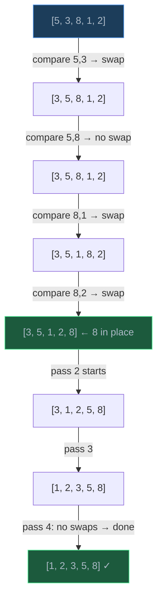
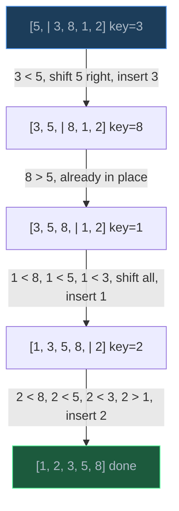
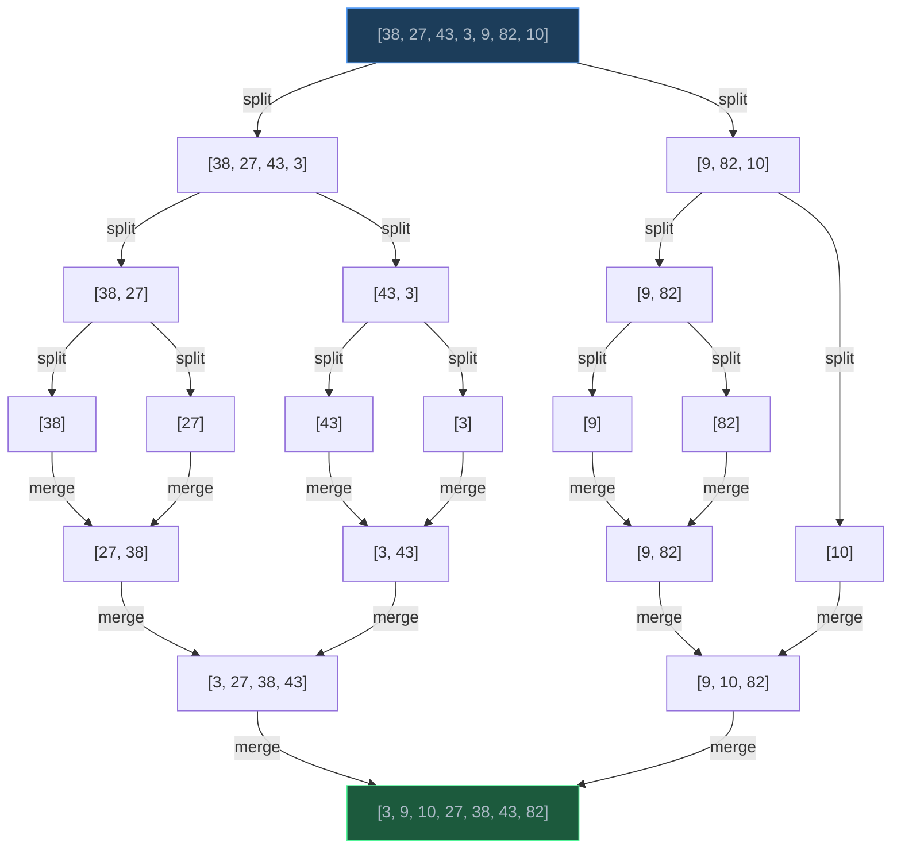
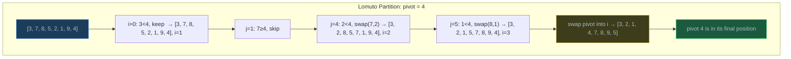
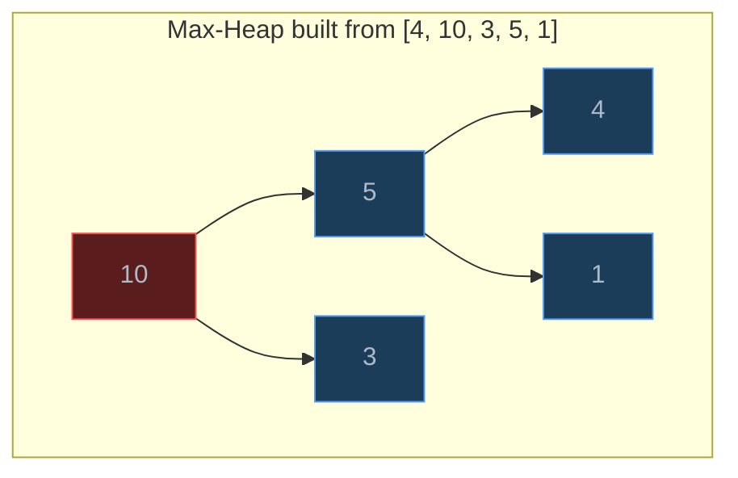
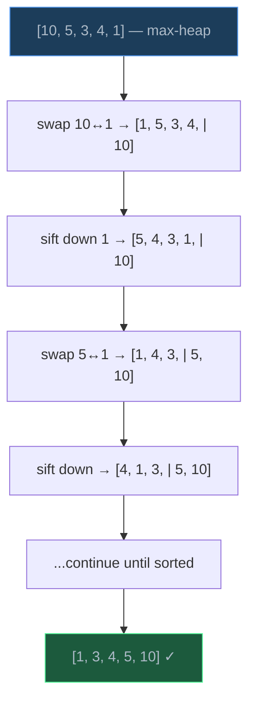

# Sorting Algorithms

> Sorting transforms an unordered collection into an ordered one — it is the most studied problem in computer science because it underpins searching, indexing, deduplication, and nearly every data processing pipeline.

## Table of Contents
- [Core Concepts](#core-concepts)
- [Code Examples](#code-examples)
- [Common Pitfalls](#common-pitfalls)
- [Key Takeaways](#key-takeaways)
- [Exercises](#exercises)

## Core Concepts

### Bubble Sort

#### What

Bubble Sort repeatedly walks through the array, comparing adjacent pairs and swapping them if they are out of order. After each full pass, the largest unsorted element "bubbles up" to its correct position at the end. The process repeats until no swaps are needed.

#### How

1. Start at index 0. Compare `arr[0]` and `arr[1]`. Swap if `arr[0] > arr[1]`.
2. Move to index 1. Compare `arr[1]` and `arr[2]`. Swap if needed.
3. Continue until the end. The largest element is now in its final position.
4. Repeat passes 1 through n-1, but each pass can stop one position earlier (the tail is already sorted).
5. **Early termination optimization**: if a full pass makes zero swaps, the array is sorted — stop immediately.



**Complexity**:
- **Time**: O(n^2) average and worst case — nested loops, each up to n iterations. Best case O(n) with early termination when the input is already sorted (one pass, zero swaps).
- **Space**: O(1) — swaps in place, only a single temporary variable.
- **Stable**: Yes — equal elements are never swapped past each other.

#### Why It Matters

Bubble Sort is the simplest sorting algorithm to understand and implement. Its only practical advantage is the early termination optimization, which makes it O(n) on already-sorted data. In all other cases, it is slower than Insertion Sort (which also has the O(n) best case but moves fewer elements). You should never use Bubble Sort in production, but it is valuable as a teaching tool: it introduces the concepts of pairwise comparison, in-place sorting, and stability that carry through to every other algorithm below.

### Insertion Sort

#### What

Insertion Sort builds a sorted subarray from left to right. It takes each element and inserts it into the correct position within the already-sorted portion, shifting larger elements to the right to make room. Think of sorting a hand of playing cards: you pick up one card at a time and slide it into the right spot among the cards you already hold.

#### How

1. Start with the element at index 1 (the element at index 0 is trivially "sorted").
2. Store `arr[i]` as `key`. Compare `key` against elements to its left.
3. Shift each left-neighbor one position right while it is greater than `key`.
4. Place `key` in the gap. Now `arr[0..i]` is sorted.
5. Repeat for i = 2, 3, ..., n-1.



**Complexity**:
- **Time**: O(n^2) worst and average — each element may shift up to i positions. Best case O(n) when the input is already sorted (inner loop never executes).
- **Space**: O(1) — in-place, one temporary variable.
- **Stable**: Yes — equal elements maintain their original relative order because we only shift elements that are *strictly greater* than the key.

#### Why It Matters

Insertion Sort is the best quadratic sort in practice. It has three properties that make it genuinely useful:

1. **O(n) on nearly-sorted data**: If every element is at most k positions from its sorted position, the inner loop runs at most k times per element, giving O(nk). When k is small, this is near-linear.
2. **Low overhead**: No recursion, no auxiliary arrays, no complex bookkeeping. The constant factor is tiny.
3. **Online**: It can sort data as it arrives — you don't need all elements upfront.

These properties explain why Python's Timsort and C++'s Introsort both fall back to Insertion Sort for small subarrays (typically n < 32-64). The overhead of Merge Sort or Quick Sort is not worth it for tiny arrays.

### Selection Sort

#### What

Selection Sort divides the array into a sorted prefix (initially empty) and an unsorted suffix (initially the whole array). In each pass, it finds the minimum element in the unsorted portion and swaps it with the first unsorted element. The sorted prefix grows by one each pass.

#### How

1. Scan `arr[0..n-1]` to find the index of the minimum element.
2. Swap `arr[0]` with the minimum. Now `arr[0]` is sorted.
3. Scan `arr[1..n-1]` to find the new minimum.
4. Swap `arr[1]` with the minimum. Now `arr[0..1]` is sorted.
5. Repeat until the entire array is sorted.

**Complexity**:
- **Time**: O(n^2) in *all* cases — even if the array is already sorted, you still scan the unsorted portion to find the minimum. There is no early termination. The number of comparisons is always n(n-1)/2.
- **Space**: O(1) — in-place, one swap per pass.
- **Stable**: No — the swap can move equal elements past each other. For example, sorting `[3a, 3b, 1]` swaps `3a` with `1`, placing `3a` after `3b`.

#### Why It Matters

Selection Sort is notable for making the minimum number of *swaps*: exactly n-1 swaps in all cases (one per pass). This matters when swapping is expensive (e.g., swapping large records on disk). However, it always performs O(n^2) comparisons regardless of input order, making it strictly worse than Insertion Sort for nearly-sorted data. In practice, Selection Sort is rarely used.

### Merge Sort

#### What

Merge Sort is a divide-and-conquer algorithm. It recursively splits the array in half until each piece has one element (which is trivially sorted), then merges the sorted halves back together. The merge step is where the actual sorting happens: it combines two sorted arrays into one sorted array by comparing their front elements and taking the smaller one each time.

#### How

1. **Divide**: Split the array into two halves at the midpoint.
2. **Conquer**: Recursively sort each half.
3. **Combine**: Merge the two sorted halves into a single sorted array.

The merge step uses a temporary array. Two pointers walk through the left and right halves, always picking the smaller element. This guarantees sorted output.



**Complexity**:
- **Time**: O(n log n) in *all* cases. The array is split log n times (each split halves the size). At each level, merging all subarrays together processes n elements total. So: log n levels x n work per level = O(n log n). There is no degradation on pathological inputs.
- **Space**: O(n) — the merge step requires a temporary array of size n. The recursion stack adds O(log n) but the temporary array dominates.
- **Stable**: Yes — when left and right elements are equal, we take from the left half first, preserving original order.

#### Why It Matters

Merge Sort guarantees O(n log n) regardless of input — no worst-case degradation. This makes it the safest choice when predictable performance is critical. It is the foundation of external sorting (sorting data that does not fit in memory), because the merge step only needs sequential access — you can merge two sorted files by reading them front-to-back without random access.

The trade-off is O(n) extra space. For in-memory sorting where space matters, Quick Sort is usually preferred. But when stability and guaranteed O(n log n) are required, Merge Sort wins. Python's Timsort is essentially an optimized Merge Sort.

### Quick Sort

#### What

Quick Sort is a divide-and-conquer algorithm that works by selecting a "pivot" element, partitioning the array so that all elements less than the pivot come before it and all elements greater come after it, then recursively sorting the two partitions. Unlike Merge Sort, the work happens *during the divide step* (partitioning), not during the combine step.

#### How

1. **Choose a pivot** (strategies: first element, last element, median-of-three, random).
2. **Partition**: Rearrange the array so elements < pivot are on the left, elements > pivot are on the right, and the pivot is in its final sorted position.
3. **Recurse** on the left partition and the right partition.

There are two classic partitioning schemes:

**Lomuto partition** (simpler, slower): Uses the last element as pivot. Maintains a boundary index `i` — everything left of `i` is less than the pivot. Walk through with pointer `j`; whenever `arr[j] < pivot`, swap `arr[j]` with `arr[i]` and advance `i`. Finally, swap the pivot into position `i`.

**Hoare partition** (original, faster): Uses two pointers starting from both ends, moving inward. The left pointer finds elements >= pivot, the right pointer finds elements <= pivot, and they swap. Hoare does ~3x fewer swaps than Lomuto on average.



**Complexity**:
- **Time**: O(n log n) average. The pivot ideally splits the array in half each time, giving log n levels of recursion with n work per level. **O(n^2) worst case** — when the pivot is always the smallest or largest element (e.g., sorted input with first-element pivot), one partition is empty and the other has n-1 elements. This gives n + (n-1) + (n-2) + ... = O(n^2).
- **Space**: O(log n) average for the recursion stack. O(n) worst case with pathological pivots.
- **Stable**: No — the partition step moves elements across the pivot, which can reorder equal elements.

#### Why It Matters

Quick Sort is the most-used sorting algorithm in practice despite its O(n^2) worst case. Why?

1. **In-place**: Unlike Merge Sort, it needs no O(n) auxiliary array. The partition step rearranges elements within the array.
2. **Cache-friendly**: It accesses elements sequentially within partitions, making excellent use of CPU cache.
3. **Small constant factor**: The inner loop is very tight — one comparison and one conditional swap.

The O(n^2) worst case is avoidable with randomized pivot selection (random pivot makes the probability of worst case negligible) or median-of-three pivot (take the median of first, middle, last elements). Modern implementations like Introsort (C++ `std::sort`) use Quick Sort but switch to Heap Sort if recursion depth exceeds 2 * log n, guaranteeing O(n log n) worst case.

### Heap Sort

#### What

Heap Sort uses a max-heap (a complete binary tree where every parent >= its children) to sort an array. It first builds a max-heap from the input, then repeatedly extracts the maximum element and places it at the end of the array.

#### How

1. **Build a max-heap** from the array using `heapify` from the bottom up. This takes O(n) — not O(n log n) — because most nodes are near the bottom and sift down a small distance.
2. **Extract max**: Swap the root (maximum) with the last element. The max is now in its final position at the end.
3. **Sift down** the new root to restore the heap property for the remaining n-1 elements.
4. Repeat steps 2-3 until the heap has one element.





**Complexity**:
- **Time**: O(n log n) in *all* cases. Building the heap is O(n). Each of the n extractions requires a sift-down of O(log n). Total: O(n) + O(n log n) = O(n log n). There is no worst-case degradation.
- **Space**: O(1) — the heap is built in-place within the array. No auxiliary storage needed.
- **Stable**: No — the swap-to-end and sift-down operations move elements in ways that can reorder equal values.

#### Why It Matters

Heap Sort is the only comparison sort that is simultaneously O(n log n) guaranteed *and* O(1) space. Merge Sort is O(n log n) guaranteed but needs O(n) space. Quick Sort is O(1) space but has O(n^2) worst case. Heap Sort pays for this combination with poor cache performance — it accesses array elements in a tree pattern (parent at i, children at 2i+1 and 2i+2) that jumps around in memory, causing cache misses.

In practice, Heap Sort is rarely used as a standalone sort. Its main role is as the fallback in Introsort: when Quick Sort's recursion gets too deep (suggesting a bad pivot sequence), Introsort switches to Heap Sort to guarantee O(n log n).

### Comparison Summary

| Algorithm | Best | Average | Worst | Space | Stable? | In-place? |
| --- | --- | --- | --- | --- | --- | --- |
| Bubble Sort | O(n) | O(n^2) | O(n^2) | O(1) | Yes | Yes |
| Insertion Sort | O(n) | O(n^2) | O(n^2) | O(1) | Yes | Yes |
| Selection Sort | O(n^2) | O(n^2) | O(n^2) | O(1) | No | Yes |
| Merge Sort | O(n log n) | O(n log n) | O(n log n) | O(n) | Yes | No |
| Quick Sort | O(n log n) | O(n log n) | O(n^2) | O(log n) | No | Yes |
| Heap Sort | O(n log n) | O(n log n) | O(n log n) | O(1) | No | Yes |

The key trade-offs to remember:
- **Need guaranteed O(n log n)?** Merge Sort or Heap Sort.
- **Need stability?** Merge Sort or Insertion Sort.
- **Need in-place + fast?** Quick Sort (with randomized pivot).
- **Small or nearly-sorted input?** Insertion Sort.

### The O(n log n) Lower Bound

#### What

No comparison-based sorting algorithm can do better than O(n log n) in the worst case. This is a proven mathematical lower bound, not just an empirical observation. It applies to any algorithm that sorts by comparing pairs of elements (which includes all six algorithms above).

#### How

The proof uses a **decision tree** argument. Any comparison sort can be modeled as a binary tree where:
- Each internal node is a comparison (is `a[i] < a[j]`?).
- Each leaf is a permutation of the input (a specific sorted ordering).
- For n elements, there are n! possible permutations, so the tree needs at least n! leaves.

A binary tree with n! leaves has height at least log2(n!). By Stirling's approximation: log2(n!) = n log2(n) - n log2(e) + O(log n), which is Theta(n log n).

Since the height of the decision tree is the worst-case number of comparisons, any comparison sort must make at least O(n log n) comparisons in the worst case.

#### Why It Matters

This lower bound tells you when to stop optimizing. If you have a comparison-based sort running in O(n log n), you have reached the theoretical limit — you cannot do better without changing the model. Algorithms like Counting Sort and Radix Sort break this barrier by *not* using comparisons (they exploit the structure of the keys themselves), but they require assumptions about the input (e.g., integers within a known range).

### Python's Timsort

#### What

Timsort is the sorting algorithm used by Python's `list.sort()` and `sorted()`. It was designed by Tim Peters in 2002 specifically for real-world data, which is often partially sorted. It is a hybrid of Merge Sort and Insertion Sort.

#### How

1. **Identify runs**: Scan the input for existing ascending or descending sequences (called "runs"). Descending runs are reversed to become ascending. This exploits existing order in the data.
2. **Extend short runs**: If a natural run is shorter than a minimum run length (typically 32-64), extend it using Insertion Sort. This is where Insertion Sort's efficiency on small inputs pays off.
3. **Merge runs**: Merge runs using a modified Merge Sort. Timsort uses a stack of runs and a set of invariants (similar to the Fibonacci sequence) to decide which runs to merge next, minimizing the total number of merges.
4. **Galloping mode**: During merging, if one run is "winning" many consecutive comparisons, Timsort switches to exponential search (galloping) to find the insertion point faster. This helps when one run is entirely less than the other.

**Complexity**:
- **Time**: O(n log n) worst case, O(n) best case (when data is already sorted or has few runs).
- **Space**: O(n) — needs temporary space for merging.
- **Stable**: Yes — Timsort preserves the relative order of equal elements.

#### Why It Matters

Timsort is what you are actually using every time you call `sorted()` or `.sort()` in Python. You should almost never implement your own sorting algorithm in production Python code — Timsort is written in highly optimized C and exploits patterns in real-world data that a naive O(n log n) algorithm misses.

Understanding Timsort explains why Python sorting is so fast on nearly-sorted data: it detects and exploits existing runs. It also explains why `sorted()` is stable — you can sort by multiple keys by sorting repeatedly (sort by secondary key first, then primary key, and equal primary keys retain their secondary ordering).

## Code Examples

### Bubble Sort

```python
def bubble_sort(arr: list[int]) -> list[int]:
    """Sort using Bubble Sort with early termination optimization.

    Repeatedly compare adjacent pairs and swap if out of order.
    If a full pass makes no swaps, the array is already sorted.
    """
    n: int = len(arr)
    result: list[int] = arr.copy()  # Don't mutate the original

    for i in range(n - 1):
        swapped: bool = False

        # Each pass bubbles the next-largest element to position n-1-i
        for j in range(n - 1 - i):
            if result[j] > result[j + 1]:
                result[j], result[j + 1] = result[j + 1], result[j]
                swapped = True

        # Early termination: no swaps means array is sorted
        if not swapped:
            break

    return result


# Demo
data = [64, 34, 25, 12, 22, 11, 90]
print(f"Original: {data}")
print(f"Sorted:   {bubble_sort(data)}")
# Original: [64, 34, 25, 12, 22, 11, 90]
# Sorted:   [11, 12, 22, 25, 34, 64, 90]
```

**Time**: O(n^2) average/worst — two nested loops, each up to n. O(n) best case when input is sorted (one pass, no swaps, early termination).
**Space**: O(n) for the copy. O(1) if sorting in-place.

### Insertion Sort

```python
def insertion_sort(arr: list[int]) -> list[int]:
    """Sort using Insertion Sort.

    Build a sorted subarray left-to-right. For each element,
    shift larger elements right and insert in the correct position.
    """
    result: list[int] = arr.copy()

    for i in range(1, len(result)):
        key: int = result[i]
        j: int = i - 1

        # Shift elements right while they are greater than key
        while j >= 0 and result[j] > key:
            result[j + 1] = result[j]
            j -= 1

        # Place key in the gap left by the shifts
        result[j + 1] = key

    return result


# Demo
data = [64, 34, 25, 12, 22, 11, 90]
print(f"Original: {data}")
print(f"Sorted:   {insertion_sort(data)}")
# Original: [64, 34, 25, 12, 22, 11, 90]
# Sorted:   [11, 12, 22, 25, 34, 64, 90]
```

**Time**: O(n^2) average/worst — each element may shift up to i positions. O(n) best case on sorted input because the inner while loop never executes (each key is already >= its predecessor).
**Space**: O(n) for the copy. O(1) if sorting in-place.

### Selection Sort

```python
def selection_sort(arr: list[int]) -> list[int]:
    """Sort using Selection Sort.

    Find the minimum in the unsorted portion and swap it
    to the front. Repeat until sorted.
    """
    result: list[int] = arr.copy()
    n: int = len(result)

    for i in range(n - 1):
        # Find the index of the minimum element in arr[i..n-1]
        min_idx: int = i
        for j in range(i + 1, n):
            if result[j] < result[min_idx]:
                min_idx = j

        # Swap the minimum into position i
        if min_idx != i:
            result[i], result[min_idx] = result[min_idx], result[i]

    return result


# Demo
data = [64, 34, 25, 12, 22, 11, 90]
print(f"Original: {data}")
print(f"Sorted:   {selection_sort(data)}")
# Original: [64, 34, 25, 12, 22, 11, 90]
# Sorted:   [11, 12, 22, 25, 34, 64, 90]
```

**Time**: O(n^2) in *all* cases — always scans the entire unsorted portion regardless of input order. The number of comparisons is exactly n(n-1)/2.
**Space**: O(n) for the copy. O(1) if sorting in-place.

### Merge Sort

```python
def merge_sort(arr: list[int]) -> list[int]:
    """Sort using Merge Sort (divide-and-conquer).

    Recursively split the array in half, sort each half,
    then merge the two sorted halves together.
    """
    # Base case: a single element (or empty) is already sorted
    if len(arr) <= 1:
        return arr.copy()

    mid: int = len(arr) // 2
    left: list[int] = merge_sort(arr[:mid])
    right: list[int] = merge_sort(arr[mid:])

    return _merge(left, right)


def _merge(left: list[int], right: list[int]) -> list[int]:
    """Merge two sorted arrays into one sorted array.

    Uses two pointers to walk through both arrays simultaneously,
    always picking the smaller front element.
    """
    result: list[int] = []
    i: int = 0  # Pointer into left
    j: int = 0  # Pointer into right

    # Compare front elements and take the smaller one
    while i < len(left) and j < len(right):
        if left[i] <= right[j]:
            # Take from left when equal — this preserves stability
            result.append(left[i])
            i += 1
        else:
            result.append(right[j])
            j += 1

    # One side is exhausted — append the remainder of the other
    result.extend(left[i:])
    result.extend(right[j:])

    return result


# Demo
data = [38, 27, 43, 3, 9, 82, 10]
print(f"Original: {data}")
print(f"Sorted:   {merge_sort(data)}")
# Original: [38, 27, 43, 3, 9, 82, 10]
# Sorted:   [3, 9, 10, 27, 38, 43, 82]
```

**Time**: O(n log n) in all cases — log n levels of recursion, n work per level to merge.
**Space**: O(n) — each merge creates a new list. The total auxiliary space across all levels is O(n) because only one level's merge arrays exist at a time (plus O(log n) for the call stack).

### Quick Sort (Lomuto Partition)

```python
def quick_sort(arr: list[int]) -> list[int]:
    """Sort using Quick Sort with Lomuto partitioning.

    Pick the last element as pivot, partition the array,
    then recursively sort the two partitions.
    """
    result: list[int] = arr.copy()
    _quick_sort_helper(result, 0, len(result) - 1)
    return result


def _quick_sort_helper(arr: list[int], low: int, high: int) -> None:
    """Recursively sort arr[low..high] in-place."""
    if low < high:
        pivot_idx: int = _lomuto_partition(arr, low, high)
        _quick_sort_helper(arr, low, pivot_idx - 1)
        _quick_sort_helper(arr, pivot_idx + 1, high)


def _lomuto_partition(arr: list[int], low: int, high: int) -> int:
    """Lomuto partition scheme: use arr[high] as pivot.

    Rearranges arr[low..high] so that:
    - Elements < pivot are to the left of the pivot
    - Elements >= pivot are to the right of the pivot
    - The pivot is in its final sorted position

    Returns the final index of the pivot.
    """
    pivot: int = arr[high]
    i: int = low  # Boundary: everything left of i is < pivot

    for j in range(low, high):
        if arr[j] < pivot:
            arr[i], arr[j] = arr[j], arr[i]
            i += 1

    # Place pivot in its correct position
    arr[i], arr[high] = arr[high], arr[i]
    return i


# Demo
data = [3, 7, 8, 5, 2, 1, 9, 4]
print(f"Original: {data}")
print(f"Sorted:   {quick_sort(data)}")
# Original: [3, 7, 8, 5, 2, 1, 9, 4]
# Sorted:   [1, 2, 3, 4, 5, 7, 8, 9]
```

**Time**: O(n log n) average — each partition roughly halves the array. O(n^2) worst case — when the pivot is always the min or max (e.g., sorted input with last-element pivot), each partition removes only one element.
**Space**: O(log n) average for the recursion stack. O(n) worst case with pathological pivots.

### Quick Sort (Hoare Partition + Randomized Pivot)

```python
import random


def quick_sort_hoare(arr: list[int]) -> list[int]:
    """Sort using Quick Sort with Hoare partitioning and random pivot.

    Hoare partition uses two pointers moving inward from both ends.
    Random pivot selection makes O(n²) worst case astronomically unlikely.
    """
    result: list[int] = arr.copy()
    _quick_sort_hoare_helper(result, 0, len(result) - 1)
    return result


def _quick_sort_hoare_helper(arr: list[int], low: int, high: int) -> None:
    """Recursively sort arr[low..high] in-place."""
    if low < high:
        pivot_idx: int = _hoare_partition(arr, low, high)
        _quick_sort_hoare_helper(arr, low, pivot_idx)
        _quick_sort_hoare_helper(arr, pivot_idx + 1, high)


def _hoare_partition(arr: list[int], low: int, high: int) -> int:
    """Hoare partition: two pointers moving inward.

    Randomize pivot to avoid O(n²) on sorted/reverse-sorted input.
    Hoare's scheme does ~3x fewer swaps than Lomuto on average.
    """
    # Randomized pivot: swap a random element to arr[low]
    rand_idx: int = random.randint(low, high)
    arr[low], arr[rand_idx] = arr[rand_idx], arr[low]

    pivot: int = arr[low]
    i: int = low - 1
    j: int = high + 1

    while True:
        # Move i right until we find an element >= pivot
        i += 1
        while arr[i] < pivot:
            i += 1

        # Move j left until we find an element <= pivot
        j -= 1
        while arr[j] > pivot:
            j -= 1

        # If pointers crossed, partition is complete
        if i >= j:
            return j

        # Swap elements that are on the wrong side
        arr[i], arr[j] = arr[j], arr[i]


# Demo
data = [3, 7, 8, 5, 2, 1, 9, 4]
print(f"Original: {data}")
print(f"Sorted:   {quick_sort_hoare(data)}")
# Original: [3, 7, 8, 5, 2, 1, 9, 4]
# Sorted:   [1, 2, 3, 4, 5, 7, 8, 9]
```

**Time**: O(n log n) average. Randomized pivot makes worst case O(n^2) extremely unlikely in practice.
**Space**: O(log n) average for the recursion stack.

### Heap Sort

```python
def heap_sort(arr: list[int]) -> list[int]:
    """Sort using Heap Sort.

    1. Build a max-heap from the array (O(n)).
    2. Repeatedly extract the max (swap root to end, sift down).
    """
    result: list[int] = arr.copy()
    n: int = len(result)

    # Phase 1: Build max-heap from bottom up.
    # Start from the last non-leaf node (parent of the last element).
    # Leaf nodes (indices n//2 to n-1) are trivially valid heaps.
    for i in range(n // 2 - 1, -1, -1):
        _sift_down(result, n, i)

    # Phase 2: Extract max one by one.
    # Swap root (max) with the last unsorted element,
    # shrink the heap by one, and restore heap property.
    for i in range(n - 1, 0, -1):
        result[0], result[i] = result[i], result[0]  # Move max to end
        _sift_down(result, i, 0)  # Restore heap for arr[0..i-1]

    return result


def _sift_down(arr: list[int], heap_size: int, root: int) -> None:
    """Sift element at `root` down to its correct position in the max-heap.

    Compares root with its children and swaps with the largest child
    if the heap property is violated. Repeats until the element
    reaches a valid position.
    """
    largest: int = root
    left: int = 2 * root + 1
    right: int = 2 * root + 2

    # Check if left child exists and is greater than root
    if left < heap_size and arr[left] > arr[largest]:
        largest = left

    # Check if right child exists and is greater than current largest
    if right < heap_size and arr[right] > arr[largest]:
        largest = right

    # If the largest is not the root, swap and continue sifting
    if largest != root:
        arr[root], arr[largest] = arr[largest], arr[root]
        _sift_down(arr, heap_size, largest)


# Demo
data = [4, 10, 3, 5, 1]
print(f"Original: {data}")
print(f"Sorted:   {heap_sort(data)}")
# Original: [4, 10, 3, 5, 1]
# Sorted:   [1, 3, 4, 5, 10]
```

**Time**: O(n log n) in all cases. Building the heap is O(n) (the math: most nodes are near the bottom and sift a short distance; the sum telescopes to O(n)). Each of n extractions requires O(log n) sift-down. Total: O(n) + O(n log n) = O(n log n).
**Space**: O(1) auxiliary (ignoring the initial copy). The heap is built within the array itself. The recursive `_sift_down` uses O(log n) stack space, but this can be converted to iterative for true O(1).

### Benchmark Comparison

```python
import random
import time
from typing import Callable


def benchmark_sorts(n: int = 5_000) -> None:
    """Compare all sorting algorithms on the same random input.

    Uses a moderately large n to show the O(n²) vs O(n log n) difference.
    For n=5000: O(n²) ≈ 25,000,000 ops, O(n log n) ≈ 60,000 ops.
    """
    data: list[int] = [random.randint(0, 100_000) for _ in range(n)]

    algorithms: list[tuple[str, Callable[[list[int]], list[int]]]] = [
        ("Bubble Sort", bubble_sort),
        ("Insertion Sort", insertion_sort),
        ("Selection Sort", selection_sort),
        ("Merge Sort", merge_sort),
        ("Quick Sort (Lomuto)", quick_sort),
        ("Quick Sort (Hoare)", quick_sort_hoare),
        ("Heap Sort", heap_sort),
        ("Python sorted()", lambda arr: sorted(arr)),
    ]

    print(f"Sorting {n:,} random integers:\n")
    print(f"  {'Algorithm':<25} {'Time':>10}")
    print(f"  {'-' * 25} {'-' * 10}")

    for name, func in algorithms:
        test_data: list[int] = data.copy()
        start: float = time.perf_counter()
        result: list[int] = func(test_data)
        elapsed: float = time.perf_counter() - start
        print(f"  {name:<25} {elapsed:>9.4f}s")

        # Verify correctness
        assert result == sorted(data), f"{name} produced incorrect result!"

    # Also test on already-sorted data to show best-case behavior
    sorted_data: list[int] = sorted(data)
    print(f"\nSorting {n:,} already-sorted integers:\n")
    print(f"  {'Algorithm':<25} {'Time':>10}")
    print(f"  {'-' * 25} {'-' * 10}")

    for name, func in algorithms:
        test_data = sorted_data.copy()
        start = time.perf_counter()
        result = func(test_data)
        elapsed = time.perf_counter() - start
        print(f"  {name:<25} {elapsed:>9.4f}s")


if __name__ == "__main__":
    benchmark_sorts()
```

**Time**: The benchmark reveals the practical difference between O(n^2) and O(n log n). On n=5000, Bubble/Insertion/Selection Sort take seconds while Merge/Quick/Heap Sort finish in milliseconds. Python's built-in `sorted()` (Timsort) is the fastest because it is implemented in optimized C.
**Space**: Each algorithm's space usage is as described above. The benchmark itself uses O(n) for copies.

### From Brute Force to Optimal: The Sorting Progression

```python
def sort_and_count_ops(arr: list[int]) -> tuple[list[int], int]:
    """Bubble Sort with operation counter — illustrates O(n²) cost.

    This is the 'brute-force' approach to sorting: compare every
    pair in a nested loop.
    """
    result: list[int] = arr.copy()
    n: int = len(result)
    ops: int = 0

    for i in range(n - 1):
        for j in range(n - 1 - i):
            ops += 1  # Count each comparison
            if result[j] > result[j + 1]:
                result[j], result[j + 1] = result[j + 1], result[j]

    return result, ops


def merge_sort_and_count(arr: list[int]) -> tuple[list[int], int]:
    """Merge Sort with operation counter — illustrates O(n log n) cost.

    This is the 'optimized' approach: divide and conquer reduces
    the number of comparisons from O(n²) to O(n log n).
    """
    if len(arr) <= 1:
        return arr.copy(), 0

    mid: int = len(arr) // 2
    left, left_ops = merge_sort_and_count(arr[:mid])
    right, right_ops = merge_sort_and_count(arr[mid:])

    merged: list[int] = []
    ops: int = left_ops + right_ops
    i: int = 0
    j: int = 0

    while i < len(left) and j < len(right):
        ops += 1
        if left[i] <= right[j]:
            merged.append(left[i])
            i += 1
        else:
            merged.append(right[j])
            j += 1

    merged.extend(left[i:])
    merged.extend(right[j:])

    return merged, ops


def demonstrate_progression() -> None:
    """Show how O(n²) vs O(n log n) scales with input size."""
    print(f"  {'n':>6}  {'Bubble (O(n²))':>16}  {'Merge (O(n log n))':>20}  {'Ratio':>8}")
    print(f"  {'---':>6}  {'---':>16}  {'---':>20}  {'---':>8}")

    for n in [100, 500, 1_000, 2_000, 5_000]:
        data: list[int] = [random.randint(0, 100_000) for _ in range(n)]
        _, bubble_ops = sort_and_count_ops(data)
        _, merge_ops = merge_sort_and_count(data)
        ratio: float = bubble_ops / merge_ops if merge_ops > 0 else 0
        print(f"  {n:>6}  {bubble_ops:>16,}  {merge_ops:>20,}  {ratio:>7.1f}x")


if __name__ == "__main__":
    demonstrate_progression()
```

**Time**: This demonstrates the fundamental insight — as n grows, the gap between O(n^2) and O(n log n) widens dramatically. At n=5000, Bubble Sort does ~12.5 million comparisons while Merge Sort does ~60,000. The ratio grows as O(n / log n).

## Common Pitfalls

### Pitfall 1: Using Quick Sort's Last Element Pivot on Sorted Data

```python
# BAD — choosing the last element as pivot on sorted input gives O(n²)
def bad_quick_sort(arr: list[int], low: int, high: int) -> None:
    if low < high:
        pivot = arr[high]  # Always the largest element in sorted input!
        # Partition produces empty right side every time → O(n²)
        i = low
        for j in range(low, high):
            if arr[j] < pivot:
                arr[i], arr[j] = arr[j], arr[i]
                i += 1
        arr[i], arr[high] = arr[high], arr[i]
        bad_quick_sort(arr, low, i - 1)  # n-1 elements
        bad_quick_sort(arr, i + 1, high)  # 0 elements


# GOOD — randomize pivot selection to avoid pathological cases
def good_quick_sort(arr: list[int], low: int, high: int) -> None:
    if low < high:
        # Random pivot makes O(n²) astronomically unlikely
        rand_idx = random.randint(low, high)
        arr[rand_idx], arr[high] = arr[high], arr[rand_idx]

        pivot = arr[high]
        i = low
        for j in range(low, high):
            if arr[j] < pivot:
                arr[i], arr[j] = arr[j], arr[i]
                i += 1
        arr[i], arr[high] = arr[high], arr[i]
        good_quick_sort(arr, low, i - 1)
        good_quick_sort(arr, i + 1, high)
```

Why it is wrong: When the input is already sorted (or reverse-sorted) and you always pick the last element as pivot, the pivot is the maximum (or minimum). The partition puts all n-1 elements on one side and zero on the other. Recursion depth becomes n, and total work is n + (n-1) + ... + 1 = O(n^2). Randomizing the pivot breaks this pattern.

### Pitfall 2: Forgetting That Merge Sort Needs O(n) Extra Space

```python
# BAD — assuming merge sort is in-place and using it in memory-constrained context
def memory_naive_merge(left: list[int], right: list[int]) -> list[int]:
    # This creates a NEW list every merge call
    # For n elements with log n levels, total allocations are O(n log n)
    # (though total *space at any point* is O(n))
    return sorted(left + right)  # Also defeats the purpose of writing merge sort


# GOOD — allocate a single auxiliary buffer and reuse it
def merge_sort_with_buffer(
    arr: list[int],
    aux: list[int],
    low: int,
    high: int,
) -> None:
    """Memory-efficient merge sort using a pre-allocated auxiliary buffer."""
    if low >= high:
        return

    mid: int = (low + high) // 2
    merge_sort_with_buffer(arr, aux, low, mid)
    merge_sort_with_buffer(arr, aux, mid + 1, high)

    # Copy to auxiliary buffer
    for k in range(low, high + 1):
        aux[k] = arr[k]

    # Merge from aux back into arr
    i: int = low
    j: int = mid + 1
    for k in range(low, high + 1):
        if i > mid:
            arr[k] = aux[j]
            j += 1
        elif j > high:
            arr[k] = aux[i]
            i += 1
        elif aux[i] <= aux[j]:
            arr[k] = aux[i]
            i += 1
        else:
            arr[k] = aux[j]
            j += 1


# Usage
data = [38, 27, 43, 3, 9, 82, 10]
buffer = [0] * len(data)
merge_sort_with_buffer(data, buffer, 0, len(data) - 1)
print(data)  # [3, 9, 10, 27, 38, 43, 82]
```

Why it is wrong: The naive version concatenates and sorts, which is O(n log n) per merge call — defeating the divide-and-conquer strategy entirely. The "bad" version also creates many temporary lists. The optimized version pre-allocates a single auxiliary buffer and reuses it across all recursive calls, keeping auxiliary space at exactly O(n).

### Pitfall 3: Confusing Stability — Using an Unstable Sort for Multi-Key Data

```python
from dataclasses import dataclass


@dataclass
class Student:
    name: str
    grade: int


# BAD — Selection Sort is unstable. After sorting by grade,
# students with the same grade may lose their original order.
def unstable_sort_by_grade(students: list[Student]) -> list[Student]:
    result = students.copy()
    for i in range(len(result)):
        min_idx = i
        for j in range(i + 1, len(result)):
            if result[j].grade < result[min_idx].grade:
                min_idx = j
        result[i], result[min_idx] = result[min_idx], result[i]
    return result


# GOOD — use Python's sorted() which is stable (Timsort).
# Students with the same grade keep their original relative order.
def stable_sort_by_grade(students: list[Student]) -> list[Student]:
    return sorted(students, key=lambda s: s.grade)


students = [
    Student("Alice", 90),
    Student("Bob", 85),
    Student("Charlie", 90),
    Student("Diana", 85),
]

# With stable sort, Alice stays before Charlie (both 90),
# and Bob stays before Diana (both 85).
result = stable_sort_by_grade(students)
for s in result:
    print(f"  {s.name}: {s.grade}")
# Bob: 85
# Diana: 85
# Alice: 90
# Charlie: 90
```

Why it is wrong: When sorting records with equal keys, an unstable sort can arbitrarily reorder them. This matters when you sort by multiple criteria sequentially (sort by name, then by grade) — an unstable sort on the second key destroys the ordering from the first key. Python's `sorted()` is stable by design, which is why multi-key sorting works correctly with `sorted(students, key=lambda s: (s.grade, s.name))`.

### Pitfall 4: Hitting Python's Recursion Limit with Deep Recursion

```python
import sys

# BAD — Quick Sort on sorted input with bad pivot can recurse n times
# Python's default recursion limit is 1000, so n > 1000 crashes
def recursive_sort_naive(arr: list[int]) -> list[int]:
    if len(arr) <= 1:
        return arr
    pivot = arr[0]  # Bad pivot for sorted input
    left = [x for x in arr[1:] if x <= pivot]
    right = [x for x in arr[1:] if x > pivot]
    return recursive_sort_naive(left) + [pivot] + recursive_sort_naive(right)

# This will crash: recursive_sort_naive(list(range(2000)))
# RecursionError: maximum recursion depth exceeded


# GOOD — use iterative approach or increase limit carefully
# Option 1: Use Python's built-in sorted() for production code
result = sorted(list(range(2000)))

# Option 2: If you must write your own, use an explicit stack
def iterative_quick_sort(arr: list[int]) -> list[int]:
    """Quick Sort using an explicit stack instead of recursion."""
    result: list[int] = arr.copy()
    stack: list[tuple[int, int]] = [(0, len(result) - 1)]

    while stack:
        low, high = stack.pop()
        if low >= high:
            continue

        # Lomuto partition
        rand_idx = random.randint(low, high)
        result[rand_idx], result[high] = result[high], result[rand_idx]
        pivot = result[high]
        i = low
        for j in range(low, high):
            if result[j] < pivot:
                result[i], result[j] = result[j], result[i]
                i += 1
        result[i], result[high] = result[high], result[i]

        # Push sub-problems onto stack (smaller partition first for space)
        if i - low < high - i:
            stack.append((i + 1, high))
            stack.append((low, i - 1))
        else:
            stack.append((low, i - 1))
            stack.append((i + 1, high))

    return result
```

Why it is wrong: Python's default recursion limit is 1000. Quick Sort with a bad pivot on sorted input recurses n times, causing a `RecursionError` for n > 1000. While you can increase the limit with `sys.setrecursionlimit()`, this risks a segfault if the OS stack overflows. The proper fix is either to use an iterative implementation with an explicit stack or to use randomized pivots to keep recursion depth at O(log n) with high probability.

### Pitfall 5: Re-implementing Sort Instead of Using Python's Built-in

```python
# BAD — writing your own sort in Python for production use
def my_sort(data: list[int]) -> list[int]:
    # Even a correct O(n log n) implementation in Python is
    # 10-100x slower than the built-in sorted() because:
    # 1. sorted() is implemented in C
    # 2. Timsort exploits real-world data patterns
    # 3. Python function call overhead per comparison is huge
    return merge_sort(data)  # Correct but slow


# GOOD — use sorted() or list.sort() for production code
result = sorted(data)              # Returns new sorted list
data.sort()                        # Sorts in-place, returns None
data.sort(key=lambda x: -x)       # Sort descending
data.sort(key=str.lower)           # Case-insensitive string sort

# Custom objects: use key parameter, not a custom comparator
from dataclasses import dataclass, field

@dataclass
class Task:
    priority: int
    name: str

tasks = [Task(3, "low"), Task(1, "critical"), Task(2, "medium")]
tasks.sort(key=lambda t: t.priority)
# [Task(1, 'critical'), Task(2, 'medium'), Task(3, 'low')]
```

Why it is wrong: Python's `sorted()` runs Timsort in optimized C code. A hand-written Merge Sort in Python has enormous overhead from interpreted function calls, dynamic type checking, and object allocation. The only reasons to implement sorting yourself are: (1) learning, (2) the problem requires a modified sort (e.g., counting inversions during merge sort), or (3) you are working in a language without a standard library sort.

## Key Takeaways

- **O(n^2) sorts** (Bubble, Insertion, Selection) are simple but impractical for large inputs. Insertion Sort is the best of the three because it is O(n) on nearly-sorted data and has low overhead, making it ideal for small subarrays (n < 32-64).

- **O(n log n) is the theoretical limit** for comparison-based sorting. You cannot beat it without exploiting properties of the data (like integer ranges for Counting Sort). Merge Sort, Quick Sort, and Heap Sort all achieve this bound.

- **Trade-offs define algorithm choice**: Merge Sort guarantees O(n log n) and stability but costs O(n) space. Quick Sort is in-place and cache-friendly but has O(n^2) worst case. Heap Sort is in-place and guaranteed O(n log n) but has poor cache behavior and is not stable.

- **In production Python, always use `sorted()` or `list.sort()`**. Timsort is a highly optimized hybrid that adapts to real-world data patterns. Implementing your own sort is for learning, not for production code.

- **Stability matters when sorting by multiple keys**. A stable sort preserves the relative order of equal elements, which means you can sort by secondary key first and primary key second, and the secondary ordering is preserved within equal primary keys.

## Exercises

1. **Trace the execution** of Lomuto partition on the array `[10, 80, 30, 90, 40, 50, 70]` with pivot = 70 (last element). Show the state of the array and the value of `i` after each comparison. What is the final position of the pivot?

2. **Write a function** `count_inversions(arr: list[int]) -> int` that counts the number of inversions in an array. An inversion is a pair (i, j) where i < j but arr[i] > arr[j]. The brute-force approach is O(n^2). Modify Merge Sort to count inversions during the merge step in O(n log n). (Hint: when you take an element from the right half during merge, it forms inversions with all remaining elements in the left half.)

3. **Explain** why Insertion Sort is O(n) on an already-sorted array but Selection Sort is still O(n^2). Both are quadratic sorts — what structural difference causes this asymmetry in best-case behavior?

4. **Write a function** `sort_colors(arr: list[int]) -> list[int]` that sorts an array containing only 0s, 1s, and 2s in O(n) time and O(1) space (Dutch National Flag problem). This is *not* a comparison sort — explain why it can beat the O(n log n) lower bound.

5. **Implement** `is_stable_sort(sort_func, n: int) -> bool` that tests whether a given sorting function is stable. Generate an array of tuples `(value, original_index)` with duplicate values, sort by value using the provided function, and check whether elements with equal values retained their original relative order. Test it against your implementations of Insertion Sort, Selection Sort, and Merge Sort.

---
up:: [Schedule](../../Schedule.md)
#type/learning #source/self-study #status/seed