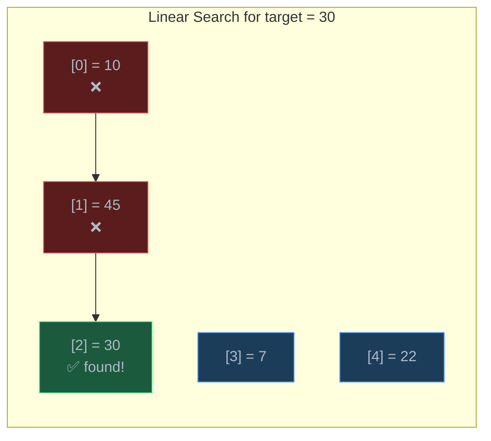
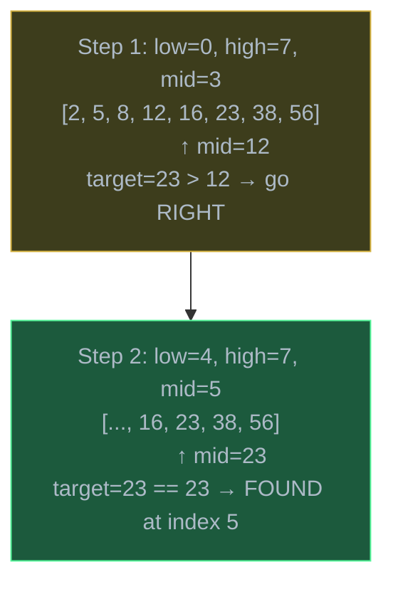
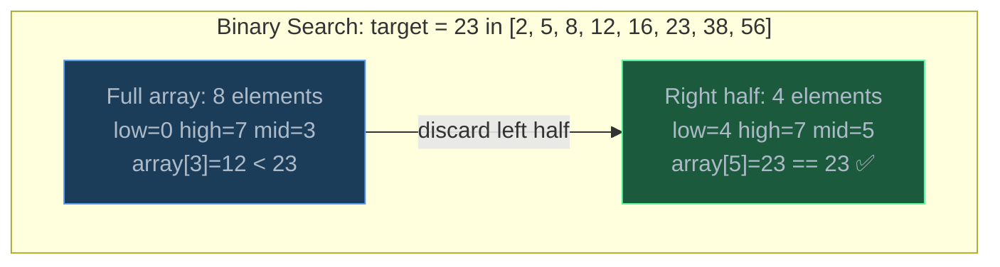
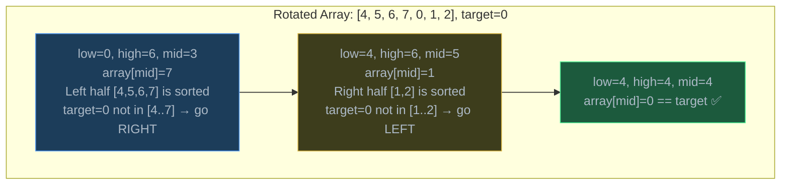
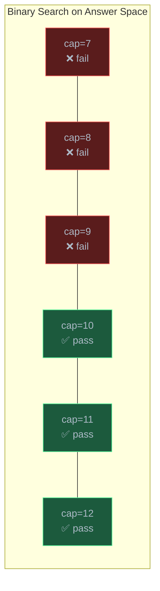

# Searching Algorithms

> Searching is the problem of finding a target value in a collection — linear search checks every element in O(n), while binary search exploits sorted order to halve the search space each step in O(log n), making it one of the most powerful algorithmic ideas in computing.

## Table of Contents
- [Core Concepts](#core-concepts)
- [Code Examples](#code-examples)
- [Common Pitfalls](#common-pitfalls)
- [Key Takeaways](#key-takeaways)
- [Exercises](#exercises)

## Core Concepts

### Linear Search

#### What

Linear search is the simplest searching algorithm: start at the beginning, check each element one by one, and stop when you find the target or exhaust the collection. It works on **any** data — sorted, unsorted, a list, a linked list, a stream of events.

#### How

Walk through the array from index 0 to n-1. Compare each element to the target. Return the index when found, or -1 (or `None`) if you reach the end without a match.



- **Best case**: O(1) — the target is the first element.
- **Worst case**: O(n) — the target is the last element or not present.
- **Average case**: O(n) — on average, you check half the elements.

#### Why It Matters

Linear search is the baseline. Every other search algorithm is measured against it. You reach for linear search when the data is unsorted and you have no additional structure to exploit. It is also the right choice for small collections (under ~100 elements) where the constant factor of more sophisticated algorithms outweighs their asymptotic advantage.

Crucially, linear search establishes the "brute-force" reference point. When you encounter a searching problem, your first thought should be: "I can always scan every element in O(n). Can I do better?" That question leads directly to binary search.

### Binary Search

#### What

Binary search is a divide-and-conquer algorithm that finds a target in a **sorted** array by repeatedly cutting the search space in half. Instead of checking every element, it checks the middle element, decides which half must contain the target, and discards the other half entirely.

#### How

Given a sorted array and a target value:

1. Set `low = 0` and `high = len(array) - 1`.
2. Compute `mid = low + (high - low) // 2`.
3. Compare `array[mid]` to the target:
   - If `array[mid] == target`: found it, return `mid`.
   - If `array[mid] < target`: the target must be in the right half. Set `low = mid + 1`.
   - If `array[mid] > target`: the target must be in the left half. Set `high = mid - 1`.
4. Repeat until `low > high` (search space is empty — target not found).



Here is a more detailed step-by-step walkthrough showing how the search space shrinks:



#### Why It Matters

Binary search is one of the most important algorithms in all of computer science. By halving the search space each step, it achieves **O(log n)** time — and the difference between O(n) and O(log n) is staggering at scale:

| n (elements) | Linear O(n) | Binary O(log n) |
|---|---|---|
| 1,000 | 1,000 comparisons | 10 comparisons |
| 1,000,000 | 1,000,000 comparisons | 20 comparisons |
| 1,000,000,000 | 1,000,000,000 comparisons | 30 comparisons |

To search a billion elements, linear search needs up to a billion steps. Binary search needs **30 steps**. This is because log₂(1,000,000,000) ≈ 30 — each step halves the search space, so after k steps you have n/2^k elements left. The search ends when n/2^k = 1, which gives k = log₂(n).

Binary search applies far beyond sorted arrays. Any problem where you can define a search space, a condition that is monotonically true/false across that space, and a way to check the middle can use binary search. This generalization — called "binary search on answer" — is one of the most powerful problem-solving techniques.

### Why Binary Search Is O(log n)

#### What

The time complexity of binary search is O(log n) because the search space is halved with every comparison. This logarithmic behavior is a direct consequence of the divide-by-two strategy.

#### How

Think of it mathematically. You start with n elements. After each step:
- Step 1: n/2 elements remain
- Step 2: n/4 elements remain
- Step 3: n/8 elements remain
- Step k: n/2^k elements remain

The search ends when only 1 element remains: n/2^k = 1, so k = log₂(n).

Another way to see it: how many times can you divide n by 2 before reaching 1? That's the definition of log₂(n).


For 16 elements: 16 → 8 → 4 → 2 → 1 = 4 steps = log₂(16).

#### Why It Matters

Understanding *why* binary search is O(log n) — not just memorizing it — is critical because the same halving logic appears everywhere: balanced BSTs have O(log n) height, merge sort has O(log n) levels, and any algorithm that repeatedly divides a problem in half has a logarithmic factor. Recognizing "this problem halves each step" instantly tells you the complexity involves log n.

### Iterative vs Recursive Binary Search

#### What

Binary search can be implemented in two styles:
- **Iterative**: uses a `while` loop with `low` and `high` pointers. No extra stack frames.
- **Recursive**: calls itself with a smaller range. More elegant but uses O(log n) stack space.

#### How

Both implementations follow the same logic — compare the middle element, then narrow the search space. The difference is mechanical:

- **Iterative** modifies `low` and `high` in a loop. It uses O(1) auxiliary space.
- **Recursive** passes `low` and `high` as arguments, making a new function call for each half. Each call adds a frame to the call stack, using O(log n) space.

#### Why It Matters

In practice, **iterative binary search is preferred** for production code because it avoids the overhead of recursive calls and the risk of stack overflow on very large inputs. Recursive binary search is useful for learning and for problems where the recursive structure makes the logic clearer (like binary search on trees). In interviews, either is acceptable, but you should understand the space complexity difference.

### Binary Search Variations

#### What

The standard binary search finds *any* occurrence of the target. But many real-world problems need more specific answers:

- **First occurrence (leftmost)**: Find the first index where the target appears. Useful for finding the lower bound in a range.
- **Last occurrence (rightmost)**: Find the last index where the target appears. Useful for finding the upper bound in a range.
- **Rotated sorted array**: A sorted array that has been rotated (e.g., `[4, 5, 6, 7, 0, 1, 2]`). The array is "almost sorted" and binary search can still be applied with modifications.
- **Binary search on answer**: Instead of searching an array, search over a range of possible answers. Used when the problem has a monotonic property — if answer x works, all answers > x also work (or vice versa).

#### How

**First occurrence**: When you find the target, don't stop — record the index and keep searching left (`high = mid - 1`) to see if there's an earlier occurrence.

**Last occurrence**: When you find the target, record the index and keep searching right (`low = mid + 1`).

**Rotated sorted array**: At least one half of the array (left or right of mid) is always properly sorted. Check which half is sorted, then determine if the target falls within that sorted half.



**Binary search on answer**: Define a range of possible answers `[lo, hi]`. For each mid value, check if mid is a feasible answer. If yes, try smaller (or larger); if no, try the other direction.

#### Why It Matters

These variations demonstrate that binary search is not a single algorithm but a **pattern of thought**: whenever you can eliminate half the possibilities with one check, you can apply binary search. The first/last occurrence variation is essential for problems involving ranges and duplicates. The rotated array variation is one of the most common interview questions. Binary search on answer is a powerful technique that turns optimization problems into decision problems.

### Binary Search on Answer

#### What

"Binary search on answer" is a technique where instead of searching for a target in an array, you search over the space of **possible answers** to an optimization problem. If you can frame the question as "is answer x feasible?", and the feasibility is monotonic (once it becomes feasible, it stays feasible for all larger values), then you can binary search over x.

#### How

Example problem: **Minimum capacity to ship packages within D days**. Given an array of package weights and a deadline D days, find the minimum ship capacity that allows all packages to be shipped in time.

1. The minimum possible capacity is `max(weights)` (must fit the heaviest package).
2. The maximum possible capacity is `sum(weights)` (ship everything in one day).
3. For each candidate capacity `mid`, simulate: can you ship all packages in ≤ D days?
4. If yes, try a smaller capacity (`high = mid`). If no, try larger (`low = mid + 1`).

The feasibility check is monotonic: if capacity 15 works, then capacity 16, 17, 18, ... all work too. If capacity 10 fails, then capacity 9, 8, 7, ... all fail too. This monotonicity is what makes binary search applicable.



The answer is the **leftmost** feasible value — in this case, capacity = 10.

#### Why It Matters

Binary search on answer is arguably the most powerful application of binary search because it extends the technique from "search in an array" to "optimize over a continuous or discrete range." Many problems that seem like they require dynamic programming or greedy algorithms can actually be solved more simply by binary searching over the answer space and checking feasibility. The pattern is: define the search space, write a feasibility checker, then binary search.

## Code Examples

### Linear Search

```python
def linear_search(arr: list[int], target: int) -> int:
    """Find target in arr by checking each element sequentially.

    Returns the index of target if found, -1 otherwise.
    Works on unsorted data — no preconditions on arr.
    """
    for i, value in enumerate(arr):
        if value == target:
            return i
    return -1


# Demo
data = [42, 17, 93, 8, 56, 31, 72]
print(f"Search for 56: index {linear_search(data, 56)}")   # 4
print(f"Search for 99: index {linear_search(data, 99)}")   # -1
```

**Time**: O(n) — in the worst case, every element is checked.
**Space**: O(1) — only a loop variable and comparisons, no extra data structures.

### Iterative Binary Search

```python
def binary_search(arr: list[int], target: int) -> int:
    """Find target in a sorted array using iterative binary search.

    Returns the index of target if found, -1 otherwise.
    Precondition: arr must be sorted in ascending order.
    """
    low: int = 0
    high: int = len(arr) - 1

    while low <= high:
        # Use low + (high - low) // 2 instead of (low + high) // 2
        # to avoid integer overflow in languages with fixed-size integers.
        # In Python, integers have arbitrary precision, but this is a good
        # habit that transfers to C/C++/Java.
        mid: int = low + (high - low) // 2

        if arr[mid] == target:
            return mid
        elif arr[mid] < target:
            # Target is in the right half — discard left half including mid
            low = mid + 1
        else:
            # Target is in the left half — discard right half including mid
            high = mid - 1

    return -1  # target not found


# Demo
sorted_data = [2, 5, 8, 12, 16, 23, 38, 56, 72, 91]
print(f"Search for 23: index {binary_search(sorted_data, 23)}")  # 5
print(f"Search for 50: index {binary_search(sorted_data, 50)}")  # -1
```

**Time**: O(log n) — the search space is halved on every iteration.
**Space**: O(1) — only three integer variables (`low`, `high`, `mid`).

### Recursive Binary Search

```python
def binary_search_recursive(
    arr: list[int],
    target: int,
    low: int = 0,
    high: int | None = None,
) -> int:
    """Find target in a sorted array using recursive binary search.

    Returns the index of target if found, -1 otherwise.
    Same logic as iterative, but expressed through recursion.
    """
    if high is None:
        high = len(arr) - 1

    # Base case: search space is empty
    if low > high:
        return -1

    mid: int = low + (high - low) // 2

    if arr[mid] == target:
        return mid
    elif arr[mid] < target:
        return binary_search_recursive(arr, target, mid + 1, high)
    else:
        return binary_search_recursive(arr, target, low, mid - 1)


# Demo
sorted_data = [2, 5, 8, 12, 16, 23, 38, 56, 72, 91]
print(f"Search for 72: index {binary_search_recursive(sorted_data, 72)}")  # 8
print(f"Search for 1: index {binary_search_recursive(sorted_data, 1)}")    # -1
```

**Time**: O(log n) — same halving behavior as iterative.
**Space**: O(log n) — each recursive call adds a frame to the call stack. The maximum depth is log n because the search space halves each time.

### Finding First Occurrence (Leftmost Target)

```python
def find_first_occurrence(arr: list[int], target: int) -> int:
    """Find the index of the FIRST (leftmost) occurrence of target.

    Standard binary search stops as soon as it finds any match.
    This version continues searching left after finding a match
    to ensure we find the earliest occurrence.

    Returns -1 if target is not in arr.
    """
    low: int = 0
    high: int = len(arr) - 1
    result: int = -1  # track the best (leftmost) index found so far

    while low <= high:
        mid: int = low + (high - low) // 2

        if arr[mid] == target:
            result = mid        # record this match...
            high = mid - 1      # ...but keep looking LEFT for an earlier one
        elif arr[mid] < target:
            low = mid + 1
        else:
            high = mid - 1

    return result


# Demo — duplicates in sorted array
data = [1, 3, 3, 3, 5, 7, 7, 9]
print(f"First occurrence of 3: index {find_first_occurrence(data, 3)}")  # 1
print(f"First occurrence of 7: index {find_first_occurrence(data, 7)}")  # 5
print(f"First occurrence of 4: index {find_first_occurrence(data, 4)}")  # -1
```

**Time**: O(log n) — even after finding a match, the search continues but the search space still halves each step.
**Space**: O(1) — only integer variables.

### Finding Last Occurrence (Rightmost Target)

```python
def find_last_occurrence(arr: list[int], target: int) -> int:
    """Find the index of the LAST (rightmost) occurrence of target.

    Mirror of find_first_occurrence: after finding a match,
    continue searching RIGHT to find the latest occurrence.
    """
    low: int = 0
    high: int = len(arr) - 1
    result: int = -1

    while low <= high:
        mid: int = low + (high - low) // 2

        if arr[mid] == target:
            result = mid        # record this match...
            low = mid + 1       # ...but keep looking RIGHT for a later one
        elif arr[mid] < target:
            low = mid + 1
        else:
            high = mid - 1

    return result


def count_occurrences(arr: list[int], target: int) -> int:
    """Count how many times target appears in sorted arr.

    Uses first and last occurrence to compute the count in O(log n)
    instead of scanning the entire array in O(n).
    """
    first: int = find_first_occurrence(arr, target)
    if first == -1:
        return 0
    last: int = find_last_occurrence(arr, target)
    return last - first + 1


# Demo
data = [1, 3, 3, 3, 3, 5, 7, 7, 9]
print(f"Last occurrence of 3: index {find_last_occurrence(data, 3)}")   # 4
print(f"Count of 3: {count_occurrences(data, 3)}")                      # 4
print(f"Count of 7: {count_occurrences(data, 7)}")                      # 2
print(f"Count of 6: {count_occurrences(data, 6)}")                      # 0
```

**Time**: O(log n) for each function — two binary searches for `count_occurrences`, so O(log n) total.
**Space**: O(1).

### Search in Rotated Sorted Array

```python
def search_rotated(arr: list[int], target: int) -> int:
    """Find target in a rotated sorted array.

    A rotated sorted array is a sorted array that has been shifted:
    [0,1,2,4,5,6,7] rotated by 3 → [4,5,6,7,0,1,2]

    Key insight: when you split a rotated sorted array at the midpoint,
    at least ONE half is always properly sorted. We check which half
    is sorted, then determine if the target falls within that sorted range.
    If it does, search that half; otherwise, search the other half.
    """
    low: int = 0
    high: int = len(arr) - 1

    while low <= high:
        mid: int = low + (high - low) // 2

        if arr[mid] == target:
            return mid

        # Determine which half is sorted
        if arr[low] <= arr[mid]:
            # LEFT half [low..mid] is sorted
            if arr[low] <= target < arr[mid]:
                # Target falls within the sorted left half
                high = mid - 1
            else:
                # Target is in the right half (which contains the rotation)
                low = mid + 1
        else:
            # RIGHT half [mid..high] is sorted
            if arr[mid] < target <= arr[high]:
                # Target falls within the sorted right half
                low = mid + 1
            else:
                # Target is in the left half (which contains the rotation)
                high = mid - 1

    return -1


# Demo
rotated = [4, 5, 6, 7, 0, 1, 2]
print(f"Search for 0: index {search_rotated(rotated, 0)}")  # 4
print(f"Search for 6: index {search_rotated(rotated, 6)}")  # 2
print(f"Search for 3: index {search_rotated(rotated, 3)}")  # -1

# Edge cases
print(f"Search in [1]: index {search_rotated([1], 1)}")     # 0
print(f"Search in [2,1]: index {search_rotated([2, 1], 1)}")  # 1
```

**Time**: O(log n) — same halving strategy as standard binary search. Each step eliminates half the array.
**Space**: O(1) — only integer variables.

### Binary Search on Answer: Minimum Ship Capacity

```python
def can_ship_in_days(weights: list[int], capacity: int, days: int) -> bool:
    """Check if all packages can be shipped within `days` using given capacity.

    Greedy simulation: load packages onto the ship in order.
    Start a new day whenever the next package would exceed capacity.
    """
    current_load: int = 0
    days_needed: int = 1  # we always need at least 1 day

    for weight in weights:
        if current_load + weight > capacity:
            # Start a new day
            days_needed += 1
            current_load = weight
        else:
            current_load += weight

    return days_needed <= days


def ship_within_days(weights: list[int], days: int) -> int:
    """Find the minimum ship capacity to deliver all packages within `days`.

    Binary search on the answer space:
    - Minimum possible capacity = max(weights)  (must fit the heaviest package)
    - Maximum possible capacity = sum(weights)  (ship everything in one day)
    - The feasibility is monotonic: if capacity C works, C+1 also works.

    This is a classic "binary search on answer" problem.
    """
    low: int = max(weights)    # can't be less than the heaviest package
    high: int = sum(weights)   # worst case: ship all in one day

    while low < high:
        mid: int = low + (high - low) // 2

        if can_ship_in_days(weights, mid, days):
            # mid works — but maybe a smaller capacity also works
            high = mid
        else:
            # mid doesn't work — need more capacity
            low = mid + 1

    return low  # low == high == minimum feasible capacity


# Demo
packages = [1, 2, 3, 4, 5, 6, 7, 8, 9, 10]
deadline = 5
result = ship_within_days(packages, deadline)
print(f"Minimum capacity to ship {packages} in {deadline} days: {result}")
# Output: 15
# Explanation: capacity=15 → day1:[1,2,3,4,5], day2:[6,7], day3:[8], day4:[9], day5:[10]
# Actually: day1:[1,2,3,4,5]=15, day2:[6,7]=13, day3:[8,9-no, 8]=8 ...
# Let's verify:
print(f"Can ship with capacity 14? {can_ship_in_days(packages, 14, deadline)}")
print(f"Can ship with capacity 15? {can_ship_in_days(packages, 15, deadline)}")
```

**Time**: O(n log S) where n = len(weights) and S = sum(weights) - max(weights). The binary search runs O(log S) iterations, and each feasibility check scans all n weights.
**Space**: O(1) — only integer variables.

### Using Python's `bisect` Module

```python
import bisect


def demonstrate_bisect() -> None:
    """Python's bisect module provides production-ready binary search.

    - bisect_left(a, x): index where x should be inserted to keep a sorted
      (leftmost position — before any existing x values)
    - bisect_right(a, x): rightmost position — after any existing x values
    - insort_left/insort_right: insert while maintaining sort order
    """
    data: list[int] = [1, 3, 3, 3, 5, 7, 7, 9]

    # bisect_left: finds the leftmost insertion point
    # This is equivalent to "find first occurrence" for existing values
    idx_left: int = bisect.bisect_left(data, 3)
    print(f"bisect_left(data, 3) = {idx_left}")   # 1 (first index of 3)

    # bisect_right: finds the rightmost insertion point
    idx_right: int = bisect.bisect_right(data, 3)
    print(f"bisect_right(data, 3) = {idx_right}")  # 4 (one past last 3)

    # Count occurrences of a value in O(log n)
    count: int = idx_right - idx_left
    print(f"Number of 3s: {count}")  # 3

    # Check if a value exists
    target: int = 5
    i: int = bisect.bisect_left(data, target)
    found: bool = i < len(data) and data[i] == target
    print(f"Is {target} in data? {found}")  # True

    # Insert while maintaining sorted order — O(n) due to shifting
    sorted_list: list[int] = [1, 3, 5, 7, 9]
    bisect.insort(sorted_list, 4)
    print(f"After insort(4): {sorted_list}")  # [1, 3, 4, 5, 7, 9]


demonstrate_bisect()
```

**Time**: `bisect_left` and `bisect_right` are O(log n). `insort` is O(n) because insertion into a list requires shifting elements.
**Space**: O(1) for search operations.

### Brute-Force vs Binary Search Comparison

```python
import time


def find_target_linear(arr: list[int], target: int) -> int:
    """Brute-force: scan every element — O(n)."""
    for i, val in enumerate(arr):
        if val == target:
            return i
    return -1


def find_target_binary(arr: list[int], target: int) -> int:
    """Optimized: binary search on sorted data — O(log n)."""
    low, high = 0, len(arr) - 1
    while low <= high:
        mid = low + (high - low) // 2
        if arr[mid] == target:
            return mid
        elif arr[mid] < target:
            low = mid + 1
        else:
            high = mid - 1
    return -1


def benchmark_search(n: int = 10_000_000) -> None:
    """Compare linear vs binary search on a large sorted array.

    Searching for the last element — worst case for linear search,
    but binary search doesn't care about position.
    """
    arr: list[int] = list(range(n))
    target: int = n - 1  # worst case for linear search

    # Linear search
    start = time.perf_counter()
    idx1 = find_target_linear(arr, target)
    linear_time = time.perf_counter() - start

    # Binary search
    start = time.perf_counter()
    idx2 = find_target_binary(arr, target)
    binary_time = time.perf_counter() - start

    print(f"Array size: {n:,}")
    print(f"Linear search: found at {idx1}, took {linear_time:.6f}s")
    print(f"Binary search: found at {idx2}, took {binary_time:.6f}s")
    print(f"Speedup: {linear_time / binary_time:.0f}x faster")


if __name__ == "__main__":
    benchmark_search()
```

**Time**: Linear is O(n), binary is O(log n). For n = 10,000,000, linear does up to 10M comparisons while binary does at most 24.
**Space**: O(1) for both search functions (the array is shared input).

## Common Pitfalls

### Pitfall 1: Off-by-One Errors in Binary Search Bounds

```python
# BAD — using low < high and returning -1 outside the loop
# misses the case where low == high and that element IS the target
def binary_search_broken(arr: list[int], target: int) -> int:
    low, high = 0, len(arr) - 1
    while low < high:  # should be low <= high
        mid = low + (high - low) // 2
        if arr[mid] == target:
            return mid
        elif arr[mid] < target:
            low = mid + 1
        else:
            high = mid - 1
    return -1  # misses single-element case!

# binary_search_broken([5], 5) returns -1 instead of 0


# GOOD — use low <= high to handle the case where search space is a single element
def binary_search_correct(arr: list[int], target: int) -> int:
    low, high = 0, len(arr) - 1
    while low <= high:
        mid = low + (high - low) // 2
        if arr[mid] == target:
            return mid
        elif arr[mid] < target:
            low = mid + 1
        else:
            high = mid - 1
    return -1

# binary_search_correct([5], 5) returns 0 ✓
```

Why it's wrong: `while low < high` exits the loop when `low == high`, which means the last remaining element is never checked. This causes the function to return -1 even when the target is in the array. The fix is `while low <= high`, which ensures every element in the search space is examined.

### Pitfall 2: Integer Overflow in Mid Calculation

```python
# BAD — (low + high) can overflow in languages with fixed-size integers
# In Python this doesn't cause a bug, but it's a bad habit
mid = (low + high) // 2

# GOOD — mathematically equivalent, but avoids overflow
mid = low + (high - low) // 2
```

Why it's wrong: In C, C++, and Java, if `low` and `high` are both large (e.g., close to 2^31 - 1), their sum overflows. `low + (high - low) // 2` avoids this because `high - low` is always non-negative and smaller than `high`. Python's arbitrary-precision integers make this a non-issue in Python, but writing it the safe way is a habit worth building — especially if you ever write binary search in another language.

### Pitfall 3: Applying Binary Search to Unsorted Data

```python
# BAD — binary search on unsorted data gives wrong results
unsorted = [42, 17, 93, 8, 56, 31, 72]
result = binary_search(unsorted, 56)
# Returns -1 (not found) even though 56 is in the array!
# Binary search assumes sorted order — it discards half the array
# based on comparisons that are meaningless with unsorted data.

# GOOD — sort first, then binary search (if multiple queries justify it)
sorted_data = sorted(unsorted)  # O(n log n) one-time cost
result = binary_search(sorted_data, 56)

# OR — use linear search if you only need one lookup
result = linear_search(unsorted, 56)
```

Why it's wrong: Binary search's correctness depends on the sorted order invariant. When the mid element is less than the target, binary search discards the left half — but in unsorted data, the target could be anywhere. The result is unpredictable: it might find the target by luck, or miss it entirely. If you need to search unsorted data once, use linear search. If you need many searches, sort first (O(n log n)) and then each binary search is O(log n).

### Pitfall 4: Forgetting to Move Past Mid in First/Last Occurrence

```python
# BAD — infinite loop when finding first occurrence
def find_first_broken(arr: list[int], target: int) -> int:
    low, high = 0, len(arr) - 1
    while low <= high:
        mid = low + (high - low) // 2
        if arr[mid] == target:
            high = mid  # WRONG: should be mid - 1, causes infinite loop
        elif arr[mid] < target:
            low = mid + 1
        else:
            high = mid - 1
    return -1

# GOOD — move high to mid - 1 to make progress
def find_first_correct(arr: list[int], target: int) -> int:
    low, high = 0, len(arr) - 1
    result = -1
    while low <= high:
        mid = low + (high - low) // 2
        if arr[mid] == target:
            result = mid
            high = mid - 1  # continue searching left
        elif arr[mid] < target:
            low = mid + 1
        else:
            high = mid - 1
    return result
```

Why it's wrong: Setting `high = mid` (without -1) means that when `low == mid == high`, the loop condition `low <= high` is still true and `mid` computes to the same value forever. Always set `high = mid - 1` or `low = mid + 1` to ensure the search space strictly shrinks on every iteration.

## Key Takeaways

- **Linear search** is O(n) and works on any data. It is the brute-force baseline — always start here, then ask if you can do better.
- **Binary search** is O(log n) and requires sorted data. The core insight is halving the search space with each comparison — this logarithmic speedup is transformative at scale (30 steps to search a billion elements).
- **Binary search is a pattern, not just an algorithm.** It applies to sorted arrays, rotated arrays, first/last occurrence, and answer spaces. Any problem with a monotonic property over a search space can use binary search.
- The most common binary search bugs are **off-by-one errors** (`< vs <=`), **not shrinking the search space** (`mid vs mid ± 1`), and **applying it to unsorted data**. Get the loop invariant right and these disappear.
- **Python's `bisect` module** provides production-ready binary search. Use it in real code instead of writing your own — `bisect_left` and `bisect_right` handle all the edge cases.

## Exercises

1. **Explain** why binary search requires sorted data. Construct a specific unsorted array where binary search returns -1 even though the target is present, and trace through the algorithm to show exactly where it goes wrong.

2. **Write a function** `find_peak_element(arr: list[int]) -> int` that finds a peak element in an unsorted array. A peak element is greater than its neighbors. The array may have multiple peaks — return the index of any one. Achieve O(log n) using binary search. *Hint: compare `arr[mid]` with `arr[mid + 1]` to decide which half contains a peak.*

3. **Write a function** `sqrt_floor(n: int) -> int` that returns the floor of the square root of a non-negative integer using binary search on the answer space. For example, `sqrt_floor(8)` returns 2 because sqrt(8) ≈ 2.83. Do not use `math.sqrt`. Analyze the time complexity.

4. **Write a function** `search_matrix(matrix: list[list[int]], target: int) -> bool` for a matrix where each row is sorted and the first element of each row is greater than the last element of the previous row. Treat the matrix as a flattened sorted array and apply binary search. What is the time complexity in terms of rows (m) and columns (n)?

5. **Write a function** `min_eating_speed(piles: list[int], h: int) -> int` that solves the "Koko eating bananas" problem: given piles of bananas and h hours, find the minimum eating speed k (bananas per hour) such that all bananas can be eaten within h hours. Use binary search on the answer space. If a pile has fewer than k bananas, Koko finishes it in one hour and waits.

---
up:: [Schedule](../../Schedule.md)
#type/learning #source/self-study #status/seed
