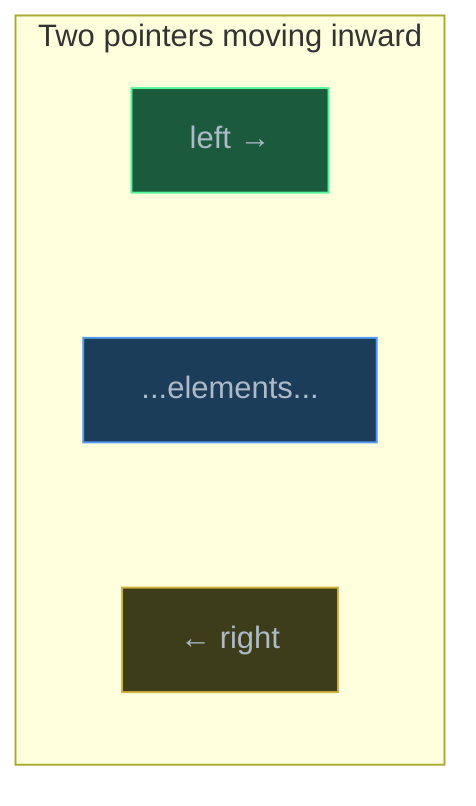
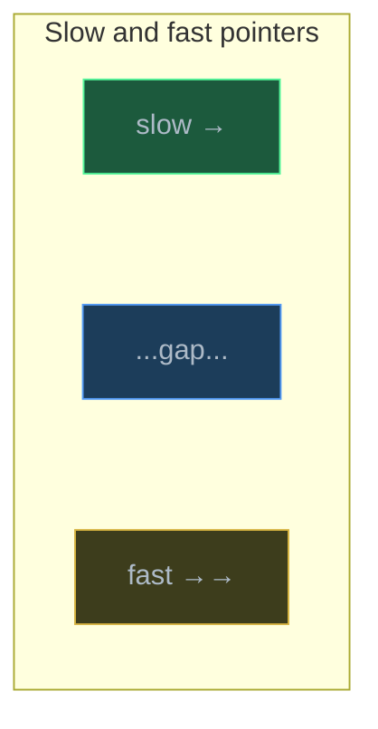
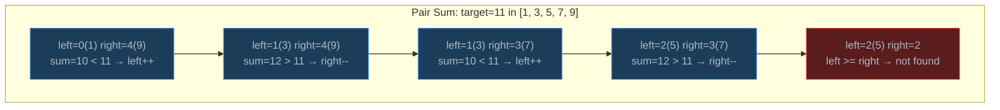
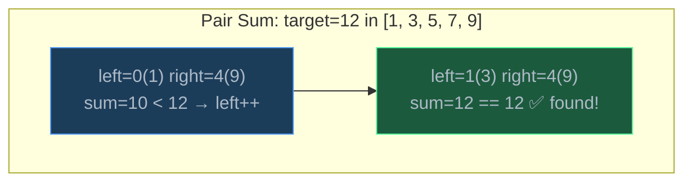
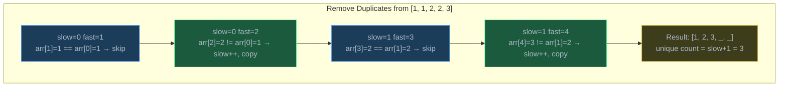
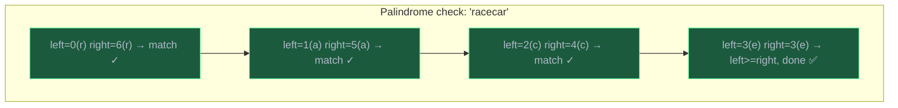
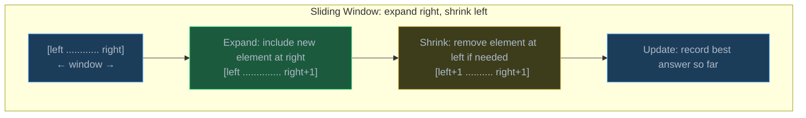
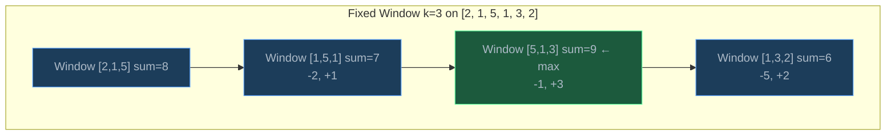

# Two Pointers and Sliding Window

> Two pointers and sliding window are array traversal patterns that replace brute-force nested loops with a single smart pass, transforming O(n^2) solutions into O(n) by maintaining state as pointers move through the data.

## Table of Contents
- [Core Concepts](#core-concepts)
- [Code Examples](#code-examples)
- [Common Pitfalls](#common-pitfalls)
- [Key Takeaways](#key-takeaways)
- [Exercises](#exercises)

## Core Concepts

### Two Pointer Technique

#### What

The two pointer technique uses two index variables that move through an array (or string) in a coordinated way to solve problems that would otherwise require nested loops. Instead of checking every pair of elements (O(n^2)), the pointers move based on conditions, ensuring each element is visited a bounded number of times.

There are two main flavors:
- **Opposite-direction pointers**: one starts at the beginning, one at the end, and they move inward toward each other.
- **Same-direction pointers** (slow/fast): both start near the beginning, but one moves ahead faster than the other.

#### How

The key idea is that pointer movement encodes decisions. Each step, you look at the elements under the pointers, decide which pointer to advance (and in which direction), and by the time the pointers meet or cross, you have examined all necessary combinations — without nested loops.

For opposite-direction pointers on a sorted array:



For same-direction pointers:



#### Why It Matters

Two pointers reduce time complexity from O(n^2) to O(n) for a broad class of problems — pair sums, palindrome checks, removing duplicates, merging sorted arrays, and partitioning. The technique works because the pointer movement rules guarantee that you skip combinations that can't possibly be the answer, without ever examining them. This is the same principle behind binary search (skipping half the data), but applied to traversal rather than search.

### Opposite-Direction Pointers

#### What

Place one pointer at the start (`left = 0`) and one at the end (`right = n - 1`). They move toward each other based on a condition, and the algorithm terminates when they meet or cross.

This pattern is natural for problems involving pairs from opposite ends of an array: finding a pair that sums to a target, checking palindromes, or maximizing a value that depends on the distance between two elements.

#### How

Example: **Pair sum in a sorted array**. Find two numbers that sum to a target.

- If `arr[left] + arr[right] == target`: found it.
- If the sum is too small: move `left` right (increase the smaller value).
- If the sum is too large: move `right` left (decrease the larger value).

Because the array is sorted, moving `left` right increases the sum, and moving `right` left decreases it. This gives you precise control over the sum.



Let's use target=12 instead, to show a successful case:



#### Why It Matters

The brute-force approach checks all O(n^2) pairs. Two pointers does it in O(n) by exploiting sorted order — each pointer movement provably eliminates an entire row or column of the pair-search space. The insight transfers to many problems: the "Container With Most Water" problem uses the same pattern, even though the logic for which pointer to move is different (move the shorter side).

### Same-Direction Pointers (Slow/Fast)

#### What

Both pointers start at or near the beginning. The "fast" pointer scans ahead, examining new elements. The "slow" pointer tracks the boundary of the result being built. The gap between them represents elements being processed or skipped.

This pattern is ideal for **in-place array transformations**: removing duplicates, partitioning elements, or moving specific values to the end.

#### How

Example: **Remove duplicates from a sorted array in-place**. Return the number of unique elements.

- `slow` points to the last unique element found.
- `fast` scans forward looking for the next different element.
- When `fast` finds a new value, advance `slow` and copy the value there.



#### Why It Matters

Same-direction pointers enable in-place transformations without extra memory. The slow pointer maintains the invariant "everything to the left is processed and correct," while the fast pointer does the scanning. This is a foundational pattern — it appears in quicksort's partition step, in the Dutch National Flag algorithm, and in any problem that asks you to rearrange elements in-place.

### Palindrome Checking with Two Pointers

#### What

A palindrome reads the same forward and backward. Two opposite-direction pointers — one at the start, one at the end — can check this in a single O(n) pass by comparing characters moving inward.

#### How

Compare `s[left]` and `s[right]`. If they match, move both pointers inward. If they don't match, it's not a palindrome. Continue until the pointers meet or cross.



#### Why It Matters

The naive approach — reversing the string and comparing — uses O(n) extra space. Two pointers check in O(n) time with O(1) space. More importantly, the two-pointer approach is easily extended: checking if a string is "almost a palindrome" (can become one by removing at most one character) is straightforward with two pointers but awkward with the reversal approach.

### Sliding Window Technique

#### What

The sliding window technique maintains a "window" — a contiguous subarray or substring — defined by two pointers (`left` and `right`). The right pointer expands the window to include new elements, and the left pointer shrinks it when a condition is violated or to find the optimal window size.

There are two variants:
- **Fixed-size window**: the window is always exactly k elements wide. As the right pointer advances, the left pointer advances in lockstep.
- **Variable-size window**: the window grows and shrinks dynamically based on a constraint (e.g., "sum must be ≥ target" or "no repeating characters").

#### How

The general pattern for variable-size sliding window:

```python
left = 0
for right in range(len(arr)):
    # 1. EXPAND: add arr[right] to window state
    # 2. SHRINK: while window violates constraint, remove arr[left] and left++
    # 3. UPDATE: record the answer (max/min window size, etc.)
```



Key insight: the left pointer only moves forward (never backward). Both left and right move across the array at most once each, so the total work is O(n) — not O(n^2).

#### Why It Matters

Sliding window is the go-to technique for subarray/substring optimization problems. The brute-force approach examines all O(n^2) subarrays. The sliding window examines each element at most twice (once when `right` includes it, once when `left` excludes it), giving O(n). The technique works because window state can be maintained incrementally — adding or removing one element at the boundary is O(1), instead of recomputing the entire window from scratch.

### Fixed-Size Sliding Window

#### What

When the problem specifies a window of exactly size k (e.g., "find the maximum sum of any k consecutive elements"), you use a fixed-size window. The window slides one position at a time: add the new element on the right, remove the old element on the left.

#### How

1. Compute the sum of the first k elements (the initial window).
2. Slide the window: add `arr[right]`, subtract `arr[left]`, advance both by 1.
3. Track the maximum (or minimum, or whatever the problem asks for).



#### Why It Matters

The brute-force approach recomputes the sum for every window from scratch: O(k) per window, O(n * k) total. The sliding window updates the sum incrementally in O(1) per step, giving O(n) total. This incremental update principle is the core of all sliding window techniques — you never recompute what you can update.

### Variable-Size Sliding Window

#### What

When the window size is not fixed but depends on a constraint (e.g., "find the smallest subarray whose sum is ≥ target"), you use a variable-size window. The right pointer expands the window until the constraint is met, then the left pointer shrinks it to find the optimal (smallest/largest) window.

#### How

The right pointer always moves forward, one step at a time. When the constraint is satisfied, try shrinking from the left to see if a smaller window still satisfies it. This "expand-then-shrink" pattern explores all valid windows without nested loops.

```mermaid
graph TD
    subgraph "Min subarray with sum ≥ 7 in [2, 3, 1, 2, 4, 3]"
        V0["right=0: [2] sum=2 < 7"]
        V1["right=1: [2,3] sum=5 < 7"]
        V2["right=2: [2,3,1] sum=6 < 7"]
        V3["right=3: [2,3,1,2] sum=8 ≥ 7\nwindow size=4, shrink left"]
        V4["shrink: [3,1,2] sum=6 < 7\nstop shrinking, continue right"]
        V5["right=4: [3,1,2,4] sum=10 ≥ 7\nwindow size=4, shrink left"]
        V6["shrink: [1,2,4] sum=7 ≥ 7\nwindow size=3, shrink"]
        V7["shrink: [2,4] sum=6 < 7\nstop, continue right"]
        V8["right=5: [2,4,3] sum=9 ≥ 7\nwindow size=3, shrink"]
        V9["shrink: [4,3] sum=7 ≥ 7\nwindow size=2 ← BEST"]
    end

    V0 --> V1 --> V2 --> V3 --> V4 --> V5 --> V6 --> V7 --> V8 --> V9

    style V0 fill:#1c3d5a,stroke:#539bf5,color:#adbac7
    style V1 fill:#1c3d5a,stroke:#539bf5,color:#adbac7
    style V2 fill:#1c3d5a,stroke:#539bf5,color:#adbac7
    style V3 fill:#3d3d1c,stroke:#d6b340,color:#adbac7
    style V4 fill:#5a1c1c,stroke:#f55353,color:#adbac7
    style V5 fill:#3d3d1c,stroke:#d6b340,color:#adbac7
    style V6 fill:#3d3d1c,stroke:#d6b340,color:#adbac7
    style V7 fill:#5a1c1c,stroke:#f55353,color:#adbac7
    style V8 fill:#3d3d1c,stroke:#d6b340,color:#adbac7
    style V9 fill:#1c5a3d,stroke:#53f599,color:#adbac7
```



#### Why It Matters

Variable-size sliding window is one of the most versatile algorithmic techniques. It solves problems like "longest substring without repeating characters," "smallest subarray with sum ≥ target," and "longest substring with at most k distinct characters" — all in O(n). The key requirement is that the constraint must be monotonic: expanding the window can only make the constraint more likely to be violated (or satisfied), not both. This monotonicity is what allows the left pointer to only move forward.

## Code Examples

### Brute-Force Pair Sum vs Two-Pointer Pair Sum

```python
def pair_sum_brute_force(arr: list[int], target: int) -> tuple[int, int] | None:
    """Find two elements that sum to target — brute force.

    Check every pair. O(n^2) time.
    """
    n: int = len(arr)
    for i in range(n):
        for j in range(i + 1, n):
            if arr[i] + arr[j] == target:
                return (i, j)
    return None


def pair_sum_two_pointers(arr: list[int], target: int) -> tuple[int, int] | None:
    """Find two elements that sum to target — two pointers.

    Requires arr to be sorted. O(n) time.

    The insight: if the current sum is too small, the only way to
    increase it is to move the left pointer right (larger value).
    If the sum is too large, move the right pointer left (smaller value).
    Each step eliminates at least one candidate pair.
    """
    left: int = 0
    right: int = len(arr) - 1

    while left < right:
        current_sum: int = arr[left] + arr[right]

        if current_sum == target:
            return (left, right)
        elif current_sum < target:
            left += 1    # need a larger sum → increase left value
        else:
            right -= 1   # need a smaller sum → decrease right value

    return None


# Demo — compare both approaches
sorted_arr = [1, 3, 5, 7, 9, 11, 15]
target = 16

print(f"Brute force: {pair_sum_brute_force(sorted_arr, target)}")
# (1, 5) → arr[1]=3 + arr[5]=11 = 14... let's check
# Actually: (0, 6) → 1+15=16 ✓

print(f"Two pointers: {pair_sum_two_pointers(sorted_arr, target)}")
# (0, 6) → 1+15=16 ✓
```

**Time**: Brute force is O(n^2) — two nested loops. Two pointers is O(n) — each pointer moves at most n steps total.
**Space**: O(1) for both — only index variables.

### Container With Most Water

```python
def max_water_brute_force(heights: list[int]) -> int:
    """Find the maximum water area between two vertical lines — brute force.

    Area = min(height[i], height[j]) × (j - i)
    Check all pairs: O(n^2).
    """
    n: int = len(heights)
    max_area: int = 0

    for i in range(n):
        for j in range(i + 1, n):
            width: int = j - i
            height: int = min(heights[i], heights[j])
            max_area = max(max_area, width * height)

    return max_area


def max_water_two_pointers(heights: list[int]) -> int:
    """Find the maximum water area — two pointer approach.

    Start with the widest container (left=0, right=n-1).
    The width can only decrease from here, so the only way to find
    a larger area is to find a taller height.

    Key insight: always move the pointer with the SHORTER height.
    Why? The area is limited by the shorter side. Moving the taller
    side can never increase the area (the height is still limited by
    the shorter side, and the width decreases). Moving the shorter
    side MIGHT find a taller line that increases the area.
    """
    left: int = 0
    right: int = len(heights) - 1
    max_area: int = 0

    while left < right:
        width: int = right - left
        height: int = min(heights[left], heights[right])
        area: int = width * height
        max_area = max(max_area, area)

        # Move the shorter side — the only way to potentially increase area
        if heights[left] < heights[right]:
            left += 1
        else:
            right -= 1

    return max_area


# Demo
heights = [1, 8, 6, 2, 5, 4, 8, 3, 7]
print(f"Brute force: {max_water_brute_force(heights)}")    # 49
print(f"Two pointers: {max_water_two_pointers(heights)}")  # 49
# Best container: heights[1]=8 and heights[8]=7, width=7, area=7×7=49
```

**Time**: Brute force is O(n^2). Two pointers is O(n) — each pointer moves at most n times.
**Space**: O(1) for both.

### Remove Duplicates from Sorted Array (In-Place)

```python
def remove_duplicates(arr: list[int]) -> int:
    """Remove duplicates from a sorted array in-place.

    Uses slow/fast pointers. The slow pointer marks the boundary
    of unique elements. The fast pointer scans for the next new value.

    Returns the count of unique elements. The first `count` elements
    of arr contain the unique values in sorted order.

    Modifies arr in-place — no extra array allocated.
    """
    if not arr:
        return 0

    # slow points to the last unique element placed
    slow: int = 0

    for fast in range(1, len(arr)):
        if arr[fast] != arr[slow]:
            # Found a new unique value — advance slow and place it
            slow += 1
            arr[slow] = arr[fast]

    # Number of unique elements = slow + 1
    return slow + 1


# Demo
data = [1, 1, 2, 2, 2, 3, 4, 4, 5]
print(f"Before: {data}")
unique_count = remove_duplicates(data)
print(f"After: {data[:unique_count]} (count={unique_count})")
# After: [1, 2, 3, 4, 5] (count=5)
```

**Time**: O(n) — `fast` visits each element exactly once.
**Space**: O(1) — modification is in-place, only two integer pointers.

### Palindrome Check

```python
def is_palindrome(s: str) -> bool:
    """Check if a string is a palindrome using two pointers.

    Compares characters from outside in. O(n) time, O(1) space.
    """
    left: int = 0
    right: int = len(s) - 1

    while left < right:
        if s[left] != s[right]:
            return False
        left += 1
        right -= 1

    return True


def is_palindrome_alphanumeric(s: str) -> bool:
    """Check if a string is a palindrome, ignoring non-alphanumeric characters.

    More realistic version — handles "A man, a plan, a canal: Panama".
    Two pointers skip non-alphanumeric characters.
    """
    left: int = 0
    right: int = len(s) - 1

    while left < right:
        # Skip non-alphanumeric from the left
        while left < right and not s[left].isalnum():
            left += 1
        # Skip non-alphanumeric from the right
        while left < right and not s[right].isalnum():
            right -= 1

        if s[left].lower() != s[right].lower():
            return False

        left += 1
        right -= 1

    return True


# Demo
print(f"'racecar': {is_palindrome('racecar')}")          # True
print(f"'hello': {is_palindrome('hello')}")               # False
print(f"'A man, a plan, a canal: Panama': "
      f"{is_palindrome_alphanumeric('A man, a plan, a canal: Panama')}")  # True
```

**Time**: O(n) — each pointer moves at most n/2 steps.
**Space**: O(1) — only two integer variables. No reversed copy of the string needed.

### Brute-Force vs Sliding Window: Maximum Sum Subarray of Size K

```python
def max_sum_brute_force(arr: list[int], k: int) -> int:
    """Find max sum of any k consecutive elements — brute force.

    For each starting position, compute the sum of k elements.
    Recomputes the entire sum for each window: O(n × k).
    """
    n: int = len(arr)
    if n < k:
        return 0

    max_sum: int = sum(arr[:k])

    for i in range(1, n - k + 1):
        # Recompute sum from scratch — wasteful!
        window_sum: int = sum(arr[i:i + k])
        max_sum = max(max_sum, window_sum)

    return max_sum


def max_sum_sliding_window(arr: list[int], k: int) -> int:
    """Find max sum of any k consecutive elements — sliding window.

    Instead of recomputing the sum, update it incrementally:
    subtract the element leaving the window, add the element entering.
    O(n) time — each element is added and removed exactly once.
    """
    n: int = len(arr)
    if n < k:
        return 0

    # Compute sum of the first window
    window_sum: int = sum(arr[:k])
    max_sum: int = window_sum

    # Slide the window: remove left element, add right element
    for right in range(k, n):
        window_sum += arr[right]         # add new element entering window
        window_sum -= arr[right - k]     # remove element leaving window
        max_sum = max(max_sum, window_sum)

    return max_sum


# Demo
data = [2, 1, 5, 1, 3, 2]
k = 3
print(f"Brute force: max sum of {k} elements = {max_sum_brute_force(data, k)}")    # 9
print(f"Sliding window: max sum of {k} elements = {max_sum_sliding_window(data, k)}")  # 9
# Best window: [5, 1, 3] = 9
```

**Time**: Brute force is O(n * k) — recomputes sum for each window. Sliding window is O(n) — each element is added once and removed once.
**Space**: O(1) for both — only a running sum and max tracker.

### Smallest Subarray with Sum at Least Target

```python
def min_subarray_brute_force(arr: list[int], target: int) -> int:
    """Find the smallest subarray with sum >= target — brute force.

    Check all subarrays, O(n^2).
    """
    n: int = len(arr)
    min_len: int = n + 1  # impossible length as sentinel

    for i in range(n):
        current_sum: int = 0
        for j in range(i, n):
            current_sum += arr[j]
            if current_sum >= target:
                min_len = min(min_len, j - i + 1)
                break  # no need to extend further from this i

    return min_len if min_len <= n else 0


def min_subarray_sliding_window(arr: list[int], target: int) -> int:
    """Find the smallest subarray with sum >= target — sliding window.

    Variable-size window: expand right until sum >= target,
    then shrink from left to minimize window size.

    Each element is added at most once (by right) and removed at most
    once (by left), so total work is O(n).
    """
    n: int = len(arr)
    min_len: int = n + 1
    window_sum: int = 0
    left: int = 0

    for right in range(n):
        # EXPAND: add new element to window
        window_sum += arr[right]

        # SHRINK: while constraint is satisfied, try smaller window
        while window_sum >= target:
            min_len = min(min_len, right - left + 1)
            window_sum -= arr[left]
            left += 1

    return min_len if min_len <= n else 0


# Demo
data = [2, 3, 1, 2, 4, 3]
target = 7
print(f"Brute force: min length = {min_subarray_brute_force(data, target)}")         # 2
print(f"Sliding window: min length = {min_subarray_sliding_window(data, target)}")   # 2
# Best subarray: [4, 3] = 7, length 2
```

**Time**: Brute force is O(n^2). Sliding window is O(n) — `left` and `right` each advance across the array at most once, for a total of at most 2n pointer movements.
**Space**: O(1) for both.

### Longest Substring Without Repeating Characters

```python
def longest_unique_brute_force(s: str) -> int:
    """Find length of longest substring with all unique characters — brute force.

    Check every substring, verify uniqueness with a set. O(n^3) worst case
    (O(n^2) substrings, each checked in O(n)).
    """
    n: int = len(s)
    max_len: int = 0

    for i in range(n):
        seen: set[str] = set()
        for j in range(i, n):
            if s[j] in seen:
                break
            seen.add(s[j])
            max_len = max(max_len, j - i + 1)

    return max_len


def longest_unique_sliding_window(s: str) -> int:
    """Find length of longest substring with all unique characters — sliding window.

    Use a set to track characters in the current window.
    When a duplicate is found, shrink from the left until the
    duplicate is removed.

    Why this works: we want the longest window with no repeats.
    Expanding right adds characters. When we hit a repeat, we must
    shrink from the left until the repeated character is gone.
    The window always contains unique characters.
    """
    char_set: set[str] = set()
    max_len: int = 0
    left: int = 0

    for right in range(len(s)):
        # SHRINK: if s[right] is already in window, remove from left
        while s[right] in char_set:
            char_set.remove(s[left])
            left += 1

        # EXPAND: add the new character
        char_set.add(s[right])

        # UPDATE: check if this is the longest valid window
        max_len = max(max_len, right - left + 1)

    return max_len


def longest_unique_optimized(s: str) -> int:
    """Find length of longest substring with all unique characters — optimized.

    Uses a dict mapping characters to their last seen index.
    When a repeat is found, jump left directly to one past the
    previous occurrence — no need to remove characters one by one.

    This is O(n) with a single pass and no inner while loop.
    """
    last_seen: dict[str, int] = {}
    max_len: int = 0
    left: int = 0

    for right in range(len(s)):
        if s[right] in last_seen and last_seen[s[right]] >= left:
            # Character was seen within the current window — jump left past it
            left = last_seen[s[right]] + 1

        last_seen[s[right]] = right
        max_len = max(max_len, right - left + 1)

    return max_len


# Demo
test_strings = ["abcabcbb", "bbbbb", "pwwkew", ""]

for s in test_strings:
    bf = longest_unique_brute_force(s)
    sw = longest_unique_sliding_window(s)
    opt = longest_unique_optimized(s)
    print(f"'{s}': brute={bf}, sliding_window={sw}, optimized={opt}")

# 'abcabcbb': 3 (abc)
# 'bbbbb': 1 (b)
# 'pwwkew': 3 (wke)
# '': 0
```

**Time**: Brute force is O(n^2) (with the `break` optimization; O(n^3) without it). Sliding window with set is O(n) — each character is added and removed at most once. Optimized with dict is O(n) — single pass, no inner loop.
**Space**: O(min(n, m)) where m is the character set size (26 for lowercase letters, 128 for ASCII). The set/dict stores at most one entry per unique character in the current window.

### Two Pointers vs Hash Map: Pair Sum Trade-offs

```python
def pair_sum_hash(arr: list[int], target: int) -> tuple[int, int] | None:
    """Find two elements summing to target using a hash map.

    Works on UNSORTED arrays. O(n) time, O(n) space.
    For each element, check if (target - element) was seen before.
    """
    seen: dict[int, int] = {}  # value → index

    for i, num in enumerate(arr):
        complement: int = target - num
        if complement in seen:
            return (seen[complement], i)
        seen[num] = i

    return None


# Demo — unsorted array, hash map approach works
unsorted = [11, 7, 3, 15, 1, 9]
print(f"Hash map on unsorted: {pair_sum_hash(unsorted, 10)}")  # (1, 2) → 7+3=10

# For sorted arrays, two pointers uses O(1) space vs O(n) for hash map.
# For unsorted arrays, hash map is the only O(n) option (two pointers requires sorting first).
sorted_arr = sorted(unsorted)
print(f"Two pointers on sorted: {pair_sum_two_pointers(sorted_arr, 10)}")
```

**Time**: Hash map is O(n). Two pointers is O(n) but requires sorted input (sorting is O(n log n) if not already sorted).
**Space**: Hash map uses O(n). Two pointers uses O(1). Choose based on whether the data is already sorted and whether space matters.

## Common Pitfalls

### Pitfall 1: Forgetting That Two Pointers Requires Sorted Data

```python
# BAD — applying opposite-direction two pointers to unsorted data
def pair_sum_wrong(arr: list[int], target: int) -> tuple[int, int] | None:
    left, right = 0, len(arr) - 1
    while left < right:
        s = arr[left] + arr[right]
        if s == target:
            return (left, right)
        elif s < target:
            left += 1   # assumes left side has smaller values — NOT TRUE for unsorted!
        else:
            right -= 1
    return None

# pair_sum_wrong([5, 1, 9, 3, 7], 8) → might miss (1, 3) → 1+7=8
# The logic "sum too small → move left" only works if left side has smaller values.


# GOOD — sort first, or use a hash map for unsorted data
def pair_sum_correct(arr: list[int], target: int) -> tuple[int, int] | None:
    # Option 1: sort first (loses original indices)
    sorted_arr = sorted(arr)
    left, right = 0, len(sorted_arr) - 1
    while left < right:
        s = sorted_arr[left] + sorted_arr[right]
        if s == target:
            return (left, right)
        elif s < target:
            left += 1
        else:
            right -= 1
    return None

    # Option 2: use hash map (preserves indices, works unsorted)
    # seen = {}
    # for i, num in enumerate(arr):
    #     if target - num in seen:
    #         return (seen[target - num], i)
    #     seen[num] = i
    # return None
```

Why it's wrong: The two-pointer pair sum technique relies on sorted order. When the sum is too small, moving the left pointer right works because `arr[left + 1] >= arr[left]` in a sorted array. In an unsorted array, `arr[left + 1]` could be anything — the movement has no guaranteed effect on the sum.

### Pitfall 2: Not Shrinking the Window Enough

```python
# BAD — only shrinking once when constraint is met
def min_subarray_wrong(arr: list[int], target: int) -> int:
    min_len = len(arr) + 1
    window_sum = 0
    left = 0
    for right in range(len(arr)):
        window_sum += arr[right]
        if window_sum >= target:          # should be WHILE, not IF
            min_len = min(min_len, right - left + 1)
            window_sum -= arr[left]
            left += 1
    return min_len if min_len <= len(arr) else 0

# Misses smaller valid windows because it only shrinks once per right step.
# Example: [1, 1, 1, 100, 1, 1], target=100
# When right hits 100, sum=103. IF removes one 1, but the best window is [100] alone.


# GOOD — use WHILE to shrink as much as possible
def min_subarray_correct(arr: list[int], target: int) -> int:
    min_len = len(arr) + 1
    window_sum = 0
    left = 0
    for right in range(len(arr)):
        window_sum += arr[right]
        while window_sum >= target:       # keep shrinking until constraint breaks
            min_len = min(min_len, right - left + 1)
            window_sum -= arr[left]
            left += 1
    return min_len if min_len <= len(arr) else 0
```

Why it's wrong: Using `if` instead of `while` means you only shrink the window by one element, even when multiple elements could be removed. The correct approach is `while` — keep shrinking the window as long as the constraint is still satisfied. This is the only way to find the minimum window size.

### Pitfall 3: Modifying the Set While Iterating in Sliding Window

```python
# BAD — adding to the set before checking for duplicates
def longest_unique_wrong(s: str) -> int:
    char_set: set[str] = set()
    max_len = 0
    left = 0
    for right in range(len(s)):
        char_set.add(s[right])  # add BEFORE checking — now the "duplicate" is already in the set!
        while s[right] in char_set and len(char_set) > right - left + 1:
            char_set.remove(s[left])
            left += 1
        max_len = max(max_len, right - left + 1)
    return max_len
# This is confusing and error-prone — the logic is tangled.


# GOOD — check/remove BEFORE adding
def longest_unique_correct(s: str) -> int:
    char_set: set[str] = set()
    max_len = 0
    left = 0
    for right in range(len(s)):
        while s[right] in char_set:       # shrink until duplicate is gone
            char_set.remove(s[left])
            left += 1
        char_set.add(s[right])            # THEN add the new character
        max_len = max(max_len, right - left + 1)
    return max_len
```

Why it's wrong: The order of operations in sliding window matters. If you add the new character to the set first, it's already in the set when you check for duplicates, causing incorrect behavior. The correct pattern is: (1) shrink from the left until the window is valid, (2) add the new element, (3) update the answer.

### Pitfall 4: Off-by-One in Window Size Calculation

```python
# BAD — wrong window size calculation
left, right = 2, 5
window_size = right - left  # gives 3, but the window [2,3,4,5] has 4 elements!

# GOOD — window size is right - left + 1 (inclusive on both ends)
window_size = right - left + 1  # gives 4 ✓
```

Why it's wrong: When both `left` and `right` are inclusive indices (which is the standard convention), the number of elements in the window is `right - left + 1`, not `right - left`. This is the fencepost problem — if you have fence posts at positions 2, 3, 4, and 5, there are 4 posts but only 3 gaps between them. Count the posts (elements), not the gaps.

## Key Takeaways

- **Two pointers** eliminate nested loops by encoding decisions in pointer movement. Opposite-direction pointers shrink the search space from both ends. Same-direction (slow/fast) pointers build results in-place by scanning ahead and placing elements behind.
- **Sliding window** maintains a contiguous subarray/substring incrementally — add one element on the right, remove one on the left — avoiding the O(n * k) cost of recomputing from scratch. Fixed-size windows slide in lockstep; variable-size windows expand and shrink based on a constraint.
- Both techniques achieve **O(n) time** by ensuring each element is processed at most twice (once by each pointer). The total pointer movement across the entire algorithm is at most 2n.
- The **brute-force to optimized progression** is the same for nearly every problem in this category: start with O(n^2) nested loops, then recognize that pointer movement can skip impossible combinations, reducing to O(n).
- **Variable-size sliding window** requires a `while` loop for shrinking (not `if`) — you must shrink as far as possible to find the optimal window. This is the most common bug in sliding window implementations.

## Exercises

1. **Write a function** `three_sum(arr: list[int], target: int) -> list[tuple[int, int, int]]` that finds all unique triplets summing to `target`. Use sorting + two pointers as the inner loop to achieve O(n^2) instead of the brute-force O(n^3). Handle duplicate triplets correctly.

2. **Write a function** `move_zeroes(arr: list[int]) -> None` that moves all zeroes in `arr` to the end while maintaining the relative order of non-zero elements. Do it in-place using the slow/fast pointer technique. For example, `[0, 1, 0, 3, 12]` becomes `[1, 3, 12, 0, 0]`. Analyze time and space complexity.

3. **Explain** why the sliding window technique for "longest substring without repeating characters" is O(n) even though it has a `while` loop inside a `for` loop. Specifically, what is the maximum total number of times the left pointer can advance across the entire execution?

4. **Write a function** `max_consecutive_ones(arr: list[int], k: int) -> int` that finds the length of the longest subarray of 1s after flipping at most `k` zeroes. Use the sliding window technique. For example, `max_consecutive_ones([1,1,0,0,1,1,1,0,1,1], 2)` returns 7 (flip the zeros at indices 2 and 7, giving `[1,1,1,0,1,1,1,1,1,1]` — wait, that's flipping indices 3 and 7 for the longest run). Hint: track the number of zeroes in the current window.

5. **Write a function** `longest_substring_k_distinct(s: str, k: int) -> int` that finds the length of the longest substring containing at most `k` distinct characters. Use a variable-size sliding window with a dictionary to track character counts. For example, `longest_substring_k_distinct("araaci", 2)` returns 4 (`"araa"`). What is the time and space complexity?

---
up:: [Schedule](../../Schedule.md)
#type/learning #source/self-study #status/seed
