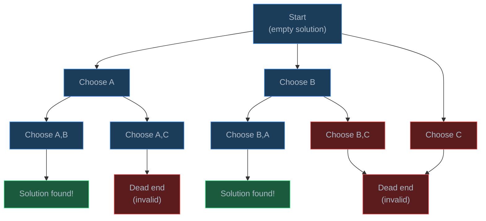
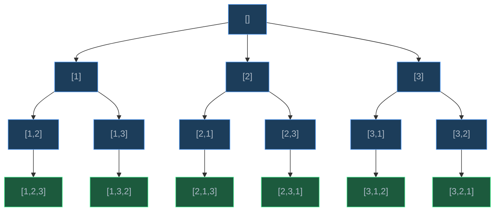
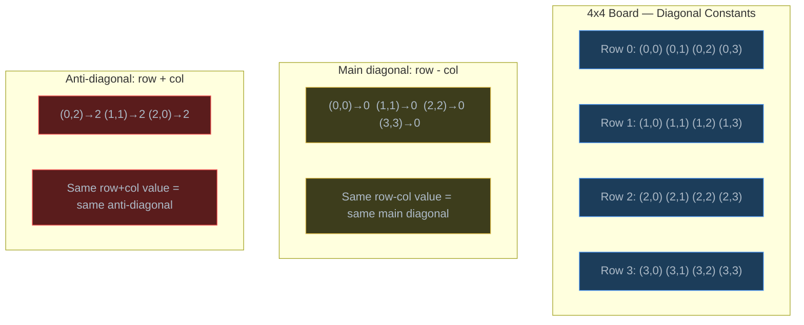

# Backtracking

> Backtracking is a systematic way to explore all possible solutions by making choices, and undoing ("backtracking") those choices when they lead to dead ends.

## Table of Contents
- [Core Concepts](#core-concepts)
- [Code Examples](#code-examples)
- [Common Pitfalls](#common-pitfalls)
- [Key Takeaways](#key-takeaways)
- [Exercises](#exercises)

## Core Concepts

### The Choose-Explore-Unchoose Pattern

#### What

Backtracking is a refined form of brute-force search. Instead of generating all possible solutions and then checking which ones are valid, backtracking builds solutions incrementally and **abandons a partial solution as soon as it determines that the solution cannot be completed successfully**. The core pattern is:

1. **Choose** — make a decision (pick an element, place a piece, assign a value)
2. **Explore** — recursively continue building the solution with this choice
3. **Unchoose** — undo the decision and try the next option

```
def backtrack(state, choices):
    if is_solution(state):
        record(state)
        return

    for choice in choices:
        if is_valid(choice, state):
            make_choice(choice, state)       # choose
            backtrack(state, next_choices)    # explore
            undo_choice(choice, state)        # unchoose
```

#### How

Think of backtracking as exploring a tree of decisions. Each node represents a partial solution. Each branch represents a choice you can make. Leaf nodes are either valid solutions or dead ends.



When the algorithm reaches a dead end (red node), it **backtracks** — returns to the previous decision point and tries the next option. When it finds a valid solution (green node), it records it and may continue searching for more solutions.

#### Why It Matters

Backtracking is the general algorithm for **constraint satisfaction problems** — problems where you need to find arrangements that satisfy a set of rules. N-Queens, Sudoku, crossword puzzles, scheduling, graph coloring, and combinatorial generation (permutations, combinations, subsets) are all backtracking problems.

The key advantage over brute force is **early termination**. If placing a queen on row 2 already conflicts with the queen on row 1, there's no point exploring any arrangement that builds on this placement. Brute force would generate all n! arrangements and check each one; backtracking prunes entire subtrees of the search space.

### Pruning: Cutting Bad Branches Early

#### What

**Pruning** is the process of eliminating parts of the search space that cannot lead to valid solutions. Instead of exploring every branch of the decision tree, you check constraints *before* making a choice and skip choices that violate constraints.

#### How

Pruning happens in the `is_valid()` check before the recursive call. The earlier you can detect that a choice leads to a dead end, the more work you save.

```python
for choice in choices:
    if is_valid(choice, state):     # ← pruning happens here
        make_choice(choice, state)
        backtrack(state, choices)
        undo_choice(choice, state)
```

Without pruning, backtracking degenerates into exhaustive brute force. With good pruning, it can solve problems that are theoretically exponential in reasonable time for practical input sizes.

Consider N-Queens: without pruning, you'd try all n^n ways to place n queens on n columns (one per row). With column/diagonal conflict checking, the actual number of nodes explored is dramatically smaller.

#### Why It Matters

The effectiveness of a backtracking solution depends almost entirely on the quality of its pruning. Two backtracking solutions for the same problem can differ by orders of magnitude in performance based on:

1. **Constraint checking order** — check the most restrictive constraints first
2. **Variable ordering** — choose the variable with the fewest remaining options first (MRV heuristic)
3. **Value ordering** — try the most promising values first

In competitive programming and interviews, the difference between TLE (Time Limit Exceeded) and AC (Accepted) is often adding one clever pruning condition.

### When to Use Backtracking

#### What

Backtracking is the right approach when:

- You need to find **all solutions** (or count them, or find the best one)
- The problem has **constraints** that can eliminate partial solutions early
- The search space is structured as a **decision tree** (sequence of choices)
- Each choice is **reversible** (you can undo it and try another)

Common problem types:

| Problem Type | Example |
| --- | --- |
| Constraint satisfaction | N-Queens, Sudoku, graph coloring |
| Combinatorial generation | Permutations, combinations, subsets |
| Path finding with constraints | Maze solving, word search in grid |
| Optimization under constraints | Knapsack (find all valid packings) |

#### How

Recognize a backtracking problem by these signals:

1. The problem asks for "all possible," "generate all," "find every," or "can you make"
2. There are rules about what's allowed at each step
3. The solution is built incrementally — one decision at a time
4. The number of possible solutions is exponential, but constraints reduce the search space

#### Why It Matters

Knowing when to reach for backtracking saves you from overcomplicating problems. If a problem can be solved greedily or with DP, backtracking is overkill. But if you need to explore all valid configurations subject to constraints, backtracking is the canonical approach. It's also the foundation for more advanced techniques like branch-and-bound (used in optimization) and constraint propagation (used in AI).

### Time Complexity of Backtracking

#### What

Backtracking algorithms typically have **exponential** time complexity in the worst case. The exact complexity depends on the branching factor (how many choices at each step) and the depth of the decision tree.

#### How

| Problem | Branching Factor | Depth | Worst-Case Time |
| --- | --- | --- | --- |
| Permutations of n | n, n-1, ..., 1 | n | O(n!) |
| Subsets of n | 2 (include or exclude) | n | O(2^n) |
| N-Queens | up to n per row | n | O(n!) |
| Sudoku (9x9) | up to 9 per cell | 81 | O(9^81) theoretical |

In practice, pruning dramatically reduces these numbers. For N-Queens, the 8-queens problem has 8! = 40,320 possible arrangements without pruning, but with column and diagonal checks, only 15,720 nodes are explored to find all 92 solutions.

#### Why It Matters

Understanding that backtracking is inherently exponential tells you two things:

1. **Don't expect polynomial time** — if someone asks you to solve N-Queens in O(n^2), you can't. The number of solutions itself grows exponentially.
2. **Pruning is everything** — the practical performance depends on how much of the search space you can eliminate. Always look for additional constraints to prune.

For interview problems, stating the time complexity as "O(branching^depth) before pruning" is acceptable. Precise analysis of pruned backtracking is usually intractable.

## Code Examples

### Backtracking Template

```python
def backtrack_template(
    result: list[list[int]],
    current: list[int],
    choices: list[int],
    start: int = 0,
) -> None:
    """General backtracking template.

    This is the skeleton that most backtracking problems follow.
    Customize is_solution(), is_valid(), and the choice iteration
    for your specific problem.
    """
    # Base case: current state is a complete solution
    if is_solution(current):
        result.append(current[:])  # append a COPY
        return

    for i in range(start, len(choices)):
        choice = choices[i]

        # Pruning: skip invalid choices
        if not is_valid(choice, current):
            continue

        # Choose
        current.append(choice)

        # Explore (recurse)
        backtrack_template(result, current, choices, i + 1)

        # Unchoose (backtrack)
        current.pop()
```

### Generating All Permutations

```python
def permutations(nums: list[int]) -> list[list[int]]:
    """Generate all permutations of a list of distinct integers.

    A permutation is an ordering of all elements. For [1,2,3],
    there are 3! = 6 permutations.

    Strategy: at each position, choose one of the remaining unused elements.
    """
    result: list[list[int]] = []
    used: list[bool] = [False] * len(nums)

    def backtrack(current: list[int]) -> None:
        # Base case: permutation is complete when it has all elements
        if len(current) == len(nums):
            result.append(current[:])  # copy — current will be modified later
            return

        for i in range(len(nums)):
            if used[i]:
                continue  # skip already-used elements

            # Choose
            used[i] = True
            current.append(nums[i])

            # Explore
            backtrack(current)

            # Unchoose
            current.pop()
            used[i] = False

    backtrack([])
    return result


# Test
print(permutations([1, 2, 3]))
# [[1,2,3], [1,3,2], [2,1,3], [2,3,1], [3,1,2], [3,2,1]]
```

**Time**: O(n! * n) — there are n! permutations, and copying each one takes O(n).
**Space**: O(n) for the recursion stack and `current` list (excluding the output).

The decision tree for `permutations([1, 2, 3])`:



### Generating All Combinations

```python
def combinations(nums: list[int], k: int) -> list[list[int]]:
    """Generate all combinations of k elements from nums.

    A combination is a selection where order doesn't matter.
    C(n, k) = n! / (k! * (n-k)!)

    Key difference from permutations: we use a 'start' index to avoid
    picking earlier elements (which would create duplicate sets).
    """
    result: list[list[int]] = []

    def backtrack(start: int, current: list[int]) -> None:
        # Base case: combination is complete
        if len(current) == k:
            result.append(current[:])
            return

        # Pruning: if remaining elements aren't enough to fill k slots, stop
        remaining = len(nums) - start
        needed = k - len(current)
        if remaining < needed:
            return  # not enough elements left — prune this branch

        for i in range(start, len(nums)):
            # Choose
            current.append(nums[i])

            # Explore — start from i+1 to avoid duplicates
            backtrack(i + 1, current)

            # Unchoose
            current.pop()

    backtrack(0, [])
    return result


# Test
print(combinations([1, 2, 3, 4], 2))
# [[1,2], [1,3], [1,4], [2,3], [2,4], [3,4]]
```

**Time**: O(C(n,k) * k) — there are C(n,k) combinations, copying each takes O(k).
**Space**: O(k) for the recursion stack depth and `current` list (excluding output).

### Generating All Subsets (Power Set)

```python
def subsets(nums: list[int]) -> list[list[int]]:
    """Generate all subsets (the power set) of nums.

    Each element has two choices: include it or exclude it.
    For n elements, there are 2^n subsets.
    """
    result: list[list[int]] = []

    def backtrack(index: int, current: list[int]) -> None:
        # Every state is a valid subset (not just leaf nodes)
        result.append(current[:])

        for i in range(index, len(nums)):
            # Choose: include nums[i]
            current.append(nums[i])

            # Explore: consider elements after i
            backtrack(i + 1, current)

            # Unchoose: exclude nums[i]
            current.pop()

    backtrack(0, [])
    return result


# Test
print(subsets([1, 2, 3]))
# [[], [1], [1,2], [1,2,3], [1,3], [2], [2,3], [3]]
```

**Time**: O(2^n * n) — 2^n subsets, each copied in O(n).
**Space**: O(n) recursion depth (excluding output).

### N-Queens Problem

```python
def solve_n_queens(n: int) -> list[list[str]]:
    """Find all valid placements of n queens on an n x n chessboard.

    Constraint: no two queens can attack each other — they cannot share
    the same row, column, or diagonal.

    Strategy: place one queen per row (eliminates row conflicts by design).
    For each row, try each column. Check column and diagonal conflicts
    using sets for O(1) lookup.
    """
    result: list[list[str]] = []

    # Track which columns and diagonals are under attack
    cols: set[int] = set()          # columns with a queen
    diag1: set[int] = set()         # main diagonals (row - col is constant)
    diag2: set[int] = set()         # anti-diagonals (row + col is constant)

    # queens[row] = col where the queen is placed in that row
    queens: list[int] = [-1] * n

    def backtrack(row: int) -> None:
        # Base case: all queens placed successfully
        if row == n:
            # Build the board representation
            board: list[str] = []
            for r in range(n):
                line = "." * queens[r] + "Q" + "." * (n - queens[r] - 1)
                board.append(line)
            result.append(board)
            return

        for col in range(n):
            # Pruning: skip if column or either diagonal is under attack
            if col in cols or (row - col) in diag1 or (row + col) in diag2:
                continue

            # Choose: place queen at (row, col)
            queens[row] = col
            cols.add(col)
            diag1.add(row - col)
            diag2.add(row + col)

            # Explore: place queen in the next row
            backtrack(row + 1)

            # Unchoose: remove queen from (row, col)
            queens[row] = -1
            cols.remove(col)
            diag1.remove(row - col)
            diag2.remove(row + col)

    backtrack(0)
    return result


# Test: 4-Queens
solutions = solve_n_queens(4)
print(f"Number of solutions for 4-Queens: {len(solutions)}")
for i, board in enumerate(solutions):
    print(f"\nSolution {i + 1}:")
    for row in board:
        print(f"  {row}")
```

**Time**: O(n!) — in the first row we try n columns, in the second at most n-1 (one column taken), etc. Pruning via diagonal checks reduces this further in practice.
**Space**: O(n) — recursion depth is n, plus the sets store at most n entries each.

How the diagonal check works:



Two cells are on the same main diagonal if `row - col` is equal. Two cells are on the same anti-diagonal if `row + col` is equal. This gives us O(1) conflict detection using sets.

### Sudoku Solver

```python
def solve_sudoku(board: list[list[int]]) -> bool:
    """Solve a 9x9 Sudoku puzzle in-place using backtracking.

    Empty cells are represented by 0.
    Rules: each row, column, and 3x3 box must contain digits 1-9 exactly once.

    Strategy: find the first empty cell, try digits 1-9, and check validity.
    If a digit is valid, place it and recurse. If no digit works, backtrack.
    """

    def is_valid(row: int, col: int, num: int) -> bool:
        """Check if placing num at (row, col) violates Sudoku rules."""
        # Check row — no duplicate in the same row
        for j in range(9):
            if board[row][j] == num:
                return False

        # Check column — no duplicate in the same column
        for i in range(9):
            if board[i][col] == num:
                return False

        # Check 3x3 box — find the top-left corner of the box
        box_row, box_col = 3 * (row // 3), 3 * (col // 3)
        for i in range(box_row, box_row + 3):
            for j in range(box_col, box_col + 3):
                if board[i][j] == num:
                    return False

        return True

    def find_empty() -> tuple[int, int] | None:
        """Find the next empty cell (value 0). Returns (row, col) or None."""
        for i in range(9):
            for j in range(9):
                if board[i][j] == 0:
                    return (i, j)
        return None

    def backtrack() -> bool:
        cell = find_empty()
        if cell is None:
            return True  # no empty cells — puzzle solved

        row, col = cell

        for num in range(1, 10):
            if is_valid(row, col, num):
                # Choose
                board[row][col] = num

                # Explore
                if backtrack():
                    return True  # solution found — propagate success up

                # Unchoose (backtrack) — this digit didn't work
                board[row][col] = 0

        return False  # no valid digit for this cell — trigger backtracking

    backtrack()
    return board[0][0] != 0  # True if solved


# Test with a sample puzzle
puzzle = [
    [5, 3, 0, 0, 7, 0, 0, 0, 0],
    [6, 0, 0, 1, 9, 5, 0, 0, 0],
    [0, 9, 8, 0, 0, 0, 0, 6, 0],
    [8, 0, 0, 0, 6, 0, 0, 0, 3],
    [4, 0, 0, 8, 0, 3, 0, 0, 1],
    [7, 0, 0, 0, 2, 0, 0, 0, 6],
    [0, 6, 0, 0, 0, 0, 2, 8, 0],
    [0, 0, 0, 4, 1, 9, 0, 0, 5],
    [0, 0, 0, 0, 8, 0, 0, 7, 9],
]

if solve_sudoku(puzzle):
    print("Solved:")
    for row in puzzle:
        print("  " + " ".join(str(x) for x in row))
```

**Time**: O(9^m) where m is the number of empty cells — worst case, try 9 digits for each empty cell. In practice, pruning reduces this dramatically for well-formed puzzles.
**Space**: O(m) — recursion depth equals the number of empty cells.

### Optimized Sudoku Solver with Set-Based Pruning

```python
def solve_sudoku_optimized(board: list[list[int]]) -> bool:
    """Sudoku solver with O(1) validity checks using precomputed sets.

    Instead of scanning the row/col/box each time, we maintain sets that
    track which digits are already placed. This reduces each validity
    check from O(9) to O(1).
    """
    # Precompute which digits are already placed in each row, col, box
    rows: list[set[int]] = [set() for _ in range(9)]
    cols: list[set[int]] = [set() for _ in range(9)]
    boxes: list[set[int]] = [set() for _ in range(9)]

    # Initialize sets from the starting board
    empty_cells: list[tuple[int, int]] = []
    for i in range(9):
        for j in range(9):
            if board[i][j] != 0:
                num = board[i][j]
                rows[i].add(num)
                cols[j].add(num)
                boxes[3 * (i // 3) + j // 3].add(num)
            else:
                empty_cells.append((i, j))

    def backtrack(idx: int) -> bool:
        if idx == len(empty_cells):
            return True  # all cells filled

        row, col = empty_cells[idx]
        box_id = 3 * (row // 3) + col // 3

        for num in range(1, 10):
            # O(1) validity check using sets
            if num in rows[row] or num in cols[col] or num in boxes[box_id]:
                continue

            # Choose
            board[row][col] = num
            rows[row].add(num)
            cols[col].add(num)
            boxes[box_id].add(num)

            # Explore
            if backtrack(idx + 1):
                return True

            # Unchoose
            board[row][col] = 0
            rows[row].remove(num)
            cols[col].remove(num)
            boxes[box_id].remove(num)

        return False

    backtrack(0)
    return board[0][0] != 0
```

**Time**: O(9^m) worst case, but the O(1) validity checks and precomputed empty cell list make this significantly faster in practice.
**Space**: O(m + 27) — recursion depth m, plus 27 sets (9 rows + 9 cols + 9 boxes).

### Word Search in a Grid

```python
def word_search(board: list[list[str]], word: str) -> bool:
    """Find if a word exists in a grid by following adjacent cells.

    Adjacent means horizontally or vertically neighboring.
    Each cell can only be used once per word.
    """
    if not board or not board[0] or not word:
        return False

    rows, cols = len(board), len(board[0])
    directions = [(0, 1), (0, -1), (1, 0), (-1, 0)]

    def backtrack(row: int, col: int, index: int) -> bool:
        # Base case: all characters matched
        if index == len(word):
            return True

        # Bounds check and character match
        if (row < 0 or row >= rows or col < 0 or col >= cols
                or board[row][col] != word[index]):
            return False

        # Choose: mark cell as visited by temporarily modifying it
        original = board[row][col]
        board[row][col] = "#"  # sentinel — won't match any letter

        # Explore: try all four directions
        for dr, dc in directions:
            if backtrack(row + dr, col + dc, index + 1):
                return True

        # Unchoose: restore the cell
        board[row][col] = original

        return False

    # Try starting from every cell
    for i in range(rows):
        for j in range(cols):
            if board[i][j] == word[0] and backtrack(i, j, 0):
                return True

    return False


# Test
grid = [
    ["A", "B", "C", "E"],
    ["S", "F", "C", "S"],
    ["A", "D", "E", "E"],
]
print(word_search(grid, "ABCCED"))  # True
print(word_search(grid, "SEE"))     # True
print(word_search(grid, "ABCB"))    # False — can't reuse B
```

**Time**: O(m * n * 4^L) where m*n is the grid size and L is the word length — we try 4 directions at each of L steps, starting from each of m*n cells. Pruning (character mismatch) makes this much faster in practice.
**Space**: O(L) — recursion depth equals word length. We modify the board in-place instead of using a visited set.

## Common Pitfalls

### Pitfall 1: Forgetting to Make a Copy When Recording Solutions

```python
# BAD — appends a reference to 'current', which gets modified later
def permutations_bad(nums: list[int]) -> list[list[int]]:
    result: list[list[int]] = []

    def backtrack(current: list[int], remaining: list[int]) -> None:
        if not remaining:
            result.append(current)  # current will be emptied by backtracking!
            return
        for i in range(len(remaining)):
            current.append(remaining[i])
            backtrack(current, remaining[:i] + remaining[i+1:])
            current.pop()

    backtrack([], nums)
    return result  # all entries will be empty lists []!

# GOOD — append a copy of current
def permutations_good(nums: list[int]) -> list[list[int]]:
    result: list[list[int]] = []

    def backtrack(current: list[int], remaining: list[int]) -> None:
        if not remaining:
            result.append(current[:])  # [:] creates a shallow copy
            return
        for i in range(len(remaining)):
            current.append(remaining[i])
            backtrack(current, remaining[:i] + remaining[i+1:])
            current.pop()

    backtrack([], nums)
    return result
```

Why it's wrong: `current` is the same list object throughout the entire backtracking process. When you append it directly, you append a reference. As the algorithm backtracks and modifies `current`, all recorded "solutions" change too. By the end, every entry in `result` points to the same empty list. Always use `current[:]` or `list(current)` to snapshot the state.

### Pitfall 2: Not Undoing the Choice (Incomplete Backtracking)

```python
# BAD — choose without unchoose
def subsets_bad(nums: list[int]) -> list[list[int]]:
    result: list[list[int]] = []
    current: list[int] = []

    def backtrack(index: int) -> None:
        result.append(current[:])
        for i in range(index, len(nums)):
            current.append(nums[i])
            backtrack(i + 1)
            # Missing: current.pop()  ← elements accumulate!

    backtrack(0)
    return result

# GOOD — always undo after explore
def subsets_good(nums: list[int]) -> list[list[int]]:
    result: list[list[int]] = []
    current: list[int] = []

    def backtrack(index: int) -> None:
        result.append(current[:])
        for i in range(index, len(nums)):
            current.append(nums[i])
            backtrack(i + 1)
            current.pop()  # ← undo the choice

    backtrack(0)
    return result
```

Why it's wrong: Without `current.pop()`, every choice you make is permanent. The `current` list grows throughout the recursion and never shrinks. The result will contain incorrect, ever-growing lists instead of proper subsets. The choose-explore-unchoose pattern must be complete.

### Pitfall 3: Wrong Pruning That Eliminates Valid Solutions

```python
# BAD — overly aggressive pruning skips valid combinations
def combinations_bad(nums: list[int], k: int) -> list[list[int]]:
    result: list[list[int]] = []

    def backtrack(start: int, current: list[int]) -> None:
        if len(current) == k:
            result.append(current[:])
            return
        for i in range(start, len(nums)):
            if nums[i] % 2 == 0:  # wrong: skips even numbers entirely
                continue
            current.append(nums[i])
            backtrack(i + 1, current)
            current.pop()

    backtrack(0, [])
    return result

# GOOD — only prune when mathematically impossible to complete
def combinations_good(nums: list[int], k: int) -> list[list[int]]:
    result: list[list[int]] = []

    def backtrack(start: int, current: list[int]) -> None:
        if len(current) == k:
            result.append(current[:])
            return

        # Valid pruning: not enough elements remaining to fill k slots
        remaining = len(nums) - start
        needed = k - len(current)
        if remaining < needed:
            return

        for i in range(start, len(nums)):
            current.append(nums[i])
            backtrack(i + 1, current)
            current.pop()

    backtrack(0, [])
    return result
```

Why it's wrong: Pruning should only eliminate branches that *cannot* lead to valid solutions. Skipping even numbers is a domain-specific filter, not a valid pruning condition for generating combinations. The "not enough elements remaining" check is a legitimate prune — it's mathematically impossible to form a k-element combination if fewer than k elements remain.

### Pitfall 4: Modifying Shared State Without Proper Isolation

```python
# BAD — using a set for visited but forgetting to remove on backtrack
def find_paths_bad(
    graph: dict[str, list[str]], start: str, end: str
) -> list[list[str]]:
    result: list[list[str]] = []
    visited: set[str] = set()

    def backtrack(node: str, path: list[str]) -> None:
        if node == end:
            result.append(path[:])
            return
        visited.add(node)
        for neighbor in graph.get(node, []):
            if neighbor not in visited:
                path.append(neighbor)
                backtrack(neighbor, path)
                path.pop()
        # Missing: visited.remove(node)  ← blocks other paths through this node!

    backtrack(start, [start])
    return result

# GOOD — remove from visited set when backtracking
def find_paths_good(
    graph: dict[str, list[str]], start: str, end: str
) -> list[list[str]]:
    result: list[list[str]] = []
    visited: set[str] = set()

    def backtrack(node: str, path: list[str]) -> None:
        if node == end:
            result.append(path[:])
            return
        visited.add(node)
        for neighbor in graph.get(node, []):
            if neighbor not in visited:
                path.append(neighbor)
                backtrack(neighbor, path)
                path.pop()
        visited.remove(node)  # ← undo so other paths can use this node

    backtrack(start, [start])
    return result
```

Why it's wrong: In backtracking, *all* state changes must be undone when backtracking. If you mark a node as visited but don't unmark it, other paths that legitimately pass through that node will be blocked. This is the "unchoose" step applied to auxiliary data structures, not just the main solution list.

## Key Takeaways

- Backtracking follows the **choose-explore-unchoose** pattern. Every choice must be undone after exploring its consequences. Forgetting the "unchoose" step is the most common backtracking bug.
- Always **copy the current state** when recording a solution (`current[:]`). Appending the list itself stores a reference that will be mutated by subsequent backtracking.
- **Pruning** is what makes backtracking practical. Without it, backtracking degenerates into brute force. Look for constraints that let you reject partial solutions early.
- Backtracking time complexity is typically **exponential** (O(n!), O(2^n), O(k^n)). This is expected — the search space is inherently exponential. Pruning reduces the constant factor, not the complexity class.
- Recognize backtracking problems by the keywords: "find all," "generate all," "can you make," or any problem requiring exhaustive search under constraints.

## Exercises

1. **Write a function** `generate_parentheses(n: int) -> list[str]` that generates all valid combinations of `n` pairs of parentheses. For example, `generate_parentheses(3)` returns `["((()))", "(()())", "(())()", "()(())", "()()()"]`. What pruning conditions prevent invalid parentheses?

2. **Explain** why the N-Queens problem uses `row - col` and `row + col` to detect diagonal conflicts. For a 4x4 board, list all cells that share a diagonal with cell (1, 2).

3. **Write a function** `combination_sum(candidates: list[int], target: int) -> list[list[int]]` that finds all unique combinations of candidates that sum to `target`. Each candidate can be used unlimited times. For example, `combination_sum([2, 3, 6, 7], 7)` returns `[[2, 2, 3], [7]]`.

4. **Modify** the Sudoku solver to find *all* solutions instead of just the first one. What change is needed in the backtracking logic? For a standard well-formed Sudoku puzzle, how many solutions should there be?

5. **Write a function** `letter_combinations(digits: str) -> list[str]` that returns all possible letter combinations that a phone number could represent (like T9 input). Mapping: `2="abc"`, `3="def"`, `4="ghi"`, `5="jkl"`, `6="mno"`, `7="pqrs"`, `8="tuv"`, `9="wxyz"`. For example, `letter_combinations("23")` returns `["ad","ae","af","bd","be","bf","cd","ce","cf"]`.

---
up:: [Schedule](../../Schedule.md)
#type/learning #source/self-study #status/seed
