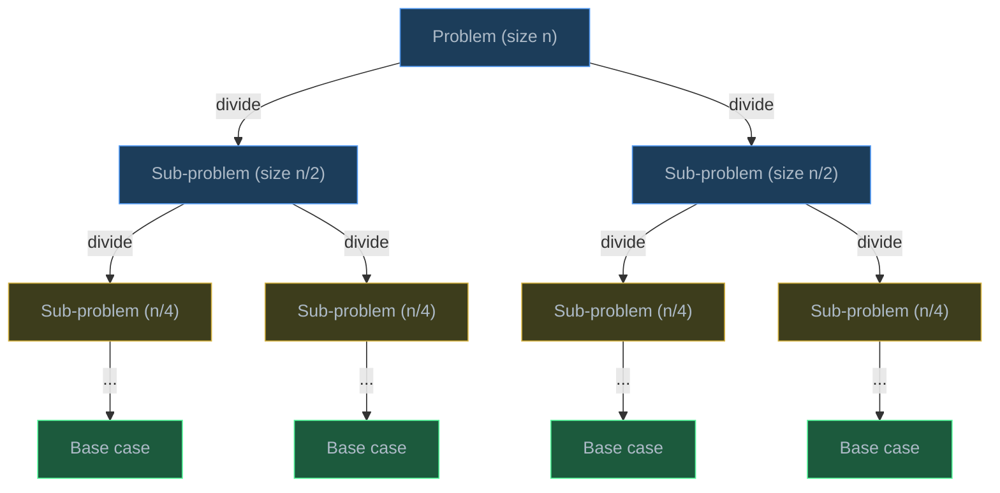
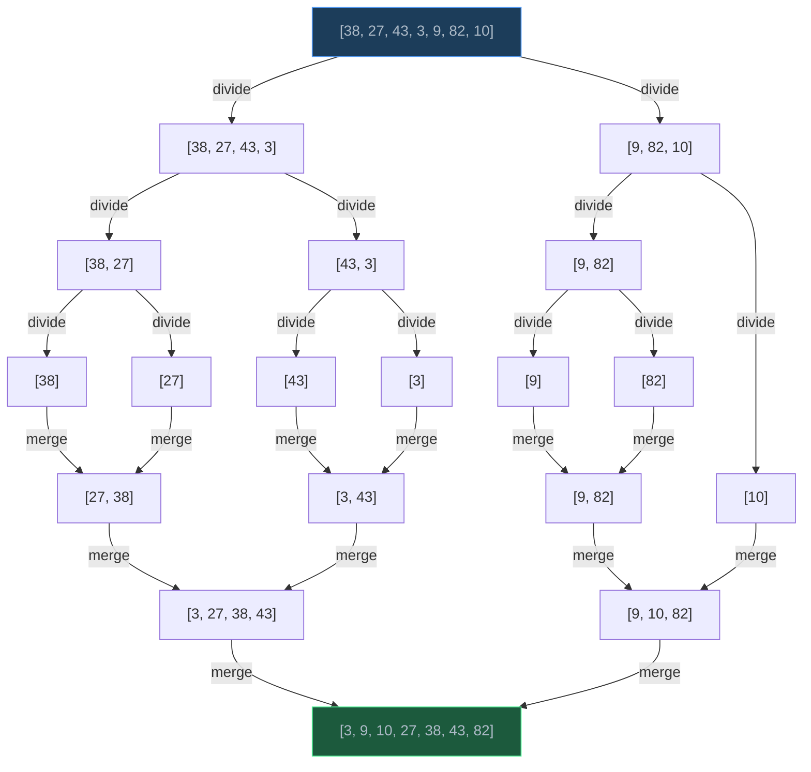
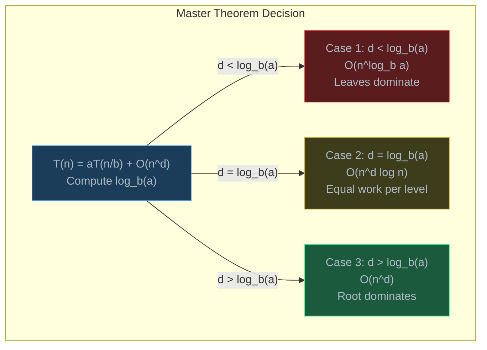
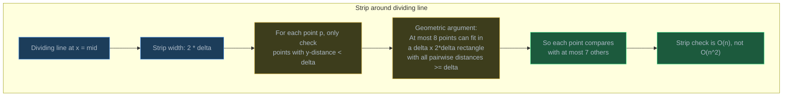

# Divide and Conquer

> Divide and conquer solves problems by splitting them into smaller sub-problems, solving each independently, and combining the results — turning intractable problems into efficient algorithms.

## Table of Contents
- [Core Concepts](#core-concepts)
- [Code Examples](#code-examples)
- [Common Pitfalls](#common-pitfalls)
- [Key Takeaways](#key-takeaways)
- [Exercises](#exercises)

## Core Concepts

### The Split-Solve-Combine Paradigm

#### What

Divide and conquer (D&C) is an algorithm design strategy that works in three steps:

1. **Divide** — split the problem into smaller sub-problems of the same type
2. **Conquer** — solve each sub-problem recursively (or directly if small enough)
3. **Combine** — merge the sub-problem solutions into the final answer

```
function solve(problem):
    if problem is small enough:        ← base case
        return direct_solution

    left, right = split(problem)       ← divide
    left_result = solve(left)          ← conquer
    right_result = solve(right)        ← conquer
    return combine(left_result, right_result)  ← combine
```

#### How

D&C is fundamentally different from simple recursion. In plain recursion, you reduce the problem by a constant amount (n to n-1). In D&C, you **divide the problem in half** (or into k parts), which is what gives D&C algorithms their characteristic O(n log n) performance.



The tree has log n levels (because we halve at each level), and at each level, the total work across all sub-problems is typically O(n). This gives the O(n log n) total that appears in merge sort, quicksort (average), and many other D&C algorithms.

#### Why It Matters

D&C is arguably the most important algorithm design paradigm. It's the strategy behind:

- **Merge sort** — O(n log n) sorting via split-sort-merge
- **Binary search** — O(log n) search via halving the search space
- **Quick sort** — O(n log n) average via partition-and-recurse
- **FFT** — O(n log n) polynomial multiplication (powers modern signal processing)
- **Strassen's algorithm** — O(n^2.81) matrix multiplication (faster than O(n^3))
- **Karatsuba multiplication** — O(n^1.585) integer multiplication (faster than O(n^2))

The power of D&C comes from a mathematical reality: splitting a problem in half and solving both halves independently is fundamentally more efficient than processing elements one at a time, whenever the combine step is efficient.

### D&C vs Other Recursive Patterns

#### What

D&C is one of three major recursive patterns. Understanding the differences helps you choose the right approach:

| Pattern | How it reduces | Sub-problems overlap? | Example |
| --- | --- | --- | --- |
| Simple recursion | n to n-1 | N/A (one sub-problem) | Factorial, linked list traversal |
| Divide and conquer | n to n/2 + n/2 | No (independent) | Merge sort, binary search |
| Dynamic programming | n to n-1, n-2, etc. | Yes (overlapping) | Fibonacci, knapsack |

#### How

The key distinguishing feature of D&C is that the sub-problems are **independent** — they don't share data, and solving one doesn't affect the other. This is what makes D&C naturally parallelizable. You could sort the left half and right half of merge sort on two different CPUs.

In contrast, dynamic programming has overlapping sub-problems (fib(5) and fib(4) both need fib(3)). If you apply D&C to a problem with overlapping sub-problems, you get exponential time (like naive recursive Fibonacci). The fix is memoization, which turns it into DP.

#### Why It Matters

Recognizing whether sub-problems overlap determines your algorithm choice. If they're independent, use D&C. If they overlap, use DP (memoize or tabulate). Applying D&C to an overlapping problem wastes work; applying DP to an independent problem wastes space on an unnecessary cache.

### Merge Sort as D&C (Review)

#### What

Merge sort is the canonical D&C algorithm. It was covered in Week 4, but reviewing it through the D&C lens reinforces the paradigm:

1. **Divide**: split the array into two halves
2. **Conquer**: recursively sort each half
3. **Combine**: merge the two sorted halves into one sorted array

#### How



The divide phase splits down to single elements (base case). The combine phase merges pairs of sorted arrays back up.

#### Why It Matters

Merge sort achieves O(n log n) because:

- **log n levels** — halving n until reaching size 1 takes log2(n) steps
- **O(n) work per level** — merging across all sub-problems at each level touches every element once
- **Total**: O(n) * O(log n) = O(n log n)

This analysis pattern — counting levels and work per level — applies to all D&C algorithms and is formalized by the Master Theorem.

### Binary Search as D&C (Review)

#### What

Binary search is a degenerate case of D&C where you only **conquer one half** — the other half is discarded entirely. This is sometimes called "decrease and conquer."

1. **Divide**: compare target with the middle element
2. **Conquer**: recurse into the left or right half (not both)
3. **Combine**: nothing to combine — the answer comes from the single sub-problem

#### How

Because only one sub-problem is solved at each level:

- **log n levels** — halving n until reaching size 1
- **O(1) work per level** — one comparison
- **Total**: O(1) * O(log n) = O(log n)

#### Why It Matters

Binary search demonstrates that D&C doesn't always mean O(n log n). When you discard one half entirely, the work drops from O(n log n) to O(log n). The Master Theorem handles this case formally: T(n) = 1 * T(n/2) + O(1), which gives O(log n).

This principle — eliminating half the problem at each step — extends beyond sorted arrays. Binary search on the answer, binary search on monotonic functions, and binary search on the search space are all applications of this D&C insight.

### The Master Theorem

#### What

The **Master Theorem** provides a formula for determining the time complexity of D&C algorithms. If a D&C algorithm has the recurrence:

```
T(n) = a * T(n/b) + O(n^d)
```

Where:
- `a` = number of sub-problems at each level
- `b` = factor by which the problem size shrinks
- `d` = exponent of the work done outside the recursive calls (divide + combine step)

Then the time complexity is determined by comparing `d` with `log_b(a)`:

| Case | Condition | Result | Intuition |
| --- | --- | --- | --- |
| Case 1 | d < log_b(a) | O(n^(log_b a)) | Sub-problems dominate |
| Case 2 | d = log_b(a) | O(n^d * log n) | Work is evenly distributed |
| Case 3 | d > log_b(a) | O(n^d) | Combine step dominates |

#### How

Let's apply the Master Theorem to algorithms we know:

**Merge sort**: T(n) = 2T(n/2) + O(n)
- a=2, b=2, d=1
- log_b(a) = log_2(2) = 1
- d = log_b(a) → Case 2 → O(n^1 * log n) = **O(n log n)**

**Binary search**: T(n) = 1T(n/2) + O(1)
- a=1, b=2, d=0
- log_b(a) = log_2(1) = 0
- d = log_b(a) → Case 2 → O(n^0 * log n) = **O(log n)**

**Karatsuba multiplication**: T(n) = 3T(n/2) + O(n)
- a=3, b=2, d=1
- log_b(a) = log_2(3) = 1.585
- d < log_b(a) → Case 1 → **O(n^1.585)**

**Naive matrix multiply (D&C version)**: T(n) = 8T(n/2) + O(n^2)
- a=8, b=2, d=2
- log_b(a) = log_2(8) = 3
- d < log_b(a) → Case 1 → **O(n^3)** (same as brute force — D&C doesn't help here)

**Strassen's matrix multiply**: T(n) = 7T(n/2) + O(n^2)
- a=7, b=2, d=2
- log_b(a) = log_2(7) = 2.807
- d < log_b(a) → Case 1 → **O(n^2.807)** (better than O(n^3)!)



#### Why It Matters

The Master Theorem is a shortcut that saves you from manually analyzing recursion trees. When you design a D&C algorithm, you can immediately determine its complexity by identifying a, b, and d. More importantly, it reveals the design levers:

- **Reducing a** (fewer sub-problems) lowers the exponent — this is exactly what Strassen did (7 sub-problems instead of 8).
- **Increasing b** (bigger shrinkage factor) reduces the number of levels.
- **Reducing d** (faster combine step) helps when the combine step dominates.

Understanding these levers tells you *where to optimize* a D&C algorithm. If you're in Case 1 (sub-problems dominate), focus on reducing the number of sub-problems. If you're in Case 3 (combine dominates), optimize the combine step.

### When D&C Applies

#### What

D&C is effective when a problem satisfies three conditions:

1. **Decomposable** — the problem can be split into smaller, independent sub-problems of the same type
2. **Base case exists** — there's a problem size small enough to solve directly
3. **Combine step is efficient** — merging sub-problem solutions is cheaper than solving the whole problem from scratch

#### How

Not every problem benefits from D&C. If the combine step is O(n^2), then splitting into two halves and combining gives T(n) = 2T(n/2) + O(n^2). By the Master Theorem (a=2, b=2, d=2 → Case 3), this is O(n^2) — no better than brute force. The combine step must be subquadratic for D&C to provide an improvement.

Similarly, if the sub-problems aren't independent (they share data or depend on each other's results), D&C doesn't apply — you need dynamic programming.

#### Why It Matters

Recognizing when D&C is the right tool avoids wasted effort. In interviews, the signal is often geometric: "split in half," "sorted order," "compare halves." If you see a problem where the answer for [0..n] can be derived from answers for [0..n/2] and [n/2..n], think D&C.

## Code Examples

### Merge Sort (D&C Walkthrough)

```python
def merge_sort(arr: list[int]) -> list[int]:
    """Sort an array using divide and conquer (merge sort).

    This is a review from Week 4, presented here to highlight
    the D&C structure: divide → conquer → combine.
    """
    # Base case: arrays of size 0 or 1 are already sorted
    if len(arr) <= 1:
        return arr

    # DIVIDE: split into two halves
    mid = len(arr) // 2
    left = arr[:mid]
    right = arr[mid:]

    # CONQUER: recursively sort each half
    sorted_left = merge_sort(left)
    sorted_right = merge_sort(right)

    # COMBINE: merge the two sorted halves
    return merge(sorted_left, sorted_right)


def merge(left: list[int], right: list[int]) -> list[int]:
    """Merge two sorted arrays into one sorted array.

    Two-pointer technique: compare the fronts of both arrays,
    take the smaller one, advance that pointer.
    """
    result: list[int] = []
    i = j = 0

    while i < len(left) and j < len(right):
        if left[i] <= right[j]:
            result.append(left[i])
            i += 1
        else:
            result.append(right[j])
            j += 1

    # Append remaining elements (one of these will be empty)
    result.extend(left[i:])
    result.extend(right[j:])
    return result


# Test
data = [38, 27, 43, 3, 9, 82, 10]
print(f"Sorted: {merge_sort(data)}")  # [3, 9, 10, 27, 38, 43, 82]
```

**Time**: O(n log n) — log n levels, O(n) merge work per level. Master Theorem: T(n) = 2T(n/2) + O(n), a=2, b=2, d=1, Case 2.
**Space**: O(n) — the merge step creates temporary arrays totaling O(n) at each level.

### Maximum Subarray: Brute Force vs D&C vs Kadane's

```python
def max_subarray_brute(arr: list[int]) -> int:
    """Find the maximum sum of a contiguous subarray — brute force.

    Try every possible subarray (every start and end pair).
    """
    n = len(arr)
    if n == 0:
        raise ValueError("Array must not be empty")

    max_sum = arr[0]

    for i in range(n):
        current_sum = 0
        for j in range(i, n):
            current_sum += arr[j]
            max_sum = max(max_sum, current_sum)

    return max_sum


def max_subarray_dc(arr: list[int]) -> int:
    """Find the maximum sum of a contiguous subarray — divide and conquer.

    Three candidates:
    1. Max subarray entirely in the left half
    2. Max subarray entirely in the right half
    3. Max subarray crossing the midpoint

    The answer is the maximum of these three.
    """

    def _max_crossing(arr: list[int], low: int, mid: int, high: int) -> int:
        """Find the max subarray that crosses the midpoint.

        Expand left from mid, then expand right from mid+1.
        The crossing sum = best left expansion + best right expansion.
        """
        # Expand left from mid toward low
        left_sum = float("-inf")
        current = 0
        for i in range(mid, low - 1, -1):
            current += arr[i]
            left_sum = max(left_sum, current)

        # Expand right from mid+1 toward high
        right_sum = float("-inf")
        current = 0
        for i in range(mid + 1, high + 1):
            current += arr[i]
            right_sum = max(right_sum, current)

        return left_sum + right_sum

    def _solve(arr: list[int], low: int, high: int) -> int:
        # Base case: single element
        if low == high:
            return arr[low]

        mid = (low + high) // 2

        # DIVIDE and CONQUER: solve left half, right half, and crossing
        left_max = _solve(arr, low, mid)
        right_max = _solve(arr, mid + 1, high)
        cross_max = _max_crossing(arr, low, mid, high)

        # COMBINE: answer is the best of three candidates
        return max(left_max, right_max, cross_max)

    if not arr:
        raise ValueError("Array must not be empty")

    return _solve(arr, 0, len(arr) - 1)


def max_subarray_kadane(arr: list[int]) -> int:
    """Find the maximum sum of a contiguous subarray — Kadane's algorithm.

    Dynamic programming approach: at each position, either extend the
    current subarray or start a new one.

    This is the optimal O(n) solution. The D&C approach above is O(n log n).
    """
    if not arr:
        raise ValueError("Array must not be empty")

    max_sum = arr[0]
    current_sum = arr[0]

    for i in range(1, len(arr)):
        # Either extend the current subarray or start fresh at arr[i]
        current_sum = max(arr[i], current_sum + arr[i])
        max_sum = max(max_sum, current_sum)

    return max_sum


# Test
test_arr = [-2, 1, -3, 4, -1, 2, 1, -5, 4]
print(f"Brute force: {max_subarray_brute(test_arr)}")  # 6 (subarray [4,-1,2,1])
print(f"D&C:         {max_subarray_dc(test_arr)}")     # 6
print(f"Kadane's:    {max_subarray_kadane(test_arr)}")  # 6
```

| Approach | Time | Space | Notes |
| --- | --- | --- | --- |
| Brute force | O(n^2) | O(1) | Try all subarrays |
| D&C | O(n log n) | O(log n) stack | Split-solve-combine |
| Kadane's | O(n) | O(1) | DP — optimal |

The D&C approach has Master Theorem recurrence T(n) = 2T(n/2) + O(n) (the crossing step is O(n)), giving O(n log n). Kadane's is O(n) because it makes a single pass. This is one case where D&C is not the optimal approach — Kadane's exploits the subarray structure more effectively.

### Closest Pair of Points

```python
import math
from dataclasses import dataclass


@dataclass(frozen=True)
class Point:
    x: float
    y: float


def distance(p1: Point, p2: Point) -> float:
    """Euclidean distance between two points."""
    return math.sqrt((p1.x - p2.x) ** 2 + (p1.y - p2.y) ** 2)


def closest_pair_brute(points: list[Point]) -> float:
    """Find the minimum distance between any two points — brute force.

    Check every pair. O(n^2) time.
    """
    n = len(points)
    min_dist = float("inf")
    for i in range(n):
        for j in range(i + 1, n):
            min_dist = min(min_dist, distance(points[i], points[j]))
    return min_dist


def closest_pair_dc(points: list[Point]) -> float:
    """Find the minimum distance between any two points — D&C.

    Strategy:
    1. Sort points by x-coordinate
    2. DIVIDE: split into left and right halves at the median x
    3. CONQUER: find closest pair in each half recursively
    4. COMBINE: check for closer pairs that cross the dividing line

    The key insight: when combining, we only need to check points within
    distance delta of the dividing line, and for each such point, we only
    need to check at most 7 other points (sorted by y-coordinate).
    """

    def _solve(pts_x: list[Point], pts_y: list[Point]) -> float:
        n = len(pts_x)

        # Base case: use brute force for small inputs
        if n <= 3:
            return closest_pair_brute(pts_x)

        # DIVIDE: split at the midpoint
        mid = n // 2
        mid_point = pts_x[mid]

        # Split pts_y into left and right halves (maintaining y-sort order)
        left_y: list[Point] = []
        right_y: list[Point] = []
        left_x_set = set(id(p) for p in pts_x[:mid])
        for p in pts_y:
            if id(p) in left_x_set:
                left_y.append(p)
            else:
                right_y.append(p)

        # CONQUER: find closest pair in each half
        delta_left = _solve(pts_x[:mid], left_y)
        delta_right = _solve(pts_x[mid:], right_y)
        delta = min(delta_left, delta_right)

        # COMBINE: check the strip around the dividing line
        # Only points within distance delta of the midline could form
        # a closer pair that crosses the dividing line
        strip: list[Point] = [
            p for p in pts_y if abs(p.x - mid_point.x) < delta
        ]

        # For each point in the strip, check the next few points
        # (at most 7 due to geometric packing argument)
        for i in range(len(strip)):
            j = i + 1
            while j < len(strip) and (strip[j].y - strip[i].y) < delta:
                delta = min(delta, distance(strip[i], strip[j]))
                j += 1

        return delta

    # Sort by x-coordinate and y-coordinate
    sorted_x = sorted(points, key=lambda p: p.x)
    sorted_y = sorted(points, key=lambda p: p.y)

    return _solve(sorted_x, sorted_y)


# Test
test_points = [
    Point(2, 3), Point(12, 30), Point(40, 50),
    Point(5, 1), Point(12, 10), Point(3, 4),
]

print(f"Brute force: {closest_pair_brute(test_points):.4f}")
print(f"D&C:         {closest_pair_dc(test_points):.4f}")
# Both should return ~1.4142 (distance between (2,3) and (3,4))
```

**Time**: O(n log n) — sorting is O(n log n), and the D&C recurrence is T(n) = 2T(n/2) + O(n) (the strip check is O(n) due to the geometric packing argument that limits each point to 7 comparisons). Master Theorem: a=2, b=2, d=1, Case 2 → O(n log n).
**Space**: O(n) — for the sorted arrays and strip.

The combine step is the clever part. Why only 7 comparisons per point in the strip?



### Count Inversions (D&C with Modified Merge Sort)

```python
def count_inversions(arr: list[int]) -> tuple[list[int], int]:
    """Count the number of inversions in an array using D&C.

    An inversion is a pair (i, j) where i < j but arr[i] > arr[j].
    Brute force checks all pairs: O(n^2).

    D&C insight: during merge sort's merge step, when we take an element
    from the right half instead of the left, every remaining element in
    the left half forms an inversion with it.

    Returns: (sorted_array, inversion_count)
    """
    # Base case
    if len(arr) <= 1:
        return arr[:], 0

    mid = len(arr) // 2

    # DIVIDE and CONQUER
    left_sorted, left_inv = count_inversions(arr[:mid])
    right_sorted, right_inv = count_inversions(arr[mid:])

    # COMBINE: merge and count cross-inversions
    merged: list[int] = []
    cross_inv = 0
    i = j = 0

    while i < len(left_sorted) and j < len(right_sorted):
        if left_sorted[i] <= right_sorted[j]:
            merged.append(left_sorted[i])
            i += 1
        else:
            # Everything remaining in left_sorted[i:] is greater than
            # right_sorted[j], so they all form inversions with it
            merged.append(right_sorted[j])
            cross_inv += len(left_sorted) - i
            j += 1

    merged.extend(left_sorted[i:])
    merged.extend(right_sorted[j:])

    total_inv = left_inv + right_inv + cross_inv
    return merged, total_inv


# Test
data = [8, 4, 2, 1]
sorted_data, inversions = count_inversions(data)
print(f"Array: {data}")
print(f"Sorted: {sorted_data}")
print(f"Inversions: {inversions}")  # 6 — every pair is inverted
# Pairs: (8,4), (8,2), (8,1), (4,2), (4,1), (2,1)

data2 = [1, 3, 5, 2, 4, 6]
_, inv2 = count_inversions(data2)
print(f"Inversions in {data2}: {inv2}")  # 3 — (3,2), (5,2), (5,4)
```

**Time**: O(n log n) — same as merge sort. The inversion counting piggybacks on the merge step with O(1) extra work per merge comparison.
**Space**: O(n) — temporary arrays for merging.

### Power Function via D&C

```python
def power(base: float, exp: int) -> float:
    """Compute base^exp using divide and conquer (exponentiation by squaring).

    D&C insight:
    - base^exp = (base^(exp/2))^2           when exp is even
    - base^exp = base * (base^(exp/2))^2    when exp is odd

    This halves the exponent at each step, giving O(log exp) time.
    """
    # Handle negative exponents
    if exp < 0:
        return 1.0 / power(base, -exp)

    # Base case
    if exp == 0:
        return 1.0

    # DIVIDE: solve for exp // 2
    half = power(base, exp // 2)

    # COMBINE: square the half-result
    if exp % 2 == 0:
        return half * half
    else:
        return base * half * half


# Test
print(f"2^10 = {power(2, 10)}")     # 1024.0
print(f"3^13 = {power(3, 13)}")     # 1594323.0
print(f"2^-3 = {power(2, -3)}")     # 0.125
```

**Time**: O(log n) — the exponent is halved at each step. Master Theorem: T(n) = T(n/2) + O(1), a=1, b=2, d=0, Case 2 → O(log n).
**Space**: O(log n) — recursion stack depth.

### Finding Majority Element via D&C

```python
def majority_element(arr: list[int]) -> int | None:
    """Find the element that appears more than n/2 times using D&C.

    D&C insight: if an element is the majority in the whole array,
    it must be the majority in at least one of the two halves.

    So the majority of the whole array is one of:
    - the majority of the left half
    - the majority of the right half

    We find the majority of each half, then count which (if either)
    is actually the majority of the whole array.
    """

    def count_in_range(arr: list[int], target: int, lo: int, hi: int) -> int:
        """Count occurrences of target in arr[lo:hi+1]."""
        return sum(1 for i in range(lo, hi + 1) if arr[i] == target)

    def _solve(lo: int, hi: int) -> int | None:
        # Base case: single element is trivially the majority
        if lo == hi:
            return arr[lo]

        mid = (lo + hi) // 2

        # CONQUER: find majority candidates in each half
        left_maj = _solve(lo, mid)
        right_maj = _solve(mid + 1, hi)

        # If both halves agree, that's the majority
        if left_maj == right_maj:
            return left_maj

        # COMBINE: count each candidate in the full range
        left_count = count_in_range(arr, left_maj, lo, hi) if left_maj is not None else 0
        right_count = count_in_range(arr, right_maj, lo, hi) if right_maj is not None else 0

        threshold = (hi - lo + 1) // 2

        if left_count > threshold:
            return left_maj
        if right_count > threshold:
            return right_maj
        return None

    return _solve(0, len(arr) - 1)


# Test
print(majority_element([3, 2, 3]))          # 3
print(majority_element([2, 2, 1, 1, 1, 2, 2]))  # 2
print(majority_element([1, 2, 3]))          # None
```

**Time**: O(n log n) — T(n) = 2T(n/2) + O(n) (counting takes O(n)). Master Theorem: a=2, b=2, d=1, Case 2 → O(n log n).
**Space**: O(log n) — recursion stack depth.

Note: Boyer-Moore voting algorithm solves this in O(n) time and O(1) space, making D&C suboptimal for this particular problem. But the D&C solution demonstrates the paradigm clearly and is a good exercise.

### Finding Kth Smallest Element (QuickSelect)

```python
import random


def quickselect(arr: list[int], k: int) -> int:
    """Find the k-th smallest element (0-indexed) using D&C.

    QuickSelect is like QuickSort but only recurses into ONE half —
    the half containing the k-th element. This gives O(n) average time
    instead of O(n log n).

    This is "decrease and conquer" — similar to binary search.
    """
    if len(arr) == 1:
        return arr[0]

    # Choose a random pivot to avoid worst-case behavior
    pivot = random.choice(arr)

    # Partition into three groups
    lows = [x for x in arr if x < pivot]
    highs = [x for x in arr if x > pivot]
    pivots = [x for x in arr if x == pivot]

    if k < len(lows):
        # k-th smallest is in the lower partition
        return quickselect(lows, k)
    elif k < len(lows) + len(pivots):
        # k-th smallest is the pivot itself
        return pivot
    else:
        # k-th smallest is in the upper partition
        return quickselect(highs, k - len(lows) - len(pivots))


# Test
data = [7, 10, 4, 3, 20, 15]
for k in range(len(data)):
    print(f"{k}-th smallest: {quickselect(data[:], k)}")
# 0-th: 3, 1st: 4, 2nd: 7, 3rd: 10, 4th: 15, 5th: 20
```

**Time**: O(n) average — each level does O(n) work but only recurses into one partition (roughly n/2 elements on average). T(n) = T(n/2) + O(n), Master Theorem a=1, b=2, d=1, Case 3 → O(n). Worst case O(n^2) if pivot selection is consistently bad.
**Space**: O(n) — for the partition lists. Can be done in-place with O(log n) space.

## Common Pitfalls

### Pitfall 1: Forgetting the Base Case or Making It Too Late

```python
# BAD — base case missing, infinite recursion on empty array
def merge_sort_bad(arr: list[int]) -> list[int]:
    mid = len(arr) // 2
    left = merge_sort_bad(arr[:mid])   # eventually arr[:0] = [], but
    right = merge_sort_bad(arr[mid:])  # arr[0:] = [] recurses forever
    return merge(left, right)

# GOOD — base case handles arrays of size 0 and 1
def merge_sort_good(arr: list[int]) -> list[int]:
    if len(arr) <= 1:
        return arr[:]

    mid = len(arr) // 2
    left = merge_sort_good(arr[:mid])
    right = merge_sort_good(arr[mid:])
    return merge(left, right)
```

Why it's wrong: When `arr` is empty, `arr[:0]` is `[]` and `arr[0:]` is also `[]`. Both recursive calls get empty arrays, which again split into two empty arrays. The recursion never terminates. The base case must catch arrays of size 0 or 1 before the split.

### Pitfall 2: Uneven Splits That Don't Converge

```python
# BAD — when n=2, this splits into [0:1] and [0:2], the right half never shrinks
def bad_split(arr: list[int], lo: int, hi: int) -> None:
    if lo >= hi:
        return
    mid = lo + 1  # wrong: always puts 1 element on left, rest on right
    bad_split(arr, lo, mid - 1)
    bad_split(arr, mid, hi)  # if hi - lo = 1, this calls (lo+1, lo+1)... ok
    # but what about (mid, hi) when hi >> mid? Still O(n) depth

# GOOD — always split at the true midpoint
def good_split(arr: list[int], lo: int, hi: int) -> None:
    if lo >= hi:
        return
    mid = (lo + hi) // 2  # balanced split — O(log n) depth
    good_split(arr, lo, mid)
    good_split(arr, mid + 1, hi)
```

Why it's wrong: An unbalanced split doesn't give O(n log n) performance. If you always put 1 element on one side and n-1 on the other, you get T(n) = T(1) + T(n-1) + O(n), which solves to O(n^2) — the same as no splitting at all. This is exactly quicksort's worst case. Always split as evenly as possible for guaranteed O(n log n).

### Pitfall 3: Misapplying the Master Theorem

```python
# Common mistake: applying Master Theorem to non-D&C recurrences

# This is NOT a D&C recurrence (subproblem size is n-1, not n/b):
# T(n) = T(n-1) + O(n)  ← this is simple recursion, not D&C
# Solves to O(n^2) by telescoping, NOT by Master Theorem

# This is NOT a D&C recurrence (variable number of subproblems):
# T(n) = n * T(n/2) + O(1)  ← 'a' depends on n, Master Theorem requires constant 'a'

# Master Theorem DOES apply to:
# T(n) = 2T(n/2) + O(n)    ← a=2, b=2, d=1 → O(n log n)
# T(n) = 4T(n/2) + O(n^2)  ← a=4, b=2, d=2 → O(n^2 log n)
# T(n) = 3T(n/4) + O(n)    ← a=3, b=4, d=1 → O(n)  (Case 3: d > log_4(3))
```

Why it's wrong: The Master Theorem only applies to recurrences of the form T(n) = aT(n/b) + O(n^d) where a, b, and d are constants. If the subproblem size decreases by subtraction (n-1) instead of division (n/b), or if the number of subproblems varies, use other methods (telescoping, recursion tree, or substitution).

### Pitfall 4: Incorrect Combine Step

```python
# BAD — closest pair crossing: only checks adjacent elements in strip
def bad_strip_check(strip: list[Point], delta: float) -> float:
    for i in range(len(strip) - 1):
        delta = min(delta, distance(strip[i], strip[i + 1]))  # only adjacent!
    return delta
# This misses pairs like strip[0] and strip[5] that could be closer

# GOOD — check all pairs within y-distance delta
def good_strip_check(strip: list[Point], delta: float) -> float:
    # strip is sorted by y-coordinate
    for i in range(len(strip)):
        j = i + 1
        while j < len(strip) and (strip[j].y - strip[i].y) < delta:
            delta = min(delta, distance(strip[i], strip[j]))
            j += 1
    return delta
# The while loop seems O(n^2) but geometric argument limits j-i to at most 7
```

Why it's wrong: The combine step must correctly handle all cases, including those that span the divide boundary. In closest pair, the two closest points could be in opposite halves. The strip check must compare all candidate pairs — but the geometric packing argument guarantees that each point needs at most 7 comparisons, keeping the step O(n).

## Key Takeaways

- Divide and conquer solves problems by **splitting in half, conquering recursively, and combining results**. The O(n log n) performance comes from log n levels of halving, each with O(n) work.
- Use the **Master Theorem** to instantly determine D&C complexity: T(n) = aT(n/b) + O(n^d). Compare d with log_b(a) to determine whether sub-problems, combine step, or both dominate.
- D&C requires **independent sub-problems**. If sub-problems overlap (share computation), you need dynamic programming instead. If sub-problems aren't the same type as the original, D&C doesn't apply.
- The **combine step** is where D&C algorithms get their cleverness. Merge sort's merge, closest pair's strip check, and inversion counting's cross-count all happen during combine. A bad combine step can negate all the benefits of splitting.
- D&C is the foundation of the most important efficient algorithms: merge sort (O(n log n) sorting), binary search (O(log n) lookup), FFT (O(n log n) polynomial multiplication), and Strassen's (O(n^2.81) matrix multiplication).

## Exercises

1. **Apply the Master Theorem** to the following recurrences and state the time complexity:
   - T(n) = 4T(n/2) + O(n)
   - T(n) = 2T(n/4) + O(sqrt(n))
   - T(n) = 2T(n/2) + O(n^2)
   - T(n) = T(n/2) + O(n)

2. **Explain** why the closest pair of points strip check is O(n) and not O(n^2), even though it uses a nested loop. What geometric property limits the number of comparisons per point to at most 7?

3. **Write a function** `count_inversions(arr: list[int]) -> int` that counts the number of pairs (i, j) where i < j but arr[i] > arr[j]. Use the D&C approach (modified merge sort). Verify with the brute force approach on small inputs.

4. **Write a function** `max_subarray_dc(arr: list[int]) -> tuple[int, int, int]` that returns not just the maximum subarray sum, but also the start and end indices of the subarray. Use the divide and conquer approach.

5. **Explain** why D&C does not help for naive matrix multiplication (8 sub-problems of size n/2 with O(n^2) combine gives O(n^3)), but Strassen's algorithm (7 sub-problems of size n/2 with O(n^2) combine) achieves O(n^2.81). Use the Master Theorem to show both results.

---
up:: [Schedule](../../Schedule.md)
#type/learning #source/self-study #status/seed
