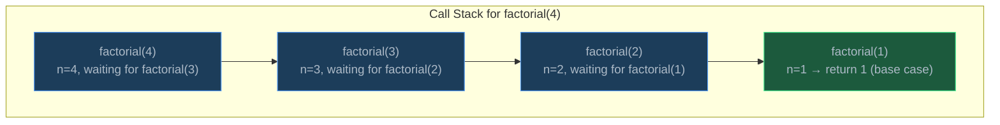
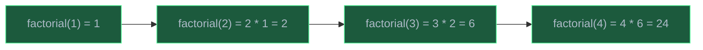
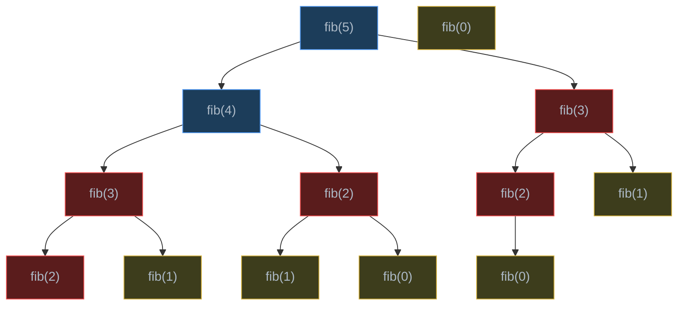

# Recursion

> Recursion is a function calling itself to solve a problem by breaking it into smaller, identical sub-problems until reaching a trivially solvable base case.

## Table of Contents
- [Core Concepts](#core-concepts)
- [Code Examples](#code-examples)
- [Common Pitfalls](#common-pitfalls)
- [Key Takeaways](#key-takeaways)
- [Exercises](#exercises)

## Core Concepts

### Base Case and Recursive Case

#### What

Every recursive function has exactly two essential components:

1. **Base case** — the condition that stops the recursion. It returns a known answer without making another recursive call.
2. **Recursive case** — the part that calls the function itself with a *smaller* or *simpler* input, moving one step closer to the base case.

```
function(problem):
    if problem is trivially small:     ← base case
        return known_answer
    else:
        return combine(function(smaller_problem))   ← recursive case
```

#### How

Consider computing `factorial(4)`:

- `factorial(4)` = `4 * factorial(3)` (recursive case)
- `factorial(3)` = `3 * factorial(2)` (recursive case)
- `factorial(2)` = `2 * factorial(1)` (recursive case)
- `factorial(1)` = `1` (base case — stop here)

The results then propagate back up: `1 → 2 → 6 → 24`.

The base case is what prevents infinite recursion. Without it, the function would call itself forever until the program crashes. The recursive case must always make progress toward the base case — typically by reducing the problem size.

#### Why It Matters

Thinking in terms of base case and recursive case is the fundamental skill for recursive problem solving. When you encounter a new problem, ask two questions: "What is the simplest version of this problem that I can answer immediately?" (base case) and "How can I reduce this problem to a smaller version of itself?" (recursive case). If you can answer both, you have a recursive solution.

Many beginners try to trace through every recursive call mentally. Instead, trust the recursion: assume the recursive call correctly solves the smaller problem, and focus only on how to combine that result with the current step. This is called the **recursive leap of faith**.

### Call Stack Mechanics

#### What

When a function calls itself (or any function), the runtime creates a **stack frame** — a block of memory that stores the function's local variables, parameters, and return address. These frames are pushed onto the **call stack**. When a function returns, its frame is popped off.

#### How

Each recursive call adds a new frame to the stack. The frames accumulate until the base case is reached, at which point frames begin to pop as return values propagate back up.



After `factorial(1)` returns `1`, the stack unwinds:



Each frame occupies memory. For `factorial(n)`, there are `n` frames on the stack simultaneously at the deepest point. This means the space complexity of a recursive solution is at least O(depth), where depth is the maximum number of nested calls.

#### Why It Matters

Understanding the call stack explains three critical things:

1. **Space cost** — recursion uses O(depth) memory for the stack, even if the algorithm itself needs no extra data structures. This is "hidden" space that Big-O analysis must account for.
2. **Stack overflow** — if the depth is too large, you exhaust the stack memory and crash.
3. **Debugging** — when a recursive function produces wrong results, the call stack trace tells you exactly which call went wrong and what parameters it had.

Every time you write a recursive function, visualize the call stack. Ask: "How deep does this go?" That depth determines both your space complexity and your risk of stack overflow.

### Stack Overflow and Python's Recursion Limit

#### What

A **stack overflow** occurs when the call stack grows beyond the available memory. In Python, this is prevented by a hard recursion limit — by default, Python allows a maximum of **1000 recursive calls** before raising a `RecursionError`.

#### How

```python
import sys

# Check the current limit
print(sys.getrecursionlimit())  # 1000 (default)

# Increase the limit (use with caution)
sys.setrecursionlimit(5000)
```

Python's limit exists because CPython uses the C call stack, which has a fixed size (typically 1-8 MB depending on the OS). Each Python stack frame consumes about 50-100 bytes of C stack space. At 1000 frames, that's roughly 50-100 KB — well within safe limits.

If you set the limit too high and the recursion actually reaches that depth, you'll crash the Python process with a segmentation fault (the C stack overflows), which is worse than a `RecursionError` because it terminates without a traceback.

#### Why It Matters

Python's recursion limit is a practical constraint that affects algorithm design. For problems where the recursion depth could be O(n) (e.g., traversing a linked list recursively, recursive factorial for large n), you must either:

1. Convert to an iterative solution
2. Use tail-call optimization manually (Python doesn't optimize tail calls automatically)
3. Increase the limit carefully with `sys.setrecursionlimit()`

This is why competitive programmers and production code in Python often prefer iterative approaches for problems with deep recursion (like DFS on large graphs). Languages like Scheme and Haskell optimize tail recursion and don't have this limitation.

### Recursive Thinking: Breaking Problems Down

#### What

Recursive thinking is the skill of recognizing that a problem can be expressed as a smaller version of itself. The key insight is: if you can solve a problem of size `n` by assuming you already have the solution for size `n-1` (or `n/2`, or any smaller size), you have a recursive solution.

#### How

The recipe for recursive thinking:

1. **Define the function signature** — what does the function take and return?
2. **Identify the base case** — what is the smallest input, and what should the function return for it?
3. **Assume the recursive call works** — take a leap of faith. If `f(n-1)` gives you the correct answer for a smaller problem, how do you use that to compute `f(n)`?
4. **Combine** — merge the result of the recursive call with the current element.

For example, "sum of a list":

1. Signature: `sum_list(arr) -> int`
2. Base case: empty list returns `0`
3. Leap of faith: `sum_list(arr[1:])` correctly sums everything except the first element
4. Combine: `arr[0] + sum_list(arr[1:])`

#### Why It Matters

Recursive thinking is a transferable skill that extends far beyond recursion itself. It's the foundation of divide-and-conquer, dynamic programming, and tree/graph algorithms. When you see a tree traversal, you're seeing recursive thinking: process the current node, then recursively process the left and right subtrees. When you write a merge sort, you're thinking recursively: sort the halves, then merge.

The ability to decompose a problem into self-similar sub-problems is one of the most powerful problem-solving strategies in computer science. It turns overwhelmingly complex problems into manageable pieces.

### Recursion vs Iteration

#### What

Any recursive algorithm can be converted to an iterative one (and vice versa). Recursion uses the call stack implicitly; iteration uses an explicit loop and sometimes an explicit stack data structure.

| Aspect | Recursion | Iteration |
| --- | --- | --- |
| State management | Implicit (stack frames) | Explicit (variables, stack) |
| Readability | Often more elegant for tree/graph problems | Often clearer for linear problems |
| Space | O(depth) for call stack | O(1) if no explicit stack needed |
| Stack overflow risk | Yes (Python: 1000 limit) | No |
| Performance | Function call overhead per frame | Generally faster |

#### How

Converting recursion to iteration follows a pattern:

1. Replace the recursive call with a loop
2. Replace implicit stack frames with an explicit stack (if needed)
3. Manage state with variables instead of parameters

For **tail recursion** (where the recursive call is the last operation), conversion is straightforward — just use a loop:

```python
# Recursive factorial (tail-recursive form)
def factorial_rec(n: int, acc: int = 1) -> int:
    if n <= 1:
        return acc
    return factorial_rec(n - 1, n * acc)

# Iterative equivalent
def factorial_iter(n: int) -> int:
    acc = 1
    while n > 1:
        acc *= n
        n -= 1
    return acc
```

For **non-tail recursion** (like tree traversals), you need an explicit stack to simulate the call stack.

#### Why It Matters

Choosing between recursion and iteration is a practical engineering decision:

- **Use recursion** when the problem has a naturally recursive structure (trees, nested data, backtracking) and the depth is bounded. Recursive code is often shorter, more readable, and easier to prove correct.
- **Use iteration** when the recursion depth could be large (processing a list of 100,000 elements), when performance is critical (avoiding function call overhead), or when you're working in a language without tail-call optimization (like Python).

In interviews, start with the recursive solution because it's usually easier to write correctly. Then discuss the iterative conversion and trade-offs.

### Memoization: Caching Repeated Sub-problems

#### What

**Memoization** is the technique of storing the results of expensive function calls and returning the cached result when the same inputs occur again. It transforms exponential recursive algorithms into polynomial ones when there are **overlapping sub-problems** — the same recursive call being made multiple times with the same arguments.

#### How

The classic example is Fibonacci. The naive recursive approach recomputes the same values many times:



Red nodes are redundant computations. `fib(3)` is computed twice, `fib(2)` three times. With memoization, each value is computed only once and then looked up in O(1) from the cache.

#### Why It Matters

Memoization is the bridge between recursion and dynamic programming. Recognizing overlapping sub-problems is a key skill: if a recursive solution has them, memoization can dramatically reduce the time complexity. For Fibonacci, it takes the time from O(2^n) to O(n). For many interview problems, the progression is: write the recursive solution, notice overlapping sub-problems, add memoization. This is the "top-down DP" approach covered in detail in Week 11.

## Code Examples

### Factorial: The Simplest Recursive Function

```python
def factorial(n: int) -> int:
    """Compute n! = n * (n-1) * ... * 1 recursively.

    Base case: 0! = 1 (by mathematical convention)
    Recursive case: n! = n * (n-1)!
    """
    if n < 0:
        raise ValueError(f"Factorial undefined for negative numbers: {n}")

    # Base case: 0! = 1
    if n == 0:
        return 1

    # Recursive case: n! = n * (n-1)!
    return n * factorial(n - 1)


# Test
for i in range(8):
    print(f"{i}! = {factorial(i)}")
# 0! = 1
# 1! = 1
# 2! = 2
# 3! = 6
# 4! = 24
# 5! = 120
# 6! = 720
# 7! = 5040
```

**Time**: O(n) — exactly n recursive calls, each doing O(1) work (one multiplication).
**Space**: O(n) — n stack frames on the call stack simultaneously at the deepest point.

### Fibonacci: Naive vs Memoized

```python
from functools import lru_cache


def fib_naive(n: int) -> int:
    """Compute the nth Fibonacci number recursively (no memoization).

    This is intentionally inefficient — it recomputes the same values
    exponentially many times. fib(5) calls fib(3) twice, fib(2) three times.
    """
    if n <= 1:
        return n
    return fib_naive(n - 1) + fib_naive(n - 2)


def fib_memo(n: int, cache: dict[int, int] | None = None) -> int:
    """Compute the nth Fibonacci number with manual memoization.

    Each value is computed once, then looked up in O(1) from the cache.
    """
    if cache is None:
        cache = {}

    if n <= 1:
        return n

    # Check cache before computing
    if n in cache:
        return cache[n]

    # Compute, store, and return
    result = fib_memo(n - 1, cache) + fib_memo(n - 2, cache)
    cache[n] = result
    return result


@lru_cache(maxsize=None)
def fib_lru(n: int) -> int:
    """Compute the nth Fibonacci number using Python's built-in memoization.

    @lru_cache is the Pythonic way to memoize — it handles the cache
    dictionary automatically. maxsize=None means unbounded cache.
    """
    if n <= 1:
        return n
    return fib_lru(n - 1) + fib_lru(n - 2)


def fib_iterative(n: int) -> int:
    """Compute the nth Fibonacci number iteratively.

    No recursion, no stack overhead, O(1) space.
    This is the most efficient approach for Fibonacci.
    """
    if n <= 1:
        return n

    prev, curr = 0, 1
    for _ in range(2, n + 1):
        prev, curr = curr, prev + curr
    return curr


# Compare approaches
import time

for func_name, func in [("naive", fib_naive), ("memo", fib_memo),
                          ("lru_cache", fib_lru), ("iterative", fib_iterative)]:
    start = time.perf_counter()
    result = func(30)
    elapsed = time.perf_counter() - start
    print(f"  {func_name:<12} fib(30) = {result:<10}  {elapsed:.6f}s")
```

| Approach | Time | Space | Notes |
| --- | --- | --- | --- |
| Naive | O(2^n) | O(n) stack | Exponential — unusable for n > 35 |
| Memoized | O(n) | O(n) cache + O(n) stack | Each fib(k) computed once |
| `@lru_cache` | O(n) | O(n) cache + O(n) stack | Pythonic, same complexity |
| Iterative | O(n) | O(1) | Best performance, no stack risk |

### Recursive Sum of a List

```python
def sum_list(arr: list[int]) -> int:
    """Sum all elements in a list recursively.

    Base case: empty list has sum 0
    Recursive case: first element + sum of the rest

    Note: arr[1:] creates a new list each call, costing O(n) per call.
    The index-based version below avoids this.
    """
    if not arr:
        return 0
    return arr[0] + sum_list(arr[1:])


def sum_list_efficient(arr: list[int], index: int = 0) -> int:
    """Sum all elements using an index instead of slicing.

    Avoids creating new lists — each call is O(1) work.
    """
    if index >= len(arr):
        return 0
    return arr[index] + sum_list_efficient(arr, index + 1)


# Test
numbers = [3, 7, 1, 9, 4, 2]
print(f"sum_list({numbers}) = {sum_list(numbers)}")             # 26
print(f"sum_list_efficient({numbers}) = {sum_list_efficient(numbers)}")  # 26
```

**Time**: O(n) — one recursive call per element.
**Space**: O(n) for call stack. The slicing version additionally uses O(n^2) total space for the intermediate lists (`arr[1:]` copies n-1 elements, then n-2, etc.). The index version uses O(n) stack space only.

### Recursive Power Function

```python
def power_naive(base: float, exp: int) -> float:
    """Compute base^exp using simple recursion.

    base^exp = base * base^(exp-1)
    This makes exp recursive calls — O(exp) time.
    """
    if exp == 0:
        return 1.0
    if exp < 0:
        return 1.0 / power_naive(base, -exp)
    return base * power_naive(base, exp - 1)


def power_fast(base: float, exp: int) -> float:
    """Compute base^exp using fast exponentiation (exponentiation by squaring).

    Key insight: base^exp = (base^(exp/2))^2 when exp is even
                 base^exp = base * base^(exp-1) when exp is odd

    This halves the exponent at each step — O(log exp) time.
    """
    if exp == 0:
        return 1.0
    if exp < 0:
        return 1.0 / power_fast(base, -exp)

    if exp % 2 == 0:
        # Even exponent: base^exp = (base^(exp/2))^2
        half = power_fast(base, exp // 2)
        return half * half
    else:
        # Odd exponent: base^exp = base * base^(exp-1)
        return base * power_fast(base, exp - 1)


# Test
print(f"power_naive(2, 10) = {power_naive(2, 10)}")    # 1024.0
print(f"power_fast(2, 10) = {power_fast(2, 10)}")      # 1024.0
print(f"power_fast(3, 13) = {power_fast(3, 13)}")      # 1594323.0
print(f"power_fast(2, -3) = {power_fast(2, -3)}")      # 0.125
```

| Approach | Time | Space | Why |
| --- | --- | --- | --- |
| Naive | O(n) | O(n) stack | One call per decrement of exponent |
| Fast (squaring) | O(log n) | O(log n) stack | Exponent halves each even step |

The fast version is how `pow()` is implemented in practice. This technique (exponentiation by squaring) is used in cryptography for computing modular exponentiation with huge exponents.

### Reversing a String Recursively

```python
def reverse_string(s: str) -> str:
    """Reverse a string recursively.

    Base case: empty or single-character string is already reversed.
    Recursive case: last character + reverse of everything except the last.
    """
    # Base case
    if len(s) <= 1:
        return s

    # Recursive case: move last char to front, reverse the rest
    return s[-1] + reverse_string(s[:-1])


def reverse_string_two_pointer(s: str) -> str:
    """Reverse a string using recursion with two pointers (via list mutation).

    More efficient than string concatenation — strings are immutable in Python,
    so s[-1] + reverse(s[:-1]) creates new string objects at every level.
    """
    chars: list[str] = list(s)

    def _reverse(left: int, right: int) -> None:
        if left >= right:
            return
        chars[left], chars[right] = chars[right], chars[left]
        _reverse(left + 1, right - 1)

    _reverse(0, len(chars) - 1)
    return "".join(chars)


# Test
print(reverse_string("hello"))              # "olleh"
print(reverse_string_two_pointer("hello"))  # "olleh"
```

**Time**: O(n) — both approaches visit each character once.
**Space**: The concatenation version uses O(n^2) total space (each concatenation creates a new string). The two-pointer version uses O(n) for the list plus O(n) for the call stack.

### Checking if a Linked List is a Palindrome

```python
from dataclasses import dataclass


@dataclass
class ListNode:
    val: int
    next: "ListNode | None" = None


def is_palindrome(head: ListNode | None) -> bool:
    """Check if a singly linked list reads the same forwards and backwards.

    Strategy: use recursion to reach the end of the list, then compare
    against a pointer moving forward from the head. The recursive call
    stack effectively gives us a "reverse traversal" for free.
    """
    # Use a list to hold the forward pointer (mutable reference trick)
    front = [head]

    def _check(node: ListNode | None) -> bool:
        if node is None:
            return True

        # Recurse to the end first
        if not _check(node.next):
            return False

        # Now node is traversing backwards (via return from recursion),
        # and front[0] is traversing forwards
        if node.val != front[0].val:
            return False

        front[0] = front[0].next
        return True

    return _check(head)


# Test: build 1 -> 2 -> 3 -> 2 -> 1
nodes = [ListNode(v) for v in [1, 2, 3, 2, 1]]
for i in range(len(nodes) - 1):
    nodes[i].next = nodes[i + 1]

print(f"Is palindrome: {is_palindrome(nodes[0])}")  # True
```

**Time**: O(n) — traverse the list once via recursion.
**Space**: O(n) — recursive call stack depth equals the length of the list.

## Common Pitfalls

### Pitfall 1: Forgetting the Base Case

```python
# BAD — no base case, infinite recursion until RecursionError
def countdown(n: int) -> None:
    print(n)
    countdown(n - 1)  # never stops!

# GOOD — base case stops the recursion
def countdown(n: int) -> None:
    if n < 0:  # base case
        return
    print(n)
    countdown(n - 1)
```

Why it's wrong: Without a base case, the function calls itself forever. Python will raise `RecursionError: maximum recursion depth exceeded` after 1000 calls. Always write the base case first, then the recursive case.

### Pitfall 2: Base Case Doesn't Match the Recursive Case's Direction

```python
# BAD — base case checks n == 0, but recursive case doesn't move toward 0
def mystery(n: int) -> int:
    if n == 0:
        return 0
    return n + mystery(n + 1)  # n increases! Never reaches 0

# GOOD — recursive case moves toward the base case
def sum_to_n(n: int) -> int:
    if n == 0:
        return 0
    return n + sum_to_n(n - 1)  # n decreases toward 0
```

Why it's wrong: The recursive case must make progress toward the base case. If `n` starts positive and you add 1 each time, you'll never reach `n == 0`. Always verify that each recursive call gets *closer* to the base case.

### Pitfall 3: Unnecessary List Slicing

```python
# BAD — arr[1:] creates a new list of size n-1 at each level
# Total copies: (n-1) + (n-2) + ... + 1 = O(n²) extra space
def find_max(arr: list[int]) -> int:
    if len(arr) == 1:
        return arr[0]
    rest_max = find_max(arr[1:])  # O(n) copy at each level!
    return arr[0] if arr[0] > rest_max else rest_max

# GOOD — use an index parameter to avoid copying
def find_max(arr: list[int], index: int = 0) -> int:
    if index == len(arr) - 1:
        return arr[index]
    rest_max = find_max(arr, index + 1)  # O(1) per call
    return arr[index] if arr[index] > rest_max else rest_max
```

Why it's wrong: `arr[1:]` allocates a new list and copies `n-1` elements every time. Over the full recursion, this is O(n^2) space and O(n^2) time just for the copies. Passing an index is O(1) per call.

### Pitfall 4: Ignoring Python's Recursion Limit

```python
import sys

# BAD — this will crash for n > 1000 (default recursion limit)
def sum_range(n: int) -> int:
    if n == 0:
        return 0
    return n + sum_range(n - 1)

# sum_range(5000)  # RecursionError!

# GOOD — use iteration for potentially deep recursion
def sum_range(n: int) -> int:
    total = 0
    for i in range(1, n + 1):
        total += i
    return total

# ALSO ACCEPTABLE — increase limit if recursion is genuinely needed
# sys.setrecursionlimit(10000)
# But prefer iteration when possible
```

Why it's wrong: Python's default recursion limit is 1000. For any function where the recursion depth is O(n) and n could be large, recursion is risky in Python. Convert to iteration or use `sys.setrecursionlimit()` with an understanding that very deep recursion can cause a segfault.

### Pitfall 5: Not Memoizing When Sub-problems Overlap

```python
# BAD — exponential time: O(2^n)
def fib(n: int) -> int:
    if n <= 1:
        return n
    return fib(n - 1) + fib(n - 2)
# fib(40) takes several seconds, fib(50) takes minutes

# GOOD — O(n) with memoization
from functools import lru_cache

@lru_cache(maxsize=None)
def fib(n: int) -> int:
    if n <= 1:
        return n
    return fib(n - 1) + fib(n - 2)
# fib(40) is instant, fib(900) still fast (near recursion limit)
```

Why it's wrong: Without memoization, `fib(n)` calls `fib(n-1)` and `fib(n-2)`, each of which calls two more, forming a binary tree of calls. The tree has O(2^n) nodes. With memoization, each unique argument is computed once — O(n) total calls. Always check: does your recursion compute the same sub-problem multiple times? If yes, memoize.

## Key Takeaways

- Every recursive function needs a **base case** (stops the recursion) and a **recursive case** (makes progress toward the base case). Missing either one causes infinite recursion.
- Recursion uses O(depth) space on the **call stack**. In Python, the default limit is 1000. For deep recursion (O(n) depth with large n), prefer iteration.
- Use the **recursive leap of faith**: assume the recursive call solves the smaller problem correctly, and focus on how to combine it with the current step. Don't trace every call mentally.
- When a recursive solution computes the same sub-problem multiple times, add **memoization** (`@lru_cache` or a dictionary) to eliminate redundant work — often reducing exponential time to polynomial.
- Recursion shines for problems with **self-similar structure** (trees, nested data, combinatorics). For linear problems (summing a list, factorial), iteration is simpler and more efficient in Python.

## Exercises

1. **Write a function** `count_digits(n: int) -> int` that recursively counts the number of digits in a non-negative integer. For example, `count_digits(4523)` returns `4`. What is the time complexity in terms of the number of digits?

2. **Explain** why the naive recursive Fibonacci has O(2^n) time complexity. Draw (or describe) the recursion tree for `fib(6)` and count how many times `fib(2)` is called.

3. **Write a function** `flatten(nested: list) -> list` that takes an arbitrarily nested list (e.g., `[1, [2, [3, 4], 5], 6]`) and returns a flat list `[1, 2, 3, 4, 5, 6]`. Use recursion to handle any depth of nesting.

4. **Convert** the following recursive function to an iterative one using an explicit stack:
   ```python
   def print_reversed(arr: list[int], index: int = 0) -> None:
       if index >= len(arr):
           return
       print_reversed(arr, index + 1)
       print(arr[index])
   ```

5. **Write a function** `binary_search_recursive(arr: list[int], target: int, low: int, high: int) -> int` that performs binary search recursively and returns the index of the target (or -1 if not found). Analyze its time and space complexity, and explain why the space complexity differs from the iterative version.

---
up:: [Schedule](../../Schedule.md)
#type/learning #source/self-study #status/seed
