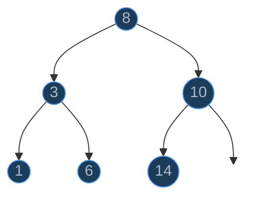
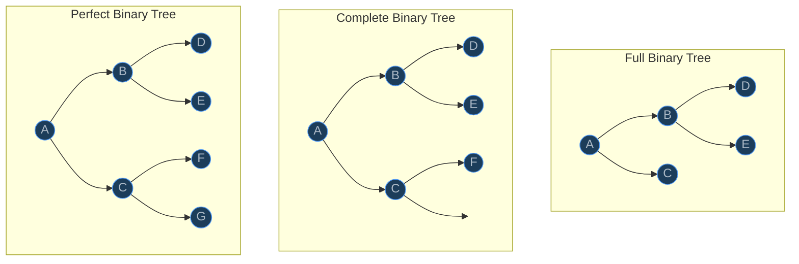
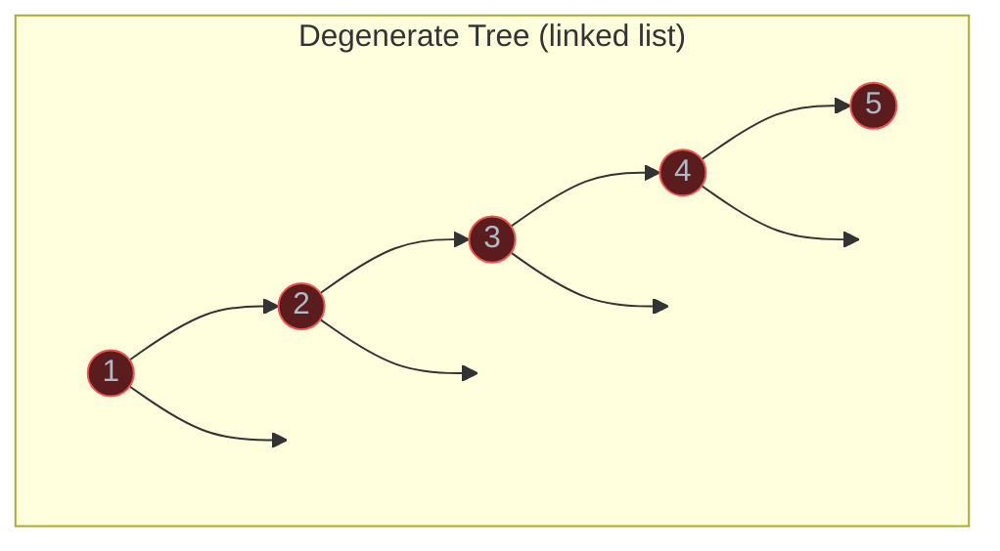
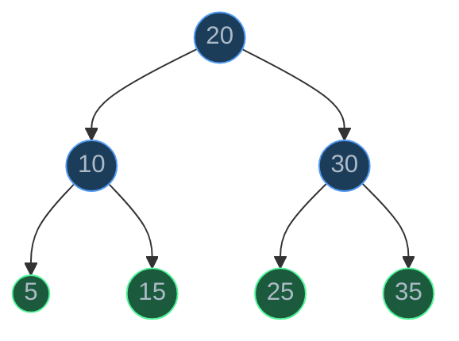
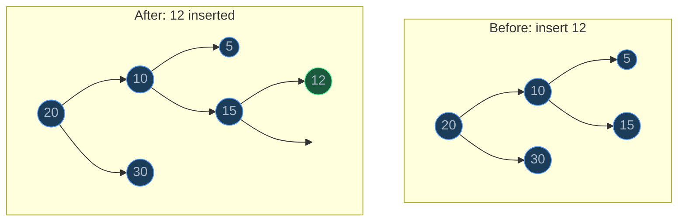
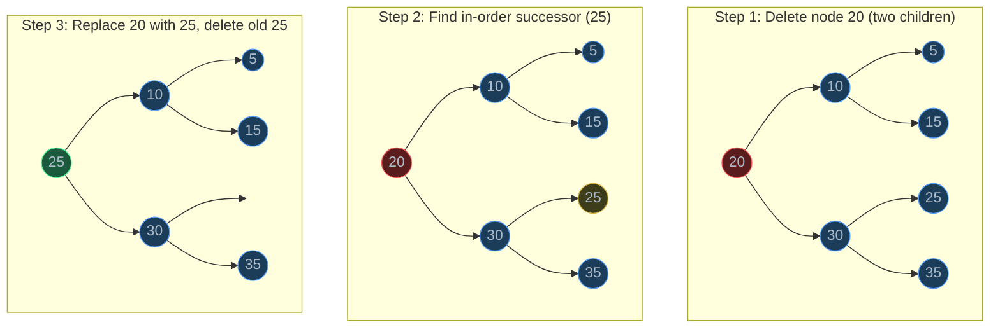
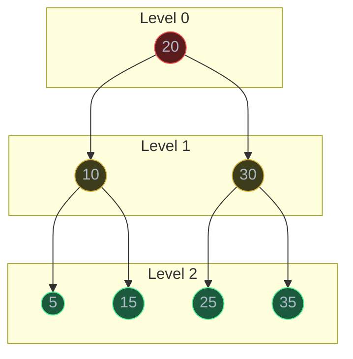

# Trees

> Trees are hierarchical data structures where each node has a parent-child relationship, enabling O(log n) search, insertion, and deletion when balanced — the backbone of file systems, databases, and most of computer science.

## Table of Contents
- [Core Concepts](#core-concepts)
- [Code Examples](#code-examples)
- [Common Pitfalls](#common-pitfalls)
- [Key Takeaways](#key-takeaways)
- [Exercises](#exercises)

## Core Concepts

### Binary Tree Fundamentals

#### What

A binary tree is a hierarchical data structure where each node has at most **two children**, referred to as the **left child** and **right child**. Unlike arrays and linked lists, which are linear, trees branch — one node can lead to multiple paths.



Key terminology you must internalize:

| Term | Definition |
| --- | --- |
| **Root** | The topmost node with no parent (node 8 above) |
| **Leaf** | A node with no children (nodes 1, 6, 14 above) |
| **Internal node** | A node that has at least one child |
| **Edge** | The connection between a parent and a child |
| **Depth** | Distance (number of edges) from the root to a node. Root has depth 0 |
| **Height** | Distance from a node to its deepest descendant leaf. Leaves have height 0 |
| **Level** | All nodes at the same depth. Level 0 = root, level 1 = root's children, etc. |
| **Subtree** | A node and all of its descendants — itself a valid tree |

A critical distinction: **depth** counts downward from the root, **height** counts upward from the leaves. The **height of the tree** equals the depth of its deepest node.

#### How

You build a binary tree by linking nodes. Each node stores a value and two pointers — one to its left child, one to its right child. A `None` pointer means "no child on this side."

```
         8            ← depth 0  (height 2)
        / \
       3   10         ← depth 1
      / \    \
     1   6   14       ← depth 2  (leaves, height 0)
```

The height of this tree is 2 (longest path from root to a leaf has 2 edges).

#### Why It Matters

Trees model hierarchy naturally — things that arrays and linked lists cannot represent well. File systems are trees (directories contain files and subdirectories). HTML/DOM is a tree. JSON is a tree. Organization charts are trees. Understanding tree terminology is the foundation for every tree-based algorithm and data structure that follows: BSTs, heaps, tries, B-trees, and syntax trees.

The height of a tree directly determines the efficiency of operations. A "short and wide" tree (height ~ log n) gives fast operations. A "tall and skinny" tree (height ~ n) degrades to a linked list with slow operations. This single insight drives the entire field of balanced trees.

### Types of Binary Trees

#### What

Not all binary trees are shaped the same. There are precise definitions that describe different structural properties:



| Type | Definition |
| --- | --- |
| **Full** | Every node has either 0 or 2 children — no node has exactly one child |
| **Complete** | All levels are fully filled except possibly the last, which is filled left-to-right |
| **Perfect** | All internal nodes have exactly 2 children AND all leaves are at the same depth |
| **Degenerate** | Every internal node has exactly one child — essentially a linked list |

#### How

- A **perfect** binary tree of height h has exactly `2^(h+1) - 1` nodes. Height 2 gives 7 nodes, height 3 gives 15 nodes. This is the "best case" shape.
- A **complete** binary tree is what heaps use — it can be efficiently stored in an array because the left-to-right filling leaves no gaps.
- A **degenerate** tree has height n-1 for n nodes. This is the "worst case" shape — it's a linked list wearing a tree costume.



#### Why It Matters

The shape of a tree determines performance. A balanced tree (close to complete or perfect) has height O(log n), so operations like search, insert, and delete take O(log n). A degenerate tree has height O(n), so those same operations become O(n) — no better than a linked list. This is exactly why balanced tree variants (AVL, Red-Black, B-Trees) exist: they enforce structural rules that keep the height logarithmic.

### Binary Search Tree (BST) Property

#### What

A Binary Search Tree is a binary tree with one additional invariant: for every node, **all values in the left subtree are less than the node's value**, and **all values in the right subtree are greater than the node's value**. This applies recursively to every node, not just the root.



Reading this tree: 20 is the root. Everything in the left subtree (5, 10, 15) is less than 20. Everything in the right subtree (25, 30, 35) is greater than 20. And this property holds at every level: in the subtree rooted at 10, 5 < 10 < 15.

#### How

The BST property enables **binary search on a tree structure**. To find a value:

1. Compare the target with the current node.
2. If equal, found it.
3. If target is smaller, go left.
4. If target is larger, go right.
5. If you hit `None`, the value doesn't exist.

Each comparison eliminates roughly half the remaining tree — just like binary search on a sorted array.

#### Why It Matters

A sorted array gives O(log n) search via binary search, but O(n) insertion (you must shift elements). A linked list gives O(1) insertion at the head, but O(n) search. A BST combines the best of both: **O(log n) search AND O(log n) insertion** — *when balanced*. This is the fundamental trade-off that makes BSTs useful.

However, the "when balanced" caveat is critical. If you insert already-sorted data into a BST (1, 2, 3, 4, 5...), every node goes to the right and you get a degenerate tree. All operations become O(n). This worst case is why balanced BSTs (AVL trees, Red-Black trees) were invented — they guarantee O(log n) height regardless of insertion order.

### BST Operations: Search

#### What

Searching a BST means following the BST property to navigate from the root to the target value, eliminating half the tree at each step.

#### How

```
Search for 15 in this BST:

    20            20 → 15 < 20, go left
   /  \
  10   30         10 → 15 > 10, go right
 / \   / \
5  15 25  35      15 → found!
```

At each node, one comparison tells you which half of the tree to search. You never visit both subtrees.

#### Why It Matters

Search is the most fundamental BST operation. Its performance determines whether the BST is useful:
- **Balanced BST** (height ~ log n): O(log n) search — excellent.
- **Degenerate BST** (height ~ n): O(n) search — no better than a list.

### BST Operations: Insert

#### What

Insertion places a new value in the correct position to maintain the BST property. The new node is always added as a **leaf** — you never rearrange existing nodes.

#### How

To insert a value, follow the same path as search. When you reach `None`, that's where the new node goes.



Inserting 12: start at 20 (12 < 20, go left), visit 10 (12 > 10, go right), visit 15 (12 < 15, go left), `None` found — insert 12 as the left child of 15.

#### Why It Matters

Insert is O(h) where h is the tree height. For a balanced tree, h = O(log n), so insert is O(log n). For a degenerate tree, h = O(n). This is the same pattern as search — the tree shape determines everything.

Crucially, the insertion order determines the tree shape. Inserting `[20, 10, 30, 5, 15, 25, 35]` creates a balanced tree. Inserting `[5, 10, 15, 20, 25, 30, 35]` (sorted order) creates a degenerate tree. Same data, wildly different performance.

### BST Operations: Delete (Three Cases)

#### What

Deletion is the most complex BST operation because removing a node must preserve the BST property. There are three cases depending on how many children the target node has.

#### How

**Case 1: Deleting a leaf (no children)** — Simply remove it. No children to worry about.

```
Delete 5:                  Result:
    20                       20
   /  \                     /  \
  10   30                  10   30
 / \                        \
5  15                       15
```

**Case 2: Deleting a node with one child** — Replace the node with its only child. The child "moves up" to take its parent's position.

```
Delete 10 (has one child, 15):    Result:
    20                                20
   /  \                              /  \
  10   30                           15   30
   \
   15
```

**Case 3: Deleting a node with two children** — This is the tricky case. You cannot simply remove the node because it has two subtrees that need a new parent. The solution: replace the node's value with its **in-order successor** (the smallest value in the right subtree), then delete the in-order successor from the right subtree.



Why the in-order successor? It's the smallest value larger than the deleted node — the value that "fits" in the deleted node's position while maintaining the BST property. Everything to the left is still smaller, everything to the right is still larger.

You can alternatively use the **in-order predecessor** (largest value in the left subtree). Both approaches are correct.

#### Why It Matters

Delete is O(h) — same as search and insert. Finding the in-order successor requires walking down the right subtree to its leftmost node, which is at most O(h) steps. Understanding the three cases is essential for BST implementation and is a common interview question. The two-children case is where most people stumble.

### Tree Traversals Overview

#### What

A **traversal** visits every node in the tree exactly once in a specific order. There are four standard traversals, and each has different use cases.

The three **depth-first** traversals differ only in *when* they process the current node relative to its children:

| Traversal | Order | Mnemonic |
| --- | --- | --- |
| **In-Order** | Left, Root, Right | "Root in the middle" |
| **Pre-Order** | Root, Left, Right | "Root first (pre)" |
| **Post-Order** | Left, Right, Root | "Root last (post)" |

The one **breadth-first** traversal:

| Traversal | Order | Mnemonic |
| --- | --- | --- |
| **Level-Order** | Level by level, left to right | "Read like a book" |

#### How

Using this tree as our example:


| Traversal | Visit Order | Result |
| --- | --- | --- |
| In-Order | L, Root, R | **5, 10, 15, 20, 25, 30, 35** (sorted!) |
| Pre-Order | Root, L, R | **20, 10, 5, 15, 30, 25, 35** |
| Post-Order | L, R, Root | **5, 15, 10, 25, 35, 30, 20** |
| Level-Order | Level by level | **20, 10, 30, 5, 15, 25, 35** |

#### Why It Matters

Each traversal exists because it solves a specific class of problems:

- **In-Order** on a BST produces sorted output. This is how you retrieve all elements in order. If your in-order traversal of a BST is not sorted, your tree is broken.
- **Pre-Order** captures the tree structure from the top down — useful for serializing/copying a tree (you need to create the root before its children).
- **Post-Order** processes children before their parent — useful for deleting a tree (you must delete children before the parent) and evaluating expression trees (you evaluate operands before applying the operator).
- **Level-Order** (BFS) processes nodes nearest to the root first — useful for finding the shortest path, printing a tree level by level, or finding the minimum depth.

### In-Order Traversal (Left, Root, Right)

#### What

In-order traversal visits the left subtree first, then the current node, then the right subtree. For a BST, this visits nodes in **ascending sorted order**.

#### How

Trace through the example tree:

```
         20
        /  \
      10    30
     / \   / \
    5  15 25  35

In-Order: go left as far as possible, then visit, then go right.

1. Start at 20, go left to 10
2. At 10, go left to 5
3. At 5, no left child → visit 5
4. 5 has no right child → back to 10 → visit 10
5. Go right to 15
6. At 15, no left child → visit 15
7. 15 has no right child → back to 20 → visit 20
8. Go right to 30
9. At 30, go left to 25
10. At 25, no left child → visit 25
11. Back to 30 → visit 30
12. Go right to 35 → visit 35

Result: 5, 10, 15, 20, 25, 30, 35  ← sorted!
```

#### Why It Matters

In-order traversal is the most important traversal for BSTs. It's how you verify the BST property (if the output isn't sorted, the tree isn't a valid BST). It's also how you implement operations like "find the kth smallest element" — do an in-order traversal and count.

### Pre-Order Traversal (Root, Left, Right)

#### What

Pre-order traversal visits the current node **first**, then the left subtree, then the right subtree. It processes the root before its descendants.

#### How

```
         20
        /  \
      10    30
     / \   / \
    5  15 25  35

Pre-Order: visit the node, then go left, then go right.

Visit 20 → Visit 10 → Visit 5 → Visit 15 → Visit 30 → Visit 25 → Visit 35

Result: 20, 10, 5, 15, 30, 25, 35
```

#### Why It Matters

Pre-order captures the tree's structure in a way that allows reconstruction. If you serialize a BST using pre-order traversal, you can rebuild the exact same tree from that sequence. This is because the root always comes first, so you know how to split the remaining elements into left and right subtrees. Pre-order is also how directory trees are printed — you print the directory name before listing its contents.

### Post-Order Traversal (Left, Right, Root)

#### What

Post-order traversal visits the left subtree, then the right subtree, then the current node **last**. It processes children before their parent.

#### How

```
         20
        /  \
      10    30
     / \   / \
    5  15 25  35

Post-Order: go left, go right, then visit the node.

Visit 5 → Visit 15 → Visit 10 → Visit 25 → Visit 35 → Visit 30 → Visit 20

Result: 5, 15, 10, 25, 35, 30, 20
```

#### Why It Matters

Post-order is the correct traversal for **deletion** and **resource cleanup** — you must free children before freeing the parent (otherwise you lose the pointers to the children). It's also used for evaluating **expression trees**: in `(3 + 4) * 5`, you evaluate the operands (3, 4) before applying the operator (+), then evaluate that result with 5 before applying (*).

### Level-Order Traversal (BFS on Trees)

#### What

Level-order traversal visits nodes level by level, from left to right. Unlike the depth-first traversals (in-order, pre-order, post-order), level-order uses **breadth-first search** — it explores all nodes at the current depth before moving deeper.

#### How

Level-order uses a **queue** (FIFO). Start by enqueuing the root. Then repeatedly: dequeue a node, process it, enqueue its children (left first, then right).



```
Step-by-step with queue:

Queue: [20]         → dequeue 20, enqueue 10, 30
Queue: [10, 30]     → dequeue 10, enqueue 5, 15
Queue: [30, 5, 15]  → dequeue 30, enqueue 25, 35
Queue: [5, 15, 25, 35] → dequeue 5 (leaf)
Queue: [15, 25, 35]    → dequeue 15 (leaf)
Queue: [25, 35]         → dequeue 25 (leaf)
Queue: [35]             → dequeue 35 (leaf)
Queue: []               → done

Result: 20, 10, 30, 5, 15, 25, 35
```

#### Why It Matters

Level-order traversal is the tree version of BFS. It naturally discovers the **shallowest** nodes first, making it ideal for problems like:
- **Minimum depth of a tree** — the first leaf you encounter is at the minimum depth.
- **Level-by-level printing** — print each level of the tree on its own line.
- **Shortest path in unweighted graphs** — BFS guarantees the shortest path because it explores all possibilities at distance d before distance d+1.

Level-order is the only traversal that cannot be done naturally with recursion alone — it requires a queue.

### DFS on Trees

#### What

Depth-First Search (DFS) explores as far down one path as possible before backtracking. In-order, pre-order, and post-order are all specific forms of DFS — they just differ in when they "visit" the current node.

#### How

DFS can be implemented two ways:
1. **Recursively** — the call stack implicitly manages the backtracking. This is the natural and most common approach.
2. **Iteratively** — using an explicit stack data structure. This avoids stack overflow on very deep trees and gives you more control.

The recursive approach is simpler to write and understand. The iterative approach is preferred in production code for very deep or unbalanced trees where recursion might hit Python's recursion limit (default: 1000).

#### Why It Matters

DFS is the foundation of most tree algorithms. Almost every tree problem you encounter in interviews or production code uses some form of DFS — checking if a tree is balanced, finding the lowest common ancestor, computing the diameter, serializing, validating BST property, etc. Understanding both recursive and iterative DFS is essential.

### Balanced vs Degenerate BSTs

#### What

The performance of a BST depends entirely on its height. Two extremes define the spectrum:

| Shape | Height | Search/Insert/Delete | When it happens |
| --- | --- | --- | --- |
| **Balanced** (close to perfect) | O(log n) | O(log n) | Random insertion order |
| **Degenerate** (linked list) | O(n) | O(n) | Sorted insertion order |

#### How

Inserting `[4, 2, 6, 1, 3, 5, 7]` creates a balanced BST:

```
       4           height = 2
      / \           n = 7
     2   6          log₂(7) ≈ 2.8 ✓
    / \ / \
   1  3 5  7
```

Inserting `[1, 2, 3, 4, 5, 6, 7]` (sorted) creates a degenerate BST:

```
   1                  height = 6
    \                  n = 7
     2                 log₂(7) ≈ 2.8
      \                but actual height is 6!
       3
        \
         4
          \
           5
            \
             6
              \
               7
```

#### Why It Matters

This is the fundamental problem with plain BSTs: the insertion order controls the tree shape, and the tree shape controls performance. If your application inserts data in sorted or nearly-sorted order (which is extremely common — think timestamps, auto-incrementing IDs, alphabetical names), a plain BST degrades to O(n).

This is why self-balancing BSTs exist:
- **AVL trees** — rebalance after every insertion via rotations, guaranteeing height <= 1.44 * log₂(n).
- **Red-Black trees** — used in Java's `TreeMap`, C++'s `std::map`. Slightly less balanced than AVL but fewer rotations.
- **B-Trees** — used in databases and file systems. Optimized for disk access.

You'll study these in Week 8. For now, understand that the plain BST is the starting point, and its weakness (degenerate shape from sorted input) motivates everything that comes next.

## Code Examples

### TreeNode Dataclass

```python
from __future__ import annotations
from dataclasses import dataclass


@dataclass
class TreeNode:
    """A node in a binary tree.

    Using a dataclass gives us __init__, __repr__, and __eq__ for free.
    The left and right children default to None (leaf node).
    """
    val: int
    left: TreeNode | None = None
    right: TreeNode | None = None


# Build a small tree manually:
#       20
#      /  \
#    10    30
#   / \   / \
#  5  15 25  35
root = TreeNode(20,
    left=TreeNode(10,
        left=TreeNode(5),
        right=TreeNode(15)),
    right=TreeNode(30,
        left=TreeNode(25),
        right=TreeNode(35)))

print(root)
# TreeNode(val=20, left=TreeNode(val=10, ...), right=TreeNode(val=30, ...))
```

### BST Class with Insert, Search, and Delete

```python
from __future__ import annotations
from dataclasses import dataclass


@dataclass
class TreeNode:
    val: int
    left: TreeNode | None = None
    right: TreeNode | None = None


class BST:
    """Binary Search Tree with insert, search, and delete operations.

    Maintains the BST invariant: left < node < right at every node.
    """

    def __init__(self) -> None:
        self.root: TreeNode | None = None

    def insert(self, val: int) -> None:
        """Insert a value into the BST.

        Time:  O(h) where h is the tree height — we walk one path from root to leaf.
        Space: O(h) due to recursion stack.

        For a balanced tree, h = O(log n). For a degenerate tree, h = O(n).
        """
        self.root = self._insert(self.root, val)

    def _insert(self, node: TreeNode | None, val: int) -> TreeNode:
        # Base case: found the right spot — create a new leaf
        if node is None:
            return TreeNode(val)

        # Recursive case: navigate left or right based on BST property
        if val < node.val:
            node.left = self._insert(node.left, val)
        elif val > node.val:
            node.right = self._insert(node.right, val)
        # If val == node.val, we ignore duplicates (common BST convention)

        return node

    def search(self, val: int) -> TreeNode | None:
        """Search for a value in the BST.

        Time:  O(h) — each comparison eliminates one subtree.
        Space: O(h) due to recursion stack. Can be made O(1) iteratively.

        Returns the node if found, None otherwise.
        """
        return self._search(self.root, val)

    def _search(self, node: TreeNode | None, val: int) -> TreeNode | None:
        # Base cases: not found or exact match
        if node is None or node.val == val:
            return node

        # Navigate left or right based on BST property
        if val < node.val:
            return self._search(node.left, val)
        return self._search(node.right, val)

    def search_iterative(self, val: int) -> TreeNode | None:
        """Iterative search — O(1) space, no recursion overhead.

        Time:  O(h) — same as recursive version.
        Space: O(1) — no recursion stack, just a pointer.
        """
        current = self.root
        while current is not None:
            if val == current.val:
                return current
            elif val < current.val:
                current = current.left
            else:
                current = current.right
        return None

    def delete(self, val: int) -> None:
        """Delete a value from the BST.

        Time:  O(h) — navigate to node + find in-order successor.
        Space: O(h) due to recursion stack.

        Handles all three cases:
        1. Leaf node (no children) — just remove it
        2. One child — replace node with its only child
        3. Two children — replace with in-order successor, delete successor
        """
        self.root = self._delete(self.root, val)

    def _delete(self, node: TreeNode | None, val: int) -> TreeNode | None:
        # Base case: value not found
        if node is None:
            return None

        # Navigate to the node to delete
        if val < node.val:
            node.left = self._delete(node.left, val)
        elif val > node.val:
            node.right = self._delete(node.right, val)
        else:
            # Found the node to delete — handle three cases

            # Case 1 & 2: Node has zero or one child
            if node.left is None:
                return node.right  # Replace with right child (or None if leaf)
            if node.right is None:
                return node.left   # Replace with left child

            # Case 3: Node has two children
            # Find the in-order successor (smallest node in right subtree)
            successor = self._find_min(node.right)
            # Replace current node's value with successor's value
            node.val = successor.val
            # Delete the successor from the right subtree
            # (successor has at most one child — its right child)
            node.right = self._delete(node.right, successor.val)

        return node

    def _find_min(self, node: TreeNode) -> TreeNode:
        """Find the node with the minimum value in a subtree.

        The minimum is always the leftmost node.
        Time: O(h) — walk left until no more left children.
        """
        current = node
        while current.left is not None:
            current = current.left
        return current

    def inorder(self) -> list[int]:
        """Return values in sorted order via in-order traversal."""
        result: list[int] = []
        self._inorder(self.root, result)
        return result

    def _inorder(self, node: TreeNode | None, result: list[int]) -> None:
        if node is None:
            return
        self._inorder(node.left, result)
        result.append(node.val)
        self._inorder(node.right, result)


# --- Demo ---
bst = BST()
for val in [20, 10, 30, 5, 15, 25, 35]:
    bst.insert(val)

print(f"In-order: {bst.inorder()}")
# In-order: [5, 10, 15, 20, 25, 30, 35]

print(f"Search 15: {bst.search(15)}")
# Search 15: TreeNode(val=15, left=None, right=None)

print(f"Search 99: {bst.search(99)}")
# Search 99: None

bst.delete(20)  # Delete root (two children case)
print(f"After deleting 20: {bst.inorder()}")
# After deleting 20: [5, 10, 15, 25, 30, 35]

bst.delete(5)   # Delete leaf
print(f"After deleting 5: {bst.inorder()}")
# After deleting 5: [10, 15, 25, 30, 35]
```

**Time**: All operations are O(h) where h is the tree height. Balanced: O(log n). Degenerate: O(n).
**Space**: O(h) for the recursion stack. Iterative search reduces this to O(1).

### Recursive Traversals (All Four)

```python
from __future__ import annotations
from collections import deque
from dataclasses import dataclass


@dataclass
class TreeNode:
    val: int
    left: TreeNode | None = None
    right: TreeNode | None = None


def inorder_recursive(root: TreeNode | None) -> list[int]:
    """In-Order Traversal: Left → Root → Right.

    For BSTs, this produces sorted output.
    Time:  O(n) — visits every node exactly once.
    Space: O(h) — recursion stack depth equals tree height.
    """
    if root is None:
        return []
    return (
        inorder_recursive(root.left)
        + [root.val]
        + inorder_recursive(root.right)
    )


def preorder_recursive(root: TreeNode | None) -> list[int]:
    """Pre-Order Traversal: Root → Left → Right.

    Useful for serializing/copying a tree (root comes first).
    Time:  O(n) — visits every node exactly once.
    Space: O(h) — recursion stack depth equals tree height.
    """
    if root is None:
        return []
    return (
        [root.val]
        + preorder_recursive(root.left)
        + preorder_recursive(root.right)
    )


def postorder_recursive(root: TreeNode | None) -> list[int]:
    """Post-Order Traversal: Left → Right → Root.

    Useful for deletion (children before parent) and expression evaluation.
    Time:  O(n) — visits every node exactly once.
    Space: O(h) — recursion stack depth equals tree height.
    """
    if root is None:
        return []
    return (
        postorder_recursive(root.left)
        + postorder_recursive(root.right)
        + [root.val]
    )


def levelorder(root: TreeNode | None) -> list[int]:
    """Level-Order Traversal (BFS): level by level, left to right.

    Uses a queue to process nodes breadth-first.
    Time:  O(n) — visits every node exactly once.
    Space: O(w) — where w is the maximum width of the tree.
           For a complete binary tree, the last level has ~n/2 nodes, so O(n).
    """
    if root is None:
        return []

    result: list[int] = []
    queue: deque[TreeNode] = deque([root])

    while queue:
        node = queue.popleft()  # O(1) dequeue from left
        result.append(node.val)

        if node.left is not None:
            queue.append(node.left)
        if node.right is not None:
            queue.append(node.right)

    return result


# --- Demo ---
#       20
#      /  \
#    10    30
#   / \   / \
#  5  15 25  35
root = TreeNode(20,
    left=TreeNode(10, left=TreeNode(5), right=TreeNode(15)),
    right=TreeNode(30, left=TreeNode(25), right=TreeNode(35)))

print(f"In-Order:    {inorder_recursive(root)}")
# In-Order:    [5, 10, 15, 20, 25, 30, 35]

print(f"Pre-Order:   {preorder_recursive(root)}")
# Pre-Order:   [20, 10, 5, 15, 30, 25, 35]

print(f"Post-Order:  {postorder_recursive(root)}")
# Post-Order:  [5, 15, 10, 25, 35, 30, 20]

print(f"Level-Order: {levelorder(root)}")
# Level-Order: [20, 10, 30, 5, 15, 25, 35]
```

**Time**: O(n) for all traversals — every node is visited exactly once.
**Space**: O(h) for depth-first (recursion stack). O(w) for level-order (queue width, worst case O(n)).

### Iterative Traversals Using an Explicit Stack

```python
from __future__ import annotations
from dataclasses import dataclass


@dataclass
class TreeNode:
    val: int
    left: TreeNode | None = None
    right: TreeNode | None = None


def inorder_iterative(root: TreeNode | None) -> list[int]:
    """Iterative In-Order: Left → Root → Right.

    Uses an explicit stack instead of recursion. The idea: push nodes
    as you go left. When you can't go left anymore, pop (visit), then
    go right.

    Time:  O(n) — each node is pushed and popped exactly once.
    Space: O(h) — stack holds at most h nodes (one path from root to leaf).
    """
    result: list[int] = []
    stack: list[TreeNode] = []
    current = root

    while current is not None or stack:
        # Go as far left as possible, pushing each node
        while current is not None:
            stack.append(current)
            current = current.left

        # Pop the leftmost unvisited node
        current = stack.pop()
        result.append(current.val)  # Visit

        # Move to the right subtree
        current = current.right

    return result


def preorder_iterative(root: TreeNode | None) -> list[int]:
    """Iterative Pre-Order: Root → Left → Right.

    Visit root first, then push right child before left child
    (so left is processed first, since stack is LIFO).

    Time:  O(n) — each node is pushed and popped exactly once.
    Space: O(h) — stack holds at most h nodes.
    """
    if root is None:
        return []

    result: list[int] = []
    stack: list[TreeNode] = [root]

    while stack:
        node = stack.pop()
        result.append(node.val)  # Visit root first

        # Push right before left — left will be popped first (LIFO)
        if node.right is not None:
            stack.append(node.right)
        if node.left is not None:
            stack.append(node.left)

    return result


def postorder_iterative(root: TreeNode | None) -> list[int]:
    """Iterative Post-Order: Left → Right → Root.

    Trick: Post-order is the reverse of a modified pre-order (Root → Right → Left).
    So we do pre-order but push left before right, then reverse the result.

    Time:  O(n) — each node is pushed and popped once, plus one O(n) reverse.
    Space: O(h) — stack, plus O(n) for the result list.
    """
    if root is None:
        return []

    result: list[int] = []
    stack: list[TreeNode] = [root]

    while stack:
        node = stack.pop()
        result.append(node.val)

        # Push left before right — right will be popped first
        # This gives us Root → Right → Left order
        if node.left is not None:
            stack.append(node.left)
        if node.right is not None:
            stack.append(node.right)

    # Reverse to get Left → Right → Root
    result.reverse()
    return result


# --- Demo ---
root = TreeNode(20,
    left=TreeNode(10, left=TreeNode(5), right=TreeNode(15)),
    right=TreeNode(30, left=TreeNode(25), right=TreeNode(35)))

print(f"Iterative In-Order:   {inorder_iterative(root)}")
# [5, 10, 15, 20, 25, 30, 35]

print(f"Iterative Pre-Order:  {preorder_iterative(root)}")
# [20, 10, 5, 15, 30, 25, 35]

print(f"Iterative Post-Order: {postorder_iterative(root)}")
# [5, 15, 10, 25, 35, 30, 20]
```

**Time**: O(n) for all iterative traversals.
**Space**: O(h) for the stack. The iterative approach avoids Python's recursion limit (default 1000), which matters for deep/unbalanced trees.

### Level-Order Traversal with Level Separation

```python
from __future__ import annotations
from collections import deque
from dataclasses import dataclass


@dataclass
class TreeNode:
    val: int
    left: TreeNode | None = None
    right: TreeNode | None = None


def levelorder_by_level(root: TreeNode | None) -> list[list[int]]:
    """Level-Order traversal that groups nodes by their level.

    Returns a list of lists, where each inner list contains the values
    at that level. This is a very common interview variation.

    The key insight: process all nodes at the current level before
    moving to the next. We do this by recording the queue size at the
    start of each level and processing exactly that many nodes.

    Time:  O(n) — every node is enqueued and dequeued exactly once.
    Space: O(w) — the queue holds at most one level's worth of nodes.
           For a complete binary tree, the last level has ~n/2 nodes.
    """
    if root is None:
        return []

    result: list[list[int]] = []
    queue: deque[TreeNode] = deque([root])

    while queue:
        level_size = len(queue)  # Number of nodes at current level
        level_values: list[int] = []

        for _ in range(level_size):
            node = queue.popleft()
            level_values.append(node.val)

            if node.left is not None:
                queue.append(node.left)
            if node.right is not None:
                queue.append(node.right)

        result.append(level_values)

    return result


def print_tree_levels(root: TreeNode | None) -> None:
    """Pretty-print a tree level by level."""
    levels = levelorder_by_level(root)
    for i, level in enumerate(levels):
        print(f"  Level {i}: {level}")


# --- Demo ---
root = TreeNode(20,
    left=TreeNode(10, left=TreeNode(5), right=TreeNode(15)),
    right=TreeNode(30, left=TreeNode(25), right=TreeNode(35)))

print("Level-order (grouped):")
print_tree_levels(root)
# Level 0: [20]
# Level 1: [10, 30]
# Level 2: [5, 15, 25, 35]

print(f"\nAs nested list: {levelorder_by_level(root)}")
# As nested list: [[20], [10, 30], [5, 15, 25, 35]]
```

**Time**: O(n) — every node visited once.
**Space**: O(w) where w is the maximum width of the tree (last level can hold up to n/2 nodes in a complete tree).

### DFS: Recursive and Iterative

```python
from __future__ import annotations
from dataclasses import dataclass


@dataclass
class TreeNode:
    val: int
    left: TreeNode | None = None
    right: TreeNode | None = None


def dfs_recursive(root: TreeNode | None) -> list[int]:
    """DFS using recursion — the natural approach.

    This is pre-order DFS (root first). The call stack manages backtracking.
    Time:  O(n) — visit every node once.
    Space: O(h) — recursion depth equals tree height.
    """
    if root is None:
        return []
    return [root.val] + dfs_recursive(root.left) + dfs_recursive(root.right)


def dfs_iterative(root: TreeNode | None) -> list[int]:
    """DFS using an explicit stack — avoids recursion limit.

    Identical behavior to recursive DFS (pre-order).
    Push right before left so left is processed first (stack is LIFO).

    Time:  O(n) — visit every node once.
    Space: O(h) — stack holds at most h nodes (one root-to-leaf path).
    """
    if root is None:
        return []

    result: list[int] = []
    stack: list[TreeNode] = [root]

    while stack:
        node = stack.pop()
        result.append(node.val)

        # Push right first so left is popped first (LIFO)
        if node.right is not None:
            stack.append(node.right)
        if node.left is not None:
            stack.append(node.left)

    return result


def tree_height(root: TreeNode | None) -> int:
    """Calculate the height of a binary tree using DFS.

    Height = max distance from root to any leaf.
    A single node has height 0. An empty tree has height -1.

    Time:  O(n) — visit every node to find the deepest leaf.
    Space: O(h) — recursion stack.
    """
    if root is None:
        return -1  # Convention: empty tree has height -1
    return 1 + max(tree_height(root.left), tree_height(root.right))


def count_nodes(root: TreeNode | None) -> int:
    """Count total nodes in a binary tree using DFS.

    Time:  O(n) — visit every node.
    Space: O(h) — recursion stack.
    """
    if root is None:
        return 0
    return 1 + count_nodes(root.left) + count_nodes(root.right)


# --- Demo ---
root = TreeNode(20,
    left=TreeNode(10, left=TreeNode(5), right=TreeNode(15)),
    right=TreeNode(30, left=TreeNode(25), right=TreeNode(35)))

print(f"DFS recursive: {dfs_recursive(root)}")
# DFS recursive: [20, 10, 5, 15, 30, 25, 35]

print(f"DFS iterative: {dfs_iterative(root)}")
# DFS iterative: [20, 10, 5, 15, 30, 25, 35]

print(f"Tree height: {tree_height(root)}")
# Tree height: 2

print(f"Node count: {count_nodes(root)}")
# Node count: 7
```

**Time**: O(n) for all DFS operations — must visit every node.
**Space**: O(h) for recursive (call stack) or iterative (explicit stack), where h is tree height.

### Demonstrating Degenerate BST

```python
from __future__ import annotations
from dataclasses import dataclass


@dataclass
class TreeNode:
    val: int
    left: TreeNode | None = None
    right: TreeNode | None = None


def insert_bst(root: TreeNode | None, val: int) -> TreeNode:
    """Insert into a BST (returns root)."""
    if root is None:
        return TreeNode(val)
    if val < root.val:
        root.left = insert_bst(root.left, val)
    elif val > root.val:
        root.right = insert_bst(root.right, val)
    return root


def tree_height(root: TreeNode | None) -> int:
    if root is None:
        return -1
    return 1 + max(tree_height(root.left), tree_height(root.right))


def count_nodes(root: TreeNode | None) -> int:
    if root is None:
        return 0
    return 1 + count_nodes(root.left) + count_nodes(root.right)


# Balanced insertion order
balanced_root: TreeNode | None = None
for val in [20, 10, 30, 5, 15, 25, 35]:
    balanced_root = insert_bst(balanced_root, val)

# Sorted insertion order — creates degenerate tree
degenerate_root: TreeNode | None = None
for val in [5, 10, 15, 20, 25, 30, 35]:
    degenerate_root = insert_bst(degenerate_root, val)

n_balanced = count_nodes(balanced_root)
h_balanced = tree_height(balanced_root)
n_degenerate = count_nodes(degenerate_root)
h_degenerate = tree_height(degenerate_root)

print(f"Balanced:   {n_balanced} nodes, height {h_balanced} (ideal: {n_balanced - 1:.0f} max, log₂: ~2.8)")
# Balanced:   7 nodes, height 2 (ideal: 6 max, log₂: ~2.8)

print(f"Degenerate: {n_degenerate} nodes, height {h_degenerate} (worst case!)")
# Degenerate: 7 nodes, height 6 (worst case!)

print(f"\nBalanced search: ~{h_balanced} comparisons")
print(f"Degenerate search: ~{h_degenerate} comparisons")
print(f"For 7 nodes, balanced is {h_degenerate / max(h_balanced, 1):.1f}x faster!")
```

**Time**: O(n * h) to build the tree (n insertions, each O(h)). Balanced: O(n log n). Degenerate: O(n^2).
**Space**: O(n) for the tree itself. O(h) for recursion stack during operations.

### Validating BST Property

```python
from __future__ import annotations
from dataclasses import dataclass


@dataclass
class TreeNode:
    val: int
    left: TreeNode | None = None
    right: TreeNode | None = None


def is_valid_bst(root: TreeNode | None) -> bool:
    """Check if a binary tree satisfies the BST property.

    The key insight: it's NOT enough to check node.left.val < node.val < node.right.val.
    You must ensure ALL nodes in the left subtree are less than the current node,
    and ALL nodes in the right subtree are greater. We do this by passing down
    valid min/max bounds.

    Time:  O(n) — visit every node once.
    Space: O(h) — recursion stack.
    """
    return _validate(root, lower=float("-inf"), upper=float("inf"))


def _validate(node: TreeNode | None, lower: float, upper: float) -> bool:
    if node is None:
        return True  # Empty tree is a valid BST

    # Current node must be within (lower, upper) range
    if node.val <= lower or node.val >= upper:
        return False

    # Left subtree: all values must be < node.val (update upper bound)
    # Right subtree: all values must be > node.val (update lower bound)
    return (
        _validate(node.left, lower, node.val)
        and _validate(node.right, node.val, upper)
    )


# Valid BST
valid = TreeNode(20,
    left=TreeNode(10, left=TreeNode(5), right=TreeNode(15)),
    right=TreeNode(30, left=TreeNode(25), right=TreeNode(35)))

# Invalid BST — 25 is in the left subtree of 20 but 25 > 20
invalid = TreeNode(20,
    left=TreeNode(10, left=TreeNode(5), right=TreeNode(25)),  # 25 violates!
    right=TreeNode(30))

print(f"Valid BST:   {is_valid_bst(valid)}")    # True
print(f"Invalid BST: {is_valid_bst(invalid)}")  # False
```

**Time**: O(n) — must check every node to confirm validity.
**Space**: O(h) — recursion stack depth.

## Common Pitfalls

### Pitfall 1: Only Checking Immediate Children for BST Validity

```python
from __future__ import annotations
from dataclasses import dataclass


@dataclass
class TreeNode:
    val: int
    left: TreeNode | None = None
    right: TreeNode | None = None


# BAD — only checks parent-child relationship, misses deeper violations
def is_bst_wrong(node: TreeNode | None) -> bool:
    if node is None:
        return True
    if node.left and node.left.val >= node.val:
        return False
    if node.right and node.right.val <= node.val:
        return False
    return is_bst_wrong(node.left) and is_bst_wrong(node.right)


# This tree passes the wrong check but is NOT a valid BST:
#      20
#     /  \
#   10    30
#    \
#     25    ← 25 > 20, violates BST property for root!
broken = TreeNode(20,
    left=TreeNode(10, right=TreeNode(25)),
    right=TreeNode(30))

print(f"Wrong check says: {is_bst_wrong(broken)}")  # True (WRONG!)


# GOOD — pass min/max bounds down the recursion
def is_bst_correct(
    node: TreeNode | None,
    lower: float = float("-inf"),
    upper: float = float("inf"),
) -> bool:
    if node is None:
        return True
    if node.val <= lower or node.val >= upper:
        return False
    return (
        is_bst_correct(node.left, lower, node.val)
        and is_bst_correct(node.right, node.val, upper)
    )


print(f"Correct check says: {is_bst_correct(broken)}")  # False (CORRECT!)
```

Why it's wrong: Node 25 is in the left subtree of 20, so it must be less than 20. But the naive check only compares 25 with its parent 10 (25 > 10, so it goes right — looks fine locally). The correct approach passes cumulative bounds: the left subtree of 20 must have all values in (-inf, 20), so 25 fails.

### Pitfall 2: Using a List as a Queue for BFS

```python
from __future__ import annotations
from collections import deque
from dataclasses import dataclass


@dataclass
class TreeNode:
    val: int
    left: TreeNode | None = None
    right: TreeNode | None = None


root = TreeNode(1, left=TreeNode(2), right=TreeNode(3))

# BAD — list.pop(0) is O(n) because it shifts all remaining elements
def bfs_slow(root: TreeNode | None) -> list[int]:
    if root is None:
        return []
    result: list[int] = []
    queue: list[TreeNode] = [root]  # Using list as queue
    while queue:
        node = queue.pop(0)  # O(n) — shifts all elements left!
        result.append(node.val)
        if node.left:
            queue.append(node.left)
        if node.right:
            queue.append(node.right)
    return result


# GOOD — deque.popleft() is O(1) using a doubly-linked list internally
def bfs_fast(root: TreeNode | None) -> list[int]:
    if root is None:
        return []
    result: list[int] = []
    queue: deque[TreeNode] = deque([root])  # Using deque as queue
    while queue:
        node = queue.popleft()  # O(1) — no shifting!
        result.append(node.val)
        if node.left:
            queue.append(node.left)
        if node.right:
            queue.append(node.right)
    return result
```

Why it's wrong: `list.pop(0)` is O(n) because Python's list is a dynamic array — removing the first element requires shifting every other element one position to the left. For BFS on a tree with n nodes, this turns an O(n) algorithm into O(n^2). `collections.deque` is implemented as a doubly-linked list and gives O(1) popleft.

### Pitfall 3: Forgetting the Base Case in Tree Recursion

```python
from __future__ import annotations
from dataclasses import dataclass


@dataclass
class TreeNode:
    val: int
    left: TreeNode | None = None
    right: TreeNode | None = None


# BAD — crashes with AttributeError when node.left or node.right is None
def tree_sum_wrong(node: TreeNode) -> int:
    return node.val + tree_sum_wrong(node.left) + tree_sum_wrong(node.right)
    # When node.left is None, this calls tree_sum_wrong(None)
    # → AttributeError: 'NoneType' object has no attribute 'val'


# GOOD — handle the None base case before accessing attributes
def tree_sum_correct(node: TreeNode | None) -> int:
    if node is None:
        return 0
    return node.val + tree_sum_correct(node.left) + tree_sum_correct(node.right)


root = TreeNode(1, left=TreeNode(2), right=TreeNode(3))
print(f"Sum: {tree_sum_correct(root)}")  # 6
```

Why it's wrong: Every recursive tree function must handle the `None` case. A leaf node has `left=None` and `right=None`, so the recursion will always eventually call the function with `None`. Forgetting this base case is the most common bug in tree code.

### Pitfall 4: Confusing BST Delete Cases

```python
from __future__ import annotations
from dataclasses import dataclass


@dataclass
class TreeNode:
    val: int
    left: TreeNode | None = None
    right: TreeNode | None = None


# BAD — tries to delete a node with two children by just removing it
def delete_wrong(root: TreeNode | None, val: int) -> TreeNode | None:
    if root is None:
        return None
    if val < root.val:
        root.left = delete_wrong(root.left, val)
    elif val > root.val:
        root.right = delete_wrong(root.right, val)
    else:
        # WRONG: just returns None, losing both subtrees!
        return None
    return root


# GOOD — handle all three cases properly
def delete_correct(root: TreeNode | None, val: int) -> TreeNode | None:
    if root is None:
        return None
    if val < root.val:
        root.left = delete_correct(root.left, val)
    elif val > root.val:
        root.right = delete_correct(root.right, val)
    else:
        # Case 1 & 2: zero or one child
        if root.left is None:
            return root.right
        if root.right is None:
            return root.left
        # Case 3: two children — replace with in-order successor
        successor = root.right
        while successor.left is not None:
            successor = successor.left
        root.val = successor.val
        root.right = delete_correct(root.right, successor.val)
    return root
```

Why it's wrong: When deleting a node with two children, returning `None` discards both subtrees — you lose data. The correct approach replaces the deleted node's value with its in-order successor (smallest value in the right subtree), preserving both subtrees and the BST property.

## Key Takeaways

- **Trees are hierarchical** — unlike linear structures (arrays, linked lists), trees branch. This branching enables O(log n) operations when the tree is balanced, because each step eliminates roughly half the remaining nodes.

- **The BST property (left < node < right) enables binary search on a dynamic structure** — you get O(log n) search, insert, and delete without the O(n) insertion cost of sorted arrays. But this only holds when the tree is balanced; sorted input creates a degenerate tree with O(n) operations.

- **In-order traversal of a BST produces sorted output** — this is the fundamental connection between BSTs and sorting. If your in-order traversal isn't sorted, your BST is broken.

- **Use `collections.deque` for BFS, not `list`** — `deque.popleft()` is O(1), while `list.pop(0)` is O(n). This distinction turns O(n) BFS into O(n^2) if you use a list as a queue.

- **Always handle `None` as the base case in tree recursion** — every path through a tree eventually reaches `None` (the children of leaves). Forgetting this base case is the single most common tree bug.

## Exercises

1. **Write a function** `tree_height(root: TreeNode | None) -> int` that returns the height of a binary tree. An empty tree has height -1, a single node has height 0. Analyze the time and space complexity. Then write an iterative version using level-order traversal (BFS) — how does the space complexity compare?

2. **Explain** why inserting elements `[1, 2, 3, 4, 5]` into an empty BST produces O(n) search time, while inserting `[3, 1, 4, 2, 5]` produces O(log n) search time. Draw both resulting trees. What insertion order would produce a perfect BST for the values 1 through 7?

3. **Write a function** `kth_smallest(root: TreeNode | None, k: int) -> int` that returns the kth smallest element in a BST. First implement it using in-order traversal (collecting all values into a list), then optimize it to stop early once you've found the kth element without collecting the full list. What are the time and space complexities of each approach?

4. **Write a function** `level_order_zigzag(root: TreeNode | None) -> list[list[int]]` that returns the level-order traversal but alternates direction at each level: left-to-right for level 0, right-to-left for level 1, left-to-right for level 2, and so on. For example, on the tree `[20, 10, 30, 5, 15, 25, 35]`, return `[[20], [30, 10], [5, 15, 25, 35]]`.

5. **Write a function** `lowest_common_ancestor(root: TreeNode | None, p: int, q: int) -> int | None` that finds the lowest common ancestor of two values in a BST. The LCA is the deepest node that is an ancestor of both p and q. Exploit the BST property — you should not need to search both subtrees. Analyze the time and space complexity.

---
up:: [Schedule](../../Schedule.md)
#type/learning #source/self-study #status/seed
