# Balanced Trees

> A balanced tree guarantees O(log n) operations by keeping its height proportional to log n — preventing the degenerate O(n) case that plagues naive binary search trees.

## Table of Contents
- [Core Concepts](#core-concepts)
- [Code Examples](#code-examples)
- [Common Pitfalls](#common-pitfalls)
- [Key Takeaways](#key-takeaways)
- [Exercises](#exercises)

## Core Concepts

### Why Balancing Matters

#### What

A binary search tree (BST) promises O(log n) search, insert, and delete — but only when the tree is roughly balanced. An **unbalanced** BST can degrade into a shape that's effectively a linked list, where every operation becomes O(n).

The worst case is trivial to trigger: insert elements in sorted order.

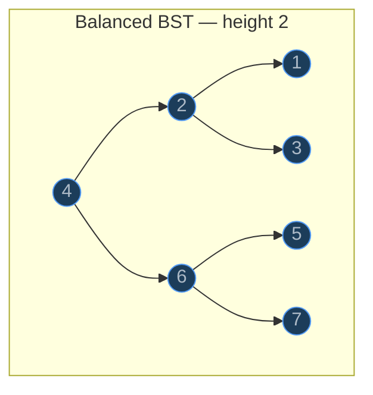

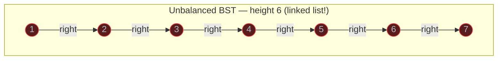

#### How

Inserting `1, 2, 3, 4, 5, 6, 7` into a BST (without balancing) produces a right-skewed chain. Searching for `7` requires traversing all 7 nodes — exactly like searching a linked list.

With n nodes, a balanced BST has height ~log₂(n), so 7 nodes need at most 3 comparisons. The degenerate BST has height n - 1, so 7 nodes need 7 comparisons. At 1 million nodes, that is the difference between 20 comparisons and 1 million.

#### Why It Matters

The promise of a BST is O(log n), but that promise is conditional on balance. Without a balancing strategy, a BST is unreliable — its performance depends entirely on the insertion order, which you often cannot control. Self-balancing trees like AVL trees and Red-Black trees exist specifically to enforce this guarantee. Every database index, every language runtime's sorted map implementation (Java `TreeMap`, C++ `std::map`), and every in-memory ordered data structure uses a self-balancing tree.

### AVL Trees — Concept and Balance Factor

#### What

An **AVL tree** (named after its inventors Adelson-Velsky and Landis, 1962) is a self-balancing BST where every node maintains a **balance factor**:

```
balance_factor(node) = height(left_subtree) - height(right_subtree)
```

The AVL invariant requires that every node's balance factor is **-1, 0, or +1**. If an insertion or deletion violates this, the tree performs **rotations** to restore balance.

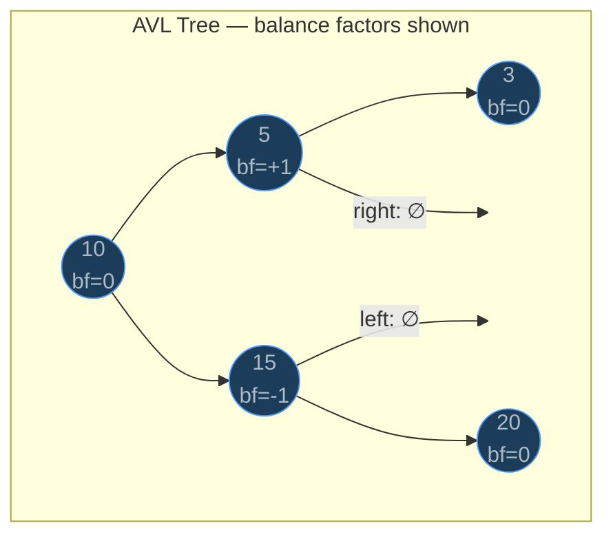

In this tree, node 5 has a left child of height 1 and no right child (height 0 for null), so `bf = 1 - 0 = +1`. Node 15 has no left child and a right child of height 1, so `bf = 0 - 1 = -1`. Both are within the allowed range.

#### How

After every insertion or deletion, the AVL tree walks back up from the modified node to the root, recalculating heights and balance factors. If any node's balance factor becomes +2 or -2, the tree applies one of four rotation types to restore balance. The beauty is that at most **one rotation (possibly a double rotation)** is needed per insertion to fix the entire tree.

The height of an AVL tree with n nodes is always between `log₂(n+1)` and `1.44 × log₂(n+2)`. This means AVL trees are **stricter** than Red-Black trees — they keep the tree more tightly balanced, resulting in slightly faster lookups but slightly more expensive insertions (more rotations on average).

#### Why It Matters

The balance factor is the mechanism that converts the vague goal of "keep the tree balanced" into a precise, checkable invariant. Because the constraint is local (each node checks its own balance factor), the tree can be repaired locally (with rotations) rather than requiring a global restructuring. This locality is what makes self-balancing trees efficient — rebalancing after insertion is O(log n) because you walk up at most the height of the tree, and each rotation is O(1).

### AVL Rotations — The Four Cases

#### What

When a node's balance factor reaches +2 or -2 after insertion, the tree is imbalanced. There are exactly **four patterns** of imbalance, each with a specific rotation fix:

| Case | Imbalance Pattern | Fix | Description |
| --- | --- | --- | --- |
| **LL** | Insert into left child's left subtree | Right rotation | Single rotation |
| **RR** | Insert into right child's right subtree | Left rotation | Single rotation |
| **LR** | Insert into left child's right subtree | Left-Right rotation | Double rotation |
| **RL** | Insert into right child's left subtree | Right-Left rotation | Double rotation |

#### How

**Left Rotation (RR case)** — The right subtree is too heavy.

Node `x` is imbalanced with bf = -2 because its right child `y` is too tall. We rotate `y` up to become the new root of this subtree, and `x` becomes `y`'s left child. The key insight: `y`'s left subtree (call it `T2`) was between `x` and `y` in value, so it becomes `x`'s new right child.

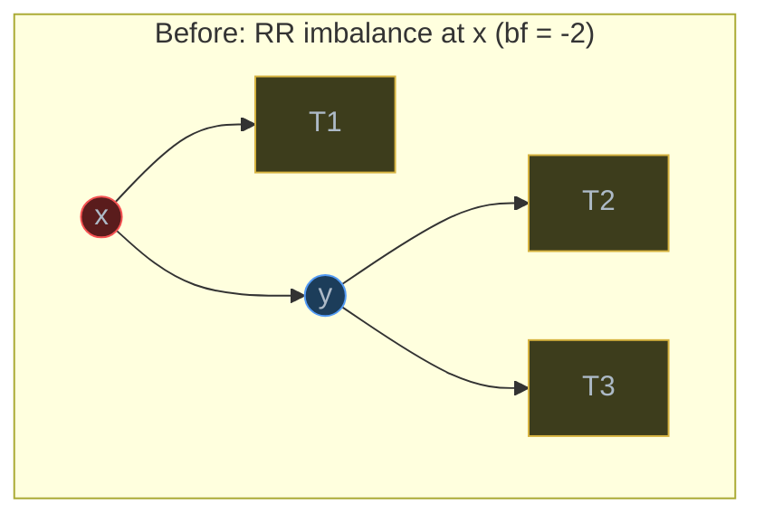

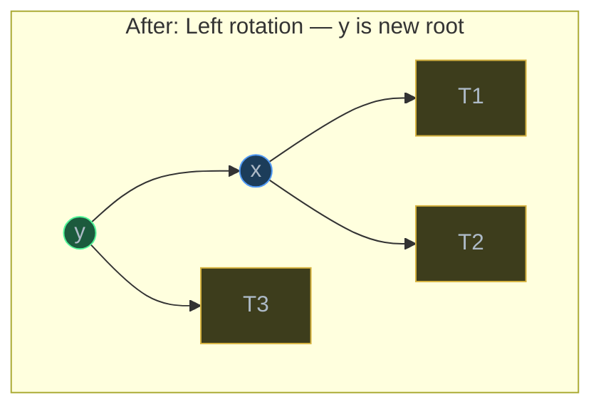

**Right Rotation (LL case)** — The left subtree is too heavy. Mirror image of left rotation.

Node `y` is imbalanced with bf = +2 because its left child `x` is too tall. We rotate `x` up to become the new root, and `y` becomes `x`'s right child. `x`'s right subtree (`T2`) becomes `y`'s new left child.

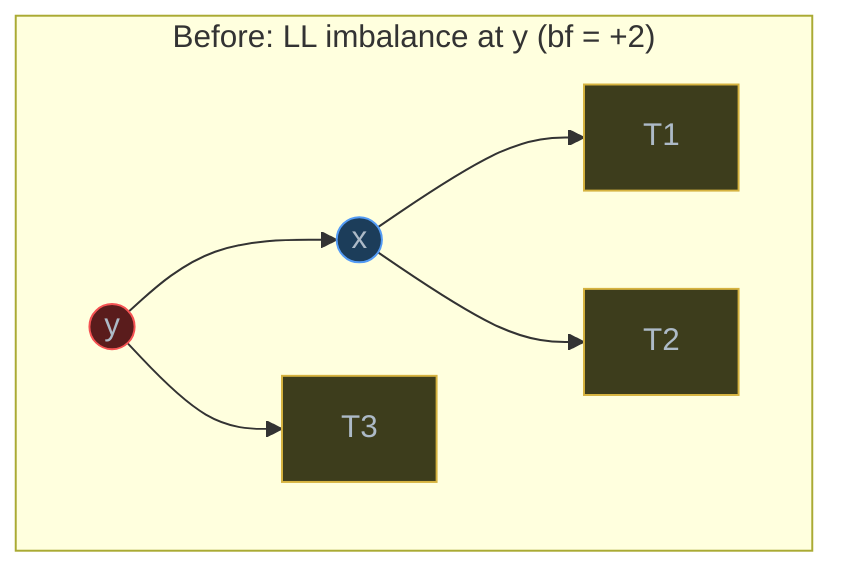

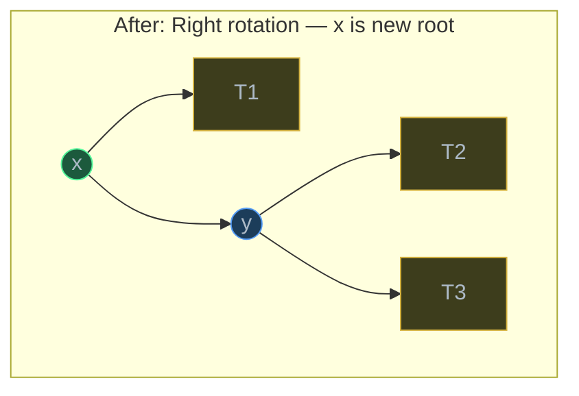

**Left-Right Rotation (LR case)** — The left child's right subtree is too heavy.

A single right rotation does not fix this case. You must first left-rotate the left child, converting the LR case into an LL case, then right-rotate the imbalanced node.

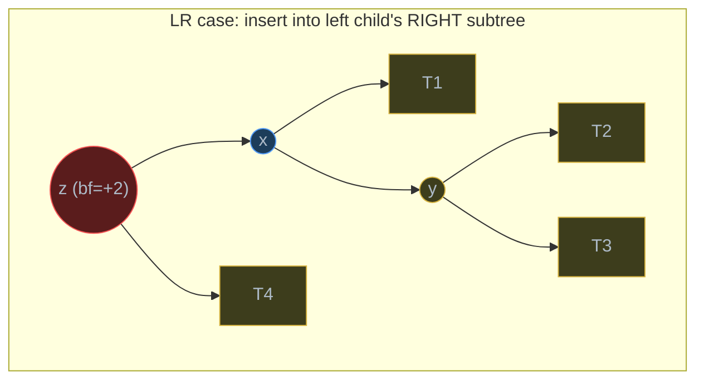

Step 1: Left-rotate `x` (now `y` becomes `x`'s parent).
Step 2: Right-rotate `z` (now `y` becomes root of subtree).


**Right-Left Rotation (RL case)** — Mirror of LR. The right child's left subtree is too heavy. First right-rotate the right child (converting RL to RR), then left-rotate the imbalanced node.

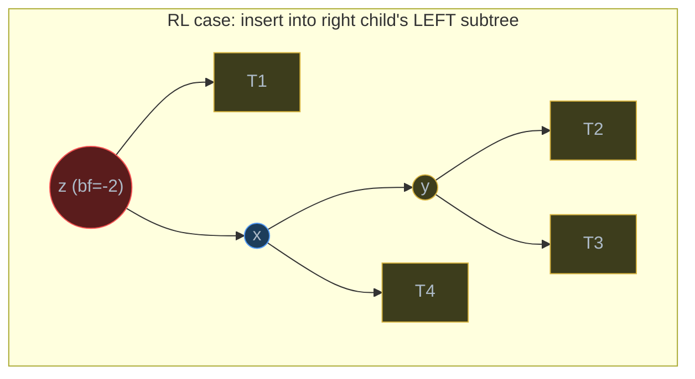

Step 1: Right-rotate `x` (now `y` becomes `x`'s parent).
Step 2: Left-rotate `z` (now `y` becomes root of subtree).

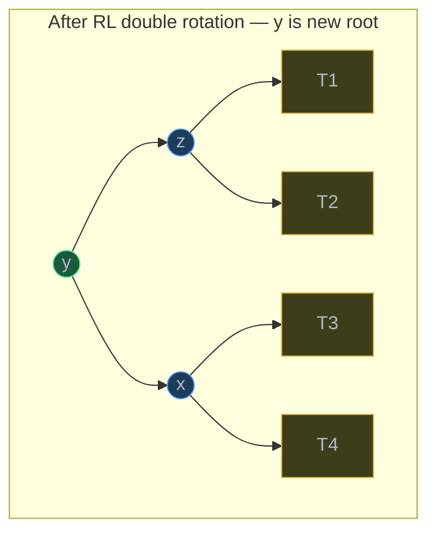

#### Why It Matters

Each rotation is O(1) — it reassigns at most three pointers. After an insertion, you walk back up the tree (O(log n) nodes) and perform at most one rotation (possibly double). This means insertion into an AVL tree is O(log n) with a small constant. The four cases might seem like a lot to memorize, but the pattern is systematic: check which side is heavy, check which grandchild caused it, and apply the corresponding rotation(s). In practice, you implement two rotation functions (`rotate_left`, `rotate_right`) and combine them for the double-rotation cases.

### AVL Insert Algorithm

#### What

AVL insertion follows two phases:

1. **Standard BST insert** — walk down the tree, place the new node at the correct leaf position.
2. **Fix-up phase** — walk back up to the root, updating heights and checking balance factors. If any node becomes imbalanced (bf = +2 or -2), apply the appropriate rotation.

#### How

The fix-up logic at each ancestor node after insertion:

1. Update the node's height: `height = 1 + max(height(left), height(right))`
2. Calculate the balance factor: `bf = height(left) - height(right)`
3. If `bf > 1` (left-heavy):
   - If the new key went into the left child's **left** subtree (LL): right-rotate
   - If the new key went into the left child's **right** subtree (LR): left-rotate left child, then right-rotate
4. If `bf < -1` (right-heavy):
   - If the new key went into the right child's **right** subtree (RR): left-rotate
   - If the new key went into the right child's **left** subtree (RL): right-rotate right child, then left-rotate

A practical way to detect the sub-case: check the balance factor of the heavy child. For the left-heavy case (`bf > 1`), if the left child's bf >= 0, it is LL; if bf < 0, it is LR.

#### Why It Matters

The insert algorithm demonstrates a powerful design pattern: **do the simple thing first, then fix invariant violations.** You do not need a special insertion procedure — just use standard BST insert. The rotations handle all the complexity of maintaining balance. This separation of concerns makes AVL trees easier to implement correctly and reason about. The same pattern appears in Red-Black trees, B-Trees, and many other self-balancing structures.

### AVL Operation Complexity

#### What

| Operation | Time (Worst) | Why |
| --- | --- | --- |
| Search | O(log n) | Height is always O(log n) |
| Insert | O(log n) | BST insert O(log n) + walk-up O(log n) + at most 1 rotation O(1) |
| Delete | O(log n) | BST delete O(log n) + walk-up O(log n) + up to O(log n) rotations |
| Rotation | O(1) | Constant number of pointer reassignments |

#### How

The key insight is that the height of an AVL tree with n nodes never exceeds `1.44 × log₂(n)`. This comes from the fact that the sparsest AVL tree (fewest nodes for a given height) follows the Fibonacci-like recurrence: `N(h) = N(h-1) + N(h-2) + 1`. The sparsest AVL tree of height h has approximately `φ^h` nodes (where `φ = 1.618...` is the golden ratio), which inverts to `h ≈ 1.44 × log₂(n)`.

Note that deletion is slightly more expensive than insertion: a single deletion can trigger rotations at every ancestor, not just one. In practice, this is rarely a problem because the constant factor is small.

#### Why It Matters

AVL trees give you a **hard guarantee** on O(log n) for all operations. Unlike a plain BST, where the performance depends on insertion order, an AVL tree delivers consistent performance regardless of the input pattern. This is why AVL trees (and their relatives) are used in databases, language runtimes, and any system where worst-case performance matters more than average-case.

### B-Trees — Multi-Way Balanced Search Trees

#### What

A **B-Tree** of order `t` (sometimes called "minimum degree") is a balanced search tree where:

- Every node holds between `t - 1` and `2t - 1` keys (except the root, which can have fewer).
- Every internal node has between `t` and `2t` children.
- All leaves are at the **same depth**.
- Keys within a node are sorted; children are separated by keys.

A B-Tree of order 2 is sometimes called a **2-3-4 tree** (each node has 2, 3, or 4 children). In practice, database B-Trees use orders of 100 or more — a single node fills an entire disk page.

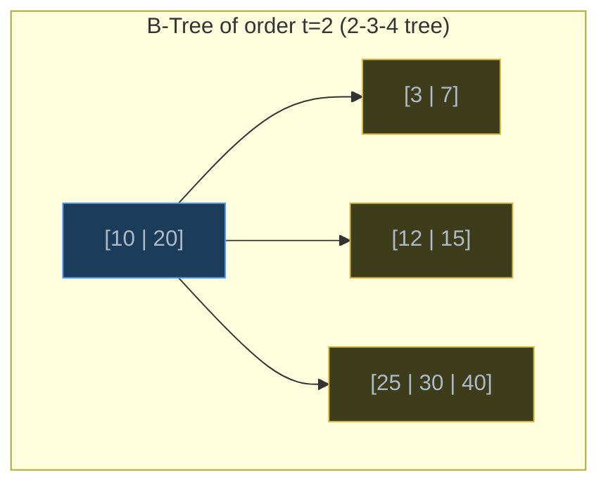

In this tree, the root has keys `[10, 20]` and three children. All keys in the first child are < 10, all keys in the second child are between 10 and 20, and all keys in the third child are > 20.

#### How

**Search**: Start at the root. Within each node, search (linearly or via binary search) for the target key. If found, return it. If not, follow the child pointer that corresponds to the range containing the target. Repeat until you reach a leaf.

**Insert**: Find the leaf where the key belongs. If the leaf has room (fewer than `2t - 1` keys), insert the key in sorted order. If the leaf is full, **split** it: the median key moves up to the parent, and the node divides into two nodes of `t - 1` keys each. If the parent also overflows, split it too — splits can propagate up to the root. If the root splits, a new root is created, and the tree height increases by one.

**Balancing**: B-Trees stay balanced because all leaves are always at the same depth. Splits grow the tree upward (from the root), never downward. This is a fundamentally different balancing strategy from AVL trees, which rebalance by rotating nodes.

#### Why It Matters

B-Trees are designed for **storage systems** where accessing a chunk of data is cheap, but seeking to a new location is expensive. A hard drive can read 4 KB in nearly the same time as reading 1 byte — the bottleneck is the seek, not the transfer. A B-Tree node is sized to fit exactly one disk page (typically 4 KB or 16 KB), so each level of the tree requires one disk seek.

A B-Tree of order 500 (realistic for a 4 KB page with 8-byte keys) with 1 billion keys has a height of only **3 or 4**. That means finding any record in a billion-row database table requires at most 4 disk reads. This is why every major database (PostgreSQL, MySQL, SQLite, Oracle) uses B-Trees (specifically B+ Trees, a variant where data lives only in leaves) for indexing.

### Red-Black Trees — Brief Overview

#### What

A **Red-Black tree** is another self-balancing BST, used as the default balanced tree in many language standard libraries (Java's `TreeMap`, C++'s `std::map`, Linux kernel's `CFS scheduler`). Instead of tracking balance factors, it colors each node red or black and enforces five properties:

1. Every node is either red or black.
2. The root is black.
3. Every null leaf is black.
4. A red node cannot have a red child (no two consecutive reds).
5. Every path from root to null leaf has the same number of black nodes ("black-height").

#### How

These constraints guarantee that the longest path (alternating red-black) is at most **twice** the length of the shortest path (all black). This means the height is at most `2 × log₂(n + 1)`, which is a weaker guarantee than AVL (1.44 × log₂(n)) but still O(log n).

Red-Black trees require fewer rotations on average than AVL trees during insertion and deletion (at most 2 rotations per insert, at most 3 per delete), which makes them faster for workloads with many writes. AVL trees have tighter balance, making lookups slightly faster.

#### Why It Matters

You rarely implement a Red-Black tree from scratch, but understanding the trade-off matters: **AVL trees are better for read-heavy workloads** (tighter balance = shorter search paths), while **Red-Black trees are better for write-heavy workloads** (fewer rotations per mutation). In practice, the difference is small — both are O(log n). The real takeaway is that multiple self-balancing strategies exist, and the right choice depends on the access pattern.

| Property | AVL Tree | Red-Black Tree | B-Tree |
| --- | --- | --- | --- |
| Balance guarantee | Height <= 1.44 log n | Height <= 2 log n | All leaves at same depth |
| Rotations per insert | At most 1 (possibly double) | At most 2 | No rotations (splits instead) |
| Best for | Read-heavy, in-memory | Write-heavy, in-memory | Disk-based storage, databases |
| Used in | Database in-memory indices | Java TreeMap, C++ std::map | PostgreSQL, MySQL, file systems |

## Code Examples

### AVL Tree Node

```python
from __future__ import annotations

from dataclasses import dataclass


@dataclass
class AVLNode:
    """A node in an AVL tree.

    Each node stores its key, pointers to left and right children,
    and its height (used to compute the balance factor).
    """

    key: int
    left: AVLNode | None = None
    right: AVLNode | None = None
    height: int = 1  # New nodes are leaves with height 1
```

### Height and Balance Factor Helpers

```python
def get_height(node: AVLNode | None) -> int:
    """Return the height of a node, treating None as height 0."""
    if node is None:
        return 0
    return node.height


def get_balance(node: AVLNode | None) -> int:
    """Return the balance factor: height(left) - height(right).

    A value of +2 means left-heavy (needs right or LR rotation).
    A value of -2 means right-heavy (needs left or RL rotation).
    """
    if node is None:
        return 0
    return get_height(node.left) - get_height(node.right)
```

**Time**: O(1) — each function reads at most two stored values.
**Space**: O(1) — no additional memory.

### Left and Right Rotations

```python
def rotate_left(z: AVLNode) -> AVLNode:
    """Perform a left rotation rooted at z.

          z                y
         / \             /   \
        T1   y    →     z     T3
            / \        / \
           T2  T3     T1  T2

    Returns the new root of this subtree (y).
    """
    y: AVLNode = z.right  # type: ignore[assignment]
    t2: AVLNode | None = y.left

    # Perform rotation
    y.left = z
    z.right = t2

    # Update heights (z first — it's now below y)
    z.height = 1 + max(get_height(z.left), get_height(z.right))
    y.height = 1 + max(get_height(y.left), get_height(y.right))

    return y


def rotate_right(z: AVLNode) -> AVLNode:
    """Perform a right rotation rooted at z.

          z               y
         / \            /   \
        y   T3   →    T1     z
       / \                  / \
      T1  T2              T2   T3

    Returns the new root of this subtree (y).
    """
    y: AVLNode = z.left  # type: ignore[assignment]
    t2: AVLNode | None = y.right

    # Perform rotation
    y.right = z
    z.left = t2

    # Update heights (z first — it's now below y)
    z.height = 1 + max(get_height(z.left), get_height(z.right))
    y.height = 1 + max(get_height(y.left), get_height(y.right))

    return y
```

**Time**: O(1) — each rotation reassigns a constant number of pointers and updates two heights.
**Space**: O(1) — in-place pointer manipulation.

### AVL Insert with Rebalancing

```python
def avl_insert(root: AVLNode | None, key: int) -> AVLNode:
    """Insert a key into an AVL tree and rebalance.

    Returns the (possibly new) root of the tree.

    Algorithm:
    1. Standard BST insert (recursive, walking down to a leaf)
    2. Update heights on the way back up
    3. Check balance factor at each ancestor
    4. Apply rotation if |balance_factor| > 1
    """
    # Phase 1: Standard BST insert
    if root is None:
        return AVLNode(key=key)

    if key < root.key:
        root.left = avl_insert(root.left, key)
    elif key > root.key:
        root.right = avl_insert(root.right, key)
    else:
        # Duplicate keys not allowed — return unchanged
        return root

    # Phase 2: Update height of this ancestor node
    root.height = 1 + max(get_height(root.left), get_height(root.right))

    # Phase 3: Check balance factor
    balance: int = get_balance(root)

    # Phase 4: Apply rotations if unbalanced

    # Case LL: Left-left — new key went into left child's left subtree
    if balance > 1 and root.left is not None and key < root.left.key:
        return rotate_right(root)

    # Case RR: Right-right — new key went into right child's right subtree
    if balance < -1 and root.right is not None and key > root.right.key:
        return rotate_left(root)

    # Case LR: Left-right — new key went into left child's right subtree
    if balance > 1 and root.left is not None and key > root.left.key:
        root.left = rotate_left(root.left)
        return rotate_right(root)

    # Case RL: Right-left — new key went into right child's left subtree
    if balance < -1 and root.right is not None and key < root.right.key:
        root.right = rotate_right(root.right)
        return rotate_left(root)

    return root
```

**Time**: O(log n) — BST insert walks down O(log n) levels, then the recursive call stack unwinds upward, checking balance and possibly rotating once. Each rotation is O(1).
**Space**: O(log n) — recursion stack depth equals tree height, which is O(log n) for an AVL tree.

### AVL Search

```python
def avl_search(root: AVLNode | None, key: int) -> AVLNode | None:
    """Search for a key in an AVL tree.

    Identical to BST search — the AVL structure just guarantees
    the tree height is O(log n), making search O(log n) worst case.
    """
    if root is None:
        return None

    if key == root.key:
        return root
    elif key < root.key:
        return avl_search(root.left, key)
    else:
        return avl_search(root.right, key)
```

**Time**: O(log n) — AVL guarantees height <= 1.44 log₂(n).
**Space**: O(log n) — recursion stack. Can be made O(1) with an iterative version.

### In-Order Traversal (Verify Sorted Output)

```python
def inorder(root: AVLNode | None) -> list[int]:
    """Return all keys in sorted order via in-order traversal."""
    if root is None:
        return []
    return inorder(root.left) + [root.key] + inorder(root.right)
```

**Time**: O(n) — visits every node exactly once.
**Space**: O(n) — stores all n keys in the result list, plus O(log n) recursion stack.

### Complete AVL Demo

```python
def print_tree(node: AVLNode | None, prefix: str = "", is_left: bool = True) -> None:
    """Pretty-print an AVL tree sideways for debugging."""
    if node is None:
        return
    print_tree(node.right, prefix + ("│   " if is_left else "    "), False)
    connector = "└── " if is_left else "┌── "
    print(f"{prefix}{connector}{node.key} (h={node.height}, bf={get_balance(node)})")
    print_tree(node.left, prefix + ("    " if is_left else "│   "), True)


def demo_avl() -> None:
    """Build an AVL tree by inserting sorted data — the worst case for a plain BST."""
    root: AVLNode | None = None

    # Inserting sorted data: 1, 2, 3, ..., 15
    # A plain BST would become a linked list. AVL stays balanced.
    for key in range(1, 16):
        root = avl_insert(root, key)

    print("AVL tree after inserting 1..15 in order:")
    print_tree(root)
    print(f"\nIn-order traversal: {inorder(root)}")
    print(f"Tree height: {get_height(root)}")
    print(f"Optimal height for 15 nodes: {15 .bit_length()}")  # ceil(log2(15+1)) = 4

    # Search for a key
    result = avl_search(root, 10)
    print(f"\nSearch for 10: {'Found' if result else 'Not found'}")

    result = avl_search(root, 99)
    print(f"Search for 99: {'Found' if result else 'Not found'}")


if __name__ == "__main__":
    demo_avl()
```

**Time**: Building the tree is O(n log n) — n insertions, each O(log n). The sorted input that would destroy a plain BST is handled gracefully by AVL rotations.
**Space**: O(n) for the tree itself, O(log n) for the recursion stack during insertion.

## Common Pitfalls

### Pitfall 1: Forgetting to Update Heights After Rotation

```python
# BAD — rotation without height update
def bad_rotate_left(z: AVLNode) -> AVLNode:
    y = z.right  # type: ignore[assignment]
    z.right = y.left
    y.left = z
    # Forgot to update heights!
    return y

# GOOD — always update heights, child first (z is now below y)
def good_rotate_left(z: AVLNode) -> AVLNode:
    y = z.right  # type: ignore[assignment]
    z.right = y.left
    y.left = z
    z.height = 1 + max(get_height(z.left), get_height(z.right))
    y.height = 1 + max(get_height(y.left), get_height(y.right))
    return y
```

Why it is wrong: If you skip the height update, future balance factor calculations use stale values, causing the tree to either miss necessary rotations (becoming unbalanced) or perform unnecessary ones. The order matters too — update `z` first because it is now a child of `y`, and `y`'s height depends on `z`'s correct height.

### Pitfall 2: Checking the Wrong Condition for LR/RL Cases

```python
# BAD — using key comparison against root instead of root's child
def bad_insert_fixup(root: AVLNode, key: int, balance: int) -> AVLNode:
    if balance > 1 and key > root.key:  # Wrong! Should check root.left.key
        root.left = rotate_left(root.left)  # type: ignore[arg-type]
        return rotate_right(root)
    return root

# GOOD — compare key against the child's key to determine sub-case
def good_insert_fixup(root: AVLNode, key: int, balance: int) -> AVLNode:
    if balance > 1 and root.left is not None and key > root.left.key:
        root.left = rotate_left(root.left)
        return rotate_right(root)
    return root
```

Why it is wrong: When `balance > 1`, the left subtree is heavy. To distinguish LL from LR, you need to know which side of the **left child** the new key was inserted into. Comparing against `root.key` tells you nothing useful — you already know the key is in the left subtree. You must compare against `root.left.key`.

### Pitfall 3: Assuming BST Guarantees O(log n) Without Balancing

```python
# BAD — using a plain BST for sorted data
class NaiveBST:
    """Degenerates to O(n) search with sorted insertions."""
    pass

# Inserting 1, 2, 3, ..., 10000 into a plain BST:
# Height = 9999, Search for 10000 = 9999 comparisons

# GOOD — use a self-balancing tree (AVL, Red-Black) or Python's sorted containers
# Inserting 1, 2, 3, ..., 10000 into an AVL tree:
# Height ≈ 14, Search for 10000 ≈ 14 comparisons

# In practice, use Python's `sortedcontainers.SortedList` or `bisect` module
# for sorted data — they use balanced tree-like structures internally.
import bisect

sorted_data: list[int] = []
for i in range(1, 10001):
    bisect.insort(sorted_data, i)  # Maintains sorted order, O(n) per insert though

# For O(log n) insert + search, use: pip install sortedcontainers
# from sortedcontainers import SortedList
```

Why it is wrong: The O(log n) guarantee of a BST depends entirely on the tree being balanced. With adversarial or sorted input (which is extremely common in practice — think auto-incrementing IDs, timestamps, alphabetically-sorted names), a plain BST is no better than a linked list. Always use a self-balancing variant when O(log n) worst-case is required.

## Key Takeaways

- A plain BST degrades to **O(n) operations** with sorted input — self-balancing is not optional for production use.
- AVL trees enforce balance by maintaining a **balance factor** of -1, 0, or +1 at every node, using **four rotation patterns** (LL, RR, LR, RL) to fix violations after insertion.
- Each AVL rotation is **O(1)** (constant pointer reassignments), and at most one rotation is needed per insertion, making the total insert cost **O(log n)**.
- **B-Trees** solve a different problem — minimizing disk I/O by packing many keys per node. They power every major database index and file system, with tree heights of only 3-4 for billions of keys.
- **Red-Black trees** are an alternative to AVL with slightly weaker balance (height <= 2 log n vs 1.44 log n) but fewer rotations on writes — used in Java's `TreeMap` and C++'s `std::map`.

## Exercises

1. **Trace the rotations**: Insert the keys `[40, 20, 10, 25, 30, 22, 50]` into an empty AVL tree one at a time. For each insertion, state whether a rotation occurs, which type (LL, RR, LR, or RL), and draw the tree after each step.

2. **Explain** why an AVL tree's height is at most `1.44 × log₂(n)`. What is the minimum number of nodes in an AVL tree of height 5? (Hint: think about the sparsest possible AVL tree at each height.)

3. **Write a function** `avl_delete(root: AVLNode | None, key: int) -> AVLNode | None` that deletes a key from an AVL tree and rebalances. Handle three cases: leaf node, one child, and two children (use in-order successor). Remember that deletion can require rotations at multiple ancestors, not just one.

4. **Compare and contrast**: A database needs to index 10 million records on disk. Explain why a B-Tree of order 500 is a better choice than an AVL tree for this use case. Calculate the approximate height of each tree.

5. **Write a function** `is_avl(root: AVLNode | None) -> bool` that verifies whether a given binary tree satisfies the AVL property (balance factor of -1, 0, or +1 at every node AND the BST ordering property). Do not trust the stored `height` values — recompute them.

---
up:: [Schedule](../../Schedule.md)
#type/learning #source/self-study #status/seed
