# Heaps

> A heap is a complete binary tree stored as an array that gives O(1) access to the min (or max) element and O(log n) insertion — the foundation of priority queues, heap sort, and top-k problems.

## Table of Contents
- [Core Concepts](#core-concepts)
- [Code Examples](#code-examples)
- [Common Pitfalls](#common-pitfalls)
- [Key Takeaways](#key-takeaways)
- [Exercises](#exercises)

## Core Concepts

### The Heap Property

#### What

A **heap** is a complete binary tree that satisfies the **heap property**:

- **Min-heap**: Every parent is less than or equal to its children. The smallest element is always at the root.
- **Max-heap**: Every parent is greater than or equal to its children. The largest element is always at the root.


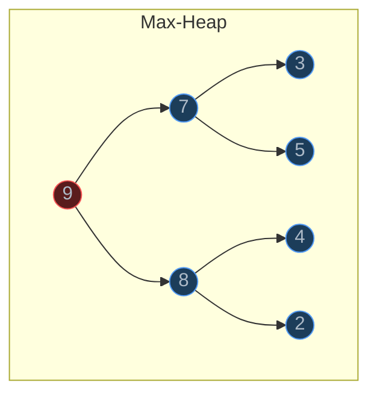

Notice that a heap is **not** fully sorted. In the min-heap above, `3` is a child of the root but `2` is also a child of the root. There is no ordering between siblings or across subtrees — only between parent and child. This partial ordering is what makes heaps faster than fully sorted structures for their intended use case.

#### How

A heap is also a **complete binary tree**: every level is fully filled except possibly the last, which is filled from left to right. This completeness property is what allows the heap to be stored efficiently as a flat array (no pointers needed).

The heap property is **recursive**: if every node satisfies it, the entire tree satisfies it. This means we can fix violations locally (at a single node) and the fix propagates.

#### Why It Matters

The partial ordering is the key insight. A sorted array gives you O(1) access to the min *and* max, but insertion is O(n) (you have to shift elements). A heap gives O(1) access to just the min *or* max, but insertion is only O(log n). This is the right trade-off for a **priority queue**: you repeatedly insert items and extract the highest-priority one. You never need the second-smallest or the median — just the extreme element. The heap is purpose-built for this access pattern.

### Array Representation of a Complete Binary Tree

#### What

Because a heap is a complete binary tree, it maps perfectly to an array with **no wasted space** and **no pointers**. The mapping uses index arithmetic:

For a node at index `i` (0-based):
- **Left child**: `2i + 1`
- **Right child**: `2i + 2`
- **Parent**: `(i - 1) // 2`

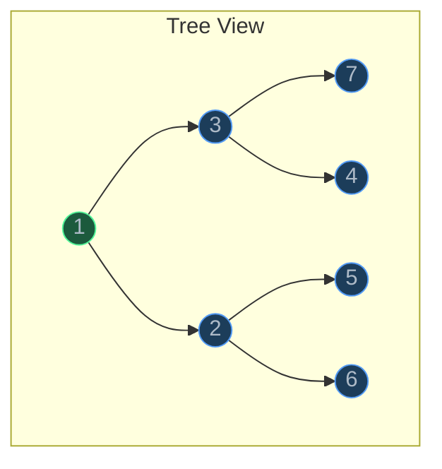

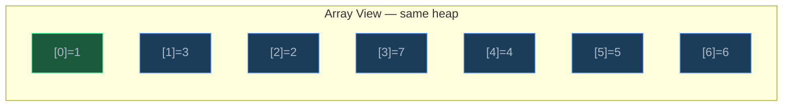

#### How

The array is filled level by level, left to right. Index 0 is the root. Index 1 and 2 are the root's left and right children. Index 3, 4, 5, 6 are the next level, and so on.

Let us verify the formulas with an example. Node `3` is at index 1:
- Left child: `2(1) + 1 = 3` → index 3 holds `7`. Correct.
- Right child: `2(1) + 2 = 4` → index 4 holds `4`. Correct.
- Parent of index 4: `(4 - 1) // 2 = 1` → index 1 holds `3`. Correct.

The completeness property guarantees no gaps in the array. If the tree had a "hole" (a missing left child when the right child exists), the index arithmetic would break — you would access the wrong node.

#### Why It Matters

Storing a tree as an array eliminates the overhead of pointers entirely. Each node in a pointer-based binary tree needs two pointers (left, right) — on a 64-bit system, that is 16 bytes of overhead per node. For a heap of 1 million integers, pointer-based storage wastes 16 MB on pointers alone. The array representation uses zero extra memory.

The array layout is also **cache-friendly**. Parent and children are close together in memory (indices `i`, `2i+1`, `2i+2`), so traversing the heap's levels loads nearby cache lines. This gives heaps a practical performance advantage over pointer-based trees, even when both have the same Big-O complexity.

### Insert — Bubble Up (Sift Up)

#### What

To insert a new element into a heap:

1. **Append** the element at the end of the array (the next available position in the last level).
2. **Bubble up**: Compare it with its parent. If it violates the heap property, swap with the parent. Repeat until the element finds its correct position or reaches the root.

#### How

Inserting `0` into the min-heap `[1, 3, 2, 7, 4, 5, 6]`:

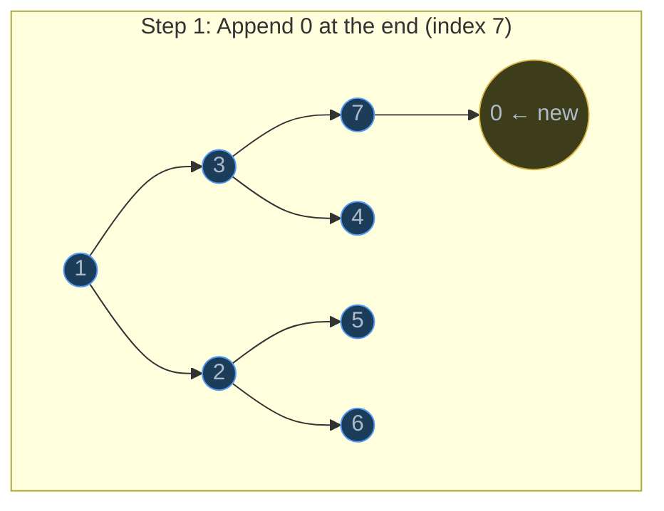

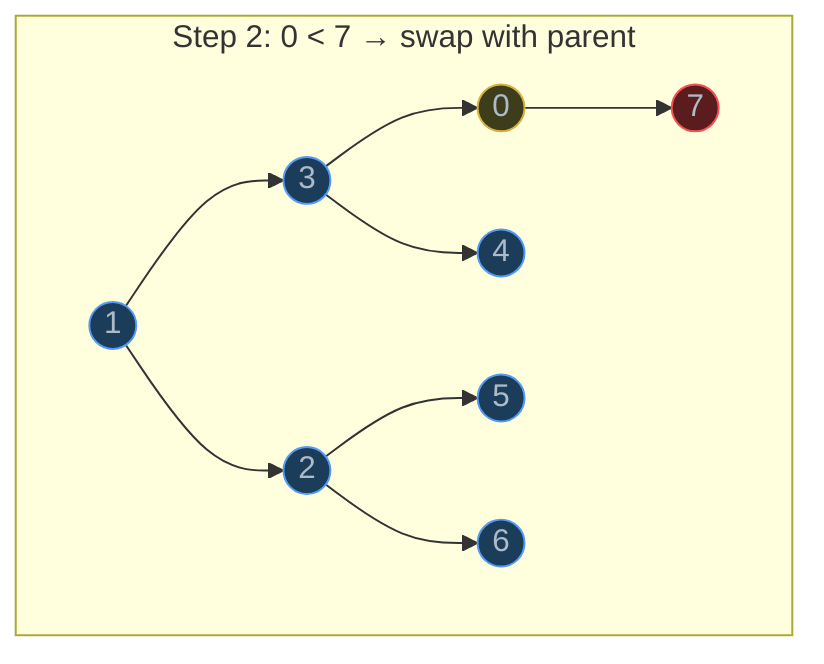

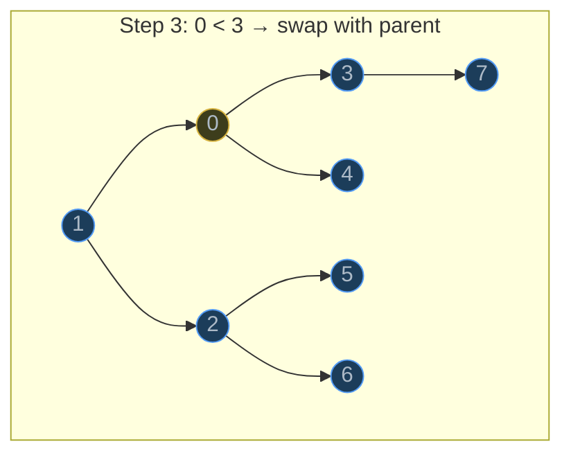

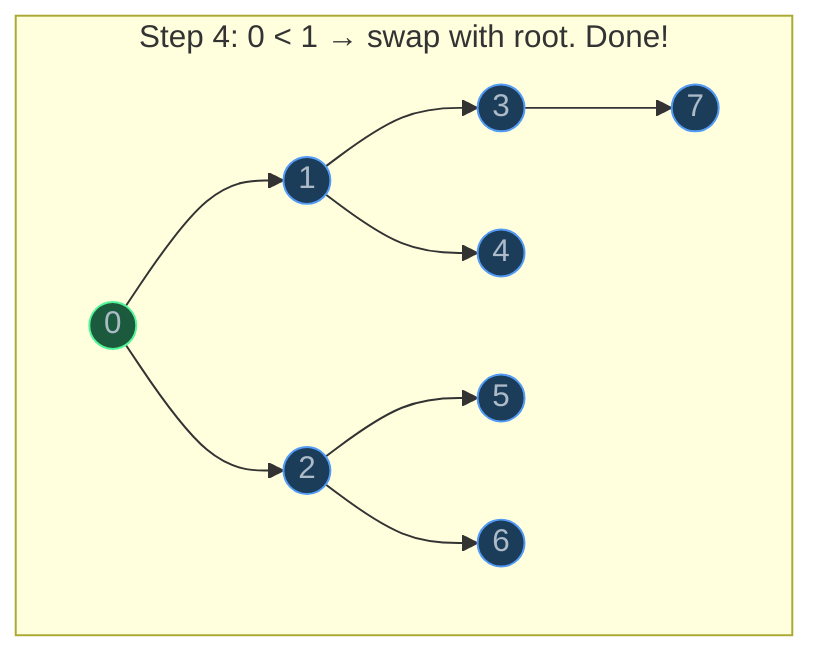

Array after each step: `[1,3,2,7,4,5,6,0]` → `[1,3,2,0,4,5,6,7]` → `[1,0,2,3,4,5,6,7]` → `[0,1,2,3,4,5,6,7]`

#### Why It Matters

Bubble up is O(log n) because the tree has at most log₂(n) levels, and the new element can move up at most that many levels. Each swap is O(1) — just swap two array elements using index arithmetic. No pointer manipulation, no memory allocation. This is why heaps are the standard implementation for priority queues: insertion is cheap, and the structure maintains itself.

### Extract Min/Max — Bubble Down (Sift Down)

#### What

To remove the root (the min or max element):

1. **Replace** the root with the last element in the array.
2. **Remove** the last element (shrink the array by one).
3. **Bubble down**: Compare the new root with its children. Swap it with the smaller child (min-heap) or larger child (max-heap). Repeat until the heap property is restored or the element reaches a leaf.

#### How

Extracting the min from `[1, 3, 2, 7, 4, 5, 6]`:

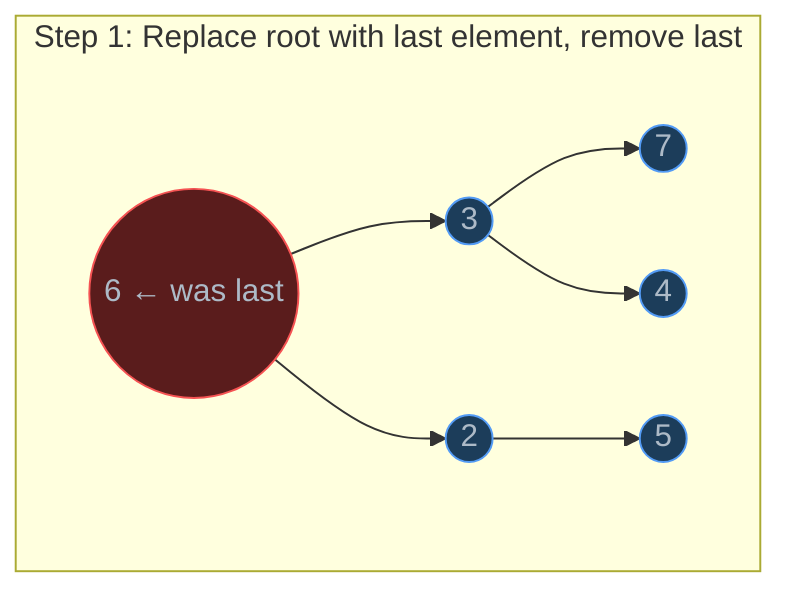

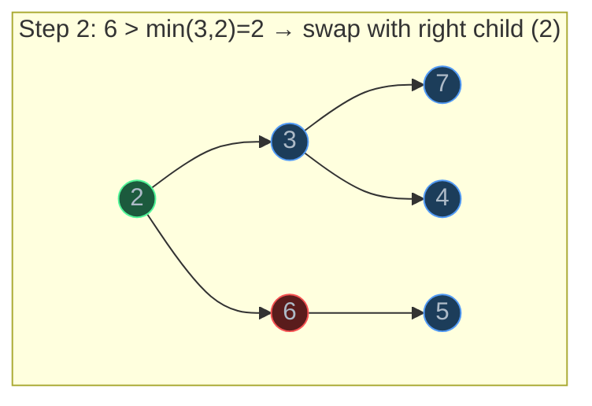

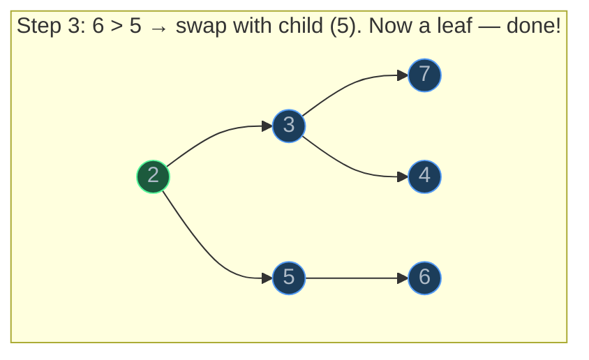

Array states: `[1,3,2,7,4,5,6]` → extract 1, move 6 to root → `[6,3,2,7,4,5]` → swap 6 with 2 → `[2,3,6,7,4,5]` → swap 6 with 5 → `[2,3,5,7,4,6]`

#### Why It Matters

Extract-min/max is O(log n) for the same reason as insert: the element moves at most log₂(n) levels down. The critical detail is swapping with the **smaller child** (in a min-heap). If you swap with the larger child, you might put a large value above a small one, violating the heap property. The "replace root with last element" trick is elegant: it maintains the completeness property (no gaps in the array) while giving us a simple starting point for bubble-down.

### Peek — O(1)

#### What

**Peek** returns the root element without removing it. In a min-heap, this is the minimum. In a max-heap, this is the maximum.

#### How

Just read `heap[0]`. The root is always at index 0 in the array representation. No traversal, no computation.

#### Why It Matters

O(1) access to the extreme element is the entire point of a heap. If you need to repeatedly ask "what is the current minimum?" without removing it, a heap gives you the answer instantly. A sorted array also offers O(1) access to the min and max, but insertion into a sorted array is O(n). A heap trades away O(1) access to *all* elements for O(1) access to *one* element and O(log n) insertion — a trade-off that is perfect for priority queues.

### Heapify — Building a Heap in O(n)

#### What

**Heapify** converts an arbitrary array into a valid heap. The naive approach — inserting elements one by one — takes O(n log n). But there is a smarter approach that runs in **O(n)**.

#### How

**Bottom-up heapify** (Floyd's algorithm):

1. Start from the **last non-leaf node** (index `n // 2 - 1`) and work backward to index 0.
2. At each node, call `sift_down` to fix the heap property.

Why start from the last non-leaf? Because leaves (the bottom half of the array) are trivially valid heaps — a single element always satisfies the heap property. You only need to fix internal nodes.

Why is this O(n) and not O(n log n)? The key insight is that most nodes are near the bottom and barely move:

| Level (from bottom) | Nodes at this level | Max sift-down distance |
| --- | --- | --- |
| 0 (leaves) | ~n/2 | 0 (skip — already heaps) |
| 1 | ~n/4 | 1 |
| 2 | ~n/8 | 2 |
| k | ~n/2^(k+1) | k |

Total work = sum from k=0 to log(n) of (n / 2^(k+1)) * k. This sum converges to **O(n)** (it is bounded by 2n). The mathematical proof uses the fact that the series `sum(k / 2^k)` converges to 2.

Intuitively: half the nodes do zero work, a quarter do one swap, an eighth do two swaps, and so on. The vast majority of nodes move very little.

#### Why It Matters

The O(n) heapify is not just a theoretical curiosity — it has practical consequences. When you call `heapq.heapify(data)` in Python, it runs in O(n), not O(n log n). This means if you have an existing list and want to convert it into a priority queue, heapify is faster than inserting elements one at a time. It is also the first step of heap sort: build the heap in O(n), then extract elements one by one in O(n log n).

### Priority Queues — The ADT That Heaps Implement

#### What

A **priority queue** is an abstract data type (ADT) that supports:

- `insert(item, priority)` — add an item with a given priority
- `extract_min()` / `extract_max()` — remove and return the highest-priority item
- `peek()` — view the highest-priority item without removing it

A priority queue is an *interface* — it defines *what* operations are available, not *how* they are implemented. A heap is the most common *implementation* of a priority queue, but you could also implement one with a sorted array, an unsorted array, or a balanced BST.

| Implementation | Insert | Extract-Min | Peek |
| --- | --- | --- | --- |
| Unsorted array | O(1) | O(n) | O(n) |
| Sorted array | O(n) | O(1) | O(1) |
| **Heap** | **O(log n)** | **O(log n)** | **O(1)** |
| Balanced BST | O(log n) | O(log n) | O(log n) |

#### How

The heap is the best general-purpose implementation because it provides O(log n) for both insert and extract, and O(1) for peek. The sorted array has O(1) extract but O(n) insert; the unsorted array has O(1) insert but O(n) extract. The heap balances both operations.

#### Why It Matters

Priority queues appear everywhere: operating system task schedulers (run the highest-priority process), Dijkstra's algorithm (always explore the closest unvisited node), event-driven simulations (process the earliest event), hospital triage (treat the most critical patient). Whenever you need "give me the most important thing next," you need a priority queue, and that usually means a heap.

### Heap Sort

#### What

**Heap sort** sorts an array by:

1. Build a max-heap from the array — O(n)
2. Repeatedly extract the max (swap root with the last unsorted element, shrink the heap, sift down) — O(n log n)

After all extractions, the array is sorted in ascending order.

#### How

The algorithm works in-place by maintaining two regions: the heap (front) and the sorted portion (back).

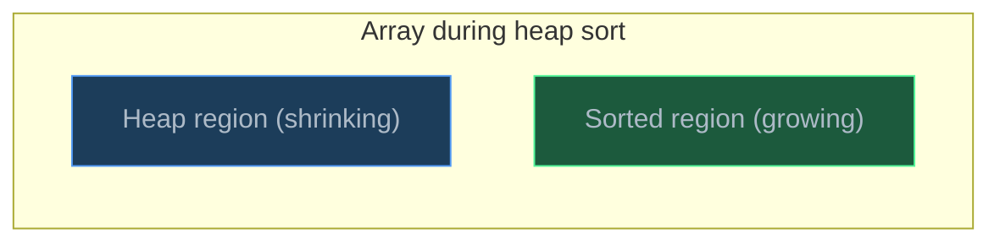

Step by step for `[4, 1, 3, 2, 5]`:

1. **Build max-heap**: `[5, 4, 3, 2, 1]`
2. Swap root (5) with last → `[1, 4, 3, 2, | 5]`. Sift down → `[4, 2, 3, 1, | 5]`
3. Swap root (4) with last unsorted → `[1, 2, 3, | 4, 5]`. Sift down → `[3, 2, 1, | 4, 5]`
4. Swap root (3) → `[1, 2, | 3, 4, 5]`. Sift down → `[2, 1, | 3, 4, 5]`
5. Swap root (2) → `[1, | 2, 3, 4, 5]`. Done: `[1, 2, 3, 4, 5]`

#### Why It Matters

Heap sort is **O(n log n) worst case** and **in-place** (O(1) auxiliary space). This is a combination that neither merge sort (O(n) space) nor quicksort (O(n^2) worst case) achieves. However, heap sort has poor cache performance (it jumps around the array during sift-down) and is not stable. In practice, Timsort (Python's built-in sort) and Introsort (C++'s `std::sort`) outperform it. Heap sort's real value is in understanding heaps — and it appears in hybrid sort algorithms as a fallback when quicksort's recursion depth gets too deep (Introsort).

### Finding the k-th Largest Element

#### What

Given an unsorted array of n elements, find the k-th largest element. A sorted array answers this trivially (index `n - k`), but sorting is O(n log n). Using a min-heap of size k, you can solve this in **O(n log k)**.

#### How

1. Build a min-heap from the first k elements.
2. For each remaining element:
   - If it is larger than the heap's root (the current k-th largest), replace the root and sift down.
   - If it is smaller, skip it — it cannot be in the top k.
3. After processing all elements, the heap's root is the k-th largest.

Why a **min**-heap for the k-th **largest**? The min-heap of size k holds the k largest elements seen so far. The root is the smallest of those k elements — which is exactly the k-th largest overall. Any element smaller than the root is not in the top k and is ignored.

When k is small relative to n (e.g., "find the top 10 out of 10 million"), this is dramatically faster than sorting: O(n log 10) versus O(n log n).

#### Why It Matters

This technique is used everywhere: finding the top-k search results, the k most frequent words, the k nearest neighbors. Python's `heapq.nlargest(k, iterable)` uses exactly this approach. Understanding the min-heap-of-size-k pattern gives you an efficient tool for any "top k" problem, and it is a favorite interview question because it tests both heap understanding and the ability to choose the right data structure.

### Python's `heapq` Module

#### What

Python's `heapq` module provides a **min-heap** implementation that operates directly on a regular `list`. There is no separate heap class — you use a list and call `heapq` functions to maintain the heap property.

Key functions:

| Function | Description | Time |
| --- | --- | --- |
| `heapq.heappush(heap, item)` | Push item onto heap | O(log n) |
| `heapq.heappop(heap)` | Pop and return smallest item | O(log n) |
| `heapq.heapify(list)` | Convert list into a heap in-place | O(n) |
| `heapq.heappushpop(heap, item)` | Push then pop (faster than separate calls) | O(log n) |
| `heapq.heapreplace(heap, item)` | Pop then push (faster than separate calls) | O(log n) |
| `heapq.nlargest(k, iterable)` | Return k largest elements | O(n log k) |
| `heapq.nsmallest(k, iterable)` | Return k smallest elements | O(n log k) |

#### How

`heapq` only supports min-heaps. To simulate a max-heap, negate the values: push `-x` and negate the result of `heappop()`. For custom objects, use tuples `(priority, item)` — tuples are compared element by element, so the first element (priority) determines the ordering.

#### Why It Matters

In production Python code, you almost never implement a heap from scratch. `heapq` is battle-tested, written in C for performance, and integrates seamlessly with Python lists. Knowing the `heapq` API and its idioms (negation for max-heap, tuple-based priorities) lets you solve priority queue problems in a few lines of code. Understanding the underlying heap mechanics (which this lesson covers) tells you *why* those operations have the complexities they do.

## Code Examples

### Manual Min-Heap Implementation

```python
from __future__ import annotations


class MinHeap:
    """A min-heap implemented from scratch using an array.

    Demonstrates the core operations: insert (bubble up),
    extract_min (bubble down), peek, and heapify.
    """

    def __init__(self, items: list[int] | None = None) -> None:
        """Initialize the heap, optionally from an existing list.

        If items are provided, builds the heap in O(n) using bottom-up heapify.
        """
        self._data: list[int] = []
        if items is not None:
            self._data = list(items)  # Copy to avoid mutating the input
            self._heapify()

    def __len__(self) -> int:
        return len(self._data)

    def __bool__(self) -> bool:
        return len(self._data) > 0

    def __repr__(self) -> str:
        return f"MinHeap({self._data})"

    # --- Index arithmetic ---

    @staticmethod
    def _parent(i: int) -> int:
        return (i - 1) // 2

    @staticmethod
    def _left(i: int) -> int:
        return 2 * i + 1

    @staticmethod
    def _right(i: int) -> int:
        return 2 * i + 2

    # --- Core operations ---

    def peek(self) -> int:
        """Return the minimum element without removing it — O(1)."""
        if not self._data:
            raise IndexError("peek from empty heap")
        return self._data[0]

    def push(self, value: int) -> None:
        """Insert a value into the heap — O(log n).

        Append at the end (maintaining completeness),
        then bubble up to restore the heap property.
        """
        self._data.append(value)
        self._bubble_up(len(self._data) - 1)

    def pop(self) -> int:
        """Remove and return the minimum element — O(log n).

        Swap root with last element, remove last, then
        bubble down the new root to restore the heap property.
        """
        if not self._data:
            raise IndexError("pop from empty heap")

        # Swap root with last element
        self._data[0], self._data[-1] = self._data[-1], self._data[0]
        min_value: int = self._data.pop()  # Remove the old root (now at end)

        # Restore heap property from the root
        if self._data:
            self._bubble_down(0)

        return min_value

    # --- Internal helpers ---

    def _bubble_up(self, i: int) -> None:
        """Move element at index i upward until heap property is restored.

        Compare with parent — if smaller, swap and continue.
        Stops when the element is >= its parent or reaches the root.
        """
        while i > 0:
            parent: int = self._parent(i)
            if self._data[i] < self._data[parent]:
                self._data[i], self._data[parent] = self._data[parent], self._data[i]
                i = parent
            else:
                break  # Heap property satisfied

    def _bubble_down(self, i: int) -> None:
        """Move element at index i downward until heap property is restored.

        Compare with both children — swap with the smaller child if needed.
        Stops when the element is <= both children or reaches a leaf.
        """
        n: int = len(self._data)
        while True:
            smallest: int = i
            left: int = self._left(i)
            right: int = self._right(i)

            # Find the smallest among node i and its children
            if left < n and self._data[left] < self._data[smallest]:
                smallest = left
            if right < n and self._data[right] < self._data[smallest]:
                smallest = right

            if smallest == i:
                break  # Heap property satisfied

            # Swap with the smaller child and continue
            self._data[i], self._data[smallest] = self._data[smallest], self._data[i]
            i = smallest

    def _heapify(self) -> None:
        """Convert the internal array into a valid heap — O(n).

        Start from the last non-leaf node and sift down each node.
        Leaves (indices n//2 to n-1) are already valid heaps.
        """
        n: int = len(self._data)
        # Last non-leaf node is at index n // 2 - 1
        for i in range(n // 2 - 1, -1, -1):
            self._bubble_down(i)


# Demo
if __name__ == "__main__":
    # Build heap from unsorted data — O(n) heapify
    data = [9, 4, 7, 1, 3, 8, 2, 6, 5]
    heap = MinHeap(data)
    print(f"Heap from {data}: {heap}")
    print(f"Min element: {heap.peek()}")

    # Extract elements in sorted order — O(n log n) total
    sorted_output: list[int] = []
    while heap:
        sorted_output.append(heap.pop())
    print(f"Extracted in order: {sorted_output}")

    # Insert elements one at a time
    heap2 = MinHeap()
    for x in [5, 3, 8, 1, 7]:
        heap2.push(x)
        print(f"  Pushed {x}: {heap2}")
```

**Time**:
- `push`: O(log n) — bubble up traverses at most log₂(n) levels.
- `pop`: O(log n) — bubble down traverses at most log₂(n) levels.
- `peek`: O(1) — reads `heap[0]`.
- `_heapify`: O(n) — bottom-up construction (see explanation in Core Concepts).

**Space**: O(n) — the array stores all n elements with zero pointer overhead.

### Priority Queue with `heapq`

```python
import heapq
from dataclasses import dataclass, field


@dataclass(order=True)
class Task:
    """A task with a priority for use in a priority queue.

    The @dataclass(order=True) generates comparison methods based on
    field order. We put priority first so tasks sort by priority.
    The sort_index=False on name excludes it from comparisons.
    """

    priority: int
    name: str = field(compare=False)
    description: str = field(compare=False, default="")


def priority_queue_demo() -> None:
    """Demonstrate a priority queue using heapq with custom objects."""

    # Using tuples — simplest approach
    # Tuples compare element-by-element: (priority, task_name)
    task_queue: list[tuple[int, str]] = []

    heapq.heappush(task_queue, (3, "Write tests"))
    heapq.heappush(task_queue, (1, "Fix critical bug"))
    heapq.heappush(task_queue, (2, "Code review"))
    heapq.heappush(task_queue, (1, "Deploy hotfix"))

    print("Processing tasks by priority (lower = higher priority):")
    while task_queue:
        priority, name = heapq.heappop(task_queue)
        print(f"  [{priority}] {name}")

    print()

    # Using dataclasses — cleaner for complex tasks
    tasks: list[Task] = []
    heapq.heappush(tasks, Task(priority=2, name="Refactor module"))
    heapq.heappush(tasks, Task(priority=1, name="Security patch"))
    heapq.heappush(tasks, Task(priority=3, name="Update docs"))
    heapq.heappush(tasks, Task(priority=1, name="Fix login flow"))

    print("Processing tasks (dataclass-based):")
    while tasks:
        task: Task = heapq.heappop(tasks)
        print(f"  [{task.priority}] {task.name}")

    print()

    # Max-heap simulation — negate priorities
    max_heap: list[int] = []
    for val in [3, 1, 4, 1, 5, 9, 2, 6]:
        heapq.heappush(max_heap, -val)  # Negate on push

    print("Max-heap extraction (via negation):")
    while max_heap:
        print(f"  {-heapq.heappop(max_heap)}")  # Negate on pop


if __name__ == "__main__":
    priority_queue_demo()
```

**Time**: Each `heappush`/`heappop` is O(log n). Processing all tasks is O(n log n).
**Space**: O(n) for the heap list.

### Finding the k-th Largest Element

```python
import heapq


def kth_largest_sorting(nums: list[int], k: int) -> int:
    """Brute force: sort the array and index from the end.

    Simple but O(n log n) — we sort the entire array just to find one element.
    """
    nums_sorted = sorted(nums)
    return nums_sorted[-k]


def kth_largest_heap(nums: list[int], k: int) -> int:
    """Optimized: maintain a min-heap of size k.

    The heap always contains the k largest elements seen so far.
    The root (smallest in the heap) is the k-th largest overall.

    Why a min-heap? Because we want to quickly identify and discard
    the smallest of our "top k" candidates. When a new element arrives
    that is larger than the current k-th largest, it replaces the root.
    """
    if k > len(nums):
        raise ValueError(f"k={k} exceeds array length {len(nums)}")

    # Build a min-heap from the first k elements — O(k)
    min_heap: list[int] = nums[:k]
    heapq.heapify(min_heap)

    # Process remaining elements — O((n-k) log k)
    for num in nums[k:]:
        if num > min_heap[0]:
            # This element belongs in the top k — replace the smallest
            heapq.heapreplace(min_heap, num)
            # heapreplace is faster than heappop + heappush

    # The root of the min-heap is the k-th largest
    return min_heap[0]


def kth_largest_nlargest(nums: list[int], k: int) -> int:
    """Pythonic: use heapq.nlargest directly.

    Under the hood, nlargest uses the same min-heap-of-size-k approach.
    """
    return heapq.nlargest(k, nums)[-1]


# Demo
if __name__ == "__main__":
    data = [3, 2, 1, 5, 6, 4]
    k = 2

    print(f"Array: {data}, k={k}")
    print(f"Brute force (sort):   {kth_largest_sorting(data, k)}")
    print(f"Min-heap of size k:   {kth_largest_heap(data, k)}")
    print(f"heapq.nlargest:       {kth_largest_nlargest(data, k)}")

    # Large array — the heap approach shines when k << n
    import random
    large_data = random.sample(range(1_000_000), 100_000)
    k = 10
    result = kth_largest_heap(large_data, k)
    print(f"\n10th largest of 100,000 random elements: {result}")
```

**Time**:
- Brute force: O(n log n) — dominated by the sort.
- Heap approach: O(n log k) — heapify of k elements is O(k), then (n-k) calls to heapreplace each costing O(log k). When k is a small constant, this is effectively O(n).
- `heapq.nlargest`: O(n log k) internally.

**Space**:
- Brute force: O(n) — sorted copy of the array.
- Heap approach: O(k) — the heap holds exactly k elements.

### Heap Sort

```python
def heap_sort(arr: list[int]) -> list[int]:
    """Sort an array using heap sort — O(n log n), in-place.

    Algorithm:
    1. Build a max-heap from the array — O(n)
    2. Repeatedly swap the max (root) with the last unsorted element,
       shrink the heap by one, and sift down — O(n log n)

    We implement max-heap sift-down inline rather than using heapq
    (which only supports min-heaps) to demonstrate the algorithm clearly.
    """
    result = list(arr)  # Work on a copy
    n: int = len(result)

    def sift_down(heap_size: int, i: int) -> None:
        """Sift element at index i down in a max-heap of given size."""
        while True:
            largest: int = i
            left: int = 2 * i + 1
            right: int = 2 * i + 2

            if left < heap_size and result[left] > result[largest]:
                largest = left
            if right < heap_size and result[right] > result[largest]:
                largest = right

            if largest == i:
                break

            result[i], result[largest] = result[largest], result[i]
            i = largest

    # Phase 1: Build max-heap — O(n)
    # Start from last non-leaf node, sift down each
    for i in range(n // 2 - 1, -1, -1):
        sift_down(n, i)

    # Phase 2: Extract max repeatedly — O(n log n)
    # Swap max (index 0) with last unsorted, shrink heap, sift down
    for end in range(n - 1, 0, -1):
        result[0], result[end] = result[end], result[0]  # Max goes to sorted region
        sift_down(end, 0)  # Restore heap in the shrunk region

    return result


# Demo
if __name__ == "__main__":
    data = [38, 27, 43, 3, 9, 82, 10]
    print(f"Original:  {data}")
    print(f"Sorted:    {heap_sort(data)}")

    # Edge cases
    print(f"Empty:     {heap_sort([])}")
    print(f"Single:    {heap_sort([42])}")
    print(f"Sorted:    {heap_sort([1, 2, 3, 4, 5])}")
    print(f"Reversed:  {heap_sort([5, 4, 3, 2, 1])}")
    print(f"Dupes:     {heap_sort([3, 1, 4, 1, 5, 9, 2, 6, 5, 3, 5])}")
```

**Time**: O(n log n) — Phase 1 (heapify) is O(n). Phase 2 performs n-1 extractions, each requiring a sift-down of O(log n). Total: O(n) + O(n log n) = O(n log n). This is the worst-case guarantee — unlike quicksort, heap sort is always O(n log n).

**Space**: O(1) auxiliary — heap sort is in-place (we only use the input array and a constant number of variables). This makes it more space-efficient than merge sort's O(n).

### Merging k Sorted Lists

```python
import heapq


def merge_k_sorted(lists: list[list[int]]) -> list[int]:
    """Merge k sorted lists into one sorted list using a min-heap.

    This is a classic heap application: maintain a heap of size k
    (one element from each list), always extract the smallest,
    then push the next element from that list.

    This is how external merge sort works in databases when
    sorting data that doesn't fit in memory.
    """
    result: list[int] = []

    # Heap entries: (value, list_index, element_index)
    # list_index and element_index let us find the next element
    heap: list[tuple[int, int, int]] = []

    # Initialize with the first element of each non-empty list
    for i, lst in enumerate(lists):
        if lst:
            heapq.heappush(heap, (lst[0], i, 0))

    while heap:
        value, list_idx, elem_idx = heapq.heappop(heap)
        result.append(value)

        # If this list has more elements, push the next one
        next_idx: int = elem_idx + 1
        if next_idx < len(lists[list_idx]):
            next_value: int = lists[list_idx][next_idx]
            heapq.heappush(heap, (next_value, list_idx, next_idx))

    return result


# Demo
if __name__ == "__main__":
    sorted_lists = [
        [1, 4, 7, 10],
        [2, 5, 8, 11],
        [3, 6, 9, 12],
    ]
    merged = merge_k_sorted(sorted_lists)
    print(f"Input lists: {sorted_lists}")
    print(f"Merged:      {merged}")

    # Uneven lists
    uneven = [[1, 3], [2, 4, 6, 8], [5]]
    print(f"\nUneven:      {merge_k_sorted(uneven)}")
```

**Time**: O(N log k) where N is the total number of elements across all lists and k is the number of lists. Each of the N elements is pushed and popped from the heap exactly once, and each heap operation costs O(log k).

**Space**: O(k) for the heap (one element per list at any time), plus O(N) for the result array.

## Common Pitfalls

### Pitfall 1: Using `heapq` as a Max-Heap Without Negation

```python
import heapq

# BAD — heapq is a min-heap; this extracts the MINIMUM, not the maximum
data = [3, 1, 4, 1, 5, 9]
heapq.heapify(data)
largest = heapq.heappop(data)  # Returns 1, not 9!

# GOOD — negate values for max-heap behavior
data = [3, 1, 4, 1, 5, 9]
max_heap = [-x for x in data]
heapq.heapify(max_heap)
largest = -heapq.heappop(max_heap)  # Returns 9 ✓
```

Why it is wrong: Python's `heapq` is **always** a min-heap. There is no `MaxHeap` class or `max=True` parameter. The standard workaround is to negate all values on insert and negate again on extraction. This is documented in the Python docs and is the idiomatic approach.

### Pitfall 2: Treating a Heapified List as Sorted

```python
import heapq

# BAD — assuming heapify produces a sorted list
data = [5, 3, 8, 1, 7]
heapq.heapify(data)
print(data)  # [1, 3, 8, 5, 7] — NOT sorted!
# Only data[0] is guaranteed to be the minimum

# GOOD — extract elements one at a time to get sorted order
data = [5, 3, 8, 1, 7]
heapq.heapify(data)
sorted_data = [heapq.heappop(data) for _ in range(len(data))]
print(sorted_data)  # [1, 3, 5, 7, 8] ✓

# Or simply use sorted() if you want a sorted list
data = [5, 3, 8, 1, 7]
sorted_data = sorted(data)  # [1, 3, 5, 7, 8] ✓
```

Why it is wrong: A heap is **partially** ordered, not fully sorted. The only guarantee is that the root is the minimum (for a min-heap). `data[1]` is not necessarily the second-smallest — it is just smaller than `data[3]` and `data[4]` (its children). If you need a sorted list, extract elements one at a time (heap sort) or just use `sorted()`.

### Pitfall 3: Forgetting to Swap with the Correct Child During Bubble-Down

```python
# BAD — always swapping with the left child
def bad_bubble_down(heap: list[int], i: int) -> None:
    n = len(heap)
    left = 2 * i + 1
    if left < n and heap[left] < heap[i]:
        heap[i], heap[left] = heap[left], heap[i]
        bad_bubble_down(heap, left)
    # What about the right child? Might be smaller than left!

# GOOD — find the smallest child, then swap
def good_bubble_down(heap: list[int], i: int) -> None:
    n = len(heap)
    smallest = i
    left = 2 * i + 1
    right = 2 * i + 2

    if left < n and heap[left] < heap[smallest]:
        smallest = left
    if right < n and heap[right] < heap[smallest]:
        smallest = right

    if smallest != i:
        heap[i], heap[smallest] = heap[smallest], heap[i]
        good_bubble_down(heap, smallest)
```

Why it is wrong: During bubble-down, you must compare the node with **both** children and swap with the **smaller** one (in a min-heap). If you swap with the left child when the right child is smaller, you place a larger value above a smaller one, violating the heap property. Always find the minimum of (current, left, right) before swapping.

### Pitfall 4: Building a Heap by Repeated Insert Instead of Heapify

```python
import heapq

# BAD — O(n log n): inserting elements one at a time
data = [9, 4, 7, 1, 3, 8, 2, 6, 5]
heap: list[int] = []
for x in data:
    heapq.heappush(heap, x)  # Each push is O(log n)
# Total: O(n log n)

# GOOD — O(n): use heapify to build the heap in-place
data = [9, 4, 7, 1, 3, 8, 2, 6, 5]
heapq.heapify(data)  # O(n) — Floyd's bottom-up algorithm
# Total: O(n)
```

Why it is wrong: While both produce a valid heap, `heapify` is O(n) and repeated `heappush` is O(n log n). For large datasets, this is a significant difference. If you already have all the data upfront, always use `heapify`. Only use `heappush` when elements arrive one at a time (streaming data).

## Key Takeaways

- A heap is a **complete binary tree** stored as a **flat array** — parent at `i`, children at `2i+1` and `2i+2`. No pointers, no wasted space, cache-friendly.
- The heap property (parent <= children for min-heap) gives **O(1) access to the min/max** and **O(log n) insert/extract** — the perfect trade-off for priority queues.
- **Heapify** builds a heap from an unsorted array in **O(n)**, not O(n log n) — most nodes are near the bottom and barely move. Always prefer `heapq.heapify()` over repeated `heappush()` when you have all data upfront.
- Python's `heapq` module is a **min-heap only**. Use negation (`-x`) for max-heap behavior, and tuples `(priority, item)` for custom priority queues.
- The **min-heap of size k** pattern solves "find the k-th largest" in O(n log k) — dramatically faster than sorting when k is small relative to n.

## Exercises

1. **Trace the operations**: Starting with an empty min-heap, insert the elements `[15, 10, 20, 8, 12, 25, 5]` one at a time. Draw the heap (as both a tree and an array) after each insertion. Then extract the minimum three times, drawing the heap after each extraction.

2. **Explain** why building a heap bottom-up (heapify) is O(n) while inserting elements one at a time is O(n log n). Both produce a valid heap — what is fundamentally different about the work distribution?

3. **Write a function** `find_median_stream(nums: list[int]) -> list[float]` that returns a list where the i-th element is the median of `nums[0..i]`. Use two heaps: a max-heap for the lower half and a min-heap for the upper half. Target O(n log n) total time.

4. **Write a function** `is_min_heap(arr: list[int]) -> bool` that checks whether a given array satisfies the min-heap property. Do not use any library functions. What is the time complexity of your solution?

5. **Compare** heap sort with merge sort and quicksort by filling in this table:

   | Property | Heap Sort | Merge Sort | Quicksort |
   | --- | --- | --- | --- |
   | Worst-case time | ? | ? | ? |
   | Average-case time | ? | ? | ? |
   | Space complexity | ? | ? | ? |
   | Stable? | ? | ? | ? |
   | In-place? | ? | ? | ? |

   For each property where the algorithms differ, explain *why* they differ (not just what the values are).

---
up:: [Schedule](../../Schedule.md)
#type/learning #source/self-study #status/seed
