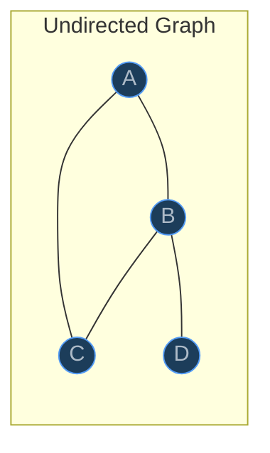
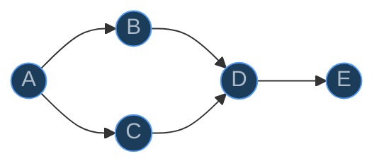
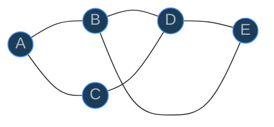
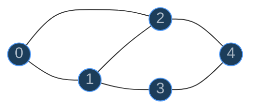
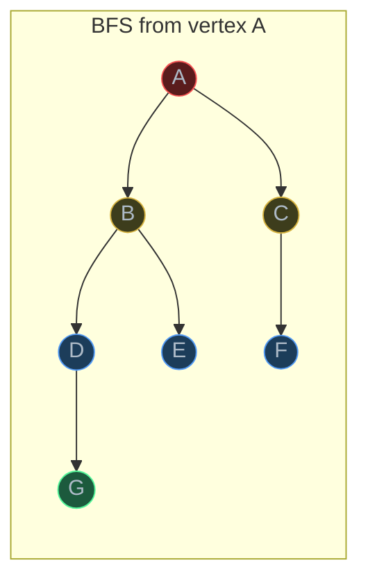
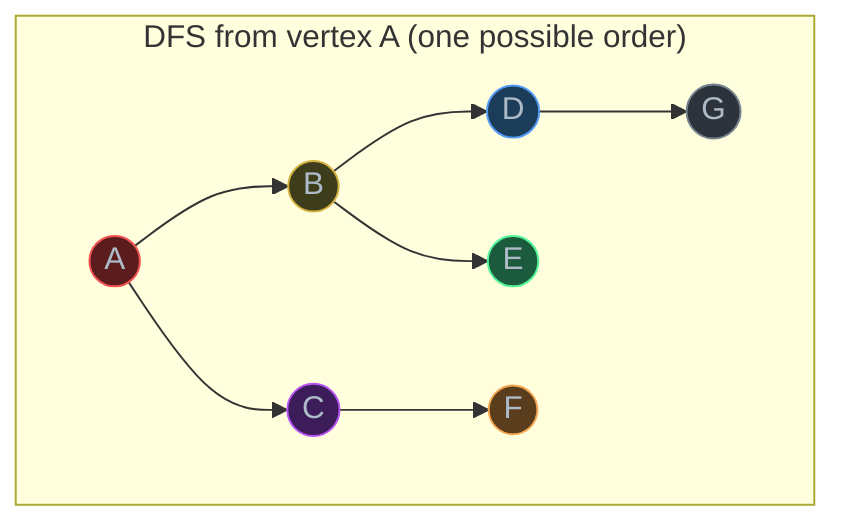
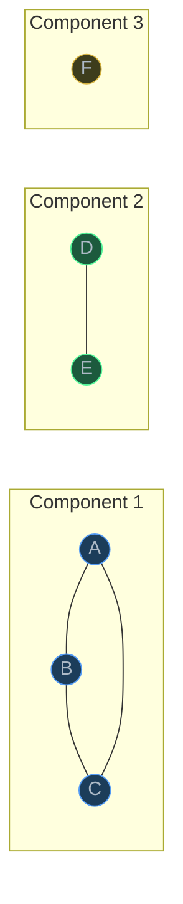
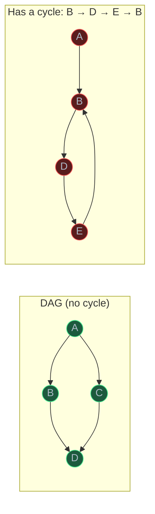
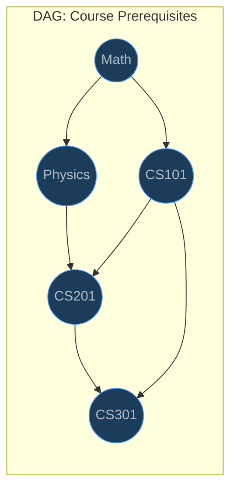

# Graphs

> A graph is a collection of vertices connected by edges, capable of modeling any relationship between objects — from social networks to build dependencies to road maps — making it the most general-purpose data structure in computer science.

## Table of Contents
- [Core Concepts](#core-concepts)
- [Code Examples](#code-examples)
- [Common Pitfalls](#common-pitfalls)
- [Key Takeaways](#key-takeaways)
- [Exercises](#exercises)

## Core Concepts

### Graph Terminology

#### What

A **graph** G = (V, E) consists of:

- **Vertices (nodes)** — the entities. A social network's users, a map's cities, a build system's packages.
- **Edges** — the connections between vertices. Friendships, roads, dependencies.

Key terminology:

| Term | Definition |
| --- | --- |
| **Vertex / Node** | A single entity in the graph |
| **Edge** | A connection between two vertices |
| **Directed edge** | An edge with a direction: u -> v (u to v, not v to u) |
| **Undirected edge** | An edge with no direction: u -- v (traversable both ways) |
| **Weighted edge** | An edge with an associated cost/distance/value |
| **Unweighted edge** | An edge with no associated value (or implicitly weight 1) |
| **Degree** | Number of edges connected to a vertex |
| **In-degree** | (Directed graphs) Number of edges pointing *into* a vertex |
| **Out-degree** | (Directed graphs) Number of edges pointing *out of* a vertex |
| **Path** | A sequence of vertices where each consecutive pair is connected by an edge |
| **Cycle** | A path that starts and ends at the same vertex |
| **Connected** | (Undirected) Every vertex is reachable from every other vertex |
| **Disconnected** | (Undirected) At least one vertex is unreachable from another |
| **DAG** | Directed Acyclic Graph — a directed graph with no cycles |



#### How

Degree counting example: In the undirected graph above, vertex A has degree 2 (connected to B and C), vertex B has degree 3 (connected to A, C, and D), vertex C has degree 2 (connected to A and B), and vertex D has degree 1 (connected only to B).

For directed graphs, you count in-degree and out-degree separately. If vertex X has edges X->Y and Z->X, then X has out-degree 1 and in-degree 1.

A **path** from A to D in the graph above could be A -> B -> D. A **cycle** exists: A -> B -> C -> A. Because every vertex can reach every other vertex, this graph is **connected**.

#### Why It Matters

Graph terminology is the vocabulary you need to discuss algorithms precisely. When someone says "find the shortest path in an unweighted graph," you need to know that means BFS. When they say "topological sort a DAG," you need to know that DAG means directed acyclic graph — and that topological sort is impossible if cycles exist. Imprecise vocabulary leads to choosing the wrong algorithm.

The distinction between directed and undirected graphs is particularly important: a friendship on Facebook is undirected (mutual), but a follow on Twitter is directed (one-way). This asymmetry fundamentally changes which algorithms apply and how you represent the graph.

### Directed Graphs

#### What

In a **directed graph** (digraph), every edge has a direction. An edge from u to v means you can go from u to v, but *not* from v to u (unless there's a separate edge v -> u). Directed edges are drawn as arrows.



In this directed graph: A has out-degree 2, in-degree 0. D has out-degree 1, in-degree 2. E has out-degree 0, in-degree 1. A vertex with in-degree 0 is called a **source**. A vertex with out-degree 0 is called a **sink**.

#### How

Directed graphs naturally model asymmetric relationships:

- **Dependencies**: Package A depends on package B (A -> B means "A requires B"). The arrow points from the dependent to the dependency.
- **Flow**: Water flows from reservoir to treatment plant to homes. The direction is inherent — water does not flow uphill.
- **Hierarchy**: Manager -> employee. The reporting structure is one-directional.
- **State machines**: State A transitions to state B on some input. The transition is directional.

When traversing a directed graph, you can only follow edges in their specified direction. From vertex D in the graph above, you can reach E but *cannot* reach A, B, or C — there is no directed path backward.

#### Why It Matters

Directed graphs unlock algorithms that don't make sense for undirected graphs: **topological sort** (ordering dependencies), **strongly connected components** (groups of vertices that can all reach each other), and **directed cycle detection** (finding circular dependencies). If your build system has a circular dependency (A needs B, B needs C, C needs A), a cycle detection algorithm on the directed dependency graph will catch it.

The concept of in-degree is particularly powerful. In Kahn's algorithm for topological sort, you start with vertices that have in-degree 0 (nothing depends on them) and work forward. This directly mirrors how a build system resolves dependencies — build the things that have no prerequisites first.

### Undirected Graphs

#### What

In an **undirected graph**, every edge is bidirectional. If there's an edge between u and v, you can travel from u to v *and* from v to u. Undirected edges are drawn as simple lines (no arrows).



In undirected graphs, there's just one "degree" per vertex (no in/out distinction). Vertex D has degree 3 (connected to B, C, and E).

#### How

Undirected graphs model symmetric relationships:

- **Social networks**: Facebook friendships — if Alice is friends with Bob, Bob is friends with Alice.
- **Road networks**: Most roads are two-way (with exceptions for one-way streets, which would be directed).
- **Communication networks**: Two computers connected by a cable can send data in both directions.
- **Chemical bonds**: A bond between atoms is bidirectional.

In implementation, an undirected edge between u and v is typically stored as *two* directed entries: u's neighbor list includes v, and v's neighbor list includes u. This means undirected graphs use twice the storage of directed graphs with the same edge count.

#### Why It Matters

Undirected graphs have properties that directed graphs lack. **Connected components** are straightforward in undirected graphs — a connected component is a maximal set of vertices where every vertex can reach every other vertex. In directed graphs, the analog is "strongly connected components," which is a harder problem (requires Tarjan's or Kosaraju's algorithm).

Cycle detection is also simpler in undirected graphs. In a directed graph, you need to track the recursion stack to detect back edges. In an undirected graph, you just need to check if you visit a vertex that you've already visited (and isn't the parent you just came from).

### Graph Representations

#### What

There are two standard ways to store a graph in memory: **adjacency matrix** and **adjacency list**. They represent the same graph but optimize for different operations.

Consider this graph with 5 vertices and 6 edges:



**Adjacency Matrix** — a V x V grid where `matrix[i][j] = 1` if there's an edge from i to j:

```
    0  1  2  3  4
0 [ 0, 1, 1, 0, 0 ]
1 [ 1, 0, 1, 1, 0 ]
2 [ 1, 1, 0, 0, 1 ]
3 [ 0, 1, 0, 0, 1 ]
4 [ 0, 0, 1, 1, 0 ]
```

Notice the matrix is **symmetric** for undirected graphs — `matrix[i][j] == matrix[j][i]`.

**Adjacency List** — a dictionary mapping each vertex to a list of its neighbors:

```
0: [1, 2]
1: [0, 2, 3]
2: [0, 1, 4]
3: [1, 4]
4: [2, 3]
```

#### How

| Operation | Adjacency Matrix | Adjacency List |
| --- | --- | --- |
| Check if edge (u, v) exists | O(1) — direct lookup `matrix[u][v]` | O(degree(u)) — scan u's neighbor list |
| Get all neighbors of u | O(V) — scan entire row | O(degree(u)) — iterate the list |
| Add an edge | O(1) — set `matrix[u][v] = 1` | O(1) — append to list |
| Remove an edge | O(1) — set `matrix[u][v] = 0` | O(degree(u)) — find and remove from list |
| Space | O(V^2) — always, regardless of edges | O(V + E) — proportional to actual edges |
| Add a vertex | O(V^2) — resize the matrix | O(1) — add an empty list |

The **density** of a graph determines which representation is better. Density = E / V^2 (ratio of actual edges to the maximum possible edges).

- **Dense graph** (E close to V^2): Most pairs of vertices are connected. Adjacency matrix wastes no space because most cells are non-zero. Edge lookup is O(1).
- **Sparse graph** (E much less than V^2): Most pairs are *not* connected. Adjacency matrix wastes enormous space storing zeros. Adjacency list stores only actual edges.

Most real-world graphs are **sparse**. A social network with 1 billion users doesn't have 10^18 friendships — each person has a few hundred connections at most. An adjacency matrix for Facebook would need ~10^18 cells (exabytes). An adjacency list needs space proportional to the actual edges (billions, not quintillions).

#### Why It Matters

Choosing the wrong representation can make your algorithm infeasible. If you need to iterate over all neighbors of a vertex (which BFS and DFS both do), an adjacency matrix forces O(V) per vertex even if the vertex has only 2 neighbors. On a graph with 1 million vertices and each vertex having 5 neighbors, the adjacency list processes neighbors in O(5) while the matrix processes in O(1,000,000). That's a 200,000x difference.

The rule of thumb: **use adjacency lists unless you have a specific reason to use a matrix**. Adjacency matrices are appropriate when the graph is dense, when you need O(1) edge existence checks, or when the graph is small enough that O(V^2) space is acceptable (e.g., V < 1000).

For the rest of this lesson, all implementations use adjacency lists with `dict[str, list[str]]` or `defaultdict(list)`.

### BFS on Graphs

#### What

**Breadth-First Search (BFS)** explores a graph level by level, starting from a source vertex. It visits all vertices at distance 1 first, then distance 2, then distance 3, and so on. BFS uses a **queue** (FIFO) to maintain the exploration frontier.

BFS guarantees the **shortest path** in an **unweighted graph** — the first time BFS reaches a vertex, it has found the shortest path to that vertex.



Exploration order: A (distance 0) -> B, C (distance 1) -> D, E, F (distance 2) -> G (distance 3).

#### How

BFS algorithm:

1. Start with the source vertex in a queue and mark it as visited.
2. While the queue is not empty:
   a. Dequeue a vertex `u`.
   b. For each neighbor `v` of `u`:
      - If `v` has not been visited, mark it visited and enqueue it.

The **visited set** is critical — without it, BFS would loop forever on cyclic graphs. Once a vertex is marked visited, it's never processed again.

Why does BFS find the shortest path? Because it processes vertices in order of their distance from the source. A vertex at distance 2 is never dequeued before all vertices at distance 1 have been dequeued. This level-by-level property is inherent to the FIFO behavior of the queue.

**Time complexity**: O(V + E) — each vertex is enqueued/dequeued at most once (O(V)), and each edge is examined at most once when exploring neighbors (O(E)).

**Space complexity**: O(V) — the visited set and queue together hold at most V vertices.

#### Why It Matters

BFS is the foundational algorithm for unweighted shortest path. When your GPS tells you the shortest route on a road network where all roads have equal travel time, that's BFS. When LinkedIn shows "2nd-degree connections," that's BFS from your profile node, stopping at distance 2.

BFS is also the basis for more advanced algorithms. Dijkstra's algorithm (week 10) is essentially BFS with a priority queue instead of a regular queue, enabling it to handle weighted edges. Level-order traversal of a tree is BFS starting from the root.

The key insight: **BFS answers the question "what is the shortest distance from a source to all other vertices in an unweighted graph?"** If edges have different weights, BFS no longer guarantees shortest paths — you need Dijkstra's algorithm.

### DFS on Graphs

#### What

**Depth-First Search (DFS)** explores a graph by going as deep as possible along each branch before backtracking. It uses a **stack** (LIFO) — either the call stack (recursive implementation) or an explicit stack (iterative implementation).

Unlike BFS, DFS does **not** find shortest paths. It explores deeply before broadly, which makes it ideal for problems that require exhaustive exploration: cycle detection, topological sort, connected components, and path existence.



One possible DFS order from A: A -> B -> D -> G -> (backtrack) -> E -> (backtrack) -> C -> F. DFS goes deep (A->B->D->G) before exploring siblings (E, C, F).

#### How

**Recursive DFS** — the most natural implementation:

1. Mark the current vertex as visited.
2. For each unvisited neighbor, recursively call DFS.

**Iterative DFS** — uses an explicit stack:

1. Push the source onto the stack.
2. While the stack is not empty:
   a. Pop a vertex `u`.
   b. If `u` is not visited, mark it visited.
   c. Push all unvisited neighbors of `u` onto the stack.

**Pre-order vs post-order processing**:

- **Pre-order**: Process the vertex *before* exploring its neighbors. Used for traversal, path finding.
- **Post-order**: Process the vertex *after* all its descendants have been explored. Used for topological sort (DFS-based), computing subtree sizes, and evaluating expression trees.

The distinction matters for topological sort: in DFS-based topological sort, you add a vertex to the result *after* all its dependencies have been processed (post-order), then reverse the result.

**Time complexity**: O(V + E) — same as BFS. Each vertex is visited once, each edge examined once.

**Space complexity**: O(V) — the visited set plus the recursion stack (or explicit stack). In the worst case (a long chain graph), the stack depth equals V.

#### Why It Matters

DFS is the backbone of three critical graph algorithms:

1. **Cycle detection**: In a directed graph, a cycle exists if DFS encounters a vertex that's currently on the recursion stack (a "back edge"). This detects circular dependencies in build systems, deadlocks in resource allocation, and infinite loops in state machines.

2. **Connected components**: Running DFS from each unvisited vertex identifies all connected components in an undirected graph. Each DFS call explores one complete component.

3. **Topological sort**: DFS post-order (reversed) produces a valid topological ordering of a DAG. This is one of the two standard approaches (the other is Kahn's algorithm).

DFS is also more memory-efficient than BFS on wide, shallow graphs. BFS stores the entire frontier (which can be O(V) for a star graph), while DFS only stores the current path (O(depth)).

### Connected Components (Undirected Graphs)

#### What

A **connected component** is a maximal subset of vertices in an undirected graph where every vertex is reachable from every other vertex in the subset. A graph is "connected" if it has exactly one connected component. A "disconnected" graph has two or more components.



This graph has three connected components: {A, B, C}, {D, E}, and {F}.

#### How

Finding connected components using DFS:

1. Initialize a visited set and a component counter.
2. For each vertex in the graph:
   - If the vertex hasn't been visited, start a DFS/BFS from it.
   - All vertices reached in this DFS/BFS belong to the same component.
   - Increment the component counter.

The total work across all DFS calls is still O(V + E) because each vertex and edge is processed exactly once across all the DFS calls combined.

#### Why It Matters

Connected components answer the question: "Can I get from A to B?" If A and B are in different components, no path exists. This is useful for network connectivity analysis (are all servers reachable from the gateway?), social network clustering (find friend groups), and image processing (identifying distinct objects in a binary image — the "number of islands" problem).

### Cycle Detection in Directed Graphs

#### What

A **cycle** in a directed graph is a path that starts and ends at the same vertex, following edge directions. Detecting cycles is critical because many algorithms (topological sort, dependency resolution) only work on **acyclic** graphs (DAGs).



#### How

Cycle detection in directed graphs uses DFS with **three vertex states**:

- **Unvisited** (white): Not yet explored.
- **In-progress** (gray): Currently being explored — on the recursion stack.
- **Completed** (black): Fully explored — all descendants processed.

A cycle exists if DFS encounters a vertex that is **in-progress** (gray). This is called a **back edge** — an edge from the current vertex back to an ancestor on the recursion stack. The cycle consists of the path from the ancestor to the current vertex plus the back edge.

Why three states and not two? In an undirected graph, two states (visited/unvisited) suffice because revisiting any vertex indicates a cycle. In a directed graph, revisiting a **completed** vertex is normal and does not indicate a cycle — it just means two paths lead to the same vertex. Only revisiting an **in-progress** vertex (currently on the recursion stack) means a cycle.

**Time complexity**: O(V + E) — standard DFS.
**Space complexity**: O(V) — for the state tracking and recursion stack.

#### Why It Matters

Cycle detection is the gatekeeper for topological sort. Before attempting topological sort, you should verify the graph is acyclic — otherwise topological sort is undefined (there is no valid ordering where every dependency comes before the things that depend on it, because circular dependencies exist).

Real-world applications: detecting deadlocks in concurrent systems (resource dependency cycles), detecting circular imports in Python modules, validating database foreign key relationships, and verifying that a build system's dependency graph is acyclic.

### Topological Sort

#### What

A **topological sort** (topological ordering) of a directed acyclic graph (DAG) is a linear ordering of vertices such that for every directed edge u -> v, vertex u comes **before** vertex v in the ordering. Topological sort answers the question: "In what order should I process these items, given their dependencies?"



Valid topological orderings:
- Math -> Physics -> CS101 -> CS201 -> CS301
- Math -> CS101 -> Physics -> CS201 -> CS301

Both are valid because every prerequisite comes before the course that requires it. Topological sort is **not unique** — a DAG may have many valid orderings.

#### How

There are two standard algorithms for topological sort:

**Kahn's Algorithm (BFS-based)**:

1. Compute the in-degree of every vertex.
2. Add all vertices with in-degree 0 to a queue (these have no prerequisites).
3. While the queue is not empty:
   a. Dequeue vertex `u` and add it to the result.
   b. For each neighbor `v` of `u`, decrement `v`'s in-degree by 1.
   c. If `v`'s in-degree becomes 0, enqueue it.
4. If the result contains all V vertices, the graph is a DAG and the result is a valid topological ordering. If not, the graph has a cycle.

```mermaid
graph TD
    subgraph "Kahn's Algorithm Step-by-Step"
        S1["Step 1: In-degrees\nMath=0, Physics=1, CS101=1, CS201=2, CS301=2"]
        S2["Step 2: Queue = [Math]\nResult = []"]
        S3["Step 3: Dequeue Math\nDecrement Physics→0, CS101→0\nQueue = [Physics, CS101]\nResult = [Math]"]
        S4["Step 4: Dequeue Physics\nDecrement CS201→1\nQueue = [CS101]\nResult = [Math, Physics]"]
        S5["Step 5: Dequeue CS101\nDecrement CS201→0, CS301→1\nQueue = [CS201]\nResult = [Math, Physics, CS101]"]
        S6["Step 6: Dequeue CS201\nDecrement CS301→0\nQueue = [CS301]\nResult = [Math, Physics, CS101, CS201]"]
        S7["Step 7: Dequeue CS301\nQueue = []\nResult = [Math, Physics, CS101, CS201, CS301]"]
    end

    S1 --> S2 --> S3 --> S4 --> S5 --> S6 --> S7

    style S1 fill:#1c3d5a,stroke:#539bf5,color:#adbac7
    style S2 fill:#1c3d5a,stroke:#539bf5,color:#adbac7
    style S3 fill:#1c3d5a,stroke:#539bf5,color:#adbac7
    style S4 fill:#1c3d5a,stroke:#539bf5,color:#adbac7
    style S5 fill:#1c3d5a,stroke:#539bf5,color:#adbac7
    style S6 fill:#1c3d5a,stroke:#539bf5,color:#adbac7
    style S7 fill:#1c3d5a,stroke:#539bf5,color:#adbac7
```



**DFS-based Topological Sort**:

1. Run DFS from each unvisited vertex.
2. After all of a vertex's descendants have been fully explored (post-order), push the vertex onto a stack (or prepend to a list).
3. The stack/list (read top to bottom) is a valid topological ordering.

The intuition: in DFS post-order, a vertex is added to the result only *after* all vertices it depends on have been added. Reversing this gives the correct dependency order.

**Time complexity**: O(V + E) for both algorithms.
**Space complexity**: O(V) for the in-degree array / visited set / result list.

#### Why It Matters

Topological sort is everywhere in software engineering:

- **Build systems** (Make, Bazel, Gradle): Compile source files in dependency order.
- **Package managers** (pip, npm, apt): Install packages in dependency order.
- **Task schedulers**: Execute tasks in prerequisite order.
- **Spreadsheets**: Evaluate cells in dependency order (cell A1 references B2, which references C3).
- **CI/CD pipelines**: Run test stages before deploy stages.
- **Course planning**: Determine which courses you can take each semester given prerequisites.

Topological sort **only works on DAGs**. If the graph has a cycle, no valid ordering exists — you can't put A before B and B before A simultaneously. Kahn's algorithm naturally detects cycles: if the result contains fewer than V vertices, some vertices were never enqueued because their in-degree never reached 0, meaning they're part of a cycle.

## Code Examples

### Graph Class with Adjacency List

```python
from __future__ import annotations
from collections import defaultdict
from dataclasses import dataclass, field


@dataclass
class Graph:
    """A graph represented as an adjacency list.

    Supports both directed and undirected graphs. Uses a defaultdict
    so adding an edge to a new vertex automatically creates its entry.
    """

    directed: bool = False
    _adj: dict[str, list[str]] = field(default_factory=lambda: defaultdict(list))

    def add_edge(self, u: str, v: str) -> None:
        """Add an edge from u to v (and v to u if undirected).

        Time:  O(1) — appending to a list.
        Space: O(1) — one (or two) list entries.
        """
        self._adj[u].append(v)
        if not self.directed:
            self._adj[v].append(u)
        else:
            # Ensure v exists in adjacency list even if it has no outgoing edges.
            # This matters for algorithms that iterate over all vertices.
            if v not in self._adj:
                self._adj[v] = []

    def neighbors(self, u: str) -> list[str]:
        """Return all neighbors of vertex u.

        Time:  O(1) — returning a reference to the list.
        """
        return self._adj[u]

    def vertices(self) -> list[str]:
        """Return all vertices in the graph.

        Time:  O(V) — iterate over all keys.
        """
        return list(self._adj.keys())

    def has_edge(self, u: str, v: str) -> bool:
        """Check if an edge from u to v exists.

        Time:  O(degree(u)) — linear scan of u's neighbor list.
        For O(1), use an adjacency matrix or store neighbors as sets.
        """
        return v in self._adj[u]

    def __repr__(self) -> str:
        kind = "Directed" if self.directed else "Undirected"
        lines = [f"{kind} Graph:"]
        for vertex in sorted(self._adj):
            neighbors = ", ".join(sorted(self._adj[vertex]))
            lines.append(f"  {vertex} -> [{neighbors}]")
        return "\n".join(lines)


# Demo: build a small undirected graph
g = Graph(directed=False)
g.add_edge("A", "B")
g.add_edge("A", "C")
g.add_edge("B", "D")
g.add_edge("C", "D")
g.add_edge("D", "E")

print(g)
print(f"\nNeighbors of B: {g.neighbors('B')}")
print(f"Edge A-D exists? {g.has_edge('A', 'D')}")
print(f"Edge A-B exists? {g.has_edge('A', 'B')}")
```

**Time**: Construction O(V + E). Neighbor lookup O(1). Edge existence check O(degree).
**Space**: O(V + E) — each vertex stored once in the dict, each edge stored once (directed) or twice (undirected) in the neighbor lists.

### Adjacency Matrix Implementation

```python
from __future__ import annotations
from dataclasses import dataclass, field


@dataclass
class GraphMatrix:
    """A graph represented as an adjacency matrix.

    Best for dense graphs where V is small. Provides O(1) edge lookup
    but uses O(V^2) space regardless of edge count.
    """

    vertices: list[str]
    directed: bool = False
    _matrix: list[list[int]] = field(default_factory=list, init=False)
    _index: dict[str, int] = field(default_factory=dict, init=False)

    def __post_init__(self) -> None:
        n = len(self.vertices)
        self._matrix = [[0] * n for _ in range(n)]
        self._index = {v: i for i, v in enumerate(self.vertices)}

    def add_edge(self, u: str, v: str, weight: int = 1) -> None:
        """Add an edge from u to v. O(1) time."""
        i, j = self._index[u], self._index[v]
        self._matrix[i][j] = weight
        if not self.directed:
            self._matrix[j][i] = weight

    def has_edge(self, u: str, v: str) -> bool:
        """Check if edge exists. O(1) time — the key advantage of matrices."""
        i, j = self._index[u], self._index[v]
        return self._matrix[i][j] != 0

    def neighbors(self, u: str) -> list[str]:
        """Return all neighbors of u. O(V) time — must scan entire row."""
        i = self._index[u]
        return [
            self.vertices[j]
            for j in range(len(self.vertices))
            if self._matrix[i][j] != 0
        ]

    def print_matrix(self) -> None:
        """Display the matrix with vertex labels."""
        header = "     " + "  ".join(f"{v:>2}" for v in self.vertices)
        print(header)
        for i, row in enumerate(self._matrix):
            label = f"{self.vertices[i]:>2}"
            values = "  ".join(f"{val:>2}" for val in row)
            print(f"  {label} [{values}]")


# Demo
gm = GraphMatrix(vertices=["A", "B", "C", "D", "E"])
gm.add_edge("A", "B")
gm.add_edge("A", "C")
gm.add_edge("B", "D")
gm.add_edge("C", "D")
gm.add_edge("D", "E")

gm.print_matrix()
print(f"\nEdge A-D? {gm.has_edge('A', 'D')}")
print(f"Edge A-B? {gm.has_edge('A', 'B')}")
print(f"Neighbors of D: {gm.neighbors('D')}")
```

**Time**: Edge check O(1). Neighbor enumeration O(V). Construction O(V^2).
**Space**: O(V^2) — always, regardless of how many edges exist. For a 10,000-vertex graph, this is 100 million cells.

### BFS: Shortest Path in Unweighted Graph

```python
from collections import defaultdict, deque


def bfs(
    graph: dict[str, list[str]],
    start: str,
) -> dict[str, int]:
    """Perform BFS from start, returning shortest distances to all reachable vertices.

    In an unweighted graph, BFS naturally finds the shortest path because
    it explores vertices level by level — all vertices at distance d are
    processed before any vertex at distance d+1.

    Time:  O(V + E) — each vertex dequeued once, each edge examined once.
    Space: O(V) — visited set + queue hold at most V vertices.
    """
    distances: dict[str, int] = {start: 0}
    visited: set[str] = {start}
    queue: deque[str] = deque([start])

    while queue:
        current = queue.popleft()  # O(1) — deque is a doubly linked list

        for neighbor in graph[current]:
            if neighbor not in visited:
                visited.add(neighbor)
                distances[neighbor] = distances[current] + 1
                queue.append(neighbor)

    return distances


def bfs_shortest_path(
    graph: dict[str, list[str]],
    start: str,
    end: str,
) -> list[str] | None:
    """Find the shortest path from start to end in an unweighted graph.

    Returns the path as a list of vertices, or None if no path exists.
    Uses a parent map to reconstruct the path by backtracking from end to start.

    Time:  O(V + E) — standard BFS.
    Space: O(V) — parent map + visited set + queue.
    """
    if start == end:
        return [start]

    visited: set[str] = {start}
    parent: dict[str, str] = {}
    queue: deque[str] = deque([start])

    while queue:
        current = queue.popleft()

        for neighbor in graph[current]:
            if neighbor not in visited:
                visited.add(neighbor)
                parent[neighbor] = current
                queue.append(neighbor)

                # Found the target — reconstruct path by walking parent pointers
                if neighbor == end:
                    path: list[str] = []
                    node = end
                    while node != start:
                        path.append(node)
                        node = parent[node]
                    path.append(start)
                    path.reverse()
                    return path

    return None  # end is unreachable from start


# Demo
graph: dict[str, list[str]] = defaultdict(list)
edges = [("A", "B"), ("A", "C"), ("B", "D"), ("B", "E"),
         ("C", "F"), ("D", "G"), ("E", "G"), ("F", "G")]
for u, v in edges:
    graph[u].append(v)
    graph[v].append(u)

print("BFS distances from A:")
distances = bfs(graph, "A")
for vertex, dist in sorted(distances.items()):
    print(f"  {vertex}: distance {dist}")

path = bfs_shortest_path(graph, "A", "G")
print(f"\nShortest path A -> G: {' -> '.join(path)}")

no_path = bfs_shortest_path(graph, "A", "Z")
print(f"Shortest path A -> Z: {no_path}")
```

**Time**: O(V + E) — BFS visits each vertex once and each edge once.
**Space**: O(V) — the visited set, parent map, and queue each hold at most V entries.

### DFS: Recursive and Iterative

```python
from collections import defaultdict


def dfs_recursive(
    graph: dict[str, list[str]],
    start: str,
    visited: set[str] | None = None,
) -> list[str]:
    """DFS using recursion (implicit call stack).

    Pre-order processing — the vertex is recorded when first visited,
    before exploring its neighbors.

    Time:  O(V + E) — each vertex visited once, each edge examined once.
    Space: O(V) — recursion stack depth can be V in the worst case (chain graph).
    """
    if visited is None:
        visited = set()

    visited.add(start)
    result: list[str] = [start]  # pre-order: record before exploring neighbors

    for neighbor in graph[start]:
        if neighbor not in visited:
            result.extend(dfs_recursive(graph, neighbor, visited))

    return result


def dfs_iterative(
    graph: dict[str, list[str]],
    start: str,
) -> list[str]:
    """DFS using an explicit stack.

    Uses a stack instead of recursion. Note: the order of exploration
    may differ from recursive DFS because the stack reverses the order
    of neighbor processing (last neighbor pushed is first popped).

    Time:  O(V + E) — each vertex visited once, each edge examined once.
    Space: O(V) — the explicit stack can hold at most V vertices.
    """
    visited: set[str] = set()
    stack: list[str] = [start]
    result: list[str] = []

    while stack:
        current = stack.pop()

        if current in visited:
            continue

        visited.add(current)
        result.append(current)  # pre-order: record when popped

        # Push neighbors in reverse order so that the first neighbor
        # is processed first (popped last from stack = processed first)
        for neighbor in reversed(graph[current]):
            if neighbor not in visited:
                stack.append(neighbor)

    return result


# Demo
graph: dict[str, list[str]] = defaultdict(list)
edges = [("A", "B"), ("A", "C"), ("B", "D"), ("B", "E"),
         ("C", "F"), ("D", "G")]
for u, v in edges:
    graph[u].append(v)
    graph[v].append(u)

print(f"DFS recursive from A: {dfs_recursive(graph, 'A')}")
print(f"DFS iterative from A: {dfs_iterative(graph, 'A')}")
```

**Time**: O(V + E) for both implementations.
**Space**: O(V) — recursive DFS uses the call stack; iterative DFS uses an explicit stack. Both can go up to V deep in the worst case.

### Connected Components

```python
from collections import defaultdict


def find_connected_components(
    graph: dict[str, list[str]],
) -> list[list[str]]:
    """Find all connected components in an undirected graph.

    Uses DFS to explore each component. Every time we encounter an
    unvisited vertex, it starts a new component.

    Time:  O(V + E) — total across all DFS calls. Each vertex and edge
           is processed exactly once, even though we call DFS multiple times.
    Space: O(V) — visited set + recursion stack.
    """
    visited: set[str] = set()
    components: list[list[str]] = []

    def dfs(vertex: str, component: list[str]) -> None:
        visited.add(vertex)
        component.append(vertex)
        for neighbor in graph[vertex]:
            if neighbor not in visited:
                dfs(neighbor, component)

    for vertex in graph:
        if vertex not in visited:
            component: list[str] = []
            dfs(vertex, component)
            components.append(component)

    return components


# Demo: disconnected graph with 3 components
graph: dict[str, list[str]] = defaultdict(list)

# Component 1: A-B-C
for u, v in [("A", "B"), ("B", "C"), ("A", "C")]:
    graph[u].append(v)
    graph[v].append(u)

# Component 2: D-E
graph["D"].append("E")
graph["E"].append("D")

# Component 3: F (isolated vertex)
graph["F"]  # accessing creates the key with empty list in defaultdict

components = find_connected_components(graph)
print(f"Number of components: {len(components)}")
for i, comp in enumerate(components, 1):
    print(f"  Component {i}: {comp}")
```

**Time**: O(V + E) — each vertex is visited once across all DFS calls.
**Space**: O(V) — for the visited set and recursion stack.

### Cycle Detection in Directed Graphs

```python
from collections import defaultdict
from enum import Enum


class State(Enum):
    """Vertex states for directed graph cycle detection.

    Three states are necessary (not two!) because in directed graphs,
    revisiting a COMPLETED vertex is normal (multiple paths to same vertex),
    while revisiting an IN_PROGRESS vertex means a cycle (back edge).
    """
    UNVISITED = "unvisited"
    IN_PROGRESS = "in_progress"  # on the current recursion stack
    COMPLETED = "completed"      # fully explored


def has_cycle_directed(graph: dict[str, list[str]]) -> bool:
    """Detect if a directed graph contains a cycle.

    Uses DFS with three vertex states. A cycle exists if we encounter
    a vertex that is IN_PROGRESS (currently on the recursion stack),
    meaning we've found a back edge.

    Time:  O(V + E) — standard DFS.
    Space: O(V) — state dictionary + recursion stack.
    """
    state: dict[str, State] = {v: State.UNVISITED for v in graph}

    def dfs(vertex: str) -> bool:
        """Returns True if a cycle is found starting from vertex."""
        state[vertex] = State.IN_PROGRESS

        for neighbor in graph[vertex]:
            if state[neighbor] == State.IN_PROGRESS:
                # Back edge found — neighbor is an ancestor on the current path
                return True
            if state[neighbor] == State.UNVISITED:
                if dfs(neighbor):
                    return True

        state[vertex] = State.COMPLETED
        return False

    # Must try starting DFS from every vertex — the graph might be disconnected
    for vertex in graph:
        if state[vertex] == State.UNVISITED:
            if dfs(vertex):
                return True

    return False


# Demo: graph WITHOUT a cycle (DAG)
dag: dict[str, list[str]] = defaultdict(list)
dag["A"].append("B")
dag["A"].append("C")
dag["B"].append("D")
dag["C"].append("D")
print(f"DAG has cycle: {has_cycle_directed(dag)}")  # False

# Demo: graph WITH a cycle (B -> D -> E -> B)
cyclic: dict[str, list[str]] = defaultdict(list)
cyclic["A"].append("B")
cyclic["B"].append("D")
cyclic["D"].append("E")
cyclic["E"].append("B")  # creates cycle B -> D -> E -> B
print(f"Cyclic graph has cycle: {has_cycle_directed(cyclic)}")  # True
```

**Time**: O(V + E) — each vertex and edge examined once.
**Space**: O(V) — state dictionary and recursion stack.

### Topological Sort: Kahn's Algorithm (BFS-based)

```python
from collections import defaultdict, deque


def topological_sort_kahn(graph: dict[str, list[str]]) -> list[str] | None:
    """Topological sort using Kahn's algorithm (BFS with in-degree tracking).

    Algorithm:
    1. Compute in-degree for every vertex.
    2. Enqueue all vertices with in-degree 0 (no dependencies).
    3. Process queue: dequeue vertex, add to result, decrement neighbors' in-degrees.
    4. When a neighbor's in-degree reaches 0, enqueue it.
    5. If result has all V vertices, graph is a DAG. Otherwise, cycle exists.

    Returns the topological ordering, or None if the graph has a cycle.

    Time:  O(V + E) — compute in-degrees O(V + E), process each vertex
           and edge once during BFS.
    Space: O(V) — in-degree map + queue + result list.
    """
    # Step 1: Compute in-degree for every vertex
    in_degree: dict[str, int] = {v: 0 for v in graph}
    for vertex in graph:
        for neighbor in graph[vertex]:
            in_degree[neighbor] = in_degree.get(neighbor, 0) + 1

    # Step 2: Enqueue all vertices with in-degree 0
    queue: deque[str] = deque()
    for vertex in in_degree:
        if in_degree[vertex] == 0:
            queue.append(vertex)

    result: list[str] = []

    # Step 3-4: Process the queue
    while queue:
        current = queue.popleft()
        result.append(current)

        for neighbor in graph[current]:
            in_degree[neighbor] -= 1
            if in_degree[neighbor] == 0:
                queue.append(neighbor)

    # Step 5: Check if all vertices were processed
    if len(result) != len(in_degree):
        return None  # cycle detected — some vertices never reached in-degree 0

    return result


# Demo: course prerequisites
courses: dict[str, list[str]] = defaultdict(list)
courses["Math"].append("Physics")
courses["Math"].append("CS101")
courses["Physics"].append("CS201")
courses["CS101"].append("CS201")
courses["CS101"].append("CS301")
courses["CS201"].append("CS301")
# Ensure all vertices exist in the graph (including those with no outgoing edges)
courses["CS301"]  # accessing creates the key with empty list

order = topological_sort_kahn(courses)
if order:
    print(f"Course order (Kahn's): {' -> '.join(order)}")
else:
    print("Cycle detected — no valid ordering exists!")

# Demo: cyclic graph
cyclic: dict[str, list[str]] = defaultdict(list)
cyclic["A"].append("B")
cyclic["B"].append("C")
cyclic["C"].append("A")  # cycle

order = topological_sort_kahn(cyclic)
if order:
    print(f"Order: {' -> '.join(order)}")
else:
    print("Cyclic graph — Kahn's algorithm detected the cycle!")
```

**Time**: O(V + E) — computing in-degrees scans all edges, BFS processes each vertex and edge once.
**Space**: O(V) — in-degree map, queue, and result list.

### Topological Sort: DFS-based

```python
from collections import defaultdict
from enum import Enum


class State(Enum):
    UNVISITED = "unvisited"
    IN_PROGRESS = "in_progress"
    COMPLETED = "completed"


def topological_sort_dfs(graph: dict[str, list[str]]) -> list[str] | None:
    """Topological sort using DFS post-order.

    The key insight: in DFS, a vertex is finished (post-order) only after
    ALL its descendants have been finished. So if we record vertices in
    post-order and reverse the result, we get a valid topological ordering.

    Why reverse? Because in post-order, a dependency is recorded AFTER the
    things that depend on it. Reversing puts dependencies first.

    Returns the topological ordering, or None if the graph has a cycle.

    Time:  O(V + E) — standard DFS.
    Space: O(V) — state map + recursion stack + result list.
    """
    state: dict[str, State] = {v: State.UNVISITED for v in graph}
    result: list[str] = []

    def dfs(vertex: str) -> bool:
        """Returns True if NO cycle is found (success)."""
        state[vertex] = State.IN_PROGRESS

        for neighbor in graph[vertex]:
            if state[neighbor] == State.IN_PROGRESS:
                return False  # cycle detected (back edge)
            if state[neighbor] == State.UNVISITED:
                if not dfs(neighbor):
                    return False  # propagate cycle detection upward

        state[vertex] = State.COMPLETED
        result.append(vertex)  # post-order: add AFTER all descendants are done
        return True

    for vertex in graph:
        if state[vertex] == State.UNVISITED:
            if not dfs(vertex):
                return None  # cycle exists

    result.reverse()  # post-order is reverse topological order
    return result


# Demo: build system dependencies
build: dict[str, list[str]] = defaultdict(list)
build["main.o"].append("app")
build["utils.o"].append("app")
build["main.c"].append("main.o")
build["utils.c"].append("utils.o")
build["utils.h"].append("main.o")
build["utils.h"].append("utils.o")
build["app"]  # sink — no outgoing edges

order = topological_sort_dfs(build)
if order:
    print(f"Build order (DFS): {' -> '.join(order)}")
else:
    print("Cycle detected — build system has circular dependencies!")

# Verify: every dependency comes before the thing that depends on it
if order:
    positions = {v: i for i, v in enumerate(order)}
    print("\nVerification:")
    for src in build:
        for dst in build[src]:
            status = "OK" if positions[src] < positions[dst] else "VIOLATION"
            print(f"  {src} -> {dst}: {status} (pos {positions[src]} < {positions[dst]})")
```

**Time**: O(V + E) — standard DFS traversal.
**Space**: O(V) — state map, recursion stack (up to V deep), and result list.

### Complete Graph Toolkit: Combining Everything

```python
from __future__ import annotations
from collections import defaultdict, deque
from dataclasses import dataclass, field
from enum import Enum


class VertexState(Enum):
    UNVISITED = "unvisited"
    IN_PROGRESS = "in_progress"
    COMPLETED = "completed"


@dataclass
class GraphToolkit:
    """A comprehensive graph class combining adjacency list representation
    with BFS, DFS, connected components, cycle detection, and topological sort.

    This is the kind of utility class you'd build once and reuse across
    graph problems — a practical toolkit, not a textbook exercise.
    """

    directed: bool = False
    _adj: dict[str, list[str]] = field(default_factory=lambda: defaultdict(list))

    def add_edge(self, u: str, v: str) -> None:
        """Add edge u->v (and v->u if undirected). O(1)."""
        self._adj[u].append(v)
        if not self.directed:
            self._adj[v].append(u)
        elif v not in self._adj:
            self._adj[v] = []

    def add_vertex(self, v: str) -> None:
        """Ensure vertex exists (even with no edges). O(1)."""
        if v not in self._adj:
            self._adj[v] = []

    def bfs_distances(self, start: str) -> dict[str, int]:
        """BFS returning shortest distances from start. O(V + E)."""
        dist: dict[str, int] = {start: 0}
        queue: deque[str] = deque([start])

        while queue:
            u = queue.popleft()
            for v in self._adj[u]:
                if v not in dist:
                    dist[v] = dist[u] + 1
                    queue.append(v)

        return dist

    def bfs_path(self, start: str, end: str) -> list[str] | None:
        """Find shortest path from start to end. O(V + E)."""
        if start == end:
            return [start]

        visited: set[str] = {start}
        parent: dict[str, str] = {}
        queue: deque[str] = deque([start])

        while queue:
            u = queue.popleft()
            for v in self._adj[u]:
                if v not in visited:
                    visited.add(v)
                    parent[v] = u
                    if v == end:
                        path = []
                        node = end
                        while node != start:
                            path.append(node)
                            node = parent[node]
                        path.append(start)
                        path.reverse()
                        return path
                    queue.append(v)

        return None

    def dfs(self, start: str) -> list[str]:
        """DFS traversal from start (pre-order). O(V + E)."""
        visited: set[str] = set()
        result: list[str] = []

        def explore(v: str) -> None:
            visited.add(v)
            result.append(v)
            for neighbor in self._adj[v]:
                if neighbor not in visited:
                    explore(neighbor)

        explore(start)
        return result

    def connected_components(self) -> list[list[str]]:
        """Find all connected components (undirected graph). O(V + E)."""
        visited: set[str] = set()
        components: list[list[str]] = []

        def explore(v: str, component: list[str]) -> None:
            visited.add(v)
            component.append(v)
            for neighbor in self._adj[v]:
                if neighbor not in visited:
                    explore(neighbor, component)

        for vertex in self._adj:
            if vertex not in visited:
                comp: list[str] = []
                explore(vertex, comp)
                components.append(comp)

        return components

    def has_cycle(self) -> bool:
        """Detect if the graph has a cycle. O(V + E).

        Uses three-state DFS for directed graphs.
        Uses parent tracking for undirected graphs.
        """
        if self.directed:
            return self._has_cycle_directed()
        return self._has_cycle_undirected()

    def _has_cycle_directed(self) -> bool:
        state: dict[str, VertexState] = {
            v: VertexState.UNVISITED for v in self._adj
        }

        def dfs(v: str) -> bool:
            state[v] = VertexState.IN_PROGRESS
            for neighbor in self._adj[v]:
                if state[neighbor] == VertexState.IN_PROGRESS:
                    return True
                if state[neighbor] == VertexState.UNVISITED and dfs(neighbor):
                    return True
            state[v] = VertexState.COMPLETED
            return False

        return any(
            dfs(v) for v in self._adj if state[v] == VertexState.UNVISITED
        )

    def _has_cycle_undirected(self) -> bool:
        visited: set[str] = set()

        def dfs(v: str, parent: str | None) -> bool:
            visited.add(v)
            for neighbor in self._adj[v]:
                if neighbor not in visited:
                    if dfs(neighbor, v):
                        return True
                elif neighbor != parent:
                    # Visited and not the parent — cycle found
                    return True
            return False

        return any(
            dfs(v, None) for v in self._adj if v not in visited
        )

    def topological_sort(self) -> list[str] | None:
        """Topological sort using Kahn's algorithm. O(V + E).

        Returns None if the graph has a cycle.
        Only meaningful for directed graphs.
        """
        if not self.directed:
            raise ValueError("Topological sort is only defined for directed graphs")

        in_degree: dict[str, int] = {v: 0 for v in self._adj}
        for v in self._adj:
            for neighbor in self._adj[v]:
                in_degree[neighbor] += 1

        queue: deque[str] = deque(v for v in in_degree if in_degree[v] == 0)
        result: list[str] = []

        while queue:
            v = queue.popleft()
            result.append(v)
            for neighbor in self._adj[v]:
                in_degree[neighbor] -= 1
                if in_degree[neighbor] == 0:
                    queue.append(neighbor)

        return result if len(result) == len(self._adj) else None


# ---- Demo: Undirected Graph ----
print("=== Undirected Graph ===")
ug = GraphToolkit(directed=False)
for u, v in [("A", "B"), ("B", "C"), ("A", "C"), ("D", "E"), ("F", "F")]:
    if u != v:
        ug.add_edge(u, v)
    else:
        ug.add_vertex(u)

print(f"Components: {ug.connected_components()}")
print(f"BFS from A: distances = {ug.bfs_distances('A')}")
print(f"DFS from A: {ug.dfs('A')}")
print(f"Path A->C: {ug.bfs_path('A', 'C')}")
print(f"Has cycle: {ug.has_cycle()}")

# ---- Demo: Directed Graph (DAG) ----
print("\n=== Directed Graph (DAG) ===")
dg = GraphToolkit(directed=True)
for u, v in [("compile", "link"), ("test", "deploy"),
             ("link", "test"), ("lint", "compile")]:
    dg.add_edge(u, v)

print(f"Has cycle: {dg.has_cycle()}")
print(f"Topological sort: {dg.topological_sort()}")

# ---- Demo: Directed Graph with cycle ----
print("\n=== Directed Graph (with cycle) ===")
cg = GraphToolkit(directed=True)
for u, v in [("A", "B"), ("B", "C"), ("C", "A")]:
    cg.add_edge(u, v)

print(f"Has cycle: {cg.has_cycle()}")
print(f"Topological sort: {cg.topological_sort()}")
```

**Time**: All operations are O(V + E).
**Space**: O(V + E) for the graph itself; individual algorithms use O(V) auxiliary space.

## Common Pitfalls

### Pitfall 1: Forgetting the Visited Set

```python
from collections import deque, defaultdict

# BAD — no visited set, BFS loops forever on cyclic graphs
def bfs_infinite_loop(graph: dict[str, list[str]], start: str) -> list[str]:
    result: list[str] = []
    queue: deque[str] = deque([start])

    while queue:
        current = queue.popleft()
        result.append(current)
        for neighbor in graph[current]:
            queue.append(neighbor)  # re-enqueues already-visited vertices!

    return result  # never returns if the graph has any cycle

# GOOD — track visited vertices to prevent revisiting
def bfs_correct(graph: dict[str, list[str]], start: str) -> list[str]:
    result: list[str] = []
    visited: set[str] = {start}
    queue: deque[str] = deque([start])

    while queue:
        current = queue.popleft()
        result.append(current)
        for neighbor in graph[current]:
            if neighbor not in visited:
                visited.add(neighbor)
                queue.append(neighbor)

    return result
```

Why it's wrong: Without a visited set, BFS will enqueue the same vertex multiple times. In an undirected graph with edge A-B, processing A enqueues B, then processing B enqueues A again, and the loop never terminates. Even in acyclic graphs, forgetting the visited set causes redundant work and incorrect results.

### Pitfall 2: Using Two States for Directed Cycle Detection

```python
# BAD — two states (visited/unvisited) gives false positives in directed graphs
def has_cycle_wrong(graph: dict[str, list[str]]) -> bool:
    visited: set[str] = set()

    def dfs(vertex: str) -> bool:
        visited.add(vertex)
        for neighbor in graph[vertex]:
            if neighbor in visited:
                return True  # FALSE POSITIVE — revisiting a completed vertex is normal!
            if dfs(neighbor):
                return True
        return False

    return any(dfs(v) for v in graph if v not in visited)


# GOOD — three states: UNVISITED, IN_PROGRESS, COMPLETED
def has_cycle_correct(graph: dict[str, list[str]]) -> bool:
    UNVISITED, IN_PROGRESS, COMPLETED = 0, 1, 2
    state: dict[str, int] = {v: UNVISITED for v in graph}

    def dfs(vertex: str) -> bool:
        state[vertex] = IN_PROGRESS
        for neighbor in graph[vertex]:
            if state[neighbor] == IN_PROGRESS:  # back edge = cycle
                return True
            if state[neighbor] == UNVISITED and dfs(neighbor):
                return True
        state[vertex] = COMPLETED
        return False

    return any(dfs(v) for v in graph if state[v] == UNVISITED)


# Example: A -> B, A -> C -> B (no cycle, but two-state detects false positive)
graph: dict[str, list[str]] = {"A": ["B", "C"], "B": [], "C": ["B"]}
print(f"Two-state (wrong): {has_cycle_wrong(graph)}")    # True (false positive!)
print(f"Three-state (correct): {has_cycle_correct(graph)}")  # False (correct)
```

Why it's wrong: In a directed graph, two different paths can lead to the same vertex — A->B and A->C->B. When DFS explores C->B after already visiting B via A->B, B is in the "visited" set. With two states, this is incorrectly flagged as a cycle. Three states distinguish between a vertex that is fully explored (COMPLETED, safe to revisit) and one that is still on the current recursion stack (IN_PROGRESS, indicates a real cycle).

### Pitfall 3: Not Handling Disconnected Graphs

```python
from collections import defaultdict

# BAD — only runs DFS from one vertex, misses disconnected components
def count_components_wrong(graph: dict[str, list[str]]) -> int:
    visited: set[str] = set()

    def dfs(v: str) -> None:
        visited.add(v)
        for neighbor in graph[v]:
            if neighbor not in visited:
                dfs(neighbor)

    first_vertex = next(iter(graph))
    dfs(first_vertex)
    return 1  # always returns 1!

# GOOD — try starting DFS from every unvisited vertex
def count_components_correct(graph: dict[str, list[str]]) -> int:
    visited: set[str] = set()
    count = 0

    def dfs(v: str) -> None:
        visited.add(v)
        for neighbor in graph[v]:
            if neighbor not in visited:
                dfs(neighbor)

    for vertex in graph:
        if vertex not in visited:
            dfs(vertex)
            count += 1

    return count


# Example: three separate components
graph: dict[str, list[str]] = defaultdict(list)
graph["A"].append("B"); graph["B"].append("A")
graph["C"].append("D"); graph["D"].append("C")
graph["E"]  # isolated vertex

print(f"Wrong: {count_components_wrong(graph)} component(s)")   # 1 (wrong)
print(f"Correct: {count_components_correct(graph)} component(s)")  # 3 (correct)
```

Why it's wrong: A single DFS/BFS from one starting vertex only reaches vertices in that vertex's connected component. If the graph is disconnected, vertices in other components are never visited. You must iterate over all vertices and start a new DFS/BFS from each unvisited one. This applies to cycle detection, topological sort, and connected components — any algorithm that must process the entire graph.

### Pitfall 4: Treating Undirected Edges as Single Entries

```python
from collections import defaultdict

# BAD — only stores one direction for undirected edges
def build_graph_wrong(edges: list[tuple[str, str]]) -> dict[str, list[str]]:
    graph: dict[str, list[str]] = defaultdict(list)
    for u, v in edges:
        graph[u].append(v)  # missing: graph[v].append(u)
    return graph

# GOOD — store both directions for undirected edges
def build_graph_correct(edges: list[tuple[str, str]]) -> dict[str, list[str]]:
    graph: dict[str, list[str]] = defaultdict(list)
    for u, v in edges:
        graph[u].append(v)
        graph[v].append(u)  # undirected: add both directions
    return graph


edges = [("A", "B"), ("B", "C")]
wrong = build_graph_wrong(edges)
correct = build_graph_correct(edges)

print(f"Wrong — neighbors of C: {wrong['C']}")    # [] (should be [B])
print(f"Correct — neighbors of C: {correct['C']}")  # ['B']
```

Why it's wrong: In an undirected graph, an edge A-B means A is B's neighbor *and* B is A's neighbor. If you only store A->B, traversals from B will never find A. BFS/DFS will miss vertices, connected component counts will be wrong, and shortest path computations will fail. Always add both directions for undirected graphs.

## Key Takeaways

- **Graphs model relationships** between entities. Choose directed for asymmetric relationships (dependencies, flow) and undirected for symmetric ones (friendships, roads). This choice determines which algorithms apply.
- **Adjacency lists** are the default representation for almost all graph problems because real-world graphs are sparse. Adjacency matrices are only worth the O(V^2) space when the graph is dense or you need O(1) edge existence checks.
- **BFS finds shortest paths in unweighted graphs** by exploring level by level. Always use a visited set to prevent infinite loops on cyclic graphs. Time and space are both O(V + E).
- **DFS is the foundation for cycle detection, connected components, and topological sort**. For directed cycle detection, you need three vertex states (unvisited / in-progress / completed) — two states produce false positives.
- **Topological sort orders vertices in dependency order** and only works on DAGs. Kahn's algorithm (BFS + in-degree tracking) naturally detects cycles; DFS-based topological sort uses post-order reversal. Both run in O(V + E).

## Exercises

1. **Write a function** `is_bipartite(graph: dict[str, list[str]]) -> bool` that determines if an undirected graph is bipartite (2-colorable). A graph is bipartite if you can color every vertex red or blue such that no two adjacent vertices share the same color. Hint: use BFS and try to assign alternating colors level by level. Analyze the time and space complexity.

2. **Explain** why BFS guarantees the shortest path in an unweighted graph but DFS does not. Construct a small graph (5-6 vertices) where DFS finds a path from A to Z that is longer than the shortest path. Show the BFS and DFS traversal orders and the resulting paths.

3. **Write a function** `all_paths(graph: dict[str, list[str]], start: str, end: str) -> list[list[str]]` that returns all possible paths from `start` to `end` in a directed acyclic graph. Each path should be a list of vertices. Hint: use DFS with backtracking. Analyze the time complexity in terms of the number of paths.

4. **Given a directed graph**, implement both Kahn's algorithm and DFS-based topological sort, then verify they produce valid (though possibly different) topological orderings for the same graph. Write a function `is_valid_topological_order(graph: dict[str, list[str]], order: list[str]) -> bool` that checks whether a given ordering is a valid topological sort.

5. **Write a function** `shortest_path_length(graph: dict[str, list[str]], start: str, end: str) -> int` that returns the shortest path length between two vertices in an unweighted undirected graph, or -1 if no path exists. Then extend it to `shortest_path_all_pairs(graph: dict[str, list[str]]) -> dict[str, dict[str, int]]` that returns the shortest distance between every pair of vertices. Analyze the time complexity of the all-pairs version.

---
up:: [Schedule](../../Schedule.md)
#type/learning #source/self-study #status/seed
