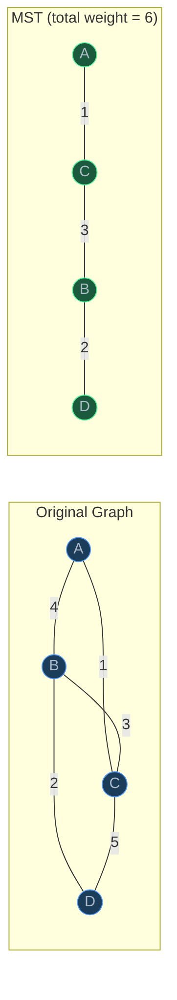
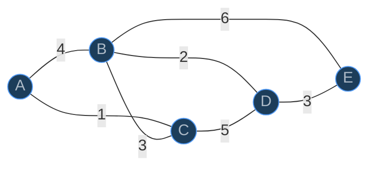
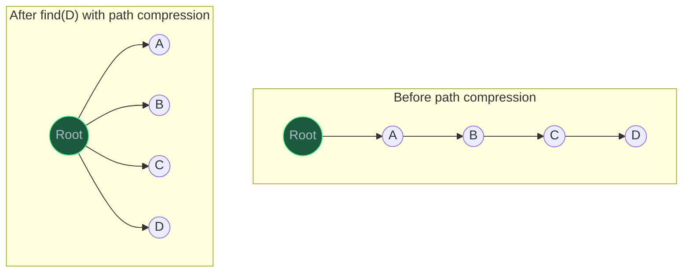
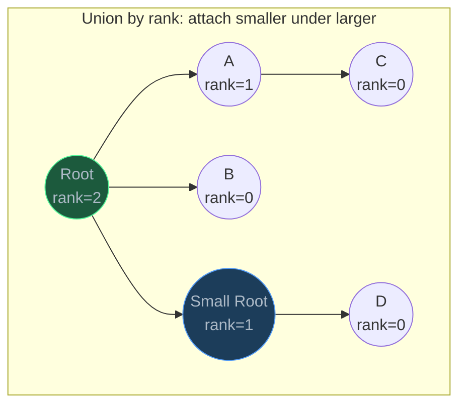

# Minimum Spanning Trees

> A minimum spanning tree connects all vertices in a weighted graph with the least total edge weight and no cycles — the foundation of network design and clustering problems.

## Table of Contents
- [Core Concepts](#core-concepts)
- [Code Examples](#code-examples)
- [Common Pitfalls](#common-pitfalls)
- [Key Takeaways](#key-takeaways)
- [Exercises](#exercises)

## Core Concepts

### What Is a Spanning Tree?

#### What

A **spanning tree** of a connected, undirected graph G = (V, E) is a subgraph that:

1. **Includes all vertices** of G.
2. **Is a tree** — connected and acyclic.
3. Has exactly **V - 1 edges** (a tree with V vertices always has V - 1 edges).

A graph can have many spanning trees. Among all possible spanning trees, a **minimum spanning tree (MST)** is one where the sum of edge weights is minimized.



The original graph has 5 edges. The MST keeps only 3 edges (V - 1 = 4 - 1 = 3) with the minimum total weight of 1 + 3 + 2 = 6.

#### How

Two classical algorithms build MSTs using different strategies:

- **Prim's**: Start from a vertex. Repeatedly add the cheapest edge that connects the growing tree to a new vertex. (Grows a single tree outward.)
- **Kruskal's**: Sort all edges by weight. Add edges one by one, skipping any that would create a cycle. (Grows a forest that merges into a single tree.)

Both produce the same MST (or one of equal weight if multiple MSTs exist).

#### Why It Matters

MSTs solve the fundamental network design problem: "connect everything at minimum cost." This appears everywhere:

- **Telecommunications**: Laying cable to connect all cities with minimum total cable length.
- **Circuit design**: Connecting pins on a circuit board with minimum wire.
- **Clustering**: Removing the most expensive edges from an MST produces clusters — the basis of single-linkage clustering in data science.
- **Approximation algorithms**: MSTs provide 2-approximations for the Traveling Salesman Problem.

### The Cut Property

#### What

The **cut property** is the theoretical foundation that guarantees both Prim's and Kruskal's algorithms produce correct MSTs. It states:

> For any cut (a partition of vertices into two non-empty sets S and V-S), the lightest edge crossing the cut belongs to some MST.

A **cut** divides the vertices into two groups. Edges that have one endpoint in each group "cross" the cut. The cut property says the cheapest crossing edge is always safe to add to the MST.

#### How

Both Prim's and Kruskal's implicitly apply the cut property at every step:

- **Prim's**: At each step, the "cut" is {vertices in the tree} vs {vertices not in the tree}. The cheapest edge crossing this cut is added.
- **Kruskal's**: When adding edge (u, v), if u and v are in different connected components, the edge crosses the cut {component of u} vs {everything else}. Since edges are sorted by weight, this is the cheapest crossing edge.

#### Why It Matters

The cut property is why greedy algorithms work for MSTs. It's not obvious that always picking the locally cheapest option yields the globally optimal tree — the cut property proves it does. This is one of the rare cases where a greedy strategy is provably optimal, which is why MST is one of the first problems taught in algorithm courses.

### Prim's Algorithm

#### What

Prim's algorithm grows the MST from a single starting vertex, always adding the cheapest edge that connects a vertex already in the MST to a vertex not yet in the MST. It's conceptually similar to Dijkstra's algorithm — both use a min-heap to greedily expand outward.

The key difference: Dijkstra tracks the *total distance from the source*, while Prim's tracks the *weight of the single edge connecting to the MST*.

#### How

1. Pick any starting vertex. Add it to the MST.
2. Add all edges from the starting vertex to a min-heap.
3. While the MST has fewer than V - 1 edges:
   - Extract the cheapest edge `(weight, u, v)` from the heap.
   - If `v` is already in the MST, skip this edge (it would create a cycle).
   - Otherwise, add `v` to the MST and add edge `(u, v)` to the MST edges.
   - Push all edges from `v` to non-MST vertices onto the heap.



**Step-by-step walkthrough** (starting from A):

| Step | Action | MST Vertices | MST Edges | Total Weight |
| --- | --- | --- | --- | --- |
| Init | Start with A | {A} | — | 0 |
| 1 | Cheapest edge from A: A-C (1) | {A, C} | A-C | 1 |
| 2 | Cheapest edge to non-MST: C-B (3) | {A, C, B} | A-C, C-B | 4 |
| 3 | Cheapest edge to non-MST: B-D (2) | {A, C, B, D} | A-C, C-B, B-D | 6 |
| 4 | Cheapest edge to non-MST: D-E (3) | {A, C, B, D, E} | A-C, C-B, B-D, D-E | 9 |


The MST has 4 edges (V - 1 = 5 - 1 = 4) with total weight 1 + 3 + 2 + 3 = 9.

**Complexity**: O(V + E log V) with a binary heap. Each of the E edges is pushed onto and possibly popped from the heap. Heap operations are O(log V) since the heap size is bounded by E, and log E = O(log V) because E <= V^2, so log E <= 2 log V = O(log V).

#### Why It Matters

Prim's is the natural choice when you want to grow the MST from a specific starting vertex. It works especially well on **dense graphs** (many edges) because the heap never holds more than E entries, and dense graphs have E close to V^2. With a Fibonacci heap, Prim's reaches O(E + V log V), which is optimal for dense graphs.

### Kruskal's Algorithm

#### What

Kruskal's algorithm builds the MST by processing all edges in order of increasing weight. For each edge, if adding it doesn't create a cycle, it's included in the MST. Cycle detection is handled efficiently by a **Union-Find (Disjoint Set Union)** data structure.

#### How

1. Sort all edges by weight.
2. Initialize a Union-Find structure with each vertex in its own set.
3. For each edge `(u, v, weight)` in sorted order:
   - If `u` and `v` are in different sets (different components), add the edge to the MST and union the two sets.
   - If they're in the same set, skip the edge (it would create a cycle).
4. Stop when V - 1 edges have been added.


**Sorted edges**: A-C (1), B-D (2), B-C (3), D-E (3), A-B (4), C-D (5), B-E (6)

| Step | Edge | Weight | Action | Components |
| --- | --- | --- | --- | --- |
| Init | — | — | — | {A}, {B}, {C}, {D}, {E} |
| 1 | A-C | 1 | Add (different sets) | {A,C}, {B}, {D}, {E} |
| 2 | B-D | 2 | Add (different sets) | {A,C}, {B,D}, {E} |
| 3 | B-C | 3 | Add (different sets) | {A,B,C,D}, {E} |
| 4 | D-E | 3 | Add (different sets) | {A,B,C,D,E} |
| — | A-B | 4 | Skip (same set) | — |
| — | C-D | 5 | Skip (same set) | — |
| — | B-E | 6 | Skip (same set) | — |

MST edges: A-C (1), B-D (2), B-C (3), D-E (3). Total weight = 9.

**Complexity**: O(E log E) — dominated by sorting. The Union-Find operations (find and union) are nearly O(1) amortized, so they don't affect the overall complexity. Since E <= V^2, we have log E <= 2 log V, so O(E log E) = O(E log V).

#### Why It Matters

Kruskal's shines on **sparse graphs** (few edges relative to vertices) because sorting E edges is fast when E is small. It's also naturally suited for problems where edges arrive incrementally or where you want to process edges in a specific order.

The key difference from Prim's: Kruskal's doesn't grow a single tree — it grows a **forest** of trees that gradually merge. This makes it inherently parallelizable and well-suited for distributed computing.

### Union-Find (Disjoint Set Union)

#### What

Union-Find is a data structure that tracks a collection of disjoint (non-overlapping) sets. It supports two operations:

- **`find(x)`**: Determine which set `x` belongs to (returns the set's representative).
- **`union(x, y)`**: Merge the sets containing `x` and `y`.

For Kruskal's algorithm, each connected component is a set. `find` checks if two vertices are in the same component, and `union` merges components when an edge is added.

#### How

The naive implementation uses a parent array where `parent[x]` points to x's parent. The root of a tree is its own parent and serves as the set's representative.

Two optimizations make Union-Find nearly O(1) per operation:

**1. Path compression** (in `find`): When finding the root of x, make every node along the path point directly to the root. This flattens the tree, so future `find` calls are faster.



**2. Union by rank**: When merging two trees, attach the shorter tree under the root of the taller tree. This keeps trees shallow, preventing the worst case where `find` degrades to O(n).



With both optimizations, the amortized cost per operation is **O(alpha(n))**, where alpha is the **inverse Ackermann function** — a function that grows so slowly that for all practical inputs (up to 10^80, the number of atoms in the universe), alpha(n) <= 5. For all intents and purposes, Union-Find operations are O(1).

#### Why It Matters

Union-Find is one of the most elegant data structures in computer science. Its near-O(1) performance comes from two simple optimizations that work synergistically — path compression makes trees flat, and union by rank keeps them balanced. Beyond Kruskal's algorithm, Union-Find is used for:

- **Connected components**: Dynamically tracking which nodes are connected as edges are added.
- **Cycle detection**: If `find(u) == find(v)`, adding edge (u, v) creates a cycle.
- **Percolation theory**: Determining when a grid becomes connected (used in physics and network analysis).
- **Image processing**: Connected-component labeling in binary images.

### Prim's vs Kruskal's

#### What

| Feature | Prim's | Kruskal's |
| --- | --- | --- |
| Strategy | Grow one tree from a start vertex | Merge a forest by adding cheapest edges |
| Time complexity | O(E log V) with binary heap | O(E log E) = O(E log V) |
| Data structure | Min-heap | Sorted edge list + Union-Find |
| Best for | Dense graphs (E close to V^2) | Sparse graphs (E close to V) |
| Parallelizable | Not easily | Yes (edges are independent) |
| Starting point | Requires a starting vertex | Doesn't need one |

#### How

The decision depends on graph density:

- **Dense graphs** (E >> V): Prim's is better. With a Fibonacci heap, Prim's runs in O(E + V log V), which is faster than Kruskal's O(E log E) when E is large.
- **Sparse graphs** (E ~ V): Kruskal's is better. Sorting fewer edges is fast, and Union-Find is nearly O(1).
- **Already-sorted edges**: Kruskal's is the clear winner — no sorting needed, the algorithm is just linear Union-Find operations.
- **Disconnected graph**: Kruskal's naturally handles this (produces a minimum spanning forest). Prim's needs to be run from each connected component separately.

#### Why It Matters

In practice, both algorithms are fast enough for most applications. The choice often comes down to implementation convenience:

- Prim's is easier to implement if you already have a graph represented as an adjacency list.
- Kruskal's is easier if your edges are naturally represented as a list of (u, v, weight) tuples.
- For competitive programming, Kruskal's is often preferred because the Union-Find implementation is reusable across many problems.

## Code Examples

### Union-Find with Path Compression and Union by Rank

```python
from dataclasses import dataclass, field


@dataclass
class UnionFind:
    """Disjoint Set Union with path compression and union by rank.

    Supports near-O(1) amortized find and union operations.
    """
    parent: dict[str, str] = field(default_factory=dict)
    rank: dict[str, int] = field(default_factory=dict)

    def make_set(self, x: str) -> None:
        """Create a new set containing only x.

        Time: O(1).
        """
        if x not in self.parent:
            self.parent[x] = x
            self.rank[x] = 0

    def find(self, x: str) -> str:
        """Find the representative (root) of the set containing x.

        Uses path compression: every node on the path to the root
        is directly attached to the root. This flattens the tree,
        making future find operations nearly O(1).

        Time: O(alpha(n)) amortized — effectively O(1).
        """
        if self.parent[x] != x:
            self.parent[x] = self.find(self.parent[x])  # Path compression
        return self.parent[x]

    def union(self, x: str, y: str) -> bool:
        """Merge the sets containing x and y.

        Uses union by rank: the shorter tree is attached under the
        taller tree's root, keeping the overall structure balanced.

        Returns True if x and y were in different sets (merge happened),
        False if they were already in the same set.

        Time: O(alpha(n)) amortized — effectively O(1).
        """
        root_x = self.find(x)
        root_y = self.find(y)

        if root_x == root_y:
            return False  # Already in the same set — edge would create a cycle

        # Attach smaller tree under larger tree's root
        if self.rank[root_x] < self.rank[root_y]:
            self.parent[root_x] = root_y
        elif self.rank[root_x] > self.rank[root_y]:
            self.parent[root_y] = root_x
        else:
            # Same rank — pick one as root and increment its rank
            self.parent[root_y] = root_x
            self.rank[root_x] += 1

        return True

    def connected(self, x: str, y: str) -> bool:
        """Check if x and y are in the same set.

        Time: O(alpha(n)) amortized.
        """
        return self.find(x) == self.find(y)


# --- Demo ---
def demo_union_find() -> None:
    """Demonstrate Union-Find operations."""
    uf = UnionFind()

    # Create individual sets
    for v in ["A", "B", "C", "D", "E"]:
        uf.make_set(v)

    print("Initial: each vertex is its own set")
    print(f"  A and B connected? {uf.connected('A', 'B')}")  # False

    uf.union("A", "B")
    print("\nAfter union(A, B):")
    print(f"  A and B connected? {uf.connected('A', 'B')}")  # True
    print(f"  A and C connected? {uf.connected('A', 'C')}")  # False

    uf.union("C", "D")
    uf.union("B", "C")
    print("\nAfter union(C, D) and union(B, C):")
    print(f"  A and D connected? {uf.connected('A', 'D')}")  # True
    print(f"  A and E connected? {uf.connected('A', 'E')}")  # False


if __name__ == "__main__":
    demo_union_find()
```

**Time**: Each `find` and `union` is O(alpha(n)) amortized, where alpha is the inverse Ackermann function. For all practical purposes, this is O(1).

**Space**: O(V) for the parent and rank dictionaries.

### Kruskal's Algorithm

```python
from dataclasses import dataclass, field


@dataclass
class UnionFind:
    """Disjoint Set Union — see previous example for detailed comments."""
    parent: dict[str, str] = field(default_factory=dict)
    rank: dict[str, int] = field(default_factory=dict)

    def make_set(self, x: str) -> None:
        if x not in self.parent:
            self.parent[x] = x
            self.rank[x] = 0

    def find(self, x: str) -> str:
        if self.parent[x] != x:
            self.parent[x] = self.find(self.parent[x])
        return self.parent[x]

    def union(self, x: str, y: str) -> bool:
        root_x = self.find(x)
        root_y = self.find(y)
        if root_x == root_y:
            return False
        if self.rank[root_x] < self.rank[root_y]:
            self.parent[root_x] = root_y
        elif self.rank[root_x] > self.rank[root_y]:
            self.parent[root_y] = root_x
        else:
            self.parent[root_y] = root_x
            self.rank[root_x] += 1
        return True


@dataclass
class MSTResult:
    """Stores the result of an MST algorithm."""
    edges: list[tuple[str, str, int]]
    total_weight: int


def kruskal(
    vertices: list[str],
    edges: list[tuple[str, str, int]],
) -> MSTResult:
    """Build a minimum spanning tree using Kruskal's algorithm.

    Args:
        vertices: List of all vertex names.
        edges: List of (u, v, weight) tuples representing undirected edges.

    Returns:
        MSTResult with the MST edges and total weight.

    Time:  O(E log E) — dominated by sorting edges. Union-Find operations
           are O(alpha(V)) each, effectively O(1), so the E union/find
           calls contribute O(E * alpha(V)) which is negligible.
    Space: O(V + E) — Union-Find is O(V), sorted edge list is O(E).
    """
    # Sort edges by weight — this is the bottleneck: O(E log E)
    sorted_edges = sorted(edges, key=lambda e: e[2])

    # Initialize Union-Find with each vertex in its own set
    uf = UnionFind()
    for v in vertices:
        uf.make_set(v)

    mst_edges: list[tuple[str, str, int]] = []
    total_weight = 0

    for u, v, weight in sorted_edges:
        # If u and v are in different components, this edge is safe to add
        # (it crosses a cut and is the cheapest such edge — cut property)
        if uf.union(u, v):
            mst_edges.append((u, v, weight))
            total_weight += weight

            # MST has exactly V-1 edges — stop early when we have enough
            if len(mst_edges) == len(vertices) - 1:
                break

    return MSTResult(edges=mst_edges, total_weight=total_weight)


# --- Demo ---
def demo_kruskal() -> None:
    """Build MST for the example graph."""
    vertices = ["A", "B", "C", "D", "E"]
    edges: list[tuple[str, str, int]] = [
        ("A", "B", 4),
        ("A", "C", 1),
        ("B", "C", 3),
        ("B", "D", 2),
        ("C", "D", 5),
        ("B", "E", 6),
        ("D", "E", 3),
    ]

    result = kruskal(vertices, edges)

    print(f"MST total weight: {result.total_weight}")
    print("MST edges:")
    for u, v, w in result.edges:
        print(f"  {u} -- {v} (weight {w})")


if __name__ == "__main__":
    demo_kruskal()
```

**Output:**
```
MST total weight: 9
MST edges:
  A -- C (weight 1)
  B -- D (weight 2)
  B -- C (weight 3)
  D -- E (weight 3)
```

**Time**: O(E log E) — sorting dominates. The E union/find calls are O(E * alpha(V)), which is effectively O(E).

**Space**: O(V + E) — the Union-Find structure is O(V), the sorted edge list is O(E).

### Prim's Algorithm

```python
import heapq
from dataclasses import dataclass


@dataclass
class MSTResult:
    """Stores the result of an MST algorithm."""
    edges: list[tuple[str, str, int]]
    total_weight: int


def prim(
    graph: dict[str, list[tuple[str, int]]],
    start: str | None = None,
) -> MSTResult:
    """Build a minimum spanning tree using Prim's algorithm.

    Args:
        graph: Weighted adjacency list for an undirected graph.
               graph[u] contains (neighbor, weight) tuples.
               IMPORTANT: edges must be represented in both directions.
        start: Starting vertex. Defaults to the first vertex in the graph.

    Returns:
        MSTResult with the MST edges and total weight.

    Time:  O(V + E log V) — each edge is pushed/popped from the heap
           at most once. Heap operations are O(log V) since the heap
           has at most E entries and log E = O(log V).
    Space: O(V + E) — the heap can hold up to E entries, and the
           in_mst set and edges list are O(V).
    """
    if start is None:
        start = next(iter(graph))

    # Track which vertices are in the MST
    in_mst: set[str] = {start}
    mst_edges: list[tuple[str, str, int]] = []
    total_weight = 0

    # Min-heap of (weight, from_vertex, to_vertex)
    # Initialize with all edges from the starting vertex
    heap: list[tuple[int, str, str]] = [
        (weight, start, neighbor) for neighbor, weight in graph[start]
    ]
    heapq.heapify(heap)

    while heap and len(mst_edges) < len(graph) - 1:
        weight, u, v = heapq.heappop(heap)

        # Skip if v is already in the MST — this edge would create a cycle
        if v in in_mst:
            continue

        # Add v to the MST
        in_mst.add(v)
        mst_edges.append((u, v, weight))
        total_weight += weight

        # Push all edges from v to non-MST vertices onto the heap
        for neighbor, edge_weight in graph[v]:
            if neighbor not in in_mst:
                heapq.heappush(heap, (edge_weight, v, neighbor))

    return MSTResult(edges=mst_edges, total_weight=total_weight)


# --- Demo ---
def demo_prim() -> None:
    """Build MST using Prim's algorithm."""
    # Undirected graph — each edge appears in both directions
    graph: dict[str, list[tuple[str, int]]] = {
        "A": [("B", 4), ("C", 1)],
        "B": [("A", 4), ("C", 3), ("D", 2), ("E", 6)],
        "C": [("A", 1), ("B", 3), ("D", 5)],
        "D": [("B", 2), ("C", 5), ("E", 3)],
        "E": [("B", 6), ("D", 3)],
    }

    result = prim(graph, "A")

    print(f"MST total weight: {result.total_weight}")
    print("MST edges (in order added):")
    for u, v, w in result.edges:
        print(f"  {u} -- {v} (weight {w})")


if __name__ == "__main__":
    demo_prim()
```

**Output:**
```
MST total weight: 9
MST edges (in order added):
  A -- C (weight 1)
  C -- B (weight 3)
  B -- D (weight 2)
  D -- E (weight 3)
```

**Time**: O(V + E log V) — every edge is pushed and popped from the heap at most once. Each heap operation is O(log V) because the heap contains at most E entries and log E = O(log V).

**Space**: O(V + E) — the heap can hold up to E entries, plus O(V) for the in_mst set.

### Computing MST Weight and Verifying Properties

```python
from dataclasses import dataclass, field


@dataclass
class UnionFind:
    """Minimal Union-Find for MST verification."""
    parent: dict[str, str] = field(default_factory=dict)
    rank: dict[str, int] = field(default_factory=dict)

    def make_set(self, x: str) -> None:
        if x not in self.parent:
            self.parent[x] = x
            self.rank[x] = 0

    def find(self, x: str) -> str:
        if self.parent[x] != x:
            self.parent[x] = self.find(self.parent[x])
        return self.parent[x]

    def union(self, x: str, y: str) -> bool:
        rx, ry = self.find(x), self.find(y)
        if rx == ry:
            return False
        if self.rank[rx] < self.rank[ry]:
            rx, ry = ry, rx
        self.parent[ry] = rx
        if self.rank[rx] == self.rank[ry]:
            self.rank[rx] += 1
        return True


def is_valid_spanning_tree(
    vertices: list[str],
    mst_edges: list[tuple[str, str, int]],
) -> tuple[bool, str]:
    """Verify that a set of edges forms a valid spanning tree.

    A valid spanning tree must:
    1. Have exactly V-1 edges.
    2. Connect all vertices (form a single connected component).
    3. Contain no cycles.

    Time:  O(V + E * alpha(V)) — effectively O(V + E).
    Space: O(V) for the Union-Find.
    """
    # Check edge count
    if len(mst_edges) != len(vertices) - 1:
        return False, f"Expected {len(vertices) - 1} edges, got {len(mst_edges)}"

    # Check connectivity and acyclicity using Union-Find
    uf = UnionFind()
    for v in vertices:
        uf.make_set(v)

    for u, v, _ in mst_edges:
        if not uf.union(u, v):
            return False, f"Edge {u}-{v} creates a cycle"

    # Check all vertices are connected
    root = uf.find(vertices[0])
    for v in vertices[1:]:
        if uf.find(v) != root:
            return False, f"Vertex {v} is not connected"

    return True, "Valid spanning tree"


def compute_mst_weight(edges: list[tuple[str, str, int]]) -> int:
    """Sum the weights of MST edges.

    Time:  O(E) — single pass over edges.
    Space: O(1) — just an accumulator.
    """
    return sum(w for _, _, w in edges)


# --- Demo ---
def demo_verify_mst() -> None:
    """Verify MST properties on a computed result."""
    vertices = ["A", "B", "C", "D", "E"]
    mst_edges: list[tuple[str, str, int]] = [
        ("A", "C", 1),
        ("B", "D", 2),
        ("B", "C", 3),
        ("D", "E", 3),
    ]

    valid, message = is_valid_spanning_tree(vertices, mst_edges)
    weight = compute_mst_weight(mst_edges)

    print(f"MST edges: {[(u, v, w) for u, v, w in mst_edges]}")
    print(f"Total weight: {weight}")
    print(f"Valid spanning tree: {valid} — {message}")
    print(f"Edge count: {len(mst_edges)} (expected {len(vertices) - 1})")

    # Test with an invalid MST (extra edge creates cycle)
    bad_edges = mst_edges + [("A", "B", 4)]
    valid, message = is_valid_spanning_tree(vertices, bad_edges)
    print(f"\nWith extra edge A-B: Valid = {valid} — {message}")


if __name__ == "__main__":
    demo_verify_mst()
```

**Output:**
```
MST edges: [('A', 'C', 1), ('B', 'D', 2), ('B', 'C', 3), ('D', 'E', 3)]
Total weight: 9
Valid spanning tree: True — Valid spanning tree
Edge count: 4 (expected 4)

With extra edge A-B: Valid = False — Expected 4 edges, got 5
```

**Time**: O(V + E * alpha(V)) for validation, O(E) for weight computation.

**Space**: O(V) for the Union-Find structure.

### Building a Graph from Edges and Running Both Algorithms

```python
import heapq
from dataclasses import dataclass, field


@dataclass
class UnionFind:
    parent: dict[str, str] = field(default_factory=dict)
    rank: dict[str, int] = field(default_factory=dict)

    def make_set(self, x: str) -> None:
        if x not in self.parent:
            self.parent[x] = x
            self.rank[x] = 0

    def find(self, x: str) -> str:
        if self.parent[x] != x:
            self.parent[x] = self.find(self.parent[x])
        return self.parent[x]

    def union(self, x: str, y: str) -> bool:
        rx, ry = self.find(x), self.find(y)
        if rx == ry:
            return False
        if self.rank[rx] < self.rank[ry]:
            rx, ry = ry, rx
        self.parent[ry] = rx
        if self.rank[rx] == self.rank[ry]:
            self.rank[rx] += 1
        return True


def edges_to_adjacency_list(
    edges: list[tuple[str, str, int]],
) -> dict[str, list[tuple[str, int]]]:
    """Convert an edge list to an adjacency list for an undirected graph.

    Time:  O(E).
    Space: O(V + E).
    """
    graph: dict[str, list[tuple[str, int]]] = {}
    for u, v, w in edges:
        graph.setdefault(u, []).append((v, w))
        graph.setdefault(v, []).append((u, w))
    return graph


def kruskal_mst(
    vertices: list[str],
    edges: list[tuple[str, str, int]],
) -> list[tuple[str, str, int]]:
    """Kruskal's MST — returns list of MST edges."""
    sorted_edges = sorted(edges, key=lambda e: e[2])
    uf = UnionFind()
    for v in vertices:
        uf.make_set(v)

    mst: list[tuple[str, str, int]] = []
    for u, v, w in sorted_edges:
        if uf.union(u, v):
            mst.append((u, v, w))
            if len(mst) == len(vertices) - 1:
                break
    return mst


def prim_mst(
    graph: dict[str, list[tuple[str, int]]],
) -> list[tuple[str, str, int]]:
    """Prim's MST — returns list of MST edges."""
    start = next(iter(graph))
    in_mst: set[str] = {start}
    mst: list[tuple[str, str, int]] = []
    heap: list[tuple[int, str, str]] = [
        (w, start, v) for v, w in graph[start]
    ]
    heapq.heapify(heap)

    while heap and len(mst) < len(graph) - 1:
        w, u, v = heapq.heappop(heap)
        if v in in_mst:
            continue
        in_mst.add(v)
        mst.append((u, v, w))
        for neighbor, weight in graph[v]:
            if neighbor not in in_mst:
                heapq.heappush(heap, (weight, v, neighbor))
    return mst


# --- Demo: compare both algorithms on the same graph ---
def demo_compare() -> None:
    """Run Kruskal's and Prim's on the same graph and compare results."""
    edges: list[tuple[str, str, int]] = [
        ("A", "B", 7),
        ("A", "D", 5),
        ("B", "C", 8),
        ("B", "D", 9),
        ("B", "E", 7),
        ("C", "E", 5),
        ("D", "E", 15),
        ("D", "F", 6),
        ("E", "F", 8),
        ("E", "G", 9),
        ("F", "G", 11),
    ]

    vertices = sorted({v for e in edges for v in (e[0], e[1])})
    graph = edges_to_adjacency_list(edges)

    print("=== Kruskal's Algorithm ===")
    k_mst = kruskal_mst(vertices, edges)
    k_weight = sum(w for _, _, w in k_mst)
    for u, v, w in k_mst:
        print(f"  {u} -- {v} (weight {w})")
    print(f"  Total weight: {k_weight}")

    print("\n=== Prim's Algorithm ===")
    p_mst = prim_mst(graph)
    p_weight = sum(w for _, _, w in p_mst)
    for u, v, w in p_mst:
        print(f"  {u} -- {v} (weight {w})")
    print(f"  Total weight: {p_weight}")

    print(f"\nBoth algorithms produce MST with weight: {k_weight}")
    assert k_weight == p_weight, "Bug: MST weights should be equal!"


if __name__ == "__main__":
    demo_compare()
```

**Output:**
```
=== Kruskal's Algorithm ===
  A -- D (weight 5)
  C -- E (weight 5)
  D -- F (weight 6)
  A -- B (weight 7)
  B -- E (weight 7)
  E -- G (weight 9)
  Total weight: 39

=== Prim's Algorithm ===
  A -- D (weight 5)
  D -- F (weight 6)
  A -- B (weight 7)
  B -- E (weight 7)
  E -- C (weight 5)
  E -- G (weight 9)
  Total weight: 39

Both algorithms produce MST with weight: 39
```

**Time**: Kruskal's O(E log E), Prim's O(E log V). Both produce MSTs of equal weight, though the specific edges may differ when multiple MSTs exist.

**Space**: O(V + E) for both algorithms.

## Common Pitfalls

### Pitfall 1: Forgetting to Add Edges in Both Directions for Undirected Graphs

```python
# BAD — only adds one direction, Prim's will miss connections
graph: dict[str, list[tuple[str, int]]] = {
    "A": [("B", 5)],
    "B": [("C", 3)],
    "C": [],
}
# Prim starting from C can't reach A or B!

# GOOD — add edges in both directions for undirected graphs
graph: dict[str, list[tuple[str, int]]] = {
    "A": [("B", 5)],
    "B": [("A", 5), ("C", 3)],
    "C": [("B", 3)],
}
# Now Prim's can traverse in any direction
```

Why it's wrong: An undirected edge means traversal in both directions. Prim's algorithm explores neighbors via the adjacency list — if only one direction is stored, the algorithm can't discover all connections. Kruskal's is less affected because it processes edges directly, but it's still best practice to be explicit about directionality.

### Pitfall 2: Not Checking for Cycles in Kruskal's Algorithm

```python
# BAD — adds all edges without cycle checking, result is not a tree
def bad_kruskal(vertices: list[str],
                edges: list[tuple[str, str, int]]) -> list[tuple[str, str, int]]:
    sorted_edges = sorted(edges, key=lambda e: e[2])
    mst = []
    for u, v, w in sorted_edges:
        mst.append((u, v, w))  # No cycle check!
        if len(mst) == len(vertices) - 1:
            break
    return mst
# This can include edges that form cycles → not a valid tree

# GOOD — use Union-Find to detect and skip cycle-forming edges
def good_kruskal(vertices: list[str],
                 edges: list[tuple[str, str, int]]) -> list[tuple[str, str, int]]:
    sorted_edges = sorted(edges, key=lambda e: e[2])
    uf = UnionFind()
    for v in vertices:
        uf.make_set(v)
    mst = []
    for u, v, w in sorted_edges:
        if uf.union(u, v):  # Only add if no cycle
            mst.append((u, v, w))
            if len(mst) == len(vertices) - 1:
                break
    return mst
```

Why it's wrong: Simply picking the V-1 cheapest edges doesn't guarantee a tree. Those edges might form cycles (e.g., a triangle of cheap edges), leaving some vertices disconnected. Union-Find efficiently checks whether two vertices are already connected before adding an edge.

### Pitfall 3: Union-Find Without Path Compression

```python
# BAD — find without path compression: O(n) worst case per call
def bad_find(parent: dict[str, str], x: str) -> str:
    while parent[x] != x:
        x = parent[x]  # Walk up the tree — could be O(n) deep
    return x

# GOOD — path compression flattens the tree, O(alpha(n)) amortized
def good_find(parent: dict[str, str], x: str) -> str:
    if parent[x] != x:
        parent[x] = good_find(parent, parent[x])  # Point directly to root
    return parent[x]
```

Why it's wrong: Without path compression, the Union-Find tree can degenerate into a long chain (like a linked list). Each `find` call walks the entire chain — O(n) per call, making Kruskal's O(n * E) instead of O(E * alpha(n)). Path compression ensures that after one `find` traversal, all nodes on the path point directly to the root, flattening the tree for future queries.

### Pitfall 4: Running Prim's on a Disconnected Graph

```python
# BAD — Prim's only reaches vertices in the same connected component
def bad_prim_disconnected(
    graph: dict[str, list[tuple[str, int]]],
) -> list[tuple[str, str, int]]:
    start = next(iter(graph))
    # ... standard Prim's ...
    # If graph has 2 components, this only finds MST of one component!

# GOOD — detect disconnected components and run Prim's on each
def prim_forest(
    graph: dict[str, list[tuple[str, int]]],
) -> list[tuple[str, str, int]]:
    """Build a minimum spanning forest for possibly disconnected graphs."""
    visited: set[str] = set()
    forest: list[tuple[str, str, int]] = []

    for vertex in graph:
        if vertex not in visited:
            # Run Prim's from this vertex for its component
            component_mst = prim_from(graph, vertex, visited)
            forest.extend(component_mst)

    return forest
```

Why it's wrong: Prim's grows a tree from a single starting vertex. If the graph is disconnected, it only reaches vertices in the same connected component. For disconnected graphs, you need to either use Kruskal's (which naturally handles multiple components) or run Prim's separately from an unvisited vertex in each component.

## Key Takeaways

- A **minimum spanning tree** connects all V vertices with V - 1 edges at minimum total weight. The **cut property** guarantees that greedy algorithms (Prim's, Kruskal's) produce correct MSTs.
- **Prim's algorithm** grows the MST from a starting vertex, always adding the cheapest edge to a new vertex. It runs in O(E log V) and works best on dense graphs.
- **Kruskal's algorithm** sorts all edges and adds them one by one, skipping those that would create cycles. It runs in O(E log E) and works best on sparse graphs.
- **Union-Find** with path compression and union by rank gives nearly O(1) amortized operations — it's the key data structure that makes Kruskal's efficient. It detects cycles by checking if two vertices share the same root.
- Both algorithms produce MSTs of equal weight. The choice between them depends on graph density, representation, and whether you need to handle disconnected graphs (Kruskal's handles this naturally).

## Exercises

1. **Trace Kruskal's algorithm** on this graph. Show the sorted edge list, the state of the Union-Find after each step, and the final MST edges and total weight.
   ```
   A --2-- B
   A --3-- C
   B --1-- C
   B --4-- D
   C --5-- D
   C --6-- E
   D --7-- E
   ```

2. **Explain** why the MST of a graph with V vertices always has exactly V - 1 edges. What would happen if it had fewer edges? What if it had more?

3. **Write a function** `second_best_mst(vertices: list[str], edges: list[tuple[str, str, int]]) -> int` that finds the total weight of the second-best MST. (Hint: for each edge in the MST, try removing it and computing a new MST. The second-best MST is the minimum among these alternatives.)

4. **Implement Union-Find iteratively** (without recursion in `find`). Write a version of `find` that uses a while loop to reach the root, then a second loop to perform path compression. Compare the recursive and iterative versions — when might the iterative version be preferred?

5. **Given a connected graph with all unique edge weights**, prove or disprove: "The MST is unique." Then construct a graph where two different MSTs exist and explain why they have the same total weight.

---
up:: [Schedule](../../Schedule.md)
#type/learning #source/self-study #status/seed
