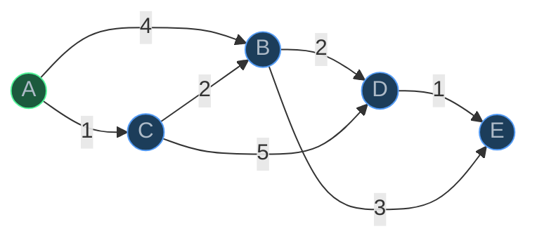
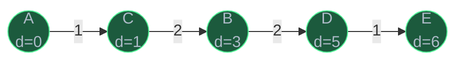
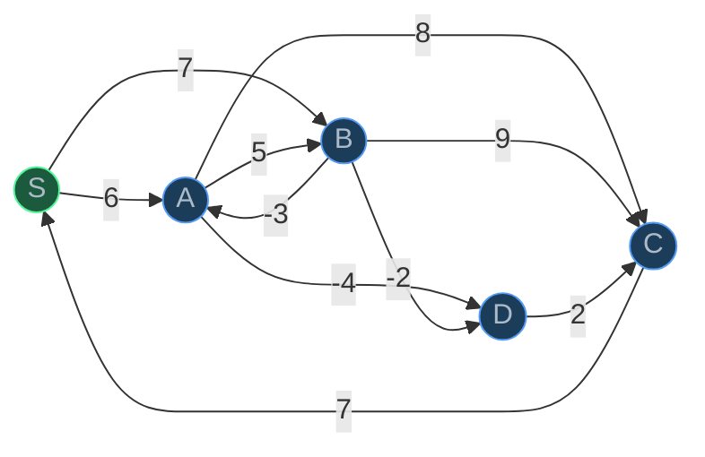
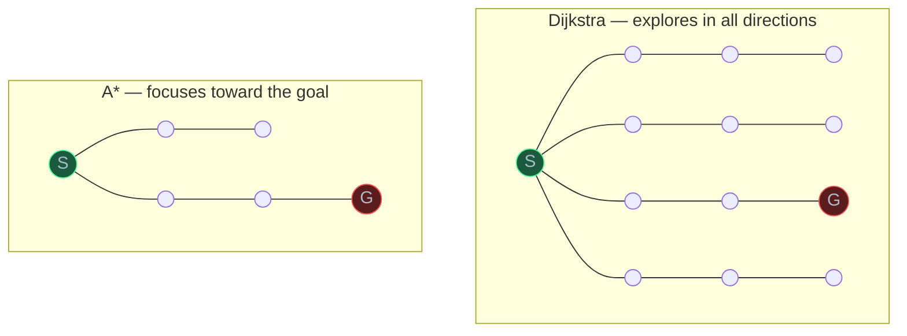
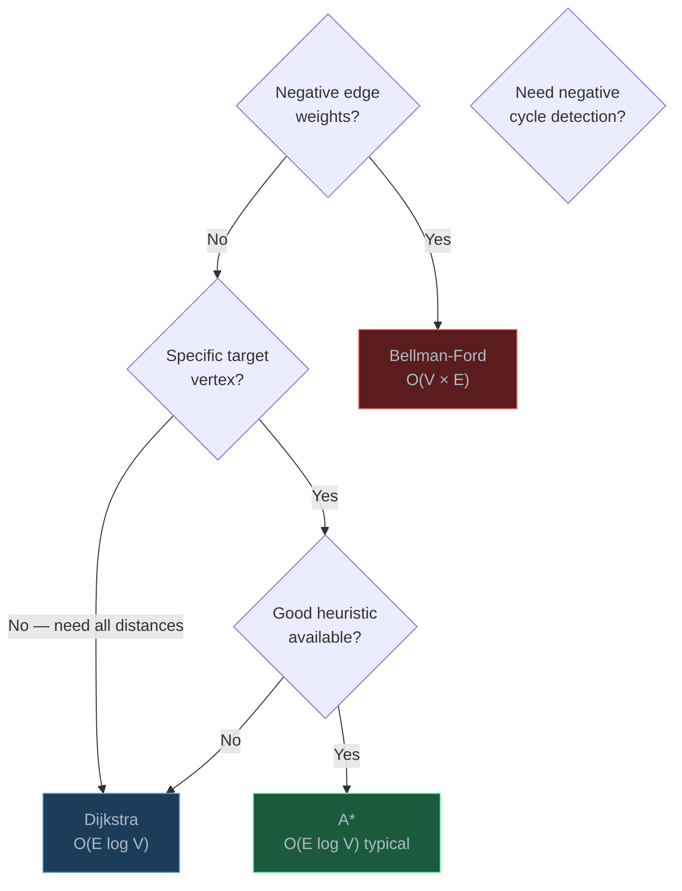

# Shortest Path Algorithms

> Shortest path algorithms find the minimum-cost route between vertices in a weighted graph — they power GPS navigation, network routing, and game AI pathfinding.

## Table of Contents
- [Core Concepts](#core-concepts)
- [Code Examples](#code-examples)
- [Common Pitfalls](#common-pitfalls)
- [Key Takeaways](#key-takeaways)
- [Exercises](#exercises)

## Core Concepts

### The Shortest Path Problem

#### What

Given a weighted graph and a source vertex, find the path from the source to every other vertex (or a specific target) such that the total sum of edge weights along the path is minimized. The "weight" can represent distance, time, cost, or any quantity you want to minimize.

There are two main variants:

| Variant | Description | Algorithms |
| --- | --- | --- |
| Single-source | Shortest paths from one vertex to all others | Dijkstra, Bellman-Ford |
| Point-to-point | Shortest path from one vertex to one specific target | A* (heuristic-guided) |

#### How

All shortest path algorithms rely on a fundamental operation called **relaxation**. For an edge `(u, v)` with weight `w`:

```
if dist[u] + w < dist[v]:
    dist[v] = dist[u] + w
    prev[v] = u
```

If we've found a shorter path to `v` by going through `u`, we update `v`'s distance. Every algorithm in this lesson is just a different strategy for choosing *which edges to relax* and *in what order*.

#### Why It Matters

Relaxation is the atomic building block of shortest path computation. Dijkstra relaxes edges greedily (cheapest first). Bellman-Ford relaxes all edges repeatedly. A* relaxes edges guided by a heuristic. Understanding relaxation means you understand the core mechanic shared by all three algorithms — the differences are just scheduling strategies.

### Dijkstra's Algorithm

#### What

Dijkstra's algorithm finds the shortest path from a single source vertex to all other vertices in a graph with **non-negative edge weights**. It uses a greedy strategy: always process the unvisited vertex with the smallest known distance.

The key insight is that once a vertex is processed (removed from the priority queue), its distance is finalized and will never change. This is what makes the greedy approach work — but only when all edge weights are non-negative.

#### How

1. Initialize `dist[source] = 0` and `dist[v] = infinity` for all other vertices.
2. Add `(0, source)` to a min-heap (priority queue).
3. While the heap is not empty:
   - Extract the vertex `u` with the smallest distance.
   - If `u` has already been finalized, skip it.
   - Mark `u` as finalized.
   - For each neighbor `v` of `u` with edge weight `w`:
     - If `dist[u] + w < dist[v]`, update `dist[v]` and push `(dist[v], v)` to the heap.
4. After the loop, `dist[v]` contains the shortest distance from source to `v`.



**Step-by-step walkthrough** (source = A):

| Step | Process | dist[A] | dist[B] | dist[C] | dist[D] | dist[E] | Heap |
| --- | --- | --- | --- | --- | --- | --- | --- |
| Init | — | 0 | inf | inf | inf | inf | (0,A) |
| 1 | A | **0** | 4 | 1 | inf | inf | (1,C),(4,B) |
| 2 | C | 0 | 3 | **1** | 6 | inf | (3,B),(4,B),(6,D) |
| 3 | B | 0 | **3** | 1 | 5 | 6 | (4,B),(5,D),(6,D),(6,E) |
| 4 | D | 0 | 3 | 1 | **5** | 6 | (6,D),(6,E) |
| 5 | E | 0 | 3 | 1 | 5 | **6** | — |

Bold values indicate when a vertex is finalized. Notice how B's distance changed from 4 (via A->B) to 3 (via A->C->B) when C was processed — this is relaxation in action.



**Complexity**: O(V + E log V) with a binary heap. Here's why:

- Each vertex is extracted from the heap at most once: O(V log V) total for all extractions.
- Each edge is relaxed at most once, and each relaxation may push to the heap: O(E log V) total.
- Combined: O(V log V + E log V) = O((V + E) log V). Since E >= V - 1 in a connected graph, this simplifies to O(E log V) in practice.
- The log V factor comes from heap operations (insert and extract-min) on a heap of at most V elements.

#### Why It Matters

Dijkstra's is the workhorse of shortest path computation. The OSPF (Open Shortest Path First) routing protocol in the internet uses Dijkstra's algorithm. GPS navigation systems use variants of it. It's fast, simple to implement, and correct — as long as all edge weights are non-negative.

The non-negative weight requirement isn't just a technicality — it's fundamental. Dijkstra's greedy assumption is: "once I've found the cheapest path to vertex u, no future path can be cheaper." With negative edges, this assumption fails. A longer path through a negative-weight edge could end up shorter. This is why you need Bellman-Ford for negative weights.

### Bellman-Ford Algorithm

#### What

The Bellman-Ford algorithm finds the shortest path from a single source to all other vertices, handling **negative edge weights**. It can also detect **negative weight cycles** — cycles where the total weight is negative, making the shortest path undefined (you could loop forever, reducing the distance).

#### How

1. Initialize `dist[source] = 0` and `dist[v] = infinity` for all other vertices.
2. Repeat V - 1 times:
   - For every edge `(u, v, w)` in the graph:
     - Relax: if `dist[u] + w < dist[v]`, update `dist[v] = dist[u] + w`.
3. (Negative cycle detection) Do one more pass over all edges:
   - If any edge can still be relaxed, a negative weight cycle exists.

**Why V - 1 iterations?** In a graph with V vertices, the shortest path between any two vertices can have at most V - 1 edges (it visits each vertex at most once). After iteration `k`, Bellman-Ford has found all shortest paths that use at most `k` edges. So after V - 1 iterations, all shortest paths are found.

**Why does the extra iteration detect negative cycles?** After V - 1 iterations, all shortest paths are finalized — *unless* a negative cycle exists. If a negative cycle is reachable from the source, you can keep going around it to reduce distances indefinitely. So if any edge can still be relaxed after V - 1 iterations, it means we can keep reducing distances, which is only possible with a negative cycle.



**Walkthrough** (source = S, processing edges in order S->A, S->B, A->B, A->C, A->D, B->A, B->C, B->D, C->S, D->C):

| Iteration | dist[S] | dist[A] | dist[B] | dist[C] | dist[D] |
| --- | --- | --- | --- | --- | --- |
| Init | 0 | inf | inf | inf | inf |
| 1 | 0 | 6 | 7 | 14 | 2 |
| 2 | 0 | 4 | 7 | 4 | 2 |
| 3 | 0 | 4 | 7 | 4 | 0 |
| 4 | 0 | 4 | 7 | 2 | 0 |

Notice how distances keep updating across iterations as shorter paths with more edges are discovered. In iteration 2, `dist[A]` improves from 6 to 4 because the path S->B->A (using the edge B->A with weight -3) is cheaper than the direct S->A.

**Complexity**: O(V * E). There are V - 1 iterations, and each iteration examines all E edges. This is significantly slower than Dijkstra's O(E log V), which is the price you pay for supporting negative weights.

#### Why It Matters

Bellman-Ford's ability to handle negative weights and detect negative cycles makes it essential in domains where "negative cost" is meaningful:

- **Currency arbitrage**: Model currencies as vertices and exchange rates as edges. A negative cycle means you can trade in a circle and profit — this is arbitrage. Financial systems use Bellman-Ford to detect these opportunities.
- **Network routing**: The RIP (Routing Information Protocol) uses a distributed version of Bellman-Ford where each router shares its distance table with neighbors.
- **Correctness verification**: Even when you expect non-negative weights, running Bellman-Ford's extra iteration can verify there are no negative cycles in your data.

### Dijkstra vs Bellman-Ford

#### What

| Feature | Dijkstra | Bellman-Ford |
| --- | --- | --- |
| Time complexity | O(E log V) | O(V * E) |
| Negative weights | No | Yes |
| Negative cycle detection | No | Yes |
| Strategy | Greedy (min-heap) | Relax all edges V-1 times |
| When to use | Non-negative weights, need speed | Negative weights or cycle detection |

#### How

The decision is straightforward:

- **Default choice**: Dijkstra. It's faster and simpler.
- **Negative weights exist**: You must use Bellman-Ford. Dijkstra will give wrong answers.
- **Need to detect negative cycles**: Bellman-Ford is the only option among these two.

#### Why It Matters

In practice, most shortest-path problems involve non-negative weights (distances, times, costs are naturally non-negative), so Dijkstra is the go-to algorithm. Bellman-Ford is the fallback for special cases. Knowing when each algorithm applies — and *why* Dijkstra fails with negative weights — shows you understand the algorithms rather than just memorizing them.

### A* Algorithm

#### What

A* (A-star) is a shortest-path algorithm that uses a **heuristic function** to guide the search toward the goal, making it faster than Dijkstra for point-to-point pathfinding. Instead of exploring all reachable vertices equally, A* prioritizes vertices that *appear* to be closer to the goal.

The core formula is:

```
f(n) = g(n) + h(n)
```

- **g(n)**: The actual cost from the start to vertex n (same as Dijkstra's distance).
- **h(n)**: The estimated cost from n to the goal (the heuristic).
- **f(n)**: The estimated total cost of the cheapest path through n.

A* processes vertices in order of f(n) instead of g(n). This means it prefers vertices that are both cheap to reach *and* estimated to be close to the goal.

#### How

A* works exactly like Dijkstra, except the priority queue sorts by `f(n) = g(n) + h(n)` instead of just `g(n)`:

1. Initialize `g[start] = 0`, push `(h(start), start)` to the min-heap.
2. While the heap is not empty:
   - Extract the vertex `n` with smallest `f(n)`.
   - If `n` is the goal, we're done — reconstruct the path.
   - For each neighbor `m` of `n` with edge weight `w`:
     - If `g[n] + w < g[m]`, update `g[m]` and push `(g[m] + h(m), m)` to the heap.

**Admissible heuristic**: A heuristic is admissible if it **never overestimates** the true cost to the goal. If h(n) is admissible, A* guarantees finding the optimal (shortest) path.

- If `h(n) = 0` for all n, A* degenerates into Dijkstra (no guidance, explores everything).
- If `h(n) =` true cost to goal, A* goes straight to the goal with zero wasted exploration.
- If `h(n) >` true cost (overestimates), A* may find a suboptimal path.

**Common heuristics for grid pathfinding:**

| Heuristic | Formula | Best for |
| --- | --- | --- |
| Manhattan distance | `abs(x1-x2) + abs(y1-y2)` | 4-directional movement (no diagonals) |
| Euclidean distance | `sqrt((x1-x2)^2 + (y1-y2)^2)` | Any-direction movement |
| Chebyshev distance | `max(abs(x1-x2), abs(y1-y2))` | 8-directional movement (with diagonals) |

All three are admissible for their respective movement types — they represent the straight-line distance, which can never be longer than the actual path.



A* explores far fewer vertices than Dijkstra because the heuristic steers the search toward the goal. In the best case (perfect heuristic), A* explores only the vertices on the optimal path. In the worst case (h=0), it explores the same vertices as Dijkstra.

**Complexity**: O(E log V) worst case (same as Dijkstra), but in practice A* visits far fewer vertices, making it much faster for point-to-point queries. The actual performance depends entirely on the quality of the heuristic.

#### Why It Matters

A* is the standard algorithm for pathfinding in games, robotics, and navigation:

- **Video games**: Every strategy game (StarCraft, Age of Empires) and many action games use A* for unit movement. Characters navigate around obstacles on a grid using Manhattan or Euclidean heuristics.
- **Robotics**: Autonomous robots use A* variants to plan paths through physical space.
- **Navigation apps**: While production GPS systems use more sophisticated algorithms (contraction hierarchies, ALT), A* is the conceptual foundation.

The key insight is that A* doesn't change the correctness guarantee — it finds the optimal path just like Dijkstra. It only changes the *order of exploration*, visiting fewer vertices by using domain knowledge (the heuristic) to avoid exploring unpromising directions.

### Algorithm Comparison Summary

#### What

| Feature | Dijkstra | Bellman-Ford | A* |
| --- | --- | --- | --- |
| Time complexity | O(E log V) | O(V * E) | O(E log V)* |
| Space complexity | O(V + E) | O(V + E) | O(V + E) |
| Negative weights | No | Yes | No |
| Negative cycle detection | No | Yes | No |
| Heuristic-guided | No | No | Yes |
| Best for | General SSSP | Negative weights | Point-to-point |
| Strategy | Greedy (min-heap) | Brute-force relaxation | Informed greedy |

*A* has the same worst-case as Dijkstra, but typically visits far fewer vertices.

#### How

Decision flowchart:



#### Why It Matters

Choosing the right algorithm is a design decision with real performance implications. Using Bellman-Ford when Dijkstra suffices wastes time (O(VE) vs O(E log V)). Using Dijkstra when negative weights exist gives wrong answers — silently. Using Dijkstra instead of A* for point-to-point pathfinding on a large grid explores orders of magnitude more vertices. Understanding the trade-offs means you pick the right tool for the job.

## Code Examples

### Dijkstra's Algorithm with Path Reconstruction

```python
import heapq
from dataclasses import dataclass, field


@dataclass
class DijkstraResult:
    """Stores the result of Dijkstra's algorithm."""
    dist: dict[str, float]
    prev: dict[str, str | None]

    def shortest_distance(self, target: str) -> float:
        """Return the shortest distance to target."""
        return self.dist.get(target, float('inf'))

    def shortest_path(self, target: str) -> list[str]:
        """Reconstruct the shortest path from source to target.

        Returns an empty list if target is unreachable.
        """
        if self.dist.get(target, float('inf')) == float('inf'):
            return []

        path: list[str] = []
        current: str | None = target
        while current is not None:
            path.append(current)
            current = self.prev.get(current)
        path.reverse()
        return path


def dijkstra(
    graph: dict[str, list[tuple[str, int]]],
    source: str,
) -> DijkstraResult:
    """Find shortest paths from source to all reachable vertices.

    Args:
        graph: Weighted adjacency list. graph[u] is a list of (neighbor, weight).
               All weights must be non-negative.
        source: The starting vertex.

    Returns:
        DijkstraResult with distances and predecessor map for path reconstruction.

    Time:  O(V + E log V) — each vertex extracted once from heap (V log V),
           each edge relaxed once with a heap push (E log V).
    Space: O(V + E) — storing distances, predecessors, and the heap.
    """
    # dist[v] = shortest known distance from source to v
    dist: dict[str, float] = {v: float('inf') for v in graph}
    dist[source] = 0

    # prev[v] = predecessor of v on the shortest path
    prev: dict[str, str | None] = {v: None for v in graph}

    # Min-heap of (distance, vertex) — Python's heapq is a min-heap
    heap: list[tuple[float, str]] = [(0, source)]

    # Track finalized vertices to skip stale heap entries
    finalized: set[str] = set()

    while heap:
        d, u = heapq.heappop(heap)

        # Skip if this vertex was already finalized.
        # The heap may contain stale entries with outdated (larger) distances
        # because we push new entries rather than decreasing keys.
        if u in finalized:
            continue
        finalized.add(u)

        # Relax all outgoing edges from u
        for v, weight in graph[u]:
            new_dist = d + weight
            if new_dist < dist[v]:
                dist[v] = new_dist
                prev[v] = u
                heapq.heappush(heap, (new_dist, v))

    return DijkstraResult(dist=dist, prev=prev)


# --- Demo ---
def demo_dijkstra() -> None:
    """Run Dijkstra on the example graph from the walkthrough."""
    graph: dict[str, list[tuple[str, int]]] = {
        "A": [("B", 4), ("C", 1)],
        "B": [("D", 2), ("E", 3)],
        "C": [("B", 2), ("D", 5)],
        "D": [("E", 1)],
        "E": [],
    }

    result = dijkstra(graph, "A")

    print("Shortest distances from A:")
    for vertex in sorted(result.dist):
        path = result.shortest_path(vertex)
        print(f"  A -> {vertex}: distance = {result.dist[vertex]}, "
              f"path = {' -> '.join(path)}")


if __name__ == "__main__":
    demo_dijkstra()
```

**Output:**
```
Shortest distances from A:
  A -> A: distance = 0, path = A
  A -> B: distance = 3, path = A -> C -> B
  A -> C: distance = 1, path = A -> C
  A -> D: distance = 5, path = A -> C -> B -> D
  A -> E: distance = 6, path = A -> C -> B -> D -> E
```

**Time**: O(V + E log V) — each vertex is extracted from the heap once (O(V log V)), and each edge triggers at most one heap push (O(E log V)).

**Space**: O(V + E) — the dist/prev dictionaries are O(V), the graph itself is O(V + E), and the heap is at most O(E) entries (each relaxation can push one entry).

### Bellman-Ford Algorithm with Negative Cycle Detection

```python
from dataclasses import dataclass


@dataclass
class BellmanFordResult:
    """Stores the result of Bellman-Ford algorithm."""
    dist: dict[str, float]
    prev: dict[str, str | None]
    has_negative_cycle: bool

    def shortest_path(self, target: str) -> list[str]:
        """Reconstruct path. Returns empty list if unreachable or negative cycle."""
        if self.has_negative_cycle:
            return []
        if self.dist.get(target, float('inf')) == float('inf'):
            return []

        path: list[str] = []
        current: str | None = target
        while current is not None:
            path.append(current)
            current = self.prev.get(current)
        path.reverse()
        return path


def bellman_ford(
    graph: dict[str, list[tuple[str, int]]],
    source: str,
) -> BellmanFordResult:
    """Find shortest paths from source, handling negative edge weights.

    Args:
        graph: Weighted adjacency list. graph[u] is a list of (neighbor, weight).
               Negative weights are allowed.
        source: The starting vertex.

    Returns:
        BellmanFordResult with distances, predecessors, and negative cycle flag.

    Time:  O(V × E) — V-1 iterations, each examining all E edges.
    Space: O(V) — distance and predecessor arrays.
    """
    vertices = list(graph.keys())
    dist: dict[str, float] = {v: float('inf') for v in vertices}
    dist[source] = 0
    prev: dict[str, str | None] = {v: None for v in vertices}

    # Collect all edges as (u, v, weight) tuples for easy iteration
    edges: list[tuple[str, str, int]] = []
    for u in graph:
        for v, w in graph[u]:
            edges.append((u, v, w))

    # Relax all edges V-1 times.
    # After iteration k, we have found all shortest paths using at most k edges.
    # The longest shortest path in a graph with V vertices has at most V-1 edges.
    for i in range(len(vertices) - 1):
        updated = False
        for u, v, w in edges:
            if dist[u] != float('inf') and dist[u] + w < dist[v]:
                dist[v] = dist[u] + w
                prev[v] = u
                updated = True

        # Early termination: if no distances changed, we're done
        if not updated:
            break

    # Negative cycle detection: one more pass.
    # If any distance can still be reduced, a negative cycle is reachable.
    has_negative_cycle = False
    for u, v, w in edges:
        if dist[u] != float('inf') and dist[u] + w < dist[v]:
            has_negative_cycle = True
            break

    return BellmanFordResult(
        dist=dist,
        prev=prev,
        has_negative_cycle=has_negative_cycle,
    )


# --- Demo ---
def demo_bellman_ford() -> None:
    """Run Bellman-Ford on a graph with negative edges."""
    graph: dict[str, list[tuple[str, int]]] = {
        "S": [("A", 6), ("B", 7)],
        "A": [("B", 5), ("C", 8), ("D", -4)],
        "B": [("A", -3), ("C", 9), ("D", -2)],
        "C": [("S", 7)],
        "D": [("C", 2)],
    }

    result = bellman_ford(graph, "S")

    if result.has_negative_cycle:
        print("Negative cycle detected! Shortest paths are undefined.")
    else:
        print("Shortest distances from S:")
        for vertex in sorted(result.dist):
            path = result.shortest_path(vertex)
            print(f"  S -> {vertex}: distance = {result.dist[vertex]}, "
                  f"path = {' -> '.join(path)}")


def demo_negative_cycle() -> None:
    """Demonstrate negative cycle detection."""
    # This graph has a negative cycle: A -> B -> C -> A = 1 + (-3) + 1 = -1
    graph: dict[str, list[tuple[str, int]]] = {
        "S": [("A", 5)],
        "A": [("B", 1)],
        "B": [("C", -3)],
        "C": [("A", 1)],
    }

    result = bellman_ford(graph, "S")
    print(f"\nNegative cycle detected: {result.has_negative_cycle}")
    # True — the cycle A -> B -> C -> A has total weight -1


if __name__ == "__main__":
    demo_bellman_ford()
    demo_negative_cycle()
```

**Output:**
```
Shortest distances from S:
  S -> A: distance = 4, path = S -> B -> A
  S -> B: distance = 7, path = S -> B
  S -> C: distance = 2, path = S -> B -> A -> D -> C
  S -> D: distance = 0, path = S -> B -> A -> D
  S -> S: distance = 0, path = S

Negative cycle detected: True
```

**Time**: O(V * E) — V-1 iterations over all E edges. The early termination optimization helps in practice but doesn't change the worst case.

**Space**: O(V + E) — distance and predecessor dictionaries are O(V), the edge list is O(E).

### A* Algorithm for Grid Pathfinding

```python
import heapq
from dataclasses import dataclass


@dataclass(frozen=True)
class Point:
    """A 2D grid coordinate."""
    row: int
    col: int

    def __lt__(self, other: "Point") -> bool:
        """Required for heapq tie-breaking when f-values are equal."""
        return (self.row, self.col) < (other.row, other.col)


def manhattan_distance(a: Point, b: Point) -> int:
    """Manhattan distance heuristic — admissible for 4-directional grid movement.

    This never overestimates because the shortest path on a grid with
    4-directional movement is at least |dx| + |dy| moves.
    """
    return abs(a.row - b.row) + abs(a.col - b.col)


def a_star_grid(
    grid: list[list[int]],
    start: Point,
    goal: Point,
) -> tuple[list[Point], int] | None:
    """Find the shortest path on a 2D grid using A*.

    Args:
        grid: 2D grid where 0 = passable, 1 = wall.
        start: Starting position.
        goal: Target position.

    Returns:
        Tuple of (path as list of Points, total cost) or None if no path exists.
        Each step costs 1 (unweighted grid).

    Time:  O(V log V) worst case where V = rows × cols, but typically
           much less due to heuristic pruning.
    Space: O(V) for the g_score dict and the heap.
    """
    rows = len(grid)
    cols = len(grid[0])

    # Validate start and goal
    if grid[start.row][start.col] == 1 or grid[goal.row][goal.col] == 1:
        return None

    # g_score[p] = actual cost from start to p
    g_score: dict[Point, float] = {start: 0}

    # came_from[p] = predecessor of p on the shortest path
    came_from: dict[Point, Point] = {}

    # Priority queue: (f_score, point)
    # f_score = g_score + heuristic
    open_set: list[tuple[float, Point]] = [
        (manhattan_distance(start, goal), start)
    ]

    closed_set: set[Point] = set()

    # 4-directional movement: up, down, left, right
    directions: list[tuple[int, int]] = [(-1, 0), (1, 0), (0, -1), (0, 1)]

    while open_set:
        f, current = heapq.heappop(open_set)

        if current == goal:
            # Reconstruct path
            path: list[Point] = [current]
            while current in came_from:
                current = came_from[current]
                path.append(current)
            path.reverse()
            return path, int(g_score[goal])

        if current in closed_set:
            continue
        closed_set.add(current)

        for dr, dc in directions:
            neighbor = Point(current.row + dr, current.col + dc)

            # Skip out-of-bounds
            if not (0 <= neighbor.row < rows and 0 <= neighbor.col < cols):
                continue

            # Skip walls
            if grid[neighbor.row][neighbor.col] == 1:
                continue

            # Skip already-finalized vertices
            if neighbor in closed_set:
                continue

            # Each step costs 1 on an unweighted grid
            tentative_g = g_score[current] + 1

            if tentative_g < g_score.get(neighbor, float('inf')):
                g_score[neighbor] = tentative_g
                came_from[neighbor] = current
                f_score = tentative_g + manhattan_distance(neighbor, goal)
                heapq.heappush(open_set, (f_score, neighbor))

    return None  # No path exists


def print_grid_with_path(
    grid: list[list[int]],
    path: list[Point] | None,
    start: Point,
    goal: Point,
) -> None:
    """Visualize the grid with the path marked."""
    path_set = set(path) if path else set()

    symbols = {
        "wall": "#",
        "path": "*",
        "start": "S",
        "goal": "G",
        "empty": ".",
    }

    for r in range(len(grid)):
        row_str = ""
        for c in range(len(grid[0])):
            p = Point(r, c)
            if p == start:
                row_str += symbols["start"] + " "
            elif p == goal:
                row_str += symbols["goal"] + " "
            elif p in path_set:
                row_str += symbols["path"] + " "
            elif grid[r][c] == 1:
                row_str += symbols["wall"] + " "
            else:
                row_str += symbols["empty"] + " "
        print(row_str)


# --- Demo ---
def demo_a_star() -> None:
    """Find a path through a grid with obstacles."""
    grid: list[list[int]] = [
        [0, 0, 0, 0, 0, 0, 0, 0],
        [0, 0, 0, 1, 0, 0, 0, 0],
        [0, 0, 0, 1, 0, 0, 0, 0],
        [0, 0, 0, 1, 0, 0, 0, 0],
        [0, 0, 0, 1, 0, 0, 0, 0],
        [0, 0, 0, 0, 0, 0, 0, 0],
        [0, 0, 0, 0, 0, 0, 0, 0],
    ]

    start = Point(0, 0)
    goal = Point(3, 6)

    result = a_star_grid(grid, start, goal)

    if result:
        path, cost = result
        print(f"Path found! Cost: {cost}, Steps: {len(path)}")
        print()
        print_grid_with_path(grid, path, start, goal)
        print()
        print("Path coordinates:")
        for p in path:
            print(f"  ({p.row}, {p.col})")
    else:
        print("No path found!")


if __name__ == "__main__":
    demo_a_star()
```

**Output:**
```
Path found! Cost: 9, Steps: 10

S * * . . . . .
. . * # . . . .
. . * # . . . .
. . * # . . G .
. . * # . * . .
. . * * * . . .
. . . . . . . .

Path coordinates:
  (0, 0)
  (0, 1)
  (0, 2)
  (1, 2)
  (2, 2)
  (3, 2)
  (4, 2)
  (5, 2)
  (5, 3)
  (5, 4)
  (4, 5)
  (3, 6)
```

**Time**: O(V log V) worst case where V = rows * cols, but A* typically explores far fewer cells than Dijkstra/BFS due to heuristic guidance. The Manhattan heuristic is especially effective on grids because it closely approximates the true distance.

**Space**: O(V) for the g_score dictionary, came_from dictionary, and the heap.

### Dijkstra on a Larger Weighted Graph

```python
import heapq
from collections import defaultdict


def dijkstra_simple(
    graph: dict[str, list[tuple[str, int]]],
    source: str,
    target: str,
) -> tuple[float, list[str]]:
    """Simplified Dijkstra returning just the path and distance to a target.

    Time:  O(E log V) with binary heap.
    Space: O(V + E).
    """
    dist: dict[str, float] = defaultdict(lambda: float('inf'))
    dist[source] = 0
    prev: dict[str, str | None] = {source: None}
    heap: list[tuple[float, str]] = [(0, source)]
    finalized: set[str] = set()

    while heap:
        d, u = heapq.heappop(heap)

        if u in finalized:
            continue
        finalized.add(u)

        if u == target:
            break  # Early termination — we found the target

        for v, w in graph.get(u, []):
            new_dist = d + w
            if new_dist < dist[v]:
                dist[v] = new_dist
                prev[v] = u
                heapq.heappush(heap, (new_dist, v))

    # Reconstruct path
    if dist[target] == float('inf'):
        return float('inf'), []

    path: list[str] = []
    current: str | None = target
    while current is not None:
        path.append(current)
        current = prev.get(current)
    path.reverse()

    return dist[target], path


# --- Demo: city network ---
def demo_city_routing() -> None:
    """Shortest path between cities with road distances."""
    roads: dict[str, list[tuple[str, int]]] = {
        "Taipei": [("Taoyuan", 40), ("Keelung", 30)],
        "Taoyuan": [("Taipei", 40), ("Hsinchu", 50), ("Yilan", 90)],
        "Keelung": [("Taipei", 30), ("Yilan", 60)],
        "Hsinchu": [("Taoyuan", 50), ("Taichung", 80)],
        "Yilan": [("Taoyuan", 90), ("Keelung", 60), ("Hualien", 100)],
        "Taichung": [("Hsinchu", 80), ("Tainan", 150)],
        "Hualien": [("Yilan", 100), ("Taitung", 120)],
        "Tainan": [("Taichung", 150), ("Kaohsiung", 50)],
        "Taitung": [("Hualien", 120), ("Kaohsiung", 140)],
        "Kaohsiung": [("Tainan", 50), ("Taitung", 140)],
    }

    start = "Taipei"
    end = "Kaohsiung"

    distance, path = dijkstra_simple(roads, start, end)
    print(f"Shortest route from {start} to {end}:")
    print(f"  Distance: {distance} km")
    print(f"  Route: {' -> '.join(path)}")


if __name__ == "__main__":
    demo_city_routing()
```

**Time**: O(E log V). The early termination when we find the target means we often don't explore the entire graph.

**Space**: O(V + E) for the graph, distances, and heap.

## Common Pitfalls

### Pitfall 1: Using Dijkstra with Negative Edge Weights

```python
# BAD — Dijkstra gives WRONG answers with negative edges
graph_with_negative: dict[str, list[tuple[str, int]]] = {
    "A": [("B", 1), ("C", 4)],
    "B": [("C", -5)],  # Negative edge!
    "C": [],
}
# Dijkstra processes B first (dist=1), then C (dist=4).
# But the path A->B->C has cost 1+(-5) = -4, which is shorter!
# Dijkstra already finalized C at distance 4 and won't reconsider it.

# GOOD — Use Bellman-Ford for graphs with negative weights
result = bellman_ford(graph_with_negative, "A")
# Correctly finds: dist[C] = -4 via path A -> B -> C
```

Why it's wrong: Dijkstra's correctness relies on the greedy assumption that once a vertex is finalized, no shorter path can be found. Negative edges violate this — a longer path through a negative edge can end up shorter. Dijkstra has no mechanism to revisit finalized vertices, so it misses these shorter paths.

### Pitfall 2: Forgetting to Handle Unreachable Vertices

```python
# BAD — crashes with KeyError when target is unreachable
def bad_shortest_path(graph: dict[str, list[tuple[str, int]]],
                      source: str, target: str) -> float:
    dist = dijkstra(graph, source).dist
    return dist[target]  # KeyError if target not in graph!

# GOOD — use .get() with infinity default
def good_shortest_path(graph: dict[str, list[tuple[str, int]]],
                       source: str, target: str) -> float:
    dist = dijkstra(graph, source).dist
    return dist.get(target, float('inf'))
```

Why it's wrong: In disconnected graphs, some vertices may be unreachable from the source. Always check for `float('inf')` distances or missing keys before treating a distance as valid.

### Pitfall 3: Non-Admissible Heuristic in A*

```python
# BAD — heuristic overestimates, A* may return suboptimal path
def bad_heuristic(a: Point, b: Point) -> float:
    # Multiplying by 2 makes it inadmissible — overestimates the true cost
    return 2 * (abs(a.row - b.row) + abs(a.col - b.col))

# GOOD — admissible heuristic, never overestimates
def good_heuristic(a: Point, b: Point) -> int:
    # Manhattan distance for 4-directional grid — exact lower bound
    return abs(a.row - b.row) + abs(a.col - b.col)
```

Why it's wrong: An inadmissible heuristic (one that overestimates) makes A* too aggressive — it skips paths that look expensive according to the heuristic but are actually optimal. The result may be a valid path, but not the shortest one. Always verify that your heuristic is a *lower bound* on the true cost.

### Pitfall 4: Not Handling the Stale Heap Entry Problem in Dijkstra

```python
# BAD — processes the same vertex multiple times, wasting work
def bad_dijkstra(graph: dict[str, list[tuple[str, int]]],
                 source: str) -> dict[str, float]:
    dist: dict[str, float] = {v: float('inf') for v in graph}
    dist[source] = 0
    heap = [(0, source)]

    while heap:
        d, u = heapq.heappop(heap)
        # Missing: no check for stale entries!
        for v, w in graph[u]:
            if d + w < dist[v]:
                dist[v] = d + w
                heapq.heappush(heap, (dist[v], v))
    return dist

# GOOD — skip vertices that have already been finalized
def good_dijkstra(graph: dict[str, list[tuple[str, int]]],
                  source: str) -> dict[str, float]:
    dist: dict[str, float] = {v: float('inf') for v in graph}
    dist[source] = 0
    heap = [(0, source)]
    finalized: set[str] = set()

    while heap:
        d, u = heapq.heappop(heap)
        if u in finalized:
            continue  # Skip stale entry — this vertex is already done
        finalized.add(u)
        for v, w in graph[u]:
            if d + w < dist[v]:
                dist[v] = d + w
                heapq.heappush(heap, (dist[v], v))
    return dist
```

Why it's wrong: Since Python's `heapq` doesn't support decrease-key, we push new entries when a shorter distance is found. The old entry with the longer distance stays in the heap. Without the finalized check, we process the same vertex multiple times, doing redundant work. The algorithm still gives correct results, but wastes time on large graphs.

### Pitfall 5: Using Bellman-Ford's Negative Cycle Check Incorrectly

```python
# BAD — checking dist[u] + w < dist[v] without checking dist[u] != inf
for u, v, w in edges:
    if dist[u] + w < dist[v]:
        has_negative_cycle = True  # False positive! u might be unreachable

# GOOD — only check edges reachable from the source
for u, v, w in edges:
    if dist[u] != float('inf') and dist[u] + w < dist[v]:
        has_negative_cycle = True  # Genuine negative cycle reachable from source
```

Why it's wrong: If `dist[u]` is still infinity (vertex u is unreachable from the source), then `float('inf') + w` in Python is still `float('inf')`, so the comparison `float('inf') + w < float('inf')` is False and this particular case is safe in Python. However, in other languages or with integer representations of infinity, this can cause overflow or false positives. The explicit check is a best practice for clarity and portability.

## Key Takeaways

- **Dijkstra's algorithm** is the default choice for shortest paths in graphs with non-negative weights. It runs in O(E log V) with a binary heap and uses a greedy strategy: always process the vertex with the smallest known distance.
- **Bellman-Ford** handles negative edge weights at the cost of O(V * E) time. Its ability to detect negative cycles makes it essential for financial and network applications.
- **A*** uses a heuristic to guide the search toward a specific target, exploring far fewer vertices than Dijkstra in practice. It guarantees optimal paths only when the heuristic is admissible (never overestimates).
- **Relaxation** is the core operation shared by all three algorithms: `if dist[u] + w < dist[v], update dist[v]`. The algorithms differ only in *which edges they relax* and *in what order*.
- Always match the algorithm to the problem: Dijkstra for speed with non-negative weights, Bellman-Ford for negative weights, A* for point-to-point with a good heuristic.

## Exercises

1. **Trace Dijkstra's algorithm** on this graph starting from vertex S. Show the state of the distance table and heap after each vertex is finalized. What is the shortest path from S to D?
   ```
   S --3--> A --1--> C
   S --7--> B --2--> C
   A --5--> B
   C --2--> D
   B --1--> D
   ```

2. **Explain** why Dijkstra's algorithm does not work with negative edge weights. Construct a small graph (3-4 vertices) where Dijkstra produces an incorrect result, and show the correct result that Bellman-Ford would produce.

3. **Write a function** `has_negative_cycle(graph: dict[str, list[tuple[str, int]]]) -> bool` that returns True if the graph contains a negative weight cycle reachable from any vertex. (Hint: you may need to add a virtual source vertex connected to all vertices with weight 0.)

4. **Implement A* with Euclidean distance** as the heuristic for a grid that allows 8-directional movement (including diagonals). Each diagonal step costs `1.414` (approximately sqrt(2)) and each cardinal step costs `1`. Test it on a 10x10 grid with obstacles.

5. **Compare the number of vertices explored** by Dijkstra (BFS-like, exploring all directions) versus A* (heuristic-guided) on a 20x20 grid with start at (0,0) and goal at (19,19). Add counters to both implementations and report how many vertices each algorithm finalizes before finding the path.

---
up:: [Schedule](../../Schedule.md)
#type/learning #source/self-study #status/seed
