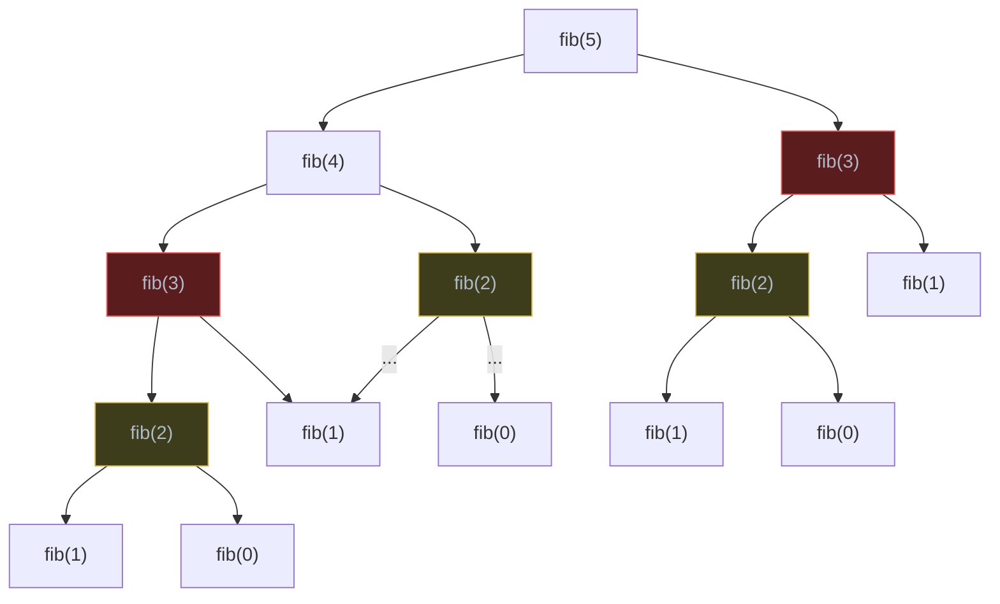
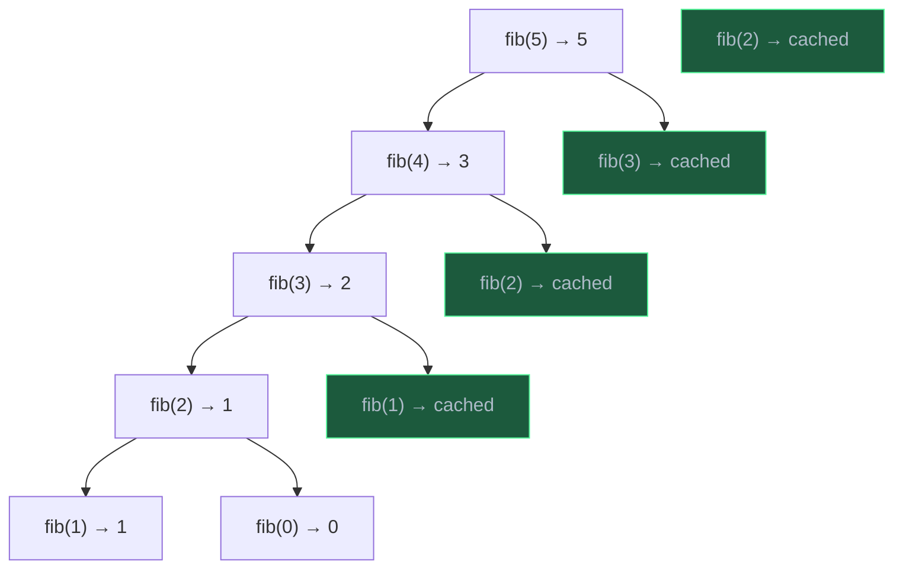
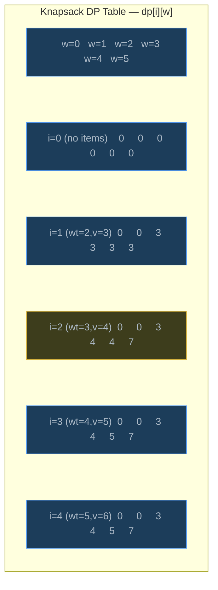
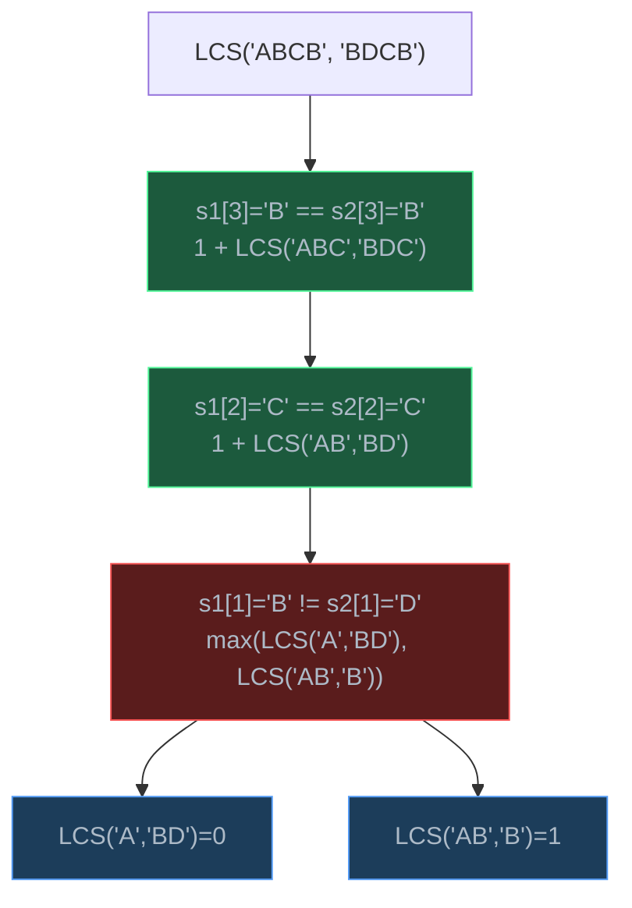
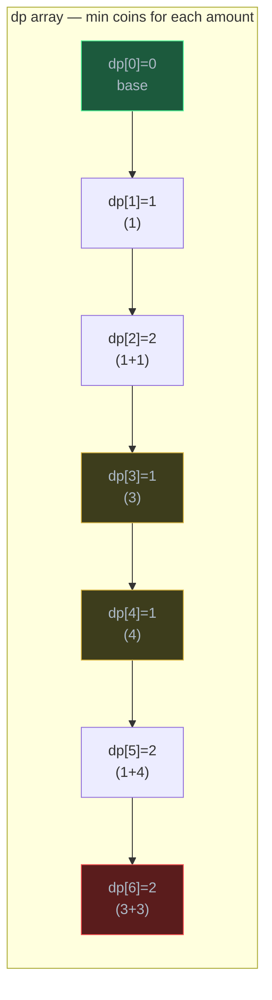
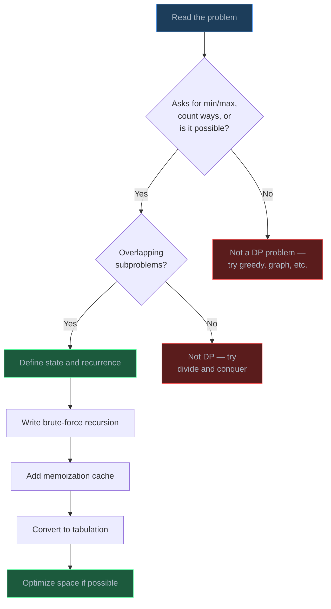

# Dynamic Programming

> Dynamic programming breaks complex optimization problems into overlapping subproblems, solves each one only once, and stores the result — transforming exponential brute-force into polynomial time.

## Table of Contents
- [Core Concepts](#core-concepts)
- [Code Examples](#code-examples)
- [Common Pitfalls](#common-pitfalls)
- [Key Takeaways](#key-takeaways)
- [Exercises](#exercises)

## Core Concepts

### What is Dynamic Programming?

#### What

Dynamic programming (DP) is an algorithmic technique for solving optimization problems by:

1. Breaking the problem into **smaller subproblems**
2. Solving each subproblem **only once**
3. **Storing** (caching) the result so it is never recomputed
4. **Combining** subproblem solutions to build the answer to the original problem

The name "dynamic programming" was coined by Richard Bellman in the 1950s. It has nothing to do with "dynamic" in the programming-language sense — Bellman chose the name to sound impressive to government funders. What it really means is: **smart recursion with a memory**.

#### How

Every DP solution follows the same recipe:

1. **Define the subproblem** — express the answer as a function of smaller inputs. For example, `fib(n)` depends on `fib(n-1)` and `fib(n-2)`.
2. **Write the recurrence relation** — the mathematical formula that relates a problem to its subproblems. For Fibonacci: `fib(n) = fib(n-1) + fib(n-2)`.
3. **Identify the base cases** — the smallest subproblems that you can solve directly. For Fibonacci: `fib(0) = 0`, `fib(1) = 1`.
4. **Decide the approach** — memoization (top-down) or tabulation (bottom-up).
5. **Analyze complexity** — count distinct subproblems and the work per subproblem.

#### Why It Matters

Without DP, many problems have exponential time complexity because the same subproblems are solved over and over again. DP eliminates this redundancy. The Fibonacci sequence computed naively is O(2^n) — with DP it becomes O(n). The 0/1 Knapsack problem has 2^n possible subsets to check — with DP it becomes O(n * W). This is not a minor optimization; it is the difference between "takes longer than the age of the universe" and "finishes in milliseconds."

### The Two Properties of DP Problems

#### What

A problem is a candidate for DP if and only if it has both of these properties:

1. **Optimal Substructure** — the optimal solution to the problem contains optimal solutions to its subproblems. If the shortest path from A to C goes through B, then the sub-path from A to B must also be the shortest path from A to B.

2. **Overlapping Subproblems** — the same subproblems are solved multiple times during a naive recursive solution. This is what makes caching worthwhile. If every subproblem were unique (like in merge sort), there would be nothing to cache.

#### How

To check for these properties, draw the recursion tree. If you see the same function call appearing in multiple branches, you have overlapping subproblems. If the answer to the original problem can be built from answers to subproblems using a simple combination (addition, max, min), you likely have optimal substructure.



In this tree, `fib(3)` (red) is computed **twice** and `fib(2)` (yellow) is computed **three times**. Every duplicate call is wasted work. DP eliminates this by storing the result the first time and reusing it.

#### Why It Matters

These two properties are your diagnostic tool. Before writing any DP code, ask: "Does this problem have overlapping subproblems?" If the answer is no — for example, merge sort divides the array into *non-overlapping* halves — then DP does not help and you should use plain divide and conquer. If the answer is yes but there is no optimal substructure (the optimal solution cannot be built from optimal sub-solutions), you may need a different technique entirely.

### Recognizing DP Problems

#### What

DP problems almost always ask one of three questions:

1. **"Find the minimum/maximum..."** — minimum cost, maximum profit, longest subsequence
2. **"Count the number of ways..."** — how many paths, how many combinations, how many ways to make change
3. **"Is it possible to..."** — can you reach the target, can you partition into equal subsets

#### How

When you see these signal words in a problem statement, immediately think DP. Then follow this mental process:

1. What is the **state**? (What variables define a subproblem? Usually the index in the input and some capacity/target remaining.)
2. What is the **choice** at each step? (Include or exclude an item, take one step or two, use a coin or skip it.)
3. What is the **recurrence**? (How does the current state relate to previous states?)
4. What are the **base cases**? (When does the recursion stop?)

#### Why It Matters

The hardest part of DP is not writing the code — it is recognizing that a problem is a DP problem and defining the state. Once you have the recurrence relation, the code almost writes itself. Practicing this recognition pattern across many problems is how you build DP intuition.

### Memoization (Top-Down)

#### What

Memoization is the top-down approach to DP. You write the solution as a natural recursive function, then add a **cache** (a dictionary or `functools.lru_cache`) that stores the result of each subproblem the first time it is computed. On subsequent calls with the same arguments, the cached result is returned immediately.

#### How

The process is straightforward:

1. Write the naive recursive solution.
2. Add a cache (dictionary or decorator).
3. Before computing, check if the result is already cached.
4. After computing, store the result in the cache before returning.

```python
from functools import lru_cache

@lru_cache(maxsize=None)
def fib(n: int) -> int:
    if n <= 1:
        return n
    return fib(n - 1) + fib(n - 2)
```

With the cache, the recursion tree is pruned: each `fib(k)` is computed exactly once, and subsequent calls return immediately from the cache.



Green nodes are cache hits — they return instantly without further recursion.

#### Why It Matters

Memoization is the easiest way to convert a brute-force recursive solution into a DP solution. You do not need to rethink the order of computation or restructure the algorithm — just add a cache. This makes it the preferred first approach when solving DP problems, especially in interviews where speed of implementation matters. The drawback is that it uses the call stack, which can cause `RecursionError` for large inputs (Python's default limit is 1000 frames).

### Tabulation (Bottom-Up)

#### What

Tabulation is the bottom-up approach to DP. Instead of recursion, you create a table (array) and fill it iteratively, starting from the base cases and building up to the final answer. There is no recursion and no call stack overhead.

#### How

The process:

1. Create a table (usually a list) indexed by the subproblem state.
2. Initialize the base cases in the table.
3. Iterate in the correct order (so that every subproblem you depend on has already been computed).
4. Fill each entry using the recurrence relation.
5. The answer is in the table at the entry corresponding to the original problem.

```python
def fib(n: int) -> int:
    if n <= 1:
        return n
    dp = [0] * (n + 1)
    dp[1] = 1
    for i in range(2, n + 1):
        dp[i] = dp[i - 1] + dp[i - 2]
    return dp[n]
```

#### Why It Matters

Tabulation avoids the call stack entirely, so it works for arbitrarily large inputs without hitting Python's recursion limit. It also often allows **space optimization**: if `dp[i]` only depends on `dp[i-1]` and `dp[i-2]`, you only need two variables instead of an entire array — reducing space from O(n) to O(1). This is the standard approach in production code and competitive programming.

### Memoization vs Tabulation

#### What

| Aspect | Memoization (Top-Down) | Tabulation (Bottom-Up) |
| --- | --- | --- |
| Approach | Recursive + cache | Iterative + table |
| Order | Solves subproblems on demand | Solves all subproblems in order |
| Space | Cache + call stack | Table only |
| Ease of writing | Natural (follows recurrence) | Requires understanding fill order |
| Stack overflow risk | Yes (deep recursion) | No |
| Space optimization | Harder | Easier (rolling array) |

#### How

Use memoization when:
- The recurrence is complex and hard to iterate in the right order
- Not all subproblems need to be solved (sparse dependency graph)
- You want to prototype quickly

Use tabulation when:
- Input size is large (risk of stack overflow)
- You need to optimize space (rolling array trick)
- The fill order is straightforward (left to right, top to bottom)

#### Why It Matters

Both approaches have the same time complexity. The choice is about engineering trade-offs, not algorithmic correctness. In interviews, start with memoization because it is faster to write. In production, prefer tabulation for robustness and space efficiency.

## Code Examples

### Fibonacci: From Brute Force to O(1) Space

The Fibonacci sequence is the simplest DP problem and the best way to understand all the approaches.

#### Brute Force — O(2^n) Time, O(n) Space

```python
def fib_brute(n: int) -> int:
    """Naive recursive Fibonacci — exponential time."""
    if n <= 1:
        return n
    return fib_brute(n - 1) + fib_brute(n - 2)


# fib_brute(40) takes several seconds
# fib_brute(50) takes minutes
# fib_brute(100) would take longer than the age of the universe
```

**Time**: O(2^n) — the recursion tree has two branches at each level, roughly doubling the work for each increment of n.

**Space**: O(n) — the call stack depth is n (each call waits for its children before returning).

#### Memoization — O(n) Time, O(n) Space

```python
from functools import lru_cache


@lru_cache(maxsize=None)
def fib_memo(n: int) -> int:
    """Top-down DP Fibonacci using Python's built-in cache."""
    if n <= 1:
        return n
    return fib_memo(n - 1) + fib_memo(n - 2)


# Manual dictionary approach (equivalent)
def fib_memo_dict(n: int, cache: dict[int, int] | None = None) -> int:
    """Top-down DP Fibonacci with explicit dictionary cache."""
    if cache is None:
        cache = {}
    if n in cache:
        return cache[n]
    if n <= 1:
        return n
    cache[n] = fib_memo_dict(n - 1, cache) + fib_memo_dict(n - 2, cache)
    return cache[n]
```

**Time**: O(n) — each of the n+1 subproblems is computed exactly once, with O(1) work per subproblem.

**Space**: O(n) — the cache stores n+1 entries, plus O(n) call stack depth.

#### Tabulation — O(n) Time, O(n) Space

```python
def fib_tab(n: int) -> int:
    """Bottom-up DP Fibonacci with full table."""
    if n <= 1:
        return n
    dp: list[int] = [0] * (n + 1)
    dp[1] = 1
    for i in range(2, n + 1):
        dp[i] = dp[i - 1] + dp[i - 2]
    return dp[n]
```

**Time**: O(n) — one pass through the table with O(1) work per entry.

**Space**: O(n) — the dp array has n+1 entries.

#### Space-Optimized Tabulation — O(n) Time, O(1) Space

```python
def fib_optimal(n: int) -> int:
    """Bottom-up Fibonacci with O(1) space.

    Since fib(i) only depends on fib(i-1) and fib(i-2),
    we only need two variables instead of an entire array.
    """
    if n <= 1:
        return n
    prev2, prev1 = 0, 1
    for _ in range(2, n + 1):
        current = prev1 + prev2
        prev2 = prev1
        prev1 = current
    return prev1
```

**Time**: O(n) — same loop as tabulation.

**Space**: O(1) — only three integer variables regardless of n.

### 0/1 Knapsack

Given `n` items, each with a weight and a value, determine the maximum value you can carry in a knapsack of capacity `W`. Each item can be taken at most once (0/1 — either take it or leave it).

#### The Recurrence

For each item `i`, you have two choices:
- **Skip it**: the best value is the same as considering only items `0..i-1` with the same capacity.
- **Take it** (if it fits): the best value is `value[i]` plus the best value from items `0..i-1` with remaining capacity `W - weight[i]`.

```
dp[i][w] = max(
    dp[i-1][w],                              # skip item i
    dp[i-1][w - weight[i]] + value[i]         # take item i (if weight[i] <= w)
)
```

Base case: `dp[0][w] = 0` for all `w` (no items means no value).

#### Memoization Approach

```python
from functools import lru_cache


def knapsack_memo(
    weights: list[int],
    values: list[int],
    capacity: int,
) -> int:
    """0/1 Knapsack using top-down DP with memoization.

    Args:
        weights: weight of each item
        values: value of each item
        capacity: maximum weight the knapsack can hold

    Returns:
        Maximum total value achievable
    """
    n = len(weights)

    @lru_cache(maxsize=None)
    def dp(i: int, w: int) -> int:
        """Max value using items 0..i with remaining capacity w."""
        # Base case: no items left or no capacity
        if i < 0 or w == 0:
            return 0

        # If current item is too heavy, skip it
        if weights[i] > w:
            return dp(i - 1, w)

        # Choose the better option: skip or take
        skip = dp(i - 1, w)
        take = dp(i - 1, w - weights[i]) + values[i]
        return max(skip, take)

    return dp(n - 1, capacity)


# Example
weights = [2, 3, 4, 5]
values = [3, 4, 5, 6]
capacity = 8
print(knapsack_memo(weights, values, capacity))  # 10 (items 1+3: weight 3+5=8, value 4+6=10)
```

**Time**: O(n * W) — there are n * W distinct states, each computed once with O(1) work.

**Space**: O(n * W) — for the cache, plus O(n) call stack depth.

#### Tabulation Approach

```python
def knapsack_tab(
    weights: list[int],
    values: list[int],
    capacity: int,
) -> int:
    """0/1 Knapsack using bottom-up DP with tabulation."""
    n = len(weights)

    # dp[i][w] = max value using first i items with capacity w
    dp: list[list[int]] = [[0] * (capacity + 1) for _ in range(n + 1)]

    for i in range(1, n + 1):
        for w in range(capacity + 1):
            # Option 1: skip item i (use 0-indexed: item i-1)
            dp[i][w] = dp[i - 1][w]

            # Option 2: take item i if it fits
            if weights[i - 1] <= w:
                dp[i][w] = max(
                    dp[i][w],
                    dp[i - 1][w - weights[i - 1]] + values[i - 1],
                )

    return dp[n][capacity]
```

**Time**: O(n * W) — two nested loops.

**Space**: O(n * W) — the 2D table.

#### DP Table Visualization

For `weights = [2, 3, 4, 5]`, `values = [3, 4, 5, 6]`, `capacity = 5`:



The answer is `dp[4][5] = 7` (take items 1 and 2: weights 2+3 = 5, values 3+4 = 7).

#### Space-Optimized Tabulation — O(W) Space

```python
def knapsack_optimized(
    weights: list[int],
    values: list[int],
    capacity: int,
) -> int:
    """0/1 Knapsack with O(W) space.

    Key insight: each row dp[i] only depends on dp[i-1].
    We can use a single 1D array and iterate capacity in REVERSE
    to avoid overwriting values we still need.
    """
    n = len(weights)
    dp: list[int] = [0] * (capacity + 1)

    for i in range(n):
        # Iterate capacity in reverse to avoid using updated values
        # (we need dp[w - weights[i]] from the PREVIOUS row)
        for w in range(capacity, weights[i] - 1, -1):
            dp[w] = max(dp[w], dp[w - weights[i]] + values[i])

    return dp[capacity]
```

**Time**: O(n * W) — same as 2D version.

**Space**: O(W) — single 1D array instead of 2D table. The reverse iteration trick is essential: iterating left-to-right would use the current row's values (allowing an item to be taken multiple times), which is the **unbounded** knapsack — a different problem.

### Longest Common Subsequence (LCS)

Given two strings, find the length of the longest subsequence that appears in both. A subsequence is formed by deleting zero or more characters without changing the order of the remaining characters.

#### The Recurrence

Compare characters from the end of both strings:
- If `s1[i] == s2[j]`: this character is part of the LCS. Add 1 and solve for the remaining prefixes.
- If `s1[i] != s2[j]`: try two options — skip the last character of `s1` or skip the last character of `s2`.

```
if s1[i-1] == s2[j-1]:
    dp[i][j] = dp[i-1][j-1] + 1
else:
    dp[i][j] = max(dp[i-1][j], dp[i][j-1])
```

Base case: `dp[0][j] = 0` and `dp[i][0] = 0` (empty string has no common subsequence with anything).

#### Memoization Approach

```python
from functools import lru_cache


def lcs_memo(s1: str, s2: str) -> int:
    """Longest Common Subsequence using top-down DP.

    Example:
        lcs_memo("abcde", "ace") → 3  (the LCS is "ace")
    """

    @lru_cache(maxsize=None)
    def dp(i: int, j: int) -> int:
        """LCS length for s1[0..i-1] and s2[0..j-1]."""
        if i == 0 or j == 0:
            return 0
        if s1[i - 1] == s2[j - 1]:
            return dp(i - 1, j - 1) + 1
        return max(dp(i - 1, j), dp(i, j - 1))

    return dp(len(s1), len(s2))
```

**Time**: O(m * n) — where m and n are the lengths of the two strings. Each (i, j) pair is computed once.

**Space**: O(m * n) — for the cache, plus O(m + n) call stack depth.

#### Tabulation Approach

```python
def lcs_tab(s1: str, s2: str) -> int:
    """Longest Common Subsequence using bottom-up DP."""
    m, n = len(s1), len(s2)

    # dp[i][j] = LCS length for s1[0..i-1] and s2[0..j-1]
    dp: list[list[int]] = [[0] * (n + 1) for _ in range(m + 1)]

    for i in range(1, m + 1):
        for j in range(1, n + 1):
            if s1[i - 1] == s2[j - 1]:
                dp[i][j] = dp[i - 1][j - 1] + 1
            else:
                dp[i][j] = max(dp[i - 1][j], dp[i][j - 1])

    return dp[m][n]


# Bonus: reconstruct the actual LCS string
def lcs_string(s1: str, s2: str) -> str:
    """Reconstruct the actual LCS string by backtracking through the DP table."""
    m, n = len(s1), len(s2)
    dp: list[list[int]] = [[0] * (n + 1) for _ in range(m + 1)]

    for i in range(1, m + 1):
        for j in range(1, n + 1):
            if s1[i - 1] == s2[j - 1]:
                dp[i][j] = dp[i - 1][j - 1] + 1
            else:
                dp[i][j] = max(dp[i - 1][j], dp[i][j - 1])

    # Backtrack from dp[m][n] to build the LCS
    result: list[str] = []
    i, j = m, n
    while i > 0 and j > 0:
        if s1[i - 1] == s2[j - 1]:
            result.append(s1[i - 1])
            i -= 1
            j -= 1
        elif dp[i - 1][j] >= dp[i][j - 1]:
            i -= 1
        else:
            j -= 1

    return "".join(reversed(result))


print(lcs_tab("abcde", "ace"))      # 3
print(lcs_string("abcde", "ace"))    # "ace"
```

**Time**: O(m * n) — two nested loops over the lengths of both strings.

**Space**: O(m * n) — the 2D table. Can be optimized to O(min(m, n)) using a rolling array since each row only depends on the previous row.

#### LCS Decision Tree



Green nodes indicate character matches (add 1 to LCS). Red node indicates a mismatch (take the max of two branches).

### Coin Change

Given a set of coin denominations and a target amount, find the **minimum number of coins** needed to make the target. You have an unlimited supply of each denomination.

#### The Recurrence

For each amount `a`, try every coin denomination `c`. If `c <= a`, then one option is to use coin `c` and solve for `a - c`:

```
dp[a] = min(dp[a - c] + 1 for c in coins if c <= a)
```

Base case: `dp[0] = 0` (zero coins needed to make amount 0).

#### Brute-Force Recursive Approach

```python
def coin_change_brute(coins: list[int], amount: int) -> int:
    """Minimum coins needed — brute force recursion.

    Returns -1 if the amount cannot be made.
    """
    if amount == 0:
        return 0
    if amount < 0:
        return -1

    min_coins = float("inf")
    for coin in coins:
        result = coin_change_brute(coins, amount - coin)
        if result >= 0:
            min_coins = min(min_coins, result + 1)

    return min_coins if min_coins != float("inf") else -1
```

**Time**: O(S^n) where S is the amount and n is the number of denominations — exponential, because at each amount we try all coins and recurse.

**Space**: O(S) — recursion depth in the worst case.

#### Memoization Approach

```python
from functools import lru_cache


def coin_change_memo(coins: list[int], amount: int) -> int:
    """Minimum coins needed — top-down DP."""

    @lru_cache(maxsize=None)
    def dp(remaining: int) -> int:
        if remaining == 0:
            return 0
        if remaining < 0:
            return float("inf")

        # Try every coin and take the minimum
        min_coins = float("inf")
        for coin in coins:
            result = dp(remaining - coin)
            min_coins = min(min_coins, result + 1)

        return min_coins

    result = dp(amount)
    return result if result != float("inf") else -1
```

**Time**: O(S * n) — S distinct subproblems, each trying n coins.

**Space**: O(S) — cache size, plus O(S) call stack depth.

#### Tabulation Approach

```python
def coin_change_tab(coins: list[int], amount: int) -> int:
    """Minimum coins needed — bottom-up DP.

    Example:
        coin_change_tab([1, 5, 10, 25], 36) → 3  (25 + 10 + 1)
        coin_change_tab([2], 3) → -1  (impossible)
    """
    # dp[a] = minimum coins to make amount a
    # Initialize with amount + 1 (an impossible value, acts as infinity)
    dp: list[int] = [amount + 1] * (amount + 1)
    dp[0] = 0  # base case: 0 coins needed for amount 0

    for a in range(1, amount + 1):
        for coin in coins:
            if coin <= a:
                dp[a] = min(dp[a], dp[a - coin] + 1)

    return dp[amount] if dp[amount] <= amount else -1


# Example usage
print(coin_change_tab([1, 5, 10, 25], 36))  # 3 (25 + 10 + 1)
print(coin_change_tab([2], 3))               # -1 (impossible)
print(coin_change_tab([1, 3, 4], 6))         # 2 (3 + 3)
```

**Time**: O(S * n) — iterate through all amounts (S) and for each, try all coins (n).

**Space**: O(S) — the dp array.

#### Coin Change DP Table Walkthrough

For `coins = [1, 3, 4]`, `amount = 6`:



Note how `dp[6] = 2` (using two 3-coins) is better than `dp[6] = dp[5] + 1 = 3` (using a 1-coin on top of the solution for 5). The DP tries all coins at each step and keeps the minimum.

### DP Problem-Solving Framework Summary



## Common Pitfalls

### Pitfall 1: Forgetting Base Cases

Missing or incorrect base cases cause infinite recursion or wrong results. Every recurrence relation needs explicitly defined base cases.

```python
# BAD — missing base case for n == 0
def fib_bad(n: int) -> int:
    if n == 1:
        return 1
    return fib_bad(n - 1) + fib_bad(n - 2)  # fib_bad(0) recurses to fib_bad(-1)!

# GOOD — handle both base cases
def fib_good(n: int) -> int:
    if n <= 1:
        return n  # fib(0) = 0, fib(1) = 1
    return fib_good(n - 1) + fib_good(n - 2)
```

### Pitfall 2: Wrong Iteration Order in Tabulation

In the 0/1 Knapsack with 1D array, iterating capacity left-to-right allows an item to be used multiple times — that solves the *unbounded* knapsack, which is a different problem.

```python
# BAD — left-to-right allows reusing the same item
def knapsack_wrong(weights: list[int], values: list[int], capacity: int) -> int:
    dp = [0] * (capacity + 1)
    for i in range(len(weights)):
        for w in range(weights[i], capacity + 1):  # LEFT-TO-RIGHT — WRONG for 0/1!
            dp[w] = max(dp[w], dp[w - weights[i]] + values[i])
    return dp[capacity]

# GOOD — right-to-left ensures each item is used at most once
def knapsack_correct(weights: list[int], values: list[int], capacity: int) -> int:
    dp = [0] * (capacity + 1)
    for i in range(len(weights)):
        for w in range(capacity, weights[i] - 1, -1):  # RIGHT-TO-LEFT — correct
            dp[w] = max(dp[w], dp[w - weights[i]] + values[i])
    return dp[capacity]
```

### Pitfall 3: Using Mutable Default Arguments as Cache

Python's mutable default argument trap is especially dangerous when used as a DP cache, because the cache persists across function calls.

```python
# BAD — cache persists between calls, may return stale results
def fib_bad(n: int, cache: dict[int, int] = {}) -> int:
    if n in cache:
        return cache[n]
    if n <= 1:
        return n
    cache[n] = fib_bad(n - 1, cache) + fib_bad(n - 2, cache)
    return cache[n]

# GOOD — use None default and create fresh cache, or use lru_cache
from functools import lru_cache

@lru_cache(maxsize=None)
def fib_good(n: int) -> int:
    if n <= 1:
        return n
    return fib_good(n - 1) + fib_good(n - 2)
```

### Pitfall 4: Not Handling Impossible Cases

When a DP problem can have no valid solution (e.g., coin change with impossible amount), you must handle the "impossible" sentinel properly.

```python
# BAD — using 0 as default, which is a valid answer (0 coins for amount 0)
def coin_change_bad(coins: list[int], amount: int) -> int:
    dp = [0] * (amount + 1)
    for a in range(1, amount + 1):
        for coin in coins:
            if coin <= a:
                dp[a] = min(dp[a], dp[a - coin] + 1)  # min(0, ...) is always 0!
    return dp[amount]

# GOOD — use a sentinel value that is clearly "impossible"
def coin_change_good(coins: list[int], amount: int) -> int:
    dp = [amount + 1] * (amount + 1)  # impossible sentinel (> any valid answer)
    dp[0] = 0
    for a in range(1, amount + 1):
        for coin in coins:
            if coin <= a:
                dp[a] = min(dp[a], dp[a - coin] + 1)
    return dp[amount] if dp[amount] <= amount else -1
```

### Pitfall 5: Hitting Python's Recursion Limit

Deep recursion in memoized solutions can crash with `RecursionError`. This is a Python-specific issue (the default recursion limit is 1000).

```python
import sys
from functools import lru_cache

# BAD — crashes for large inputs
@lru_cache(maxsize=None)
def fib_crash(n: int) -> int:
    if n <= 1:
        return n
    return fib_crash(n - 1) + fib_crash(n - 2)

# fib_crash(1500) → RecursionError!

# GOOD (option 1) — increase recursion limit (use with caution)
sys.setrecursionlimit(10000)

# GOOD (option 2) — use bottom-up tabulation instead
def fib_safe(n: int) -> int:
    if n <= 1:
        return n
    prev2, prev1 = 0, 1
    for _ in range(2, n + 1):
        prev2, prev1 = prev1, prev2 + prev1
    return prev1
```

## Key Takeaways

- **DP = recursion + caching**. If a recursive solution solves the same subproblem multiple times, DP eliminates that waste by storing results. The two required properties are **optimal substructure** and **overlapping subproblems**.
- **Start with brute force, then optimize**. Write the naive recursive solution first, verify the recurrence, add memoization, then convert to tabulation if needed. Do not try to jump straight to the optimized solution.
- **Memoization (top-down) is easier to write; tabulation (bottom-up) is more robust**. Use memoization in interviews for speed. Use tabulation in production to avoid stack overflow and enable space optimization.
- **Space optimization is the final step**. If `dp[i]` only depends on `dp[i-1]` (or a fixed window of previous states), you can reduce space from O(n) to O(1) or from O(n * W) to O(W).
- **The hard part is defining the state**, not writing the code. Practice identifying what variables define a subproblem (index, remaining capacity, remaining amount) and writing the recurrence relation.

## Exercises

1. **Concept — Identify DP Properties**: For each problem below, state whether it has (a) overlapping subproblems and (b) optimal substructure. Explain why.
   - Finding the shortest path in an unweighted graph using BFS
   - Computing the n-th Fibonacci number
   - Merge sort
   - Finding the minimum number of operations to convert one string to another (edit distance)

2. **Coding — Climbing Stairs**: You are climbing a staircase with `n` steps. Each time you can climb 1 or 2 steps. Write a function `climb_stairs(n: int) -> int` that returns the number of distinct ways to reach the top. Implement both memoization and tabulation approaches. What is the time and space complexity of each?

3. **Coding — Longest Increasing Subsequence**: Given a list of integers, find the length of the longest strictly increasing subsequence. For example, `[10, 9, 2, 5, 3, 7, 101, 18]` has LIS `[2, 3, 7, 101]` with length 4. Write a DP solution with O(n^2) time complexity.

4. **Coding — Subset Sum**: Given a list of positive integers and a target sum, determine whether any subset of the list adds up to exactly the target. For example, `nums = [3, 34, 4, 12, 5, 2]`, `target = 9` returns `True` (because 4 + 5 = 9). Implement using tabulation with a 1D dp array.

5. **Analysis — Memoization vs Tabulation Trade-offs**: Consider the 0/1 Knapsack problem with `n = 100` items and `capacity = 10000`. Explain which approach (memoization or tabulation) you would choose and why. What happens if most (i, w) states are never actually needed? How does that change your answer?

---
up:: [Schedule](../../Schedule.md)
#type/learning #source/self-study #status/seed
