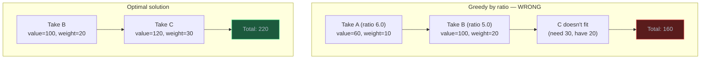
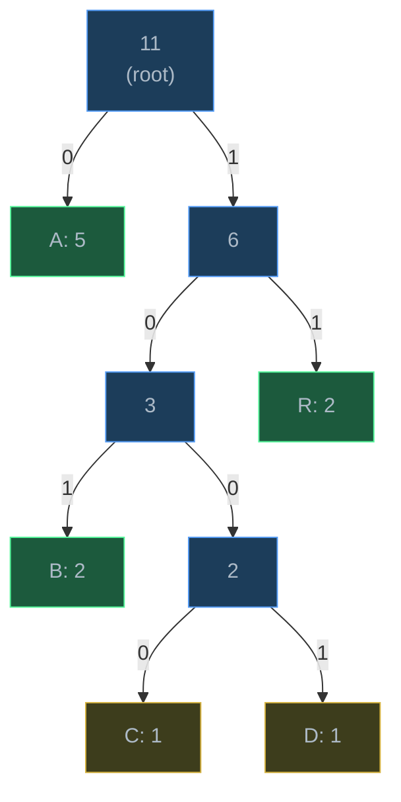
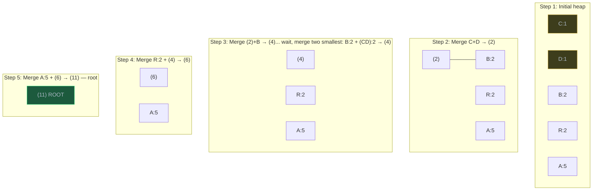
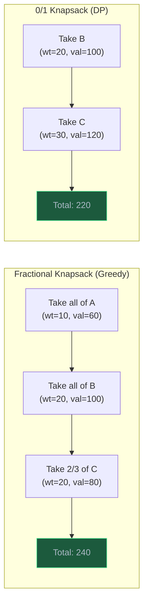

# Greedy Algorithms

> A greedy algorithm makes the locally optimal choice at each step, hoping to find the globally optimal solution — and for the right problems, this simple strategy works perfectly.

## Table of Contents
- [Core Concepts](#core-concepts)
- [Code Examples](#code-examples)
- [Common Pitfalls](#common-pitfalls)
- [Key Takeaways](#key-takeaways)
- [Exercises](#exercises)

## Core Concepts

### What is a Greedy Algorithm?

#### What

A greedy algorithm solves an optimization problem by making a sequence of choices, where each choice is the **locally best option** at that moment — without reconsidering previous decisions or looking ahead at future consequences. Once a choice is made, it is never undone.

This is fundamentally different from dynamic programming, which considers all possible choices at each step and picks the globally best one by combining solutions to subproblems. A greedy algorithm commits to one choice immediately and moves on.

#### How

The greedy strategy follows a simple pattern:

1. **Sort or organize** the input by some criterion (end time, value/weight ratio, frequency, etc.).
2. **Make the greedy choice** — pick the best option available right now.
3. **Reduce the problem** — after making the choice, the problem shrinks to a smaller subproblem.
4. **Repeat** until the problem is fully solved.


#### Why It Matters

When greedy works, it is dramatically simpler and faster than DP. A DP solution for interval scheduling would explore 2^n subsets. The greedy solution sorts and scans once in O(n log n). The catch is that greedy only works for problems with specific mathematical properties — and if you apply greedy to a problem that does not have those properties, you get a wrong answer, not just a slow one. Learning when greedy works (and when it does not) is the critical skill.

### The Two Properties

#### What

A problem is solvable by greedy if it has both:

1. **Greedy Choice Property** — a locally optimal choice is always part of some globally optimal solution. You can safely commit to the greedy choice without exploring alternatives.

2. **Optimal Substructure** — after making the greedy choice, the remaining subproblem is a smaller instance of the same problem, and the optimal solution to the original problem contains optimal solutions to subproblems.

Note that optimal substructure is shared with DP. The distinguishing property is the **greedy choice property** — DP problems have optimal substructure but *not* the greedy choice property (you must consider all choices, not just the locally best one).

#### How

To verify the greedy choice property, you typically use one of two proof techniques:

**Exchange Argument** (the most common technique):
1. Assume you have an optimal solution that does NOT make the greedy choice at some step.
2. Show that you can "exchange" that non-greedy choice for the greedy choice without making the solution worse.
3. This proves the greedy choice is safe — there exists an optimal solution that includes it.

**Stays-Ahead Argument**:
1. Show that at every step, the greedy algorithm's partial solution is at least as good as any other algorithm's partial solution.
2. If greedy stays ahead at every step, it stays ahead at the end.

In practice (especially in interviews), you rarely write formal proofs. Instead, you build intuition: "Is there any scenario where taking the locally best option now forces a worse outcome later?" If not, greedy works.

#### Why It Matters

This is the most common source of bugs in greedy algorithms: applying greedy to a problem that lacks the greedy choice property. The 0/1 knapsack is the classic counterexample — taking the item with the highest value/weight ratio first can lead to a suboptimal solution (as we will see in the fractional vs 0/1 knapsack comparison). Knowing *why* greedy fails helps you recognize when to switch to DP.

### When Greedy Works vs When It Doesn't

#### What

Greedy algorithms work when making the locally best choice never prevents you from reaching the globally best solution. They fail when a locally good choice can "block" a better overall solution.

#### How

Consider two knapsack variants:

**Fractional Knapsack — Greedy works**: You can take fractions of items. Strategy: sort by value/weight ratio, take as much of the best ratio item as possible, move to the next. This works because taking a fraction never blocks you — you can always fill the remaining capacity with the next-best item.

**0/1 Knapsack — Greedy fails**: Items are indivisible — take it entirely or leave it. Consider:

| Item | Weight | Value | Ratio |
|------|--------|-------|-------|
| A    | 10     | 60    | 6.0   |
| B    | 20     | 100   | 5.0   |
| C    | 30     | 120   | 4.0   |

Capacity = 50. Greedy by ratio takes A (60) then B (100) = 160 total, weight = 30, remaining capacity = 20, C does not fit. But the optimal solution is B + C = 220, weight = 50. Greedy missed it because committing to A (locally best ratio) blocked taking C.



#### Why It Matters

This comparison is one of the most important lessons in algorithm design. Two problems that look nearly identical (fractional vs 0/1 knapsack) require fundamentally different approaches. The indivisibility constraint in 0/1 knapsack destroys the greedy choice property. When you encounter an optimization problem, ask: "Can I always safely commit to the locally best choice?" If the answer involves "it depends on what comes later," you need DP, not greedy.

### Greedy vs Dynamic Programming

#### What

| Aspect | Greedy | Dynamic Programming |
| --- | --- | --- |
| Strategy | One choice per step (locally best) | Consider all choices per step |
| Correctness | Only when greedy choice property holds | Always correct (if recurrence is right) |
| Speed | Usually O(n log n) or O(n) | Usually O(n * W) or O(n^2) |
| Implementation | Simpler, often just sort + scan | More complex, table or cache |
| Backtracking | Never reconsiders | Implicitly considers all paths |
| Risk | Wrong answer if misapplied | Slower but always correct |

#### How

Use this decision process:

1. **Can greedy work?** Ask: "Is there a greedy criterion (sorting order, selection rule) such that the locally best choice is always globally safe?" If yes, use greedy. If unsure, try a counterexample.
2. **If greedy fails, use DP.** Define the state, write the recurrence, implement with memoization or tabulation.
3. **When in doubt, start with DP.** DP is always correct (given the right recurrence). Greedy is faster but only works for specific problems. In an interview, getting the right answer slowly beats getting the wrong answer quickly.

#### Why It Matters

The greedy vs DP decision is one of the most common algorithm design questions. Many problems (activity selection, Huffman coding, minimum spanning tree) are greedy. Many similar-looking problems (0/1 knapsack, longest common subsequence, edit distance) require DP. Building intuition for this distinction saves significant time in problem-solving.

## Code Examples

### Activity Selection / Interval Scheduling

Given a set of activities with start and end times, select the **maximum number of non-overlapping activities**. This is the most classic greedy problem.

#### The Greedy Insight

**Sort by end time, always pick the activity that finishes earliest.** Why does this work? By finishing as early as possible, you leave the most room for future activities. Any other choice (picking a later-ending activity) can only reduce the remaining time available.

This is provable via the exchange argument: if an optimal solution does not include the earliest-ending activity, you can swap its first activity for the earliest-ending one without reducing the total count (because the earliest-ending one frees up at least as much time).

#### Activity Selection Timeline

```mermaid
gantt
    title Activity Selection — Sort by End Time
    dateFormat X
    axisFormat %s

    section All Activities
    A (1-4)        :a, 1, 4
    B (3-5)        :b, 3, 5
    C (0-6)        :c, 0, 6
    D (5-7)        :d, 5, 7
    E (3-9)        :e, 3, 9
    F (5-9)        :f, 5, 9
    G (6-10)       :g, 6, 10
    H (8-11)       :h, 8, 11

    section Selected (greedy)
    A (1-4)        :done, s1, 1, 4
    D (5-7)        :done, s2, 5, 7
    H (8-11)       :done, s3, 8, 11
```



Greedy selects A (ends at 4), D (starts at 5, ends at 7), H (starts at 8, ends at 11) = 3 activities. This is optimal.

#### Implementation

```python
from dataclasses import dataclass


@dataclass
class Activity:
    """An activity with a start time, end time, and name."""
    name: str
    start: int
    end: int

    def __repr__(self) -> str:
        return f"{self.name}({self.start}-{self.end})"


def activity_selection(activities: list[Activity]) -> list[Activity]:
    """Select maximum non-overlapping activities using greedy.

    Strategy: sort by end time, greedily pick each activity
    that starts after the last selected one ends.

    Args:
        activities: list of activities with start and end times

    Returns:
        Maximum set of non-overlapping activities
    """
    if not activities:
        return []

    # Sort by end time — the greedy criterion
    sorted_acts = sorted(activities, key=lambda a: a.end)

    selected: list[Activity] = [sorted_acts[0]]  # always take the earliest-ending

    for act in sorted_acts[1:]:
        # Only select if this activity starts after the last selected one ends
        if act.start >= selected[-1].end:
            selected.append(act)

    return selected


# Example
activities = [
    Activity("A", 1, 4),
    Activity("B", 3, 5),
    Activity("C", 0, 6),
    Activity("D", 5, 7),
    Activity("E", 3, 9),
    Activity("F", 5, 9),
    Activity("G", 6, 10),
    Activity("H", 8, 11),
]

result = activity_selection(activities)
print(f"Selected {len(result)} activities: {result}")
# Selected 3 activities: [A(1-4), D(5-7), H(8-11)]
```

**Time**: O(n log n) — dominated by sorting. The greedy scan is O(n).

**Space**: O(n) — for the sorted copy and the selected list. Can be O(1) extra space if you sort in-place and only store the count.

#### Why Sort by End Time?

Sorting by start time does not work. Sorting by duration does not work. Sorting by fewest conflicts does not work. Only sorting by end time guarantees the greedy choice property. Here is a counterexample for sorting by start time:

```
Activity X: start=0, end=100   (starts earliest, but blocks everything)
Activity Y: start=1, end=2
Activity Z: start=3, end=4
```

Sorting by start time picks X first (only 1 activity). Sorting by end time picks Y then Z (2 activities).

### Huffman Coding

Huffman coding builds an optimal prefix-free binary code for a set of characters based on their frequencies. Characters that appear more frequently get shorter codes.

#### The Greedy Insight

**Always merge the two lowest-frequency nodes first.** This is greedy because we are making the locally cheapest merge. The two least-frequent characters get the longest codes (pushed to the bottom of the tree), which is optimal because they contribute the least to the total encoded length.

#### How Huffman Coding Works

1. Count character frequencies.
2. Create a leaf node for each character.
3. Use a min-heap (priority queue) ordered by frequency.
4. Repeatedly extract the two lowest-frequency nodes, create a new internal node with their combined frequency, and insert it back.
5. The last remaining node is the root of the Huffman tree.
6. Traverse the tree: left edge = '0', right edge = '1'. The path from root to a leaf is that character's code.

#### Huffman Tree Construction

For the string "ABRACADABRA" with frequencies: A=5, B=2, R=2, C=1, D=1:



Resulting codes: A = `0` (1 bit), R = `11` (2 bits), B = `101` (3 bits), C = `100` (3 bits... wait, let me trace the correct codes from the tree).

Actually, reading from the tree: A = `0`, B = `101`, C = `1000`, D = `1001`, R = `11`. The most frequent character (A, appearing 5 times) gets the shortest code (1 bit). The least frequent (C and D, appearing once each) get the longest codes (4 bits).

#### Step-by-Step Construction



#### Implementation

```python
from __future__ import annotations

import heapq
from dataclasses import dataclass, field


@dataclass(order=True)
class HuffmanNode:
    """A node in the Huffman tree.

    The order=True with sort_index means nodes are compared by frequency,
    which is exactly what the min-heap needs.
    """
    freq: int
    char: str | None = field(default=None, compare=False)
    left: HuffmanNode | None = field(default=None, compare=False, repr=False)
    right: HuffmanNode | None = field(default=None, compare=False, repr=False)

    @property
    def is_leaf(self) -> bool:
        return self.char is not None


def build_huffman_tree(frequencies: dict[str, int]) -> HuffmanNode:
    """Build a Huffman tree from character frequencies.

    Args:
        frequencies: mapping of character → frequency

    Returns:
        Root node of the Huffman tree
    """
    # Create a min-heap of leaf nodes
    heap: list[HuffmanNode] = [
        HuffmanNode(freq=freq, char=char)
        for char, freq in frequencies.items()
    ]
    heapq.heapify(heap)

    # Edge case: single character
    if len(heap) == 1:
        node = heapq.heappop(heap)
        root = HuffmanNode(freq=node.freq, left=node)
        return root

    # Repeatedly merge the two lowest-frequency nodes
    while len(heap) > 1:
        left = heapq.heappop(heap)   # smallest frequency
        right = heapq.heappop(heap)  # second smallest frequency

        # Create internal node with combined frequency
        merged = HuffmanNode(
            freq=left.freq + right.freq,
            left=left,
            right=right,
        )
        heapq.heappush(heap, merged)

    return heap[0]  # the root of the Huffman tree


def build_codes(root: HuffmanNode) -> dict[str, str]:
    """Traverse the Huffman tree to generate codes for each character.

    Left edge = '0', right edge = '1'.
    """
    codes: dict[str, str] = {}

    def _traverse(node: HuffmanNode | None, current_code: str) -> None:
        if node is None:
            return
        if node.is_leaf:
            # Leaf node — assign the accumulated code
            codes[node.char] = current_code if current_code else "0"
            return
        _traverse(node.left, current_code + "0")
        _traverse(node.right, current_code + "1")

    _traverse(root, "")
    return codes


def huffman_encode(text: str) -> tuple[str, dict[str, str]]:
    """Encode a string using Huffman coding.

    Args:
        text: the string to encode

    Returns:
        Tuple of (encoded binary string, code table)
    """
    # Count character frequencies
    frequencies: dict[str, int] = {}
    for char in text:
        frequencies[char] = frequencies.get(char, 0) + 1

    # Build tree and generate codes
    root = build_huffman_tree(frequencies)
    codes = build_codes(root)

    # Encode the text
    encoded = "".join(codes[char] for char in text)
    return encoded, codes


def huffman_decode(encoded: str, root: HuffmanNode) -> str:
    """Decode a Huffman-encoded binary string.

    Traverse the tree for each bit: 0 = left, 1 = right.
    When a leaf is reached, emit the character and restart from root.
    """
    result: list[str] = []
    current = root

    for bit in encoded:
        current = current.left if bit == "0" else current.right
        if current.is_leaf:
            result.append(current.char)
            current = root  # restart from root for next character

    return "".join(result)


# Example usage
text = "ABRACADABRA"
encoded, codes = huffman_encode(text)

print(f"Original: {text}")
print(f"Codes: {codes}")
print(f"Encoded: {encoded}")
print(f"Original size: {len(text) * 8} bits (ASCII)")
print(f"Encoded size: {len(encoded)} bits")
print(f"Compression ratio: {len(encoded) / (len(text) * 8):.1%}")

# Verify decoding works
frequencies = {char: text.count(char) for char in set(text)}
root = build_huffman_tree(frequencies)
decoded = huffman_decode(encoded, root)
print(f"Decoded: {decoded}")
print(f"Match: {decoded == text}")
```

**Time**: O(n log n) — where n is the number of unique characters. Building the heap is O(n), and each of the n-1 merge operations involves O(log n) heap operations.

**Space**: O(n) — for the tree and the heap. The tree has at most 2n-1 nodes (n leaves + n-1 internal nodes).

#### Why Huffman Coding is Optimal

Huffman coding produces the optimal prefix-free code — no other prefix-free code can achieve a shorter average code length for the given frequency distribution. The prefix-free property (no code is a prefix of another) ensures unambiguous decoding: when you read bits left to right, you know exactly when one character ends and the next begins.

The greedy choice (always merging the two least-frequent nodes) works because it pushes infrequent characters deeper in the tree (longer codes) and keeps frequent characters near the root (shorter codes). This minimizes the weighted path length, which is exactly the total number of bits in the encoded message.

### Fractional Knapsack

Given items with weights and values and a knapsack with a weight capacity, maximize the total value you can carry. Unlike the 0/1 knapsack, **you can take fractions of items**.

#### The Greedy Insight

**Sort items by value-to-weight ratio (descending). Take as much of each item as possible, starting from the highest ratio.** This works because fractions are allowed — you never have to waste capacity by skipping a high-value item entirely.

#### Implementation

```python
from dataclasses import dataclass


@dataclass
class Item:
    """An item with a name, weight, and value."""
    name: str
    weight: float
    value: float

    @property
    def ratio(self) -> float:
        """Value per unit weight — the greedy criterion."""
        return self.value / self.weight

    def __repr__(self) -> str:
        return f"{self.name}(w={self.weight}, v={self.value}, r={self.ratio:.1f})"


@dataclass
class KnapsackResult:
    """Result of the fractional knapsack problem."""
    total_value: float
    items_taken: list[tuple[Item, float]]  # (item, fraction taken)


def fractional_knapsack(items: list[Item], capacity: float) -> KnapsackResult:
    """Fractional Knapsack using greedy approach.

    Strategy: sort by value/weight ratio, take as much of each item
    as possible starting from the highest ratio.

    Args:
        items: list of items with weight and value
        capacity: maximum weight capacity

    Returns:
        KnapsackResult with total value and items taken with fractions
    """
    # Sort by value/weight ratio in descending order
    sorted_items = sorted(items, key=lambda item: item.ratio, reverse=True)

    total_value = 0.0
    remaining_capacity = capacity
    items_taken: list[tuple[Item, float]] = []

    for item in sorted_items:
        if remaining_capacity <= 0:
            break

        if item.weight <= remaining_capacity:
            # Take the entire item
            items_taken.append((item, 1.0))
            total_value += item.value
            remaining_capacity -= item.weight
        else:
            # Take a fraction of the item to fill remaining capacity
            fraction = remaining_capacity / item.weight
            items_taken.append((item, fraction))
            total_value += item.value * fraction
            remaining_capacity = 0

    return KnapsackResult(total_value=total_value, items_taken=items_taken)


# Example — same items as the 0/1 knapsack counterexample
items = [
    Item("A", weight=10, value=60),   # ratio 6.0
    Item("B", weight=20, value=100),  # ratio 5.0
    Item("C", weight=30, value=120),  # ratio 4.0
]
capacity = 50

result = fractional_knapsack(items, capacity)
print(f"Total value: {result.total_value}")
for item, fraction in result.items_taken:
    print(f"  {item.name}: {fraction:.0%} (value = {item.value * fraction:.1f})")

# Output:
# Total value: 240.0
#   A: 100% (value = 60.0)
#   B: 100% (value = 100.0)
#   C: 67% (value = 80.0)
```

**Time**: O(n log n) — dominated by sorting. The greedy scan is O(n).

**Space**: O(n) — for the sorted copy and the result list.

#### Fractional vs 0/1 Knapsack Comparison



The fractional knapsack achieves a higher total value (240 vs 220) because it can take a fraction of item C. The 0/1 knapsack must choose between taking items whole or not at all, which fundamentally changes the problem structure and requires DP.

### Comparison: When to Use Greedy vs DP

Here is a quick reference of classic problems and which approach they require:

```python
# Quick reference — Greedy vs DP for common problems

GREEDY_PROBLEMS = {
    "Activity Selection / Interval Scheduling": "Sort by end time, pick non-overlapping",
    "Fractional Knapsack": "Sort by value/weight ratio, take greedily",
    "Huffman Coding": "Always merge two lowest-frequency nodes",
    "Minimum Spanning Tree (Prim/Kruskal)": "Greedy edge selection",
    "Dijkstra's Shortest Path": "Greedy nearest-unvisited vertex",
    "Job Scheduling with Deadlines": "Sort by profit, assign latest available slot",
    "Minimum Platforms (train station)": "Sort arrivals/departures, track overlaps",
}

DP_PROBLEMS = {
    "0/1 Knapsack": "Items are indivisible — can't use greedy ratio",
    "Longest Common Subsequence": "No greedy criterion works for matching",
    "Edit Distance": "Must consider all operations at each position",
    "Coin Change (min coins)": "Greedy by largest coin fails: [1,3,4] amount=6",
    "Longest Increasing Subsequence": "Local choices affect global options",
    "Matrix Chain Multiplication": "Split point affects all subsequent computations",
    "Subset Sum / Partition": "No way to greedily decide include/exclude",
}

# The coin change example is particularly instructive:
# Coins: [1, 3, 4], Amount: 6
# Greedy (largest first): 4 + 1 + 1 = 3 coins
# Optimal (DP):           3 + 3     = 2 coins
# Greedy fails because taking the largest coin first is NOT always optimal.
```

**Time**: N/A (reference material).

**Space**: N/A (reference material).

## Common Pitfalls

### Pitfall 1: Applying Greedy to Non-Greedy Problems

The most dangerous pitfall: assuming greedy works without verifying the greedy choice property. The coin change problem is a classic trap.

```python
# BAD — greedy for coin change (fails on many inputs)
def coin_change_greedy(coins: list[int], amount: int) -> int:
    """WRONG: greedy by largest coin first."""
    coins_sorted = sorted(coins, reverse=True)
    count = 0
    for coin in coins_sorted:
        count += amount // coin
        amount %= coin
    return count if amount == 0 else -1

# Greedy gives WRONG answer:
# coin_change_greedy([1, 3, 4], 6) → 3 (4+1+1)
# Correct answer: 2 (3+3)

# GOOD — use DP for coin change
def coin_change_dp(coins: list[int], amount: int) -> int:
    dp = [amount + 1] * (amount + 1)
    dp[0] = 0
    for a in range(1, amount + 1):
        for coin in coins:
            if coin <= a:
                dp[a] = min(dp[a], dp[a - coin] + 1)
    return dp[amount] if dp[amount] <= amount else -1

# coin_change_dp([1, 3, 4], 6) → 2 (3+3) ✓
```

Note: greedy for coin change *does* work for US denominations [1, 5, 10, 25] because those denominations were specifically designed for it. But it fails for arbitrary denominations.

### Pitfall 2: Wrong Sorting Criterion for Activity Selection

Sorting by start time, by duration, or by fewest conflicts all fail for activity selection. Only sorting by end time is correct.

```python
from dataclasses import dataclass

@dataclass
class Activity:
    start: int
    end: int

# BAD — sorting by start time
def select_by_start(activities: list[Activity]) -> int:
    """WRONG: an early-starting but long activity blocks everything."""
    sorted_acts = sorted(activities, key=lambda a: a.start)
    count = 1
    last_end = sorted_acts[0].end
    for act in sorted_acts[1:]:
        if act.start >= last_end:
            count += 1
            last_end = act.end
    return count

# Counterexample: [(0, 100), (1, 2), (3, 4)]
# Sort by start: picks (0,100) → only 1 activity
# Sort by end:   picks (1,2), (3,4) → 2 activities

# BAD — sorting by duration
def select_by_duration(activities: list[Activity]) -> int:
    """WRONG: short activities can overlap with more profitable combinations."""
    sorted_acts = sorted(activities, key=lambda a: a.end - a.start)
    count = 1
    last_end = sorted_acts[0].end
    for act in sorted_acts[1:]:
        if act.start >= last_end:
            count += 1
            last_end = act.end
    return count

# Counterexample: [(0, 5), (4, 6), (5, 10)]
# Sort by duration: (4,6) dur=2, (0,5) dur=5, (5,10) dur=5
# Picks (4,6) → then (5,10) doesn't work (5 < 6). Only 1.
# Sort by end: (0,5) → (5,10) → 2 activities

# GOOD — sorting by end time
def select_by_end(activities: list[Activity]) -> int:
    """Correct: earliest end time leaves maximum room for future activities."""
    sorted_acts = sorted(activities, key=lambda a: a.end)
    count = 1
    last_end = sorted_acts[0].end
    for act in sorted_acts[1:]:
        if act.start >= last_end:
            count += 1
            last_end = act.end
    return count
```

### Pitfall 3: Not Handling Edge Cases in Huffman Coding

A single unique character or an empty string can cause crashes if not handled.

```python
import heapq
from dataclasses import dataclass, field

@dataclass(order=True)
class HuffNode:
    freq: int
    char: str | None = field(default=None, compare=False)
    left: "HuffNode | None" = field(default=None, compare=False)
    right: "HuffNode | None" = field(default=None, compare=False)

# BAD — crashes on single character
def build_codes_bad(frequencies: dict[str, int]) -> dict[str, str]:
    heap = [HuffNode(freq=f, char=c) for c, f in frequencies.items()]
    heapq.heapify(heap)

    while len(heap) > 1:
        left = heapq.heappop(heap)
        right = heapq.heappop(heap)
        merged = HuffNode(freq=left.freq + right.freq, left=left, right=right)
        heapq.heappush(heap, merged)

    root = heap[0]
    # If root is a leaf (single character), traversal produces empty code ""
    # This is invalid — every character needs at least a 1-bit code
    codes: dict[str, str] = {}
    def traverse(node: HuffNode | None, code: str) -> None:
        if node is None:
            return
        if node.char is not None:
            codes[node.char] = code  # BUG: code is "" for single character!
            return
        traverse(node.left, code + "0")
        traverse(node.right, code + "1")
    traverse(root, "")
    return codes

# build_codes_bad({"A": 5}) → {"A": ""} — empty code!

# GOOD — handle single character explicitly
def build_codes_good(frequencies: dict[str, int]) -> dict[str, str]:
    if not frequencies:
        return {}
    if len(frequencies) == 1:
        char = next(iter(frequencies))
        return {char: "0"}  # assign a 1-bit code

    heap = [HuffNode(freq=f, char=c) for c, f in frequencies.items()]
    heapq.heapify(heap)

    while len(heap) > 1:
        left = heapq.heappop(heap)
        right = heapq.heappop(heap)
        merged = HuffNode(freq=left.freq + right.freq, left=left, right=right)
        heapq.heappush(heap, merged)

    root = heap[0]
    codes: dict[str, str] = {}
    def traverse(node: HuffNode | None, code: str) -> None:
        if node is None:
            return
        if node.char is not None:
            codes[node.char] = code
            return
        traverse(node.left, code + "0")
        traverse(node.right, code + "1")
    traverse(root, "")
    return codes
```

### Pitfall 4: Confusing Fractional and 0/1 Knapsack

Using the greedy ratio approach on a 0/1 knapsack problem gives wrong answers. Always check whether items are divisible.

```python
# BAD — using greedy ratio on 0/1 knapsack
def knapsack_wrong(weights: list[int], values: list[int], capacity: int) -> int:
    """WRONG: greedy by ratio does not work for 0/1 knapsack."""
    items = sorted(
        range(len(weights)),
        key=lambda i: values[i] / weights[i],
        reverse=True,
    )
    total = 0
    remaining = capacity
    for i in items:
        if weights[i] <= remaining:
            total += values[i]
            remaining -= weights[i]
    return total

# knapsack_wrong([10, 20, 30], [60, 100, 120], 50)
# Greedy: take item 0 (ratio 6.0) + item 1 (ratio 5.0) = 160
# Optimal: take item 1 + item 2 = 220

# GOOD — use DP for 0/1 knapsack
def knapsack_correct(weights: list[int], values: list[int], capacity: int) -> int:
    """Correct: DP approach for 0/1 knapsack."""
    dp = [0] * (capacity + 1)
    for i in range(len(weights)):
        for w in range(capacity, weights[i] - 1, -1):
            dp[w] = max(dp[w], dp[w - weights[i]] + values[i])
    return dp[capacity]
```

## Key Takeaways

- **Greedy commits to the locally best choice and never reconsiders.** This makes it simple and fast (usually O(n log n) due to sorting), but it only works when the greedy choice property holds. If you cannot prove or intuit that local optimality implies global optimality, use DP instead.

- **The sorting criterion is everything.** For activity selection, sort by end time. For fractional knapsack, sort by value/weight ratio. For Huffman, use a min-heap by frequency. The wrong criterion produces wrong answers, not just slow ones.

- **Greedy fails on 0/1 Knapsack and Coin Change (arbitrary denominations).** These are the two most important counterexamples to memorize. They show that indivisibility (can't take fractions) and arbitrary structure (non-standard coin denominations) can destroy the greedy choice property.

- **When in doubt, try a counterexample.** Before committing to a greedy approach, spend 30 seconds constructing a small input where the greedy choice leads to a suboptimal result. If you find one, switch to DP. If you cannot, greedy is likely correct.

- **Greedy and DP both require optimal substructure.** The difference is whether you can commit to one choice (greedy) or must consider all choices (DP). This is the single most important distinction in algorithm design.

## Exercises

1. **Concept — Greedy or DP?**: For each problem below, state whether a greedy approach would work. If greedy works, describe the greedy criterion. If it does not, give a counterexample and explain why DP is needed.
   - Minimum number of coins to make change using denominations [1, 5, 10, 25]
   - Minimum number of coins to make change using denominations [1, 3, 4]
   - Selecting maximum number of non-overlapping intervals
   - Finding the longest increasing subsequence in an array

2. **Coding — Job Scheduling with Deadlines**: You are given `n` jobs, each with a deadline and a profit. Each job takes 1 unit of time. You can schedule at most one job per time unit. Write a function `job_scheduling(jobs: list[tuple[int, int]]) -> int` that returns the maximum profit. Each tuple is `(deadline, profit)`. Hint: sort by profit (descending) and assign each job to the latest available time slot before its deadline.

3. **Coding — Minimum Number of Platforms**: Given arrival and departure times of trains at a station, find the minimum number of platforms required so that no train waits. Write a function `min_platforms(arrivals: list[int], departures: list[int]) -> int`. Hint: this is a greedy problem that uses sorting and a two-pointer technique.

4. **Analysis — Exchange Argument**: For the activity selection problem, write an informal proof (in 3-5 sentences) using the exchange argument to explain why sorting by end time and picking the earliest-ending non-overlapping activity is optimal. Start with: "Assume there exists an optimal solution O that does not include the earliest-ending activity..."

5. **Coding — Huffman Decoding**: Given a Huffman-encoded binary string and the corresponding code table (a dictionary mapping characters to binary strings), write a function `decode(encoded: str, codes: dict[str, str]) -> str` that decodes the message. Do not use the tree — use only the code table. Think about how to efficiently match variable-length codes from the encoded string.

---
up:: [Schedule](../../Schedule.md)
#type/learning #source/self-study #status/seed
