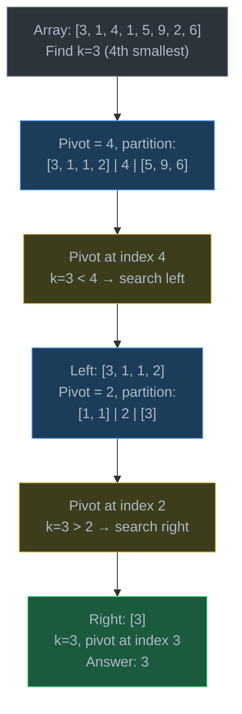
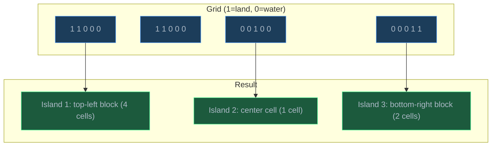
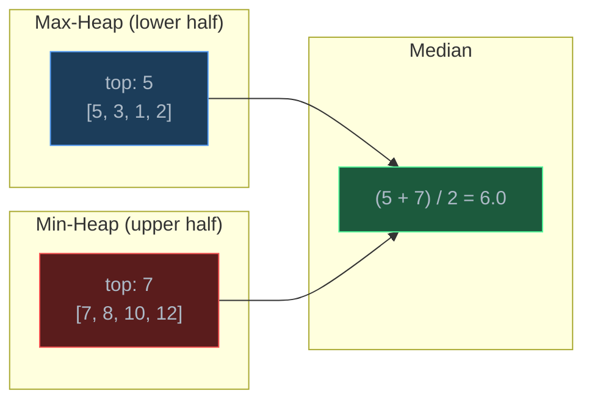
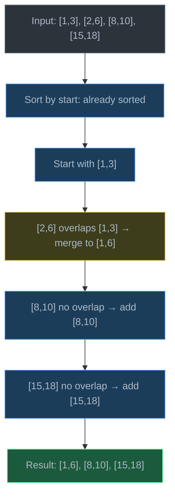
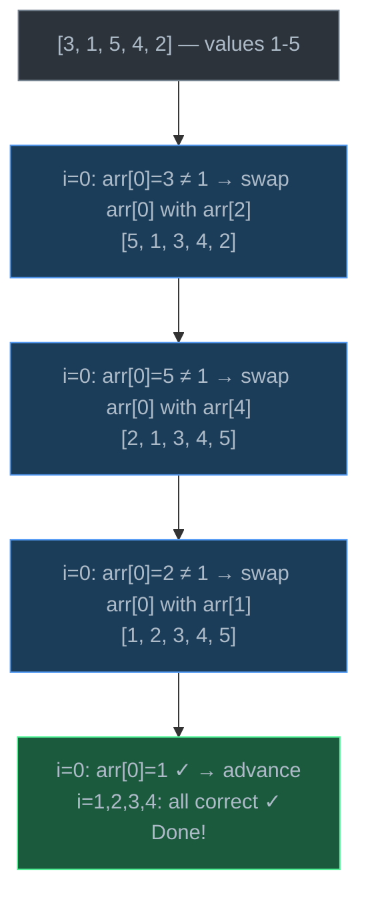
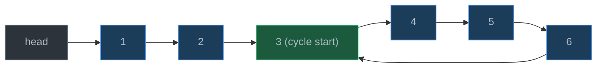

# Problem-Solving Patterns

> A toolkit of recurring algorithmic patterns — recognizing which pattern fits a problem is often the hardest step, and the one that separates efficient solutions from brute-force ones.

## Table of Contents
- [Core Concepts](#core-concepts)
- [Code Examples](#code-examples)
- [Common Pitfalls](#common-pitfalls)
- [Key Takeaways](#key-takeaways)
- [Exercises](#exercises)

## Core Concepts

### Brute Force

#### What

**Brute force** means exhaustively trying every possible solution and checking which one works. It is the simplest approach to any problem — no clever tricks, no data structure insights, just raw enumeration. Every optimization starts here.

For example, to find two numbers in an array that sum to a target, brute force checks every pair: O(n^2). To find the shortest path, brute force tries every possible path: O(n!). Brute force is always correct but often too slow.

#### How

The brute-force strategy is:
1. Enumerate all candidates (all pairs, all subsets, all permutations)
2. Check each candidate against the problem's constraints
3. Return the first valid solution or the best one

The key discipline: **write the brute-force solution first**, verify it is correct, then optimize. This gives you a reference implementation to test your optimized solution against. Many interview candidates jump to optimization and produce wrong code — starting with brute force prevents this.

#### Why It Matters

Brute force establishes **correctness**. If you cannot write a brute-force solution, you do not understand the problem. More importantly, analyzing *why* brute force is slow reveals the optimization opportunity:

- "I'm checking all pairs" → use a hash set for O(1) lookup instead of inner loop
- "I'm recomputing overlapping subproblems" → use dynamic programming
- "I'm sorting when I only need the k-th element" → use quickselect

Every pattern below exists because brute force was too slow for a specific class of problems, and someone found the structural insight to skip unnecessary work.

### Kth Element (Quickselect)

#### What

**Quickselect** finds the k-th smallest (or largest) element in an unsorted array in O(n) average time — without sorting the entire array. It is based on the same partitioning idea as quicksort, but only recurses into the partition that contains the k-th element.

The brute-force approach is to sort the array — O(n log n) — and return `arr[k]`. Quickselect avoids sorting the parts of the array that do not matter.

#### How

1. Choose a **pivot** element (randomly for best average-case behavior)
2. **Partition** the array: elements smaller than pivot go left, larger go right
3. After partitioning, the pivot is at its final sorted position `p`:
   - If `p == k`: the pivot is the answer
   - If `p > k`: the k-th element is in the left partition — recurse left
   - If `p < k`: the k-th element is in the right partition — recurse right



Unlike quicksort which recurses into **both** partitions, quickselect only recurses into **one**. This halves the work at each step (on average), giving O(n) + O(n/2) + O(n/4) + ... = O(2n) = O(n).

#### Why It Matters

Quickselect is optimal for "find the k-th element" problems. Sorting is O(n log n) and using a heap is O(n log k). Quickselect is O(n) average case. The worst case is O(n^2) — when the pivot is consistently the min or max — but random pivot selection makes this astronomically unlikely.

**When to recognize it**: Any problem asking for the k-th smallest, k-th largest, median, or top-k elements without needing the full sorted order.

### Island Traversal

#### What

**Island traversal** is a pattern for counting or exploring **connected regions** in a 2D grid. The classic problem: given a grid of 1s (land) and 0s (water), count the number of islands — where an island is a group of adjacent 1s connected horizontally or vertically.

#### How

1. Iterate over every cell in the grid
2. When you find a `1` that has not been visited:
   - Increment the island count
   - Run **BFS or DFS** from that cell to mark all connected 1s as visited
3. The traversal "floods" the entire island, marking it so it is not counted again



Marking visited cells can be done by:
- Modifying the grid in-place (set `1` → `0` after visiting)
- Using a separate `visited` set

The traversal explores 4 directions (up, down, left, right) from each land cell.

#### Why It Matters

Grid-based connectivity problems are extremely common in interviews and real applications (image processing, game maps, flood fill). The pattern generalizes to:
- Finding the largest island (track sizes during traversal)
- Counting enclosed regions
- Shortest path in a grid (BFS)
- Flood fill (paint bucket in image editors)

**When to recognize it**: Any 2D grid problem asking about connected regions, areas, or paths between cells.

### Two Heaps (Median Maintenance)

#### What

The **two heaps** pattern maintains a **max-heap** for the lower half of elements and a **min-heap** for the upper half. This lets you find the **median** in O(1) and insert new elements in O(log n).

The brute-force approach for median maintenance is to sort the entire collection after each insertion — O(n log n) per insert. Two heaps reduce this to O(log n) per insert.

#### How

Maintain two heaps:
- `max_heap`: stores the smaller half of the numbers. The top (max) is the largest of the small numbers.
- `min_heap`: stores the larger half. The top (min) is the smallest of the large numbers.

**Invariants**:
1. Every element in `max_heap` <= every element in `min_heap`
2. The heaps are balanced: `len(max_heap) == len(min_heap)` or `len(max_heap) == len(min_heap) + 1`

**Insert**:
1. Add to `max_heap` (lower half) by default
2. If `max_heap.top > min_heap.top`, move `max_heap.top` to `min_heap` (wrong half)
3. Rebalance: if sizes differ by more than 1, move the top from the larger heap to the smaller

**Get median**:
- If heaps are equal size: average of two tops
- If `max_heap` is larger: `max_heap.top`



#### Why It Matters

Median maintenance is a classic problem in data stream processing — given a continuous stream of numbers, report the median at any point. Sorting after each insertion is O(n log n) per query. A balanced BST can do it in O(log n) but is complex. Two heaps are simpler and equally efficient.

**When to recognize it**: Any problem involving running median, or more generally, maintaining partitioned data where you need quick access to the boundary between two halves.

### Merge Intervals

#### What

The **merge intervals** pattern handles problems where you have a list of intervals (start, end) and need to merge overlapping ones. For example, `[1,3], [2,6], [8,10]` becomes `[1,6], [8,10]` because `[1,3]` and `[2,6]` overlap.

#### How

1. **Sort** intervals by start time — O(n log n)
2. Initialize the result with the first interval
3. For each subsequent interval:
   - If it overlaps with the last interval in the result (its start <= the last result's end), merge them by extending the end: `merged.end = max(merged.end, current.end)`
   - If it does not overlap, add it as a new entry in the result



The sorting step is key — once intervals are sorted by start time, overlapping intervals are always adjacent, so a single pass suffices.

#### Why It Matters

Interval problems appear everywhere: meeting room scheduling (do any meetings overlap?), calendar conflict detection, CPU job scheduling, genomic region analysis, and time-range database queries.

**When to recognize it**: Any problem involving time ranges, scheduled events, overlapping segments, or intervals with start/end points. If you see pairs of numbers representing ranges, think "merge intervals."

### Cyclic Sort

#### What

**Cyclic sort** is a specialized O(n) sorting technique for arrays where values are in the range `[1, n]` (or `[0, n-1]`). The key insight: each value `v` belongs at index `v - 1`. You iterate through the array and swap each element into its correct position.

The brute-force approach (comparison sort) is O(n log n). Cyclic sort exploits the constraint that values map directly to indices, achieving O(n).

#### How

1. Start at index `i = 0`
2. If `arr[i] != i + 1` (element is not in its correct position):
   - Swap `arr[i]` with `arr[arr[i] - 1]` (put it where it belongs)
   - Do NOT advance `i` — the swapped-in element may also be wrong
3. If `arr[i] == i + 1`, advance `i`
4. After the loop, any position where `arr[i] != i + 1` has a missing or duplicate number



#### Why It Matters

Cyclic sort solves a family of problems in O(n) that would otherwise require O(n log n) sorting or O(n) extra space (hash set):
- Find the missing number in `[1, n]`
- Find all missing numbers
- Find the duplicate number
- Find the first missing positive integer

**When to recognize it**: Array contains values in range `[1, n]` or `[0, n-1]`, and the problem asks about missing, duplicate, or misplaced values.

### Fast and Slow Pointers (Floyd's Algorithm)

#### What

**Floyd's cycle detection** uses two pointers moving at different speeds through a linked list (or sequence). The **slow** pointer moves one step at a time; the **fast** pointer moves two steps. If there is a cycle, the fast pointer will eventually lap the slow pointer and they will meet inside the cycle.

#### How

**Cycle detection**:
1. Both pointers start at the head
2. Slow advances 1 node; fast advances 2 nodes
3. If fast reaches `None`, there is no cycle
4. If slow == fast, there is a cycle

**Finding the cycle start**:
1. Detect the cycle (slow and fast meet at some node inside the cycle)
2. Reset one pointer to the head
3. Move both pointers one step at a time — they meet at the cycle's entrance

**Why does step 2-3 work?** Let the distance from head to cycle start be `a`, and the distance from cycle start to the meeting point be `b`. At the meeting point, slow has traveled `a + b`. Fast has traveled `2(a + b)`. The extra distance fast traveled is exactly the cycle length `c`, so `a + b = c`. This means `a = c - b` — the distance from head to cycle start equals the distance from meeting point to cycle start (going around the cycle).



**Finding the middle of a linked list**:
When fast reaches the end, slow is at the middle — because slow has traveled half the distance.

#### Why It Matters

Floyd's algorithm detects cycles in O(n) time and O(1) space. The alternative — using a hash set to track visited nodes — requires O(n) space. For linked lists with millions of nodes, this matters.

**When to recognize it**: Linked list cycle detection, finding the middle element, detecting loops in sequences (like the "happy number" problem where you repeatedly sum digits squared).

## Code Examples

### Quickselect: Find the Kth Smallest Element

```python
import random


def quickselect(arr: list[int], k: int) -> int:
    """Find the k-th smallest element (0-indexed) without full sorting.

    Uses Lomuto partition scheme with random pivot.

    Time:  O(n) average — each partition halves the search space.
           O(n²) worst case — but random pivot makes this extremely unlikely.
    Space: O(1) — in-place partitioning (ignoring recursion stack).
    """
    if not 0 <= k < len(arr):
        raise ValueError(f"k={k} out of range for array of length {len(arr)}")

    def partition(lo: int, hi: int) -> int:
        """Lomuto partition: pick random pivot, place it at correct position."""
        # Random pivot avoids worst-case O(n²) on sorted input
        pivot_idx = random.randint(lo, hi)
        arr[pivot_idx], arr[hi] = arr[hi], arr[pivot_idx]
        pivot = arr[hi]

        # i tracks the boundary: everything before i is < pivot
        i = lo
        for j in range(lo, hi):
            if arr[j] <= pivot:
                arr[i], arr[j] = arr[j], arr[i]
                i += 1

        # Place pivot at its final position
        arr[i], arr[hi] = arr[hi], arr[i]
        return i

    lo, hi = 0, len(arr) - 1
    while lo <= hi:
        pivot_pos = partition(lo, hi)

        if pivot_pos == k:
            return arr[pivot_pos]  # found it
        elif pivot_pos < k:
            lo = pivot_pos + 1    # k-th element is in the right partition
        else:
            hi = pivot_pos - 1    # k-th element is in the left partition

    raise RuntimeError("Unreachable")


# Demo
nums = [7, 10, 4, 3, 20, 15]
print(f"Array: {nums}")
print(f"1st smallest: {quickselect(nums[:], 0)}")  # 3
print(f"3rd smallest: {quickselect(nums[:], 2)}")  # 7
print(f"Median: {quickselect(nums[:], len(nums) // 2)}")  # 10
```

**Time**: O(n) average — geometric series: n + n/2 + n/4 + ... = 2n. O(n^2) worst case (bad pivots every time).
**Space**: O(1) auxiliary — in-place partitioning, iterative version avoids recursion stack.

### Island Counting with BFS

```python
from collections import deque


def count_islands(grid: list[list[int]]) -> int:
    """Count the number of islands (connected groups of 1s) in a 2D grid.

    Uses BFS to flood-fill each island when discovered. Modifies grid
    in-place by marking visited cells as 0.

    Time:  O(M × N) — visit every cell at most once.
    Space: O(min(M, N)) — BFS queue can hold at most one row/column
           of cells at a time (the frontier of the BFS).
    """
    if not grid or not grid[0]:
        return 0

    rows, cols = len(grid), len(grid[0])
    islands = 0

    # 4-directional movement: up, down, left, right
    directions = [(-1, 0), (1, 0), (0, -1), (0, 1)]

    def bfs(start_row: int, start_col: int) -> None:
        """Flood-fill from (start_row, start_col), marking all connected 1s as 0."""
        queue: deque[tuple[int, int]] = deque([(start_row, start_col)])
        grid[start_row][start_col] = 0  # mark as visited

        while queue:
            row, col = queue.popleft()

            for dr, dc in directions:
                new_row, new_col = row + dr, col + dc

                # Check bounds and whether the cell is land
                if (
                    0 <= new_row < rows
                    and 0 <= new_col < cols
                    and grid[new_row][new_col] == 1
                ):
                    grid[new_row][new_col] = 0  # mark before enqueuing
                    queue.append((new_row, new_col))

    for r in range(rows):
        for c in range(cols):
            if grid[r][c] == 1:
                islands += 1
                bfs(r, c)  # flood-fill this entire island

    return islands


# Demo
grid = [
    [1, 1, 0, 0, 0],
    [1, 1, 0, 0, 0],
    [0, 0, 1, 0, 0],
    [0, 0, 0, 1, 1],
]
print(f"Number of islands: {count_islands(grid)}")  # 3
```

**Time**: O(M x N) — each cell is visited at most once across all BFS calls.
**Space**: O(min(M, N)) — the BFS queue holds at most one "frontier layer" of the grid.

### Median Finder with Two Heaps

```python
import heapq


class MedianFinder:
    """Find the median from a data stream using two heaps.

    max_heap (inverted): stores the smaller half — we want the largest
                         of the small numbers, so we use a max-heap.
    min_heap: stores the larger half — we want the smallest of the
              large numbers.

    Python only has a min-heap (heapq), so we negate values for the max-heap.

    Invariant: len(max_heap) == len(min_heap) or len(max_heap) == len(min_heap) + 1
    """

    def __init__(self) -> None:
        self.max_heap: list[int] = []  # negated values (simulates max-heap)
        self.min_heap: list[int] = []  # normal min-heap

    def add_num(self, num: int) -> None:
        """Add a number to the data structure.

        1. Push to max_heap (lower half) by default
        2. If max_heap's top > min_heap's top, move it to min_heap
        3. Rebalance if sizes differ by more than 1

        Time:  O(log n) — heap push/pop operations.
        Space: O(1) — no extra space beyond the heaps.
        """
        # Step 1: Add to max_heap (negate for min-heap simulation)
        heapq.heappush(self.max_heap, -num)

        # Step 2: Ensure max_heap's top <= min_heap's top
        if self.min_heap and (-self.max_heap[0] > self.min_heap[0]):
            # max_heap's largest > min_heap's smallest — wrong halves
            val = -heapq.heappop(self.max_heap)
            heapq.heappush(self.min_heap, val)

        # Step 3: Rebalance — max_heap can have at most 1 more element
        if len(self.max_heap) > len(self.min_heap) + 1:
            val = -heapq.heappop(self.max_heap)
            heapq.heappush(self.min_heap, val)
        elif len(self.min_heap) > len(self.max_heap):
            val = heapq.heappop(self.min_heap)
            heapq.heappush(self.max_heap, -val)

    def find_median(self) -> float:
        """Return the current median.

        Time:  O(1) — just peek at heap tops.
        Space: O(1).
        """
        if len(self.max_heap) > len(self.min_heap):
            # Odd number of elements — median is max_heap's top
            return float(-self.max_heap[0])
        else:
            # Even number — median is average of two tops
            return (-self.max_heap[0] + self.min_heap[0]) / 2.0


# Demo: streaming median
mf = MedianFinder()
stream = [5, 15, 1, 3, 8, 7, 9, 10, 6, 2]

for num in stream:
    mf.add_num(num)
    print(f"Added {num:>2}, median = {mf.find_median()}")

# Output:
# Added  5, median = 5.0
# Added 15, median = 10.0
# Added  1, median = 5.0
# Added  3, median = 4.0
# Added  8, median = 5.0
# Added  7, median = 6.0
# Added  9, median = 7.0
# Added 10, median = 7.5
# Added  6, median = 7.0
# Added  2, median = 5.5
```

**Time**: O(log n) per insertion, O(1) per median query.
**Space**: O(n) total for storing all elements across both heaps.

### Merge Intervals

```python
def merge_intervals(intervals: list[list[int]]) -> list[list[int]]:
    """Merge all overlapping intervals.

    Strategy:
    1. Sort by start time — overlapping intervals become adjacent
    2. Linear scan: if current interval overlaps the last merged one,
       extend the end; otherwise, start a new merged interval

    Time:  O(n log n) — dominated by the sort step.
           The merge scan itself is O(n).
    Space: O(n) — for the output list (O(log n) for sort in Python).
    """
    if not intervals:
        return []

    # Sort by start time; if equal start, sort by end time
    intervals.sort(key=lambda x: (x[0], x[1]))

    merged: list[list[int]] = [intervals[0]]

    for current in intervals[1:]:
        last = merged[-1]

        if current[0] <= last[1]:
            # Overlapping or touching — extend the end
            last[1] = max(last[1], current[1])
        else:
            # No overlap — add as new interval
            merged.append(current)

    return merged


# Demo
intervals = [[1, 3], [2, 6], [8, 10], [15, 18]]
print(f"Input:  {intervals}")
print(f"Merged: {merge_intervals(intervals)}")
# Merged: [[1, 6], [8, 10], [15, 18]]

# Edge case: contained intervals
intervals2 = [[1, 10], [2, 5], [3, 7], [12, 15]]
print(f"Input:  {intervals2}")
print(f"Merged: {merge_intervals(intervals2)}")
# Merged: [[1, 10], [12, 15]]

# Edge case: all overlapping
intervals3 = [[1, 4], [2, 5], [3, 6], [4, 7]]
print(f"Input:  {intervals3}")
print(f"Merged: {merge_intervals(intervals3)}")
# Merged: [[1, 7]]
```

**Time**: O(n log n) — sorting dominates. The merge pass is O(n).
**Space**: O(n) — output list. Sorting uses O(log n) auxiliary.

### Cyclic Sort: Find Missing Number

```python
def find_missing_number(nums: list[int]) -> int:
    """Find the missing number in an array containing n distinct numbers from [0, n].

    Uses cyclic sort: place each number at its "correct" index (value == index).
    After sorting, the index where value != index reveals the missing number.

    Time:  O(n) — each element is swapped at most once to its correct position.
           Total swaps <= n, even though there's a while loop inside the for loop.
    Space: O(1) — in-place swaps.
    """
    n = len(nums)

    # Cyclic sort: place nums[i] at index nums[i]
    i = 0
    while i < n:
        correct_idx = nums[i]

        # If the value is within range and not already in the correct spot, swap
        if correct_idx < n and nums[i] != nums[correct_idx]:
            nums[i], nums[correct_idx] = nums[correct_idx], nums[i]
            # Don't advance i — check the swapped-in value
        else:
            i += 1

    # After cyclic sort, find the index where value != index
    for i in range(n):
        if nums[i] != i:
            return i

    # If all 0..n-1 are present, n is missing
    return n


# Demo
print(find_missing_number([3, 0, 1]))        # 2
print(find_missing_number([9, 6, 4, 2, 3, 5, 7, 0, 1]))  # 8
print(find_missing_number([0, 1, 2, 3]))     # 4


def find_all_duplicates(nums: list[int]) -> list[int]:
    """Find all duplicates in an array where values are in [1, n].

    Same cyclic sort idea: place each value at index (value - 1).
    After sorting, any position where nums[i] != i + 1 has the wrong
    value — and that value is a duplicate (its correct spot is occupied).

    Time:  O(n)
    Space: O(1) — in-place.
    """
    n = len(nums)

    # Cyclic sort: place nums[i] at index nums[i] - 1
    i = 0
    while i < n:
        correct_idx = nums[i] - 1

        if nums[i] != nums[correct_idx]:
            nums[i], nums[correct_idx] = nums[correct_idx], nums[i]
        else:
            i += 1

    # Values not at their correct position are duplicates
    return [nums[i] for i in range(n) if nums[i] != i + 1]


# Demo
print(find_all_duplicates([4, 3, 2, 7, 8, 2, 3, 1]))  # [2, 3]
print(find_all_duplicates([1, 1, 2]))                    # [1]
```

**Time**: O(n) — each element is swapped at most once into its correct position.
**Space**: O(1) — in-place modification.

### Floyd's Cycle Detection

```python
from dataclasses import dataclass


@dataclass
class ListNode:
    val: int
    next: "ListNode | None" = None


def has_cycle(head: ListNode | None) -> bool:
    """Detect if a linked list has a cycle using Floyd's algorithm.

    Slow pointer moves 1 step, fast moves 2 steps.
    If they meet, there is a cycle. If fast reaches None, there is not.

    Time:  O(n) — fast pointer traverses at most 2n nodes.
    Space: O(1) — only two pointers regardless of list size.
    """
    slow = head
    fast = head

    while fast is not None and fast.next is not None:
        slow = slow.next           # type: ignore[union-attr]
        fast = fast.next.next

        if slow is fast:
            return True

    return False


def find_cycle_start(head: ListNode | None) -> ListNode | None:
    """Find the node where the cycle begins, or None if no cycle.

    Phase 1: Detect cycle (slow and fast meet inside the cycle).
    Phase 2: Reset one pointer to head. Move both one step at a time.
             They meet at the cycle entrance.

    Mathematical proof:
    - Let a = distance from head to cycle start
    - Let b = distance from cycle start to meeting point
    - Let c = cycle length
    - Slow traveled a + b steps
    - Fast traveled 2(a + b) steps
    - Fast made extra loops: 2(a + b) - (a + b) = a + b = c (one full cycle)
    - So a = c - b → distance from head to start == meeting point to start

    Time:  O(n)
    Space: O(1)
    """
    # Phase 1: Detect cycle
    slow = head
    fast = head

    while fast is not None and fast.next is not None:
        slow = slow.next           # type: ignore[union-attr]
        fast = fast.next.next

        if slow is fast:
            break
    else:
        return None  # No cycle

    # Phase 2: Find entrance
    # Reset one pointer to head, advance both one step at a time
    slow = head
    while slow is not fast:
        slow = slow.next           # type: ignore[union-attr]
        fast = fast.next           # type: ignore[union-attr]

    return slow  # type: ignore[return-value]


def find_middle(head: ListNode | None) -> ListNode | None:
    """Find the middle node of a linked list using slow/fast pointers.

    When fast reaches the end, slow is at the middle.
    For even-length lists, returns the second middle node.

    Time:  O(n) — one pass.
    Space: O(1) — two pointers.
    """
    slow = head
    fast = head

    while fast is not None and fast.next is not None:
        slow = slow.next           # type: ignore[union-attr]
        fast = fast.next.next

    return slow


# Demo: Cycle detection
# Build: 1 → 2 → 3 → 4 → 5 → back to 3
nodes = [ListNode(i) for i in range(1, 6)]
for i in range(len(nodes) - 1):
    nodes[i].next = nodes[i + 1]
nodes[-1].next = nodes[2]  # 5 → 3, creating a cycle

print(f"Has cycle: {has_cycle(nodes[0])}")  # True
cycle_start = find_cycle_start(nodes[0])
print(f"Cycle starts at node with value: {cycle_start.val}")  # 3

# Demo: No cycle
a = ListNode(1, ListNode(2, ListNode(3, ListNode(4, ListNode(5)))))
print(f"Has cycle: {has_cycle(a)}")  # False
print(f"Middle: {find_middle(a).val}")  # type: ignore[union-attr]  # 3
```

**Time**: O(n) for all operations — single pass through the list.
**Space**: O(1) — only two pointers, regardless of list size.

### Brute Force vs Optimized: Two Sum

```python
def two_sum_brute(nums: list[int], target: int) -> tuple[int, int] | None:
    """Brute force: check every pair — O(n²).

    This is the baseline. It is correct but slow.
    """
    n = len(nums)
    for i in range(n):
        for j in range(i + 1, n):
            if nums[i] + nums[j] == target:
                return (i, j)
    return None


def two_sum_optimized(nums: list[int], target: int) -> tuple[int, int] | None:
    """Optimized: use a hash map to check complements — O(n).

    The insight: for each number x, we need target - x to exist somewhere.
    A hash map gives O(1) lookup, eliminating the inner loop.
    """
    seen: dict[int, int] = {}  # value → index

    for i, num in enumerate(nums):
        complement = target - num
        if complement in seen:
            return (seen[complement], i)
        seen[num] = i

    return None


# Both produce the same answer, but optimized is n times faster
nums = [2, 7, 11, 15]
print(f"Brute force: {two_sum_brute(nums, 9)}")     # (0, 1)
print(f"Optimized:   {two_sum_optimized(nums, 9)}")  # (0, 1)
```

**Brute force**: Time O(n^2), Space O(1). Checks n(n-1)/2 pairs.
**Optimized**: Time O(n), Space O(n). Trades space for time via hash map.

## Common Pitfalls

### Pitfall 1: Quickselect on Already-Sorted Input Without Random Pivot

```python
# BAD — using first/last element as pivot on sorted input → O(n²)
def partition_bad(arr: list[int], lo: int, hi: int) -> int:
    pivot = arr[hi]  # always picks the last element
    # On sorted input, this creates maximally unbalanced partitions:
    # one side has n-1 elements, the other has 0
    i = lo
    for j in range(lo, hi):
        if arr[j] <= pivot:
            arr[i], arr[j] = arr[j], arr[i]
            i += 1
    arr[i], arr[hi] = arr[hi], arr[i]
    return i

# GOOD — random pivot avoids worst-case on any specific input
import random

def partition_good(arr: list[int], lo: int, hi: int) -> int:
    pivot_idx = random.randint(lo, hi)  # random pivot
    arr[pivot_idx], arr[hi] = arr[hi], arr[pivot_idx]
    pivot = arr[hi]
    i = lo
    for j in range(lo, hi):
        if arr[j] <= pivot:
            arr[i], arr[j] = arr[j], arr[i]
            i += 1
    arr[i], arr[hi] = arr[hi], arr[i]
    return i
```

Why it's wrong: Deterministic pivot selection (first or last element) on sorted or nearly-sorted input causes every partition to be maximally unbalanced: one side has n-1 elements, the other has 0. This gives n + (n-1) + (n-2) + ... = O(n^2) work. Random pivot ensures O(n) average case regardless of input distribution.

### Pitfall 2: Island Traversal Without Marking Before Enqueuing

```python
# BAD — mark as visited when dequeuing (too late!)
def bfs_bad(grid: list[list[int]], r: int, c: int, rows: int, cols: int) -> None:
    queue = deque([(r, c)])
    while queue:
        row, col = queue.popleft()
        grid[row][col] = 0  # marked here — but duplicates already enqueued!
        for dr, dc in [(-1, 0), (1, 0), (0, -1), (0, 1)]:
            nr, nc = row + dr, col + dc
            if 0 <= nr < rows and 0 <= nc < cols and grid[nr][nc] == 1:
                queue.append((nr, nc))

# GOOD — mark as visited immediately when enqueuing
from collections import deque

def bfs_good(grid: list[list[int]], r: int, c: int, rows: int, cols: int) -> None:
    queue: deque[tuple[int, int]] = deque([(r, c)])
    grid[r][c] = 0  # mark BEFORE entering the loop
    while queue:
        row, col = queue.popleft()
        for dr, dc in [(-1, 0), (1, 0), (0, -1), (0, 1)]:
            nr, nc = row + dr, col + dc
            if 0 <= nr < rows and 0 <= nc < cols and grid[nr][nc] == 1:
                grid[nr][nc] = 0  # mark BEFORE enqueuing
                queue.append((nr, nc))
```

Why it's wrong: If you mark cells as visited when dequeuing (processing), the same cell can be enqueued multiple times by different neighbors before it gets processed. On large grids, this causes the queue to grow to O(M x N) instead of O(min(M, N)), wasting time and memory. Marking before enqueuing ensures each cell enters the queue exactly once.

### Pitfall 3: Merge Intervals Without Sorting First

```python
# BAD — attempting to merge unsorted intervals
def merge_bad(intervals: list[list[int]]) -> list[list[int]]:
    merged: list[list[int]] = [intervals[0]]
    for current in intervals[1:]:
        last = merged[-1]
        if current[0] <= last[1]:
            last[1] = max(last[1], current[1])
        else:
            merged.append(current)
    return merged

# Input: [[8,10], [1,3], [2,6], [15,18]]
# Without sorting: [[8,10], [1,3], [2,6], [15,18]] — misses [1,3]+[2,6] overlap!

# GOOD — sort first, then merge
def merge_good(intervals: list[list[int]]) -> list[list[int]]:
    intervals.sort(key=lambda x: x[0])  # MUST sort first
    merged: list[list[int]] = [intervals[0]]
    for current in intervals[1:]:
        last = merged[-1]
        if current[0] <= last[1]:
            last[1] = max(last[1], current[1])
        else:
            merged.append(current)
    return merged
```

Why it's wrong: The merge algorithm assumes overlapping intervals are adjacent. Without sorting by start time, two overlapping intervals can be separated by non-overlapping ones, and the single-pass merge will miss them. Sorting guarantees that if interval B overlaps interval A, B comes right after A (or is within A's range).

### Pitfall 4: Cyclic Sort With Wrong Index Mapping

```python
# BAD — off-by-one: values are 1-n but indices are 0-(n-1)
def cyclic_sort_bad(nums: list[int]) -> None:
    i = 0
    while i < len(nums):
        if nums[i] != nums[nums[i]]:  # wrong: maps value 1 to index 1
            nums[i], nums[nums[i]] = nums[nums[i]], nums[i]
        else:
            i += 1
    # For values [1, n], value v should be at index v-1, not index v

# GOOD — correct index mapping: value v belongs at index v-1
def cyclic_sort_good(nums: list[int]) -> None:
    i = 0
    while i < len(nums):
        correct_idx = nums[i] - 1  # value 1 → index 0, value n → index n-1
        if nums[i] != nums[correct_idx]:
            nums[i], nums[correct_idx] = nums[correct_idx], nums[i]
        else:
            i += 1
```

Why it's wrong: When values range from 1 to n, value `v` belongs at index `v - 1`. Using `nums[i]` directly as the index (without subtracting 1) causes an off-by-one error, and for value n, it causes an index-out-of-bounds error. Always verify the mapping between values and indices before implementing cyclic sort.

## Key Takeaways

- **Start with brute force** to establish correctness, then identify the bottleneck to choose the right optimization pattern. The bottleneck tells you which pattern to apply.
- **Pattern recognition is the skill**: "values in range 1-n" signals cyclic sort; "prefix-based lookup" signals trie; "connected components" signals union-find or island traversal; "running median" signals two heaps; "overlapping ranges" signals merge intervals.
- Every pattern replaces brute-force O(n^2) or O(n log n) with something faster by exploiting **problem structure** — cyclic sort uses value-to-index mapping, quickselect uses one-sided recursion, two heaps maintain sorted halves incrementally.
- **Time complexity is not the whole story**: Floyd's cycle detection is O(n) like a hash set approach, but uses O(1) space versus O(n). Choosing the right pattern often involves space trade-offs, not just time.
- These seven patterns cover a large fraction of coding interview problems. When you see a new problem, ask: "Which pattern does the structure of this problem match?"

## Exercises

1. **Write a function** `kth_largest(nums: list[int], k: int) -> int` that finds the k-th largest element using quickselect. Do not use Python's built-in sort. What is the average and worst-case time complexity?

2. **Write a function** `max_island_area(grid: list[list[int]]) -> int` that returns the area (number of cells) of the largest island in a 2D binary grid. If there are no islands, return 0. Implement it using DFS instead of BFS.

3. **Explain** why the two heaps median finder uses a max-heap for the lower half and a min-heap for the upper half, rather than the reverse. What property of the median makes this arrangement necessary?

4. **Write a function** `insert_interval(intervals: list[list[int]], new_interval: list[int]) -> list[list[int]]` that inserts a new interval into a sorted, non-overlapping list of intervals and merges if necessary. The input intervals are already sorted by start time. Can you do it in O(n) without re-sorting?

5. **Write a function** `find_duplicate(nums: list[int]) -> int` where `nums` contains n+1 integers in the range `[1, n]` with exactly one duplicate. Solve it using Floyd's cycle detection (treat `nums[i]` as a "next pointer" from index `i` to index `nums[i]`). Why does this work?

---
up:: [Schedule](../../Schedule.md)
#type/learning #source/self-study #status/seed
