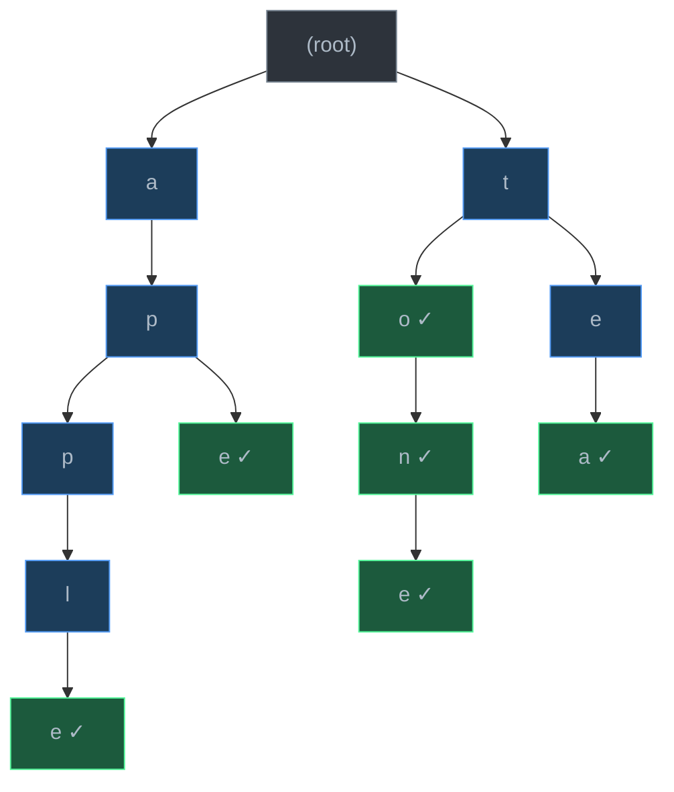
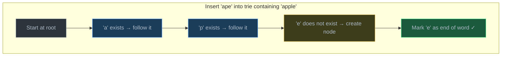

# Trie (Prefix Tree)

> A trie stores strings character-by-character in a tree structure where shared prefixes share nodes, enabling O(L) insert, search, and prefix lookup — the optimal data structure for prefix-based operations.

## Table of Contents
- [Core Concepts](#core-concepts)
- [Code Examples](#code-examples)
- [Common Pitfalls](#common-pitfalls)
- [Key Takeaways](#key-takeaways)
- [Exercises](#exercises)

## Core Concepts

### What Is a Trie?

#### What

A **trie** (pronounced "try," from re**trie**val) is a tree-shaped data structure where each node represents a single character, and paths from root to marked nodes spell out stored words. Unlike a binary search tree where each node holds a complete key, a trie distributes each key across multiple levels — one character per level.

The root node is empty. Each edge represents a character. A boolean flag `is_end_of_word` on a node marks whether the path from root to that node forms a complete word.



The diagram above stores the words: **apple, ape, to, ton, tone, tea**. Green nodes (marked with check) indicate `is_end_of_word = True`. Notice how "apple" and "ape" share the prefix "ap", and "to", "ton", "tone" share the prefix "to". This prefix sharing is the defining property of a trie.

#### How

Each trie node contains:
1. A **children** mapping: `dict[str, TrieNode]` — maps each character to its child node
2. An **is_end_of_word** flag: `bool` — marks whether a complete word ends at this node

To store a word, you start at the root and walk character by character. If the next character already exists as a child, follow it. If it does not, create a new node. After processing the last character, mark that node's `is_end_of_word` as `True`.

#### Why It Matters

Tries solve a problem that hash tables and BSTs handle poorly: **prefix-based operations**. A hash table can tell you if "apple" exists in O(1), but it cannot efficiently answer "give me all words starting with 'app'" — you would need to scan every key. A trie answers prefix queries in O(L) where L is the prefix length, because the structure itself organizes words by their prefixes.

This is why every search engine autocomplete, every phone keyboard's word prediction, and every spell checker uses a trie (or a compressed variant). The structure matches the problem perfectly: human language is inherently prefix-structured.

### Trie Node Structure

#### What

A trie node is minimal — it holds a dictionary of children and a boolean flag. Unlike BST nodes that store full keys, trie nodes do not explicitly store their character; the character is implicit in the edge from the parent. However, for debugging convenience, some implementations store the character in the node.

```
TrieNode:
    children: dict[str, TrieNode]    # char → child node
    is_end_of_word: bool             # does a word end here?
```

#### How

The `children` dictionary is the branching mechanism. For English lowercase letters, each node can have up to 26 children. In practice, most nodes have far fewer — the average English word shares significant prefix overlap with other words.

Some implementations use a fixed-size array of 26 slots instead of a dictionary for performance. The dictionary approach is more flexible (supports any character set — Unicode, digits, etc.) and more space-efficient when the alphabet is large but branching is sparse.

#### Why It Matters

The choice between a dictionary and a fixed array for `children` is the key engineering trade-off in trie design:

| Approach | Lookup Time | Space per Node | Best For |
| --- | --- | --- | --- |
| `dict[str, TrieNode]` | O(1) average (hash) | Proportional to actual children | Sparse, Unicode, variable alphabet |
| `list[TrieNode \| None]` of size 26 | O(1) (index) | Fixed 26 slots | Dense, lowercase English only |

For interview and general-purpose code, the dictionary approach is standard in Python. It is clean, flexible, and the hash lookup overhead is negligible.

### Operations and Complexity

#### What

All core trie operations run in O(L) time, where L is the length of the word or prefix being processed. This is independent of how many words are stored in the trie — whether you have 10 words or 10 million, inserting or searching a 5-character word takes exactly 5 steps.

| Operation | Time | Space | Description |
| --- | --- | --- | --- |
| Insert | O(L) | O(L) worst case | Create nodes for each new character |
| Search | O(L) | O(1) | Follow existing path, check flag |
| Starts With (prefix) | O(L) | O(1) | Follow path, return True if path exists |
| Delete | O(L) | O(1) | Unmark flag, optionally prune nodes |
| Autocomplete | O(L + K) | O(K) | Find prefix node, collect K results via DFS |

#### How

**Insert** walks the trie character by character. For each character, if a child node already exists, move to it. If not, create a new child node and move to it. After the last character, set `is_end_of_word = True`.



**Search** follows the same path but never creates nodes. If at any point a character is missing from children, the word does not exist. If the full path exists but `is_end_of_word` is `False`, the word is not in the trie (it is only a prefix of another word).

**Starts With** is identical to search, except it does not check `is_end_of_word`. If the full prefix path exists, return `True`.

**Delete** follows the path to the word's final node and sets `is_end_of_word = False`. Optionally, if that node has no children, you prune (remove) it and walk back up, removing any ancestor nodes that also have no other children and are not end-of-word markers.

#### Why It Matters

The O(L) time complexity for all operations is the critical insight. Compare this to alternatives:

| Data Structure | Insert | Search | Prefix Search |
| --- | --- | --- | --- |
| Trie | O(L) | O(L) | O(L) |
| Hash Table | O(L) | O(L) | O(N × L) — scan all keys |
| Balanced BST | O(L log N) | O(L log N) | O(L log N + K) |
| Sorted Array | O(N) | O(L log N) | O(L log N + K) |

N = number of stored words, L = word length, K = number of matches.

The trie's operations do not depend on N at all. A trie with a billion words searches just as fast as one with ten, because you are walking the word's characters, not comparing against other stored words. Hash tables and BSTs require hashing or comparing the full key, and their prefix operations are fundamentally worse.

### Trie vs Hash Table for Prefix Operations

#### What

Hash tables (Python's `dict`, `set`) offer O(1) average-case key lookup, making them seem like the ultimate data structure. But they cannot answer prefix queries efficiently because hashing destroys the character-level structure of keys. A trie preserves this structure.

#### How

Consider implementing autocomplete for a dictionary of 100,000 words. A user types "pre" and you need all words starting with "pre":

- **Hash table approach**: Iterate through all 100,000 keys, check if each starts with "pre". This is O(N × L) — linear scan of the entire dataset.
- **Trie approach**: Walk three nodes (p → r → e), then DFS from the "e" node to collect all descendants. This is O(3 + K) where K is the number of matching words. You never look at words that do not start with "pre".

#### Why It Matters

This is why tries exist as a separate data structure — they are not "better hash tables," they are a fundamentally different tool for a different class of problems. Use a hash table when you need exact key lookup. Use a trie when you need prefix-based operations: autocomplete, spell checking, IP routing (longest prefix match), word games (Boggle/Scrabble), and any scenario where keys have hierarchical structure that you want to exploit.

### Applications

#### What

Tries appear in systems where strings must be searched, completed, or validated based on prefixes:

1. **Autocomplete / Type-ahead**: Search engines, IDE code completion, phone keyboards. Type a prefix, get suggestions instantly.
2. **Spell checking**: Store a dictionary in a trie. For a misspelled word, explore nearby paths (edit distance) to suggest corrections.
3. **IP routing tables**: Routers use a variant called a **Patricia trie** (compressed trie) for longest prefix matching of IP addresses.
4. **Word games**: Boggle solvers use tries to prune invalid paths — if a partial path is not a prefix of any word, stop exploring.
5. **T9 predictive text**: Map digit sequences to words using a trie keyed by digit patterns.

#### How

In autocomplete, the trie stores all valid suggestions. When the user types a prefix:
1. Walk the trie to the prefix's end node — O(L)
2. From that node, perform DFS/BFS to collect all words in the subtree — O(K) for K results
3. Optionally rank results by frequency (store a count at each end node)

#### Why It Matters

The pattern is always the same: the trie's tree structure lets you instantly navigate to the subset of data that shares a given prefix, skipping everything else. This is a logarithmic-style win disguised as a string operation — instead of searching N items, you search L characters and then only the relevant subtree.

## Code Examples

### TrieNode and Trie with Core Operations

```python
from dataclasses import dataclass, field


@dataclass
class TrieNode:
    """A single node in a trie.

    children maps each character to its child node.
    is_end_of_word marks whether a complete word ends at this node.
    """

    children: dict[str, "TrieNode"] = field(default_factory=dict)
    is_end_of_word: bool = False


class Trie:
    """Prefix tree supporting insert, search, prefix check, and delete."""

    def __init__(self) -> None:
        self.root = TrieNode()

    def insert(self, word: str) -> None:
        """Insert a word into the trie.

        Walk character by character, creating nodes as needed.
        Mark the final node as end-of-word.

        Time:  O(L) — L is the length of the word.
        Space: O(L) — worst case creates L new nodes (no shared prefix).
        """
        node = self.root
        for char in word:
            if char not in node.children:
                node.children[char] = TrieNode()
            node = node.children[char]
        node.is_end_of_word = True

    def search(self, word: str) -> bool:
        """Return True if the exact word exists in the trie.

        Follows the character path. Returns False if:
        - Any character is missing (path does not exist)
        - Path exists but is_end_of_word is False (only a prefix)

        Time:  O(L) — traverse L characters.
        Space: O(1) — no extra space.
        """
        node = self._find_node(word)
        return node is not None and node.is_end_of_word

    def starts_with(self, prefix: str) -> bool:
        """Return True if any word in the trie starts with the given prefix.

        Same as search, but does not check is_end_of_word.

        Time:  O(L) — traverse L characters of the prefix.
        Space: O(1) — no extra space.
        """
        return self._find_node(prefix) is not None

    def delete(self, word: str) -> bool:
        """Delete a word from the trie. Returns True if the word was found and deleted.

        Strategy: walk to the end node and unmark is_end_of_word.
        Then prune any nodes that are no longer needed (no children and not end-of-word).

        Time:  O(L) — traverse the word, then backtrack to prune.
        Space: O(L) — recursion stack for the backtracking prune.
        """
        return self._delete_recursive(self.root, word, depth=0)

    def _find_node(self, prefix: str) -> TrieNode | None:
        """Walk the trie following the prefix, return the final node or None."""
        node = self.root
        for char in prefix:
            if char not in node.children:
                return None
            node = node.children[char]
        return node

    def _delete_recursive(self, node: TrieNode, word: str, depth: int) -> bool:
        """Recursively delete a word and prune orphaned nodes.

        Returns True if the parent should delete its reference to this node.
        A node is prunable if it has no children and is not an end-of-word.
        """
        if depth == len(word):
            # Reached the end of the word
            if not node.is_end_of_word:
                return False  # Word does not exist
            node.is_end_of_word = False
            # If this node has no children, it can be pruned
            return len(node.children) == 0

        char = word[depth]
        if char not in node.children:
            return False  # Word does not exist

        child_should_be_deleted = self._delete_recursive(
            node.children[char], word, depth + 1
        )

        if child_should_be_deleted:
            del node.children[char]
            # This node can also be pruned if it has no other children
            # and is not itself an end-of-word
            return len(node.children) == 0 and not node.is_end_of_word

        return False


# Demo
trie = Trie()
for w in ["apple", "ape", "app", "application", "bat", "ball"]:
    trie.insert(w)

print(trie.search("apple"))       # True
print(trie.search("app"))         # True
print(trie.search("ap"))          # False — "ap" is a prefix, not a stored word
print(trie.starts_with("ap"))     # True — "ap" is a prefix of "ape", "app", etc.
print(trie.starts_with("ba"))     # True
print(trie.starts_with("car"))    # False

trie.delete("app")
print(trie.search("app"))         # False — deleted
print(trie.search("apple"))       # True — still exists (different path end)
```

**Time**: O(L) for insert, search, starts_with, and delete, where L is the word/prefix length.
**Space**: O(L) for insert (new nodes), O(1) for search and starts_with, O(L) recursion stack for delete.

### Autocomplete with Prefix Matching

```python
from dataclasses import dataclass, field


@dataclass
class TrieNode:
    children: dict[str, "TrieNode"] = field(default_factory=dict)
    is_end_of_word: bool = False


class AutocompleteTrie:
    """Trie with autocomplete: given a prefix, return all matching words."""

    def __init__(self) -> None:
        self.root = TrieNode()

    def insert(self, word: str) -> None:
        node = self.root
        for char in word:
            if char not in node.children:
                node.children[char] = TrieNode()
            node = node.children[char]
        node.is_end_of_word = True

    def autocomplete(self, prefix: str, max_results: int = 10) -> list[str]:
        """Return up to max_results words that start with the given prefix.

        1. Walk the trie to the end of the prefix — O(L)
        2. DFS from that node to collect all words in the subtree — O(K)

        Time:  O(L + K) — L = prefix length, K = total characters in matching subtree.
        Space: O(M) — M = number of results stored in the output list,
               plus O(D) recursion stack where D = max depth of subtree.
        """
        # Step 1: Navigate to the prefix node
        node = self.root
        for char in prefix:
            if char not in node.children:
                return []  # Prefix does not exist
            node = node.children[char]

        # Step 2: DFS from prefix node to collect all words
        results: list[str] = []
        self._collect_words(node, prefix, results, max_results)
        return results

    def _collect_words(
        self,
        node: TrieNode,
        current_word: str,
        results: list[str],
        max_results: int,
    ) -> None:
        """DFS to collect all words from this node downward."""
        if len(results) >= max_results:
            return

        if node.is_end_of_word:
            results.append(current_word)

        # Explore children in sorted order for consistent, alphabetical results
        for char in sorted(node.children):
            self._collect_words(
                node.children[char],
                current_word + char,
                results,
                max_results,
            )


# Demo: build a small dictionary
ac = AutocompleteTrie()
words = [
    "python", "pytorch", "pycharm", "pyre", "pylint",
    "program", "programming", "project",
    "data", "database", "dataclass", "dataframe",
]
for w in words:
    ac.insert(w)

print(ac.autocomplete("py"))
# ['pycharm', 'pylint', 'python', 'pytorch', 'pyre']

print(ac.autocomplete("pro"))
# ['program', 'programming', 'project']

print(ac.autocomplete("data", max_results=2))
# ['data', 'database']

print(ac.autocomplete("xyz"))
# []
```

**Time**: O(L + K) where L is the prefix length and K is the total size of the matching subtree.
**Space**: O(M) for storing M results, plus O(D) recursion stack depth.

### Word Dictionary with Wildcard Search

```python
from dataclasses import dataclass, field


@dataclass
class TrieNode:
    children: dict[str, "TrieNode"] = field(default_factory=dict)
    is_end_of_word: bool = False


class WordDictionary:
    """Trie that supports '.' wildcard matching any single character.

    This is a classic interview problem (LeetCode 211).
    The wildcard requires DFS branching at each '.' character.
    """

    def __init__(self) -> None:
        self.root = TrieNode()

    def add_word(self, word: str) -> None:
        """Add a word to the dictionary — standard trie insert."""
        node = self.root
        for char in word:
            if char not in node.children:
                node.children[char] = TrieNode()
            node = node.children[char]
        node.is_end_of_word = True

    def search(self, word: str) -> bool:
        """Search for a word, where '.' matches any single character.

        For normal characters: follow the single matching child.
        For '.': try ALL children (branch the search).

        Time:  O(L) for words without '.', O(26^D × L) worst case with '.' where
               D is the number of dots — each dot branches to up to 26 children.
        Space: O(L) — recursion stack depth.
        """
        return self._search_recursive(self.root, word, index=0)

    def _search_recursive(
        self, node: TrieNode, word: str, index: int
    ) -> bool:
        if index == len(word):
            return node.is_end_of_word

        char = word[index]

        if char == ".":
            # Wildcard: try every child — if any path succeeds, return True
            for child in node.children.values():
                if self._search_recursive(child, word, index + 1):
                    return True
            return False
        else:
            # Normal character: follow the specific child
            if char not in node.children:
                return False
            return self._search_recursive(
                node.children[char], word, index + 1
            )


# Demo
wd = WordDictionary()
for w in ["bad", "dad", "mad", "pad", "bat", "bar"]:
    wd.add_word(w)

print(wd.search("bad"))    # True  — exact match
print(wd.search("b.."))    # True  — matches "bad", "bat", "bar"
print(wd.search(".ad"))    # True  — matches "bad", "dad", "mad", "pad"
print(wd.search("b.d"))    # True  — matches "bad"
print(wd.search("..."))    # True  — matches any 3-letter word
print(wd.search("b"))      # False — no 1-letter word "b"
print(wd.search("...."))   # False — no 4-letter words stored
```

**Time**: O(L) without wildcards; O(26^D x L) worst case with D wildcard characters.
**Space**: O(L) recursion stack for the search, O(total characters) for storage.

### Counting Words and Prefixes

```python
from dataclasses import dataclass, field


@dataclass
class CountingTrieNode:
    """Enhanced trie node that tracks word count and prefix count."""

    children: dict[str, "CountingTrieNode"] = field(default_factory=dict)
    word_count: int = 0      # how many times this exact word was inserted
    prefix_count: int = 0    # how many words pass through this node


class CountingTrie:
    """Trie that counts word frequencies and prefix frequencies.

    Useful for frequency-based autocomplete ranking.
    """

    def __init__(self) -> None:
        self.root = CountingTrieNode()

    def insert(self, word: str) -> None:
        """Insert a word, incrementing prefix counts along the path.

        Time:  O(L)
        Space: O(L) worst case for new nodes.
        """
        node = self.root
        for char in word:
            if char not in node.children:
                node.children[char] = CountingTrieNode()
            node = node.children[char]
            node.prefix_count += 1  # one more word passes through here
        node.word_count += 1

    def count_word(self, word: str) -> int:
        """Return how many times this exact word was inserted.

        Time: O(L), Space: O(1).
        """
        node = self.root
        for char in word:
            if char not in node.children:
                return 0
            node = node.children[char]
        return node.word_count

    def count_prefix(self, prefix: str) -> int:
        """Return how many stored words have this prefix.

        Time: O(L), Space: O(1).
        """
        node = self.root
        for char in prefix:
            if char not in node.children:
                return 0
            node = node.children[char]
        return node.prefix_count


# Demo
ct = CountingTrie()
for w in ["apple", "apple", "apple", "app", "application", "ape", "bat"]:
    ct.insert(w)

print(f"'apple' inserted {ct.count_word('apple')} times")       # 3
print(f"'app' inserted {ct.count_word('app')} times")           # 1
print(f"Words with prefix 'app': {ct.count_prefix('app')}")     # 5 (apple×3 + app + application)
print(f"Words with prefix 'ap': {ct.count_prefix('ap')}")       # 6 (apple×3 + app + application + ape)
print(f"Words with prefix 'b': {ct.count_prefix('b')}")         # 1 (bat)
print(f"Words with prefix 'xyz': {ct.count_prefix('xyz')}")     # 0
```

**Time**: O(L) for all operations.
**Space**: O(total characters across all unique prefixes) for the trie structure.

## Common Pitfalls

### Pitfall 1: Confusing "Prefix Exists" with "Word Exists"

```python
# BAD — treating starts_with result as word existence
trie = Trie()
trie.insert("apple")

# This checks if "app" is a PREFIX of any stored word — True
# But "app" itself was never inserted as a word
if trie.starts_with("app"):
    print("Found 'app'!")  # Misleading — "app" is not a stored word

# GOOD — use search() for exact word lookup, starts_with() for prefix check
trie = Trie()
trie.insert("apple")

if trie.search("app"):
    print("'app' is a stored word")
else:
    print("'app' is NOT a stored word")  # Correct

if trie.starts_with("app"):
    print("Some word starts with 'app'")  # Also correct — "apple" does
```

Why it's wrong: `search()` checks that the full path exists AND `is_end_of_word` is True. `starts_with()` only checks that the path exists. "app" is a prefix of "apple" but was never inserted as a word. Mixing these up causes silent logical errors.

### Pitfall 2: Forgetting to Handle Empty String

```python
# BAD — inserting empty string marks root as end-of-word
trie = Trie()
trie.insert("")
print(trie.search(""))  # True — root.is_end_of_word is True
# Every starts_with("") call now returns True (which is technically correct
# but may not be intended behavior)

# GOOD — validate input before insertion
class SafeTrie(Trie):
    def insert(self, word: str) -> None:
        if not word:
            return  # Skip empty strings — or raise ValueError
        super().insert(word)
```

Why it's wrong: Inserting an empty string sets `is_end_of_word = True` on the root node. This is semantically valid but often unintended and can cause confusing behavior in autocomplete (the empty prefix matches everything, and now the empty string is also a "word").

### Pitfall 3: Deleting a Word Without Checking Children

```python
# BAD — naive deletion removes the end-of-word flag but doesn't prune,
#        or worse, prunes nodes still needed by other words
trie = Trie()
trie.insert("apple")
trie.insert("app")

# If delete("app") just removes the "p" node (3rd level),
# it would destroy the path to "apple"

# GOOD — only prune nodes that have no children AND are not end-of-word
# The _delete_recursive implementation above handles this correctly:
# - "app" → unmark is_end_of_word on the 2nd 'p' node
# - That node still has children ('l' → 'e'), so it is NOT pruned
# - "apple" remains intact
trie.delete("app")
print(trie.search("app"))    # False — deleted
print(trie.search("apple"))  # True — preserved
```

Why it's wrong: A node can serve double duty — it can be an end-of-word marker AND a waypoint on the path to longer words. Pruning it destroys all longer words that share the prefix. Always check `len(node.children) == 0` before removing a node.

### Pitfall 4: Case Sensitivity Mismatch

```python
# BAD — inserting mixed case without normalizing
trie = Trie()
trie.insert("Apple")
trie.insert("apple")
# These create TWO separate paths: "A" → "p" → ... and "a" → "p" → ...
# search("apple") does not find "Apple" and vice versa

# GOOD — normalize case on insert and search
class CaseInsensitiveTrie(Trie):
    def insert(self, word: str) -> None:
        super().insert(word.lower())

    def search(self, word: str) -> bool:
        return super().search(word.lower())

    def starts_with(self, prefix: str) -> bool:
        return super().starts_with(prefix.lower())
```

Why it's wrong: Tries are character-level structures. "A" and "a" are different characters with different dictionary keys. If your use case treats them as the same (autocomplete, spell check), you must normalize consistently.

## Key Takeaways

- A trie organizes strings character-by-character in a tree where **shared prefixes share nodes**, making all operations O(L) regardless of how many words are stored.
- The `is_end_of_word` flag distinguishes stored words from mere prefixes — "app" being a prefix of "apple" does not mean "app" is a stored word unless explicitly inserted.
- Tries dominate hash tables for **prefix-based operations** (autocomplete, prefix counting, wildcard matching) because the tree structure preserves character-level relationships that hashing destroys.
- Deletion requires care: only prune nodes that have **no children and are not end-of-word markers**, or you will destroy paths to other words.
- In Python, use `dict[str, TrieNode]` for children — it is flexible, supports any character set, and is idiomatic.

## Exercises

1. **Write a function** `longest_common_prefix(words: list[str]) -> str` that uses a trie to find the longest common prefix shared by all words in the list. For example, `longest_common_prefix(["flower", "flow", "flight"])` returns `"fl"`. Analyze the time and space complexity.

2. **Explain** why searching for a word in a trie is O(L) regardless of how many words the trie contains, while searching in a hash set is also O(L) on average. In what scenarios would you still prefer a trie over a hash set?

3. **Write a method** `count_words_with_prefix(prefix: str) -> int` for the `Trie` class that returns the number of stored words that begin with the given prefix. Do not collect the words — just count them. What additional data would you store in each node to make this O(L) instead of O(L + subtree size)?

4. **Write a function** `replace_words(dictionary: list[str], sentence: str) -> str` that replaces every word in the sentence with the shortest matching root from the dictionary. For example, `replace_words(["cat", "bat", "rat"], "the cattle was rattled by the battery")` returns `"the cat was rat by the bat"`. Use a trie for efficient prefix lookup.

5. **Explain** what happens when you delete "apple" from a trie that also contains "app" and "application". Walk through the delete operation step by step: which nodes get their `is_end_of_word` unset, which nodes get pruned, and which nodes survive?

---
up:: [Schedule](../../Schedule.md)
#type/learning #source/self-study #status/seed
