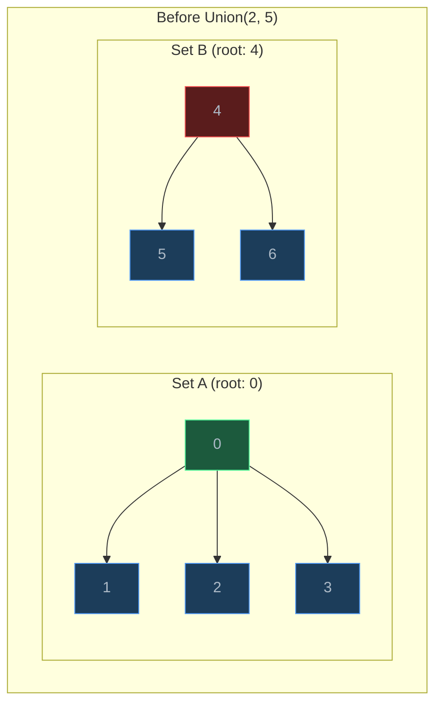
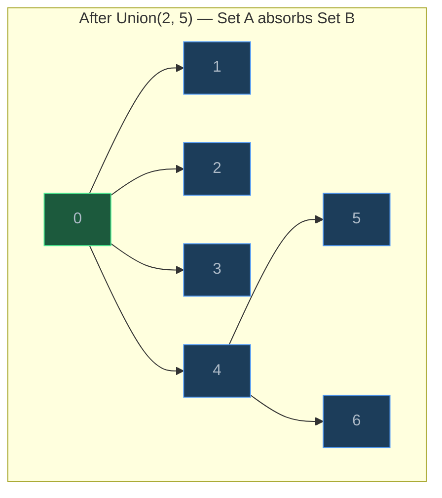
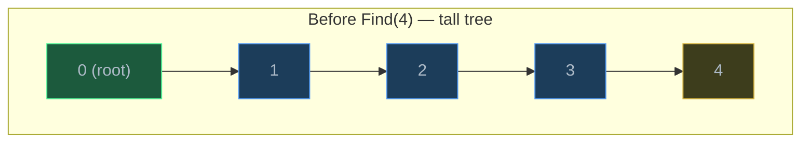
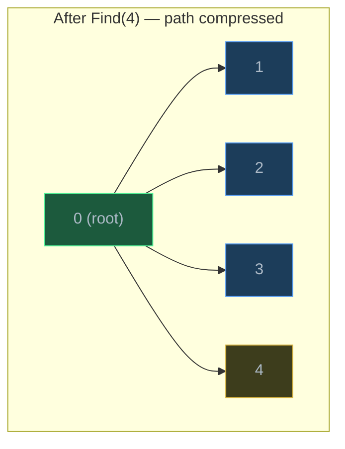
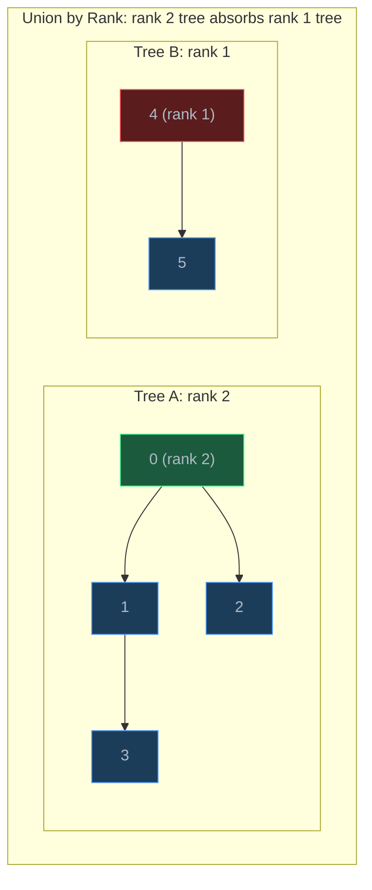
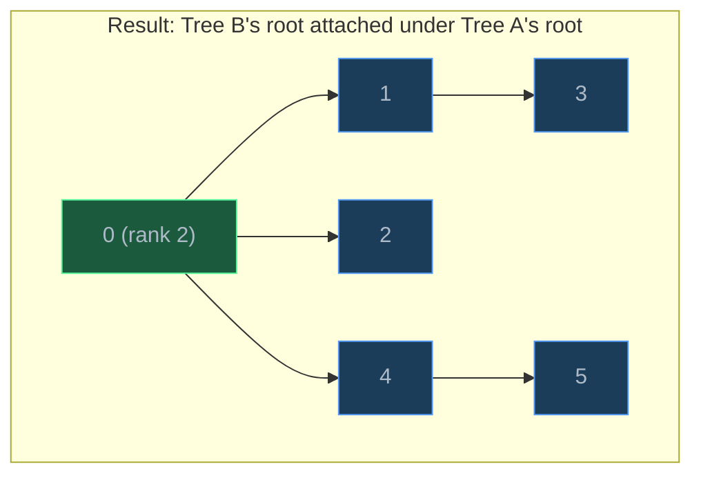

# Union-Find (Disjoint Set Union)

> Union-Find tracks which elements belong to which groups, supporting near-constant-time merge and query operations — the go-to data structure for connected component problems.

## Table of Contents
- [Core Concepts](#core-concepts)
- [Code Examples](#code-examples)
- [Common Pitfalls](#common-pitfalls)
- [Key Takeaways](#key-takeaways)
- [Exercises](#exercises)

## Core Concepts

### What Is Union-Find?

#### What

A **Disjoint Set Union** (DSU), commonly called **Union-Find**, is a data structure that manages a collection of **disjoint (non-overlapping) sets**. It supports two core operations:

1. **Find(x)**: Determine which set element `x` belongs to by returning the **representative** (root) of its set.
2. **Union(x, y)**: Merge the sets containing `x` and `y` into a single set.

Think of it as answering one question efficiently: **"Are these two elements in the same group?"** And enabling one action: **"Put these two elements in the same group."**





#### How

Internally, Union-Find represents each set as a **rooted tree**. Every element has a `parent` pointer. The root of the tree is the set's **representative** — an element whose parent is itself.

- **Find(x)**: Follow parent pointers from `x` upward until you reach a node whose parent is itself — that is the root (representative).
- **Union(x, y)**: Find the roots of `x` and `y`. If they differ, make one root point to the other.

The key insight: two elements are in the same set if and only if `Find(x) == Find(y)`.

#### Why It Matters

Union-Find is the most efficient known data structure for the **dynamic connectivity** problem: given a stream of connections between elements, can you quickly answer "are these two connected?" at any point?

Alternatives are slower:
- **BFS/DFS** per query: O(V + E) per connectivity check.
- **Adjacency matrix**: O(1) check for direct edges, but O(V) to check transitive connectivity.
- **Union-Find**: O(alpha(n)) per operation — effectively O(1).

This makes Union-Find essential for Kruskal's MST algorithm, network connectivity monitoring, image segmentation, and social network "friend of friend" queries.

### Path Compression

#### What

**Path compression** is an optimization applied during `Find(x)`. After finding the root, you make every node on the path from `x` to the root point directly to the root. This flattens the tree, making future `Find` operations on those nodes O(1).





#### How

In the naive implementation, `Find` walks up the tree: `x → parent[x] → parent[parent[x]] → ... → root`. This can be O(n) if the tree degenerates into a chain.

With path compression, after finding the root, you set `parent[x] = root` for every node visited along the way. The recursive implementation does this elegantly:

```python
def find(self, x: int) -> int:
    if self.parent[x] != x:
        self.parent[x] = self.find(self.parent[x])  # path compression
    return self.parent[x]
```

After `Find(4)` on the chain `4 → 3 → 2 → 1 → 0`, nodes 4, 3, 2, and 1 all point directly to 0. Any future `Find` on these nodes takes one step.

#### Why It Matters

Without path compression, a sequence of n operations can take O(n^2) in the worst case (a tall chain requires O(n) per `Find`). With path compression, the amortized cost drops to O(alpha(n)) per operation, where alpha is the inverse Ackermann function — a function that grows so slowly it is effectively constant for all practical inputs (alpha(n) <= 5 for n up to 2^65536).

Path compression is what transforms Union-Find from a "good" data structure into an "optimal" one.

### Union by Rank

#### What

**Union by rank** is an optimization for the `Union` operation. When merging two trees, attach the **shorter tree** (lower rank) under the **taller tree** (higher rank). This keeps trees flat, preventing the degenerate chain structure.

The **rank** of a node is an upper bound on its height. When two trees of equal rank are merged, the new root's rank increases by 1.

#### How





The decision logic:
- If `rank[root_x] > rank[root_y]`: attach `root_y` under `root_x`
- If `rank[root_x] < rank[root_y]`: attach `root_x` under `root_y`
- If equal: pick either, increment the new root's rank by 1

#### Why It Matters

Without union by rank, you can construct worst-case inputs where `Union` repeatedly attaches large trees under single-node trees, creating chains. Union by rank guarantees that the tree height is at most O(log n), because a tree of rank k must have at least 2^k nodes. Combined with path compression, this gives the O(alpha(n)) amortized bound.

An alternative is **union by size** — attach the smaller set under the larger set. Both achieve the same asymptotic bounds. Rank is slightly simpler to implement and is the standard choice.

### The Inverse Ackermann Function

#### What

The amortized time complexity of Union-Find (with both path compression and union by rank) is O(alpha(n)) per operation, where alpha(n) is the **inverse Ackermann function**. This is the slowest-growing function that appears in complexity analysis.

#### How

The Ackermann function A(m, n) grows absurdly fast:
- A(4, 2) is a number with 19,729 digits
- A(5, 2) is so large it cannot be written in the observable universe

The inverse Ackermann function alpha(n) asks: "What is the smallest m such that A(m, m) >= n?" For any input size you will ever encounter in practice:

| n | alpha(n) |
| --- | --- |
| 1 | 0 |
| 2 | 1 |
| 2^65536 | 4 |
| Anything practical | <= 5 |

#### Why It Matters

For all practical purposes, alpha(n) is a constant. This means Union-Find operations are effectively O(1). When you see complexity stated as O(alpha(n)), you can mentally read it as "constant time, with a theoretical asterisk." This makes Union-Find the fastest possible data structure for dynamic connectivity — it has been proven optimal (no data structure can achieve o(alpha(n)) amortized per operation for this problem).

### Applications

#### What

Union-Find solves any problem that involves grouping elements and querying group membership:

1. **Kruskal's MST**: Process edges in sorted order; add an edge if its endpoints are in different sets (use `Find` to check, `Union` to merge). Union-Find provides the cycle detection.
2. **Connected components**: In an undirected graph, iterate over edges and `Union` each pair. The number of distinct roots at the end is the number of connected components.
3. **Cycle detection**: When processing edge (u, v), if `Find(u) == Find(v)`, adding this edge would create a cycle.
4. **Network connectivity**: Track whether two computers can communicate in a dynamic network where connections are added over time.
5. **Image segmentation**: Merge adjacent pixels with similar colors into regions.
6. **Accounts merge**: Group accounts that share an email address (LeetCode 721).

#### How

The pattern is always the same:
1. Initialize each element as its own set
2. Process relationships (edges, connections) by calling `Union`
3. Query group membership by calling `Find` and comparing roots

#### Why It Matters

The alternative to Union-Find for these problems is BFS/DFS, which requires O(V + E) per connectivity query. If you have Q queries, that is O(Q(V + E)) total. Union-Find handles all Q queries in O(Q * alpha(n)) — effectively O(Q). For large graphs with many queries, this is the difference between minutes and milliseconds.

## Code Examples

### Complete UnionFind Class

```python
class UnionFind:
    """Disjoint Set Union with path compression and union by rank.

    Supports:
    - find(x): return root of x's set
    - union(x, y): merge sets containing x and y
    - connected(x, y): check if x and y are in the same set
    - component_count: number of distinct sets
    """

    def __init__(self, n: int) -> None:
        """Initialize n elements, each in its own set.

        parent[i] = i means element i is its own root.
        rank[i] = 0 means the tree rooted at i has height 0 (single node).

        Time:  O(n)
        Space: O(n)
        """
        self.parent: list[int] = list(range(n))
        self.rank: list[int] = [0] * n
        self.count: int = n  # number of distinct sets

    def find(self, x: int) -> int:
        """Return the root (representative) of the set containing x.

        Uses path compression: after finding the root, every node on the
        path from x to root is updated to point directly to root.

        Time:  O(α(n)) amortized — effectively O(1).
        Space: O(α(n)) — recursion stack (bounded by tree height).
        """
        if self.parent[x] != x:
            self.parent[x] = self.find(self.parent[x])  # path compression
        return self.parent[x]

    def union(self, x: int, y: int) -> bool:
        """Merge the sets containing x and y.

        Returns True if a merge occurred (they were in different sets),
        False if they were already in the same set.

        Uses union by rank: attach the shorter tree under the taller tree.

        Time:  O(α(n)) amortized — dominated by find().
        Space: O(1) — only pointer updates.
        """
        root_x = self.find(x)
        root_y = self.find(y)

        if root_x == root_y:
            return False  # already in the same set

        # Union by rank: attach shorter tree under taller tree
        if self.rank[root_x] < self.rank[root_y]:
            self.parent[root_x] = root_y
        elif self.rank[root_x] > self.rank[root_y]:
            self.parent[root_y] = root_x
        else:
            # Equal rank: pick one, increment its rank
            self.parent[root_y] = root_x
            self.rank[root_x] += 1

        self.count -= 1  # one fewer set
        return True

    def connected(self, x: int, y: int) -> bool:
        """Check if x and y are in the same set.

        Time:  O(α(n)) amortized.
        Space: O(1).
        """
        return self.find(x) == self.find(y)

    @property
    def component_count(self) -> int:
        """Return the number of distinct sets."""
        return self.count


# Demo
uf = UnionFind(7)
print(f"Initial components: {uf.component_count}")  # 7

# Connect elements
uf.union(0, 1)
uf.union(1, 2)
uf.union(3, 4)
print(f"After unions: {uf.component_count}")  # 4 (sets: {0,1,2}, {3,4}, {5}, {6})

print(f"0 and 2 connected? {uf.connected(0, 2)}")  # True (transitive)
print(f"0 and 3 connected? {uf.connected(0, 3)}")  # False

uf.union(2, 4)  # merges {0,1,2} and {3,4}
print(f"0 and 3 connected? {uf.connected(0, 3)}")  # True
print(f"Components: {uf.component_count}")           # 3
```

**Time**: O(alpha(n)) amortized per operation — effectively O(1).
**Space**: O(n) for the parent and rank arrays.

### Counting Connected Components in a Graph

```python
class UnionFind:
    def __init__(self, n: int) -> None:
        self.parent = list(range(n))
        self.rank = [0] * n
        self.count = n

    def find(self, x: int) -> int:
        if self.parent[x] != x:
            self.parent[x] = self.find(self.parent[x])
        return self.parent[x]

    def union(self, x: int, y: int) -> bool:
        root_x, root_y = self.find(x), self.find(y)
        if root_x == root_y:
            return False
        if self.rank[root_x] < self.rank[root_y]:
            self.parent[root_x] = root_y
        elif self.rank[root_x] > self.rank[root_y]:
            self.parent[root_y] = root_x
        else:
            self.parent[root_y] = root_x
            self.rank[root_x] += 1
        self.count -= 1
        return True


def count_connected_components(
    n: int, edges: list[tuple[int, int]]
) -> int:
    """Count connected components in an undirected graph.

    Args:
        n: Number of vertices (labeled 0 to n-1).
        edges: List of (u, v) undirected edges.

    Returns:
        Number of connected components.

    Time:  O(n + E × α(n)) — initialize n elements, process E edges.
    Space: O(n) — parent and rank arrays.
    """
    uf = UnionFind(n)
    for u, v in edges:
        uf.union(u, v)
    return uf.count


# Example: graph with 3 components
#   0 - 1 - 2     3 - 4     5
edges = [(0, 1), (1, 2), (3, 4)]
print(f"Components: {count_connected_components(6, edges)}")  # 3

# Adding edge connecting two components
edges.append((2, 3))
print(f"Components: {count_connected_components(6, edges)}")  # 2
```

**Time**: O(n + E * alpha(n)) which is effectively O(n + E).
**Space**: O(n).

### Cycle Detection in Undirected Graph

```python
class UnionFind:
    def __init__(self, n: int) -> None:
        self.parent = list(range(n))
        self.rank = [0] * n

    def find(self, x: int) -> int:
        if self.parent[x] != x:
            self.parent[x] = self.find(self.parent[x])
        return self.parent[x]

    def union(self, x: int, y: int) -> bool:
        root_x, root_y = self.find(x), self.find(y)
        if root_x == root_y:
            return False  # cycle detected!
        if self.rank[root_x] < self.rank[root_y]:
            self.parent[root_x] = root_y
        elif self.rank[root_x] > self.rank[root_y]:
            self.parent[root_y] = root_x
        else:
            self.parent[root_y] = root_x
            self.rank[root_x] += 1
        return True


def has_cycle(n: int, edges: list[tuple[int, int]]) -> bool:
    """Detect if an undirected graph contains a cycle.

    The insight: when processing edge (u, v), if u and v are already
    in the same set, adding this edge creates a cycle.

    Time:  O(E × α(n)) — process each edge once.
    Space: O(n) — Union-Find arrays.
    """
    uf = UnionFind(n)
    for u, v in edges:
        if not uf.union(u, v):
            # u and v already connected → this edge creates a cycle
            return True
    return False


# No cycle: 0 - 1 - 2 - 3  (simple path)
print(has_cycle(4, [(0, 1), (1, 2), (2, 3)]))  # False

# Has cycle: 0 - 1 - 2 - 0  (triangle)
print(has_cycle(3, [(0, 1), (1, 2), (2, 0)]))  # True

# Has cycle: 0 - 1, 1 - 2, 2 - 3, 3 - 1  (cycle in subgraph)
print(has_cycle(4, [(0, 1), (1, 2), (2, 3), (3, 1)]))  # True
```

**Time**: O(E * alpha(n)) — effectively O(E).
**Space**: O(n).

### Kruskal's Minimum Spanning Tree

```python
class UnionFind:
    def __init__(self, n: int) -> None:
        self.parent = list(range(n))
        self.rank = [0] * n

    def find(self, x: int) -> int:
        if self.parent[x] != x:
            self.parent[x] = self.find(self.parent[x])
        return self.parent[x]

    def union(self, x: int, y: int) -> bool:
        root_x, root_y = self.find(x), self.find(y)
        if root_x == root_y:
            return False
        if self.rank[root_x] < self.rank[root_y]:
            self.parent[root_x] = root_y
        elif self.rank[root_x] > self.rank[root_y]:
            self.parent[root_y] = root_x
        else:
            self.parent[root_y] = root_x
            self.rank[root_x] += 1
        return True


def kruskal_mst(
    n: int, edges: list[tuple[int, int, int]]
) -> tuple[list[tuple[int, int, int]], int]:
    """Find the Minimum Spanning Tree using Kruskal's algorithm.

    Kruskal's strategy:
    1. Sort all edges by weight (ascending)
    2. For each edge, if it connects two different components, add it to MST
    3. Stop when MST has n-1 edges

    Union-Find provides the cycle detection: if find(u) == find(v),
    adding edge (u, v) would create a cycle — skip it.

    Args:
        n: Number of vertices.
        edges: List of (u, v, weight) edges.

    Returns:
        Tuple of (MST edges, total weight).

    Time:  O(E log E + E × α(n)) = O(E log E) — dominated by sorting.
    Space: O(n + E) — Union-Find arrays + sorted edge list.
    """
    # Step 1: Sort edges by weight
    sorted_edges = sorted(edges, key=lambda e: e[2])

    uf = UnionFind(n)
    mst: list[tuple[int, int, int]] = []
    total_weight = 0

    # Step 2: Process edges greedily
    for u, v, weight in sorted_edges:
        if uf.union(u, v):
            # Edge connects two different components — add to MST
            mst.append((u, v, weight))
            total_weight += weight

            # MST complete when we have n-1 edges
            if len(mst) == n - 1:
                break

    return mst, total_weight


# Example graph:
#       1
#    0 --- 1
#    |  \  |
#  4 |  2\ | 3
#    |    \|
#    3 --- 2
#       5
edges = [
    (0, 1, 1),  # 0-1: weight 1
    (0, 2, 2),  # 0-2: weight 2
    (0, 3, 4),  # 0-3: weight 4
    (1, 2, 3),  # 1-2: weight 3
    (2, 3, 5),  # 2-3: weight 5
]

mst, total = kruskal_mst(4, edges)
print(f"MST edges: {mst}")
print(f"Total weight: {total}")
# MST edges: [(0, 1, 1), (0, 2, 2), (0, 3, 4)]
# Total weight: 7
# Kruskal picks: 0-1 (1), 0-2 (2), skip 1-2 (3, would create cycle), 0-3 (4)
```

**Time**: O(E log E) — sorting dominates; Union-Find operations are effectively O(1) each.
**Space**: O(n + E).

### Union-Find with Size Tracking

```python
class UnionFindWithSize:
    """Union-Find variant that tracks the size of each component.

    Useful when you need to know how many elements are in each group,
    not just whether two elements are in the same group.
    """

    def __init__(self, n: int) -> None:
        self.parent = list(range(n))
        self.size = [1] * n  # size of the component rooted at i
        self.count = n

    def find(self, x: int) -> int:
        if self.parent[x] != x:
            self.parent[x] = self.find(self.parent[x])
        return self.parent[x]

    def union(self, x: int, y: int) -> bool:
        """Merge sets using union by size (attach smaller under larger).

        Time:  O(α(n)) amortized.
        Space: O(1).
        """
        root_x, root_y = self.find(x), self.find(y)
        if root_x == root_y:
            return False

        # Union by size: smaller tree goes under larger tree
        if self.size[root_x] < self.size[root_y]:
            self.parent[root_x] = root_y
            self.size[root_y] += self.size[root_x]
        else:
            self.parent[root_y] = root_x
            self.size[root_x] += self.size[root_y]

        self.count -= 1
        return True

    def get_component_size(self, x: int) -> int:
        """Return the number of elements in x's component.

        Time: O(α(n)) — one find call.
        """
        return self.size[self.find(x)]


# Demo: social network — track friend group sizes
uf = UnionFindWithSize(8)

# Form friend groups
uf.union(0, 1)  # Alice and Bob are friends
uf.union(1, 2)  # Bob and Charlie → {Alice, Bob, Charlie}
uf.union(3, 4)  # Dave and Eve → {Dave, Eve}
uf.union(5, 6)  # Frank and Grace → {Frank, Grace}

print(f"Alice's group size: {uf.get_component_size(0)}")  # 3
print(f"Dave's group size: {uf.get_component_size(3)}")    # 2
print(f"Heidi's group size: {uf.get_component_size(7)}")   # 1 (alone)
print(f"Total groups: {uf.count}")                          # 4

# Merge two groups
uf.union(2, 4)  # Charlie meets Eve → merges {A,B,C} and {D,E}
print(f"Alice's group size: {uf.get_component_size(0)}")   # 5
print(f"Total groups: {uf.count}")                          # 3
```

**Time**: O(alpha(n)) per operation.
**Space**: O(n) for parent and size arrays.

## Common Pitfalls

### Pitfall 1: Forgetting Path Compression

```python
# BAD — find without path compression, O(n) per call in worst case
class SlowUnionFind:
    def __init__(self, n: int) -> None:
        self.parent = list(range(n))

    def find(self, x: int) -> int:
        while self.parent[x] != x:
            x = self.parent[x]  # just walks up — no flattening
        return x

# GOOD — find with path compression, O(α(n)) amortized
class FastUnionFind:
    def __init__(self, n: int) -> None:
        self.parent = list(range(n))

    def find(self, x: int) -> int:
        if self.parent[x] != x:
            self.parent[x] = self.find(self.parent[x])  # flatten!
        return self.parent[x]
```

Why it's wrong: Without path compression, a chain of n elements requires O(n) per `find`. Over m operations, that is O(m * n). With path compression, the same sequence of operations costs O(m * alpha(n)) — effectively O(m). On a chain of 100,000 elements, the difference is 100,000x.

### Pitfall 2: Union Without Rank or Size

```python
# BAD — always attaches root_y under root_x, regardless of tree shape
def union(self, x: int, y: int) -> None:
    root_x = self.find(x)
    root_y = self.find(y)
    if root_x != root_y:
        self.parent[root_y] = root_x  # no rank consideration

# GOOD — use union by rank to keep trees balanced
def union(self, x: int, y: int) -> bool:
    root_x = self.find(x)
    root_y = self.find(y)
    if root_x == root_y:
        return False
    if self.rank[root_x] < self.rank[root_y]:
        self.parent[root_x] = root_y
    elif self.rank[root_x] > self.rank[root_y]:
        self.parent[root_y] = root_x
    else:
        self.parent[root_y] = root_x
        self.rank[root_x] += 1
    return True
```

Why it's wrong: Without rank-based decisions, adversarial input can create a chain of height n. Union by rank guarantees height O(log n) even without path compression, and together they give O(alpha(n)).

### Pitfall 3: Using Find Before Comparing Roots

```python
# BAD — comparing elements directly instead of their roots
def connected(self, x: int, y: int) -> bool:
    return self.parent[x] == self.parent[y]  # WRONG!
# parent[x] might not be the root — it might be an intermediate node
# that hasn't been compressed yet

# GOOD — always use find() to get the actual root
def connected(self, x: int, y: int) -> bool:
    return self.find(x) == self.find(y)  # correct
```

Why it's wrong: `parent[x]` is only guaranteed to be the root immediately after `find(x)` or if `x` is itself a root. Without path compression, `parent[x]` could be any ancestor. Even with path compression, `parent[x]` might not be the root if `find` has not been called on `x` since the last `union` that changed the tree structure.

### Pitfall 4: Not Returning Whether Union Changed Anything

```python
# BAD — no return value, caller cannot detect cycles
def union(self, x: int, y: int) -> None:
    root_x = self.find(x)
    root_y = self.find(y)
    if root_x != root_y:
        self.parent[root_y] = root_x

# Caller has no way to know if x and y were already connected:
uf.union(u, v)
# Was this edge redundant? Did it create a cycle? No way to tell.

# GOOD — return True if merge happened, False if already connected
def union(self, x: int, y: int) -> bool:
    root_x = self.find(x)
    root_y = self.find(y)
    if root_x == root_y:
        return False  # already connected — cycle if this is a new edge
    self.parent[root_y] = root_x
    return True

# Now the caller can detect cycles:
if not uf.union(u, v):
    print(f"Edge ({u}, {v}) creates a cycle!")
```

Why it's wrong: In Kruskal's algorithm and cycle detection, the return value of `union` is the entire point — it tells you whether the edge was useful or redundant. Without it, you need a separate `connected` call before every `union`, doubling the work.

## Key Takeaways

- Union-Find tracks **dynamic connectivity** — which elements are in the same group — with effectively **O(1) per operation** using path compression and union by rank.
- **Path compression** flattens trees during `find`, and **union by rank** keeps trees balanced during `union`. Together they achieve O(alpha(n)) amortized, which is provably optimal.
- The `union` return value is critical: it tells you whether a merge occurred, enabling **cycle detection** (Kruskal's, redundant connections) without extra queries.
- Union-Find is the right tool when you need to process a **stream of connections** and answer connectivity queries efficiently — it beats BFS/DFS by orders of magnitude for repeated queries.
- The inverse Ackermann function alpha(n) is at most 5 for any input size you will ever encounter — treat O(alpha(n)) as O(1) in practice.

## Exercises

1. **Implement** a function `earliest_connection(n: int, connections: list[tuple[int, int, int]]) -> int` where each connection is `(timestamp, person_a, person_b)`. Return the earliest timestamp at which all n people are connected, or -1 if they never are. Use Union-Find and process connections in chronological order.

2. **Explain** why path compression alone (without union by rank) does not guarantee O(alpha(n)) amortized performance. Construct a sequence of union and find operations on 8 elements that demonstrates the problem.

3. **Write a function** `redundant_connection(edges: list[tuple[int, int]]) -> tuple[int, int]` that, given an undirected graph formed by adding edges one at a time to n nodes (where n = len(edges)), returns the first edge that creates a cycle. This is the edge that, if removed, would make the graph a tree.

4. **Modify** the `UnionFind` class to support a `get_groups() -> list[list[int]]` method that returns all current groups as a list of lists. What is the time complexity of this method?

5. **Explain** the difference between union by rank and union by size. Can you construct a scenario where the trees built by these two strategies differ structurally? Do they have the same asymptotic complexity guarantees?

---
up:: [Schedule](../../Schedule.md)
#type/learning #source/self-study #status/seed
